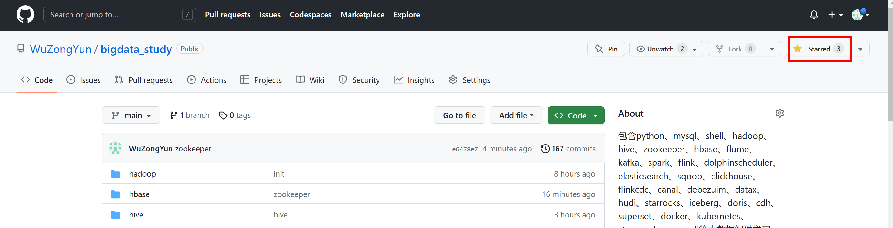
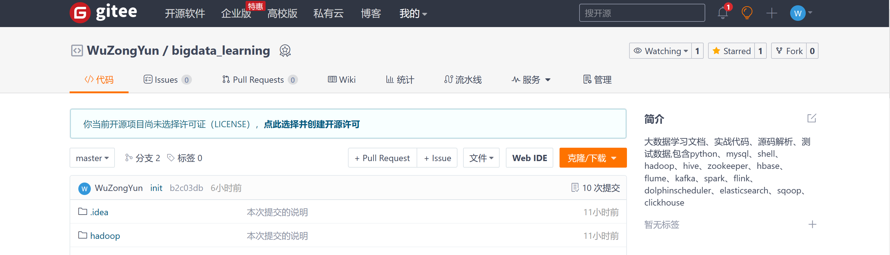

# 大数据学习文档、实战代码、源码解析、测试数据

#### 包含python、mysql、shell、hadoop、hive、zookeeper、hbase、flume、kafka、spark、flink、dolphinscheduler、elasticsearch、sqoop、clickhouse、flinkcdc、canal、debezuim、datax、hudi、starrocks、iceberg、doris、cdh、superset、docker、kubernetes、strampark、maxwell等组件学习、实战、面试 持续更新中...

## 码字不易，路过的朋友们右上角请点个 ★star★ 鼓励一下~，感谢（抱拳）。

## [gitee（同步更新,可点击访问）](https://gitee.com/wzylzjtn/bigdata_study)

## 公众号同步更新中...

## [**一、python**]()

[【 1. python 基础 】](http://t.csdn.cn/xgsYb)

[【 2. python Numpy 】](http://t.csdn.cn/4mttz)

[【 3. python Pandas 】](http://t.csdn.cn/DQRGS)

[【 4. Anaconda 搭建pyflink开发环境 】](https://mp.weixin.qq.com/s?__biz=Mzg5Mzg3MzkwNA==&mid=2247484387&idx=1&sn=755e10001142e4737f5ba460f47b85a7&chksm=c029787cf75ef16a85afd9e7ab50fe3f02918e00ff99bbd0bc26271e2a3e90d41cce9a045579#rd)

[【 5. Anaconda Jupyter Notebook中配置多版本Python 】](https://mp.weixin.qq.com/s?__biz=Mzg5Mzg3MzkwNA==&mid=2247484373&idx=1&sn=a4bb3a362a8bf69e2aaf85c877ab1aca&chksm=c029784af75ef15c12a45cf4101f89fafc5a858b94db0b45c2616b0b38f52c6e0f8d3d1f75f3#rd)

## [**二、shell**]()

[【1. shell基础 】](http://t.csdn.cn/A0GkA)

[【2. 安装包下载 】](https://mp.weixin.qq.com/s?__biz=Mzg5Mzg3MzkwNA==&mid=2247484608&idx=1&sn=5d3b278d81cd11f518f2122e012f7436&chksm=c0297f5ff75ef649f093bc4d1a5a7a3e7e4e138ff125c917d55849200d4121dbefcb6521e9c4#rd)

[【 3. 一键搭建hive集群 】](https://mp.weixin.qq.com/s?__biz=Mzg5Mzg3MzkwNA==&mid=2247484544&idx=1&sn=cd889d3d946ad6ec21be60e37aee5d85&chksm=c0297f1ff75ef6090c82387e754c15febf86d0840bf73b9ba405b50db9ebedb4f2b8cfddf46d#rd)

[【 4. 一键搭建dolphinscheduler集群 】](https://mp.weixin.qq.com/s?__biz=Mzg5Mzg3MzkwNA==&mid=2247484589&idx=1&sn=d687acc586ad1cc5e40a5887f4255380&chksm=c0297f32f75ef62496cd3981116160aacb1d1532b691498740ea973dbe3dfe44d0a6e302eb6c#rd)

[【 5. 一键搭建flume集群 】](https://mp.weixin.qq.com/s?__biz=Mzg5Mzg3MzkwNA==&mid=2247484577&idx=1&sn=160dfe50896c903941e9fff75d040bd9&chksm=c0297f3ef75ef628681bc60a24f70e7aa21278c6cbd7cdd5196311c4b2294e26d006df00b778#rd)

[【 6. 一键搭建elasticsearch集群 】](https://mp.weixin.qq.com/s?__biz=Mzg5Mzg3MzkwNA==&mid=2247484571&idx=1&sn=16c1e005cbfd41531bfb0481155bf99f&chksm=c0297f04f75ef612f0e0dfac0c992506e07efa6c910ac992a8c28d4d88e31a1030a01622a50b#rd)

[【 7. 一键搭建flink集群 】](https://mp.weixin.qq.com/s?__biz=Mzg5Mzg3MzkwNA==&mid=2247484563&idx=1&sn=d919758b875e3fcf10b496b9d4faf946&chksm=c0297f0cf75ef61a66eac52758a72df06fa841022fb3ad1997aefcb0e019dc100b5a062a7bd9#rd)

[【 8. 一键搭建flink集群 】](https://mp.weixin.qq.com/s?__biz=Mzg5Mzg3MzkwNA==&mid=2247484563&idx=1&sn=d919758b875e3fcf10b496b9d4faf946&chksm=c0297f0cf75ef61a66eac52758a72df06fa841022fb3ad1997aefcb0e019dc100b5a062a7bd9#rd)

[【 9.  一键搭建hbase集群 】](https://mp.weixin.qq.com/s?__biz=Mzg5Mzg3MzkwNA==&mid=2247484556&idx=1&sn=3a8041ac1acdd6e1930f71878218c2b5&chksm=c0297f13f75ef60587a53d64db45827d94998d39a17ed4bcb646a9a9ac6f23f301f789a92cd0#rd)

[【 10.  一键搭建kafka集群 】](https://mp.weixin.qq.com/s?__biz=Mzg5Mzg3MzkwNA==&mid=2247484550&idx=1&sn=14115d7fd9e57b389bd18f43ec168915&chksm=c0297f19f75ef60fdce64f1e3ba9985eabf00825d26a8a256d39f83ee1cc3f877fa8dd0fbb5e#rd)

[【 11.  一键搭建hadoop集群 】](https://mp.weixin.qq.com/s?__biz=Mzg5Mzg3MzkwNA==&mid=2247484538&idx=1&sn=89cfa05ecfc152464530e485bfcbb871&chksm=c0297fe5f75ef6f3451d87d6e910456d58c746ff6766cd585fba1f85dc881f5c4f7a5682ad18#rd)

## [三、大数据基础环境准备]()

[【 1. 安装虚拟机Centos7 】](https://mp.weixin.qq.com/s?__biz=Mzg5Mzg3MzkwNA==&mid=2247484120&idx=1&sn=02422623ee659ea5a8b5485e55f7b0fa&chksm=c0297947f75ef0514dea5ec0b1ae66d6909addb0f61cbae409e5d37b9880dbf0927910c6d764#rd)

[【 2. 安装MobaXterm 】](https://mp.weixin.qq.com/s?__biz=Mzg5Mzg3MzkwNA==&mid=2247484162&idx=1&sn=952292d88c4d0c73bb4521415af330d6&chksm=c029789df75ef18b3f831556080ba6b8ef219bfe54fa6f6a890b93dabde079b93c8a1882a35d#rd)

[【 3. centos7免密设置 】](https://mp.weixin.qq.com/s?__biz=Mzg5Mzg3MzkwNA==&mid=2247484176&idx=1&sn=cd0d8cdd59340ba15f00bbbed228b7b9&chksm=c029788ff75ef199dee21e7184c1c3f14965ed36403fe5518ab84df7e3ec1c5b33994e138e78#rd)

[【 4. centos7安装JDK1.8 】](https://mp.weixin.qq.com/s?__biz=Mzg5Mzg3MzkwNA==&mid=2247484190&idx=1&sn=a3a37ff5cf2f83e35825c8919336c6a9&chksm=c0297881f75ef1973e36f166d9c1b566a9e5756c70e2eaba0e2fd4ff49191b5e5ab565f00919#rd)

[【 5. centos7安装mysql 】](https://mp.weixin.qq.com/s?__biz=Mzg5Mzg3MzkwNA==&mid=2247484226&idx=1&sn=cb0738e5f53380c238fd67758145cb46&chksm=c02978ddf75ef1cb9e70c6df9b91ab6a886ca1982ecf21522c925193a094d5dc4dca34cf07ab#rd)

## [**四、hadoop**]()

[【 1. CentOS7安装hadoop集群 】](https://mp.weixin.qq.com/s?__biz=Mzg5Mzg3MzkwNA==&mid=2247484650&idx=1&sn=21016d7e2536098ab0e180dd92145665&chksm=c0297f75f75ef66359b8441d6cc2a0241828ffad4de197ff1f0911471fc79a5fc218d49c1eb6#rd)

[【 2. hadoop基于 HDFS HA 集群高可用安装 】](https://mp.weixin.qq.com/s?__biz=Mzg5Mzg3MzkwNA==&mid=2247484650&idx=1&sn=21016d7e2536098ab0e180dd92145665&chksm=c0297f75f75ef66359b8441d6cc2a0241828ffad4de197ff1f0911471fc79a5fc218d49c1eb6#rd)

[【 3. hadoop基于 YARN HA 集群高可用安装 】](https://mp.weixin.qq.com/s?__biz=Mzg5Mzg3MzkwNA==&mid=2247484774&idx=1&sn=a5789f9b1ed4976b85ada4b75191543c&chksm=c0297ef9f75ef7ef2d5c5b4d31ef9872db332cc706d96c9e93537a5b5a41c6cf9c95b191796f#rd)

[【 4. hadoop shell 命令 】](https://mp.weixin.qq.com/s?__biz=Mzg5Mzg3MzkwNA==&mid=2247484774&idx=2&sn=f8e6f39af37ef22c4b695a782d51cca1&chksm=c0297ef9f75ef7ef68cd7dac9d3838426d15d4ad9a7af195063967989d5fe36f56c33d18e3d1#rd)

[【 5. hadoop mapreduce实战 】](https://mp.weixin.qq.com/s?__biz=Mzg5Mzg3MzkwNA==&mid=2247484774&idx=3&sn=0b12044f71a0ca7382932006c431cde1&chksm=c0297ef9f75ef7effc2c04a43edae78a72bb8c600c2c65c9abb46697324282538790be35fbb0#rd)

## [**五、hive**]()

[【 1. CentOS7安装hive集群 】](https://mp.weixin.qq.com/s?__biz=Mzg5Mzg3MzkwNA==&mid=2247484250&idx=1&sn=e2aac10ac2886b07ecf8bf6f8ab009e2&chksm=c02978c5f75ef1d3a7c1258b3c2b1cee13246477787f4c33cf65145d42f5d0d9d567829cb9cb#rd)

[【 2. hive 基本概念 】](https://mp.weixin.qq.com/s?__biz=Mzg5Mzg3MzkwNA==&mid=2247484774&idx=4&sn=198f6c9b90813a38afd5e79c36a19db0&chksm=c0297ef9f75ef7ef031517ff6f995e1f76b764db656de195eac11083c5a685fc5255a83a8188#rd)

[【 3. hive 查询 】](https://github.com/WuZongYun/bigdata_study/blob/main/hive/3_hive%E5%AE%9E%E6%88%98.md)

[【 4. hive 窗口函数 】](https://github.com/WuZongYun/bigdata_study/blob/main/hive/4_hive%20%E7%AA%97%E5%8F%A3%E5%87%BD%E6%95%B0.md)

[【 5. hive 整合 hbase 】](https://github.com/WuZongYun/bigdata_study/blob/main/hive/5_Hive%E6%95%B4%E5%90%88Hbase.md)

## [**六、zookeeper**]()

[【 1. CentOS7安装zookeeper集群 】](https://mp.weixin.qq.com/s?__biz=Mzg5Mzg3MzkwNA==&mid=2247484264&idx=1&sn=1aa7a75cf682b2a184641c65e061fdf3&chksm=c02978f7f75ef1e159a6ceb7656ace7d75bad1c945955fc8bb4a93c5cae4c835bc2361f4c197#rd)

[【 2. zookeeper基础 】](https://mp.weixin.qq.com/s?__biz=Mzg5Mzg3MzkwNA==&mid=2247484904&idx=1&sn=2c2036eab77a315f2cbe16a5cb0f28dc&chksm=c0297e77f75ef761bd3cdf0086f3b79ccc8755ec1bced166710720d8911c36198938f9de66aa#rd)

[【 3. zookeeper实战 】](https://mp.weixin.qq.com/s?__biz=Mzg5Mzg3MzkwNA==&mid=2247484904&idx=2&sn=af224b42a9953eac07dc6f7ae1e505d4&chksm=c0297e77f75ef76116e171b70c6feec7ac4bd907c41307cfe9c6425da6657bb372aaaa981ae4#rd)

## [**七、hbase**]()

[【 1. CentOS7安装Hbase集群 】](https://mp.weixin.qq.com/s?__biz=Mzg5Mzg3MzkwNA==&mid=2247484278&idx=1&sn=f27d19a6aeff811fe6e67d0f5acfea90&chksm=c02978e9f75ef1ffe1f5e76fd1ceaaa88239d1e93a1189ca5b9b682ab5926f4789244b2beaa0#rd)

[【 2. hbase原理 】](https://mp.weixin.qq.com/s?__biz=Mzg5Mzg3MzkwNA==&mid=2247484905&idx=1&sn=65582c0f5de30a2fa57cd7fd36f2c2b1&chksm=c0297e76f75ef7601c5385dbad7e369fffd3eaa3e65bd527fec9a1b401a82d78b0facfaf0f00#rd)

[【 3. hbase shell命令 】](https://mp.weixin.qq.com/s?__biz=Mzg5Mzg3MzkwNA==&mid=2247484905&idx=2&sn=d22845559f786ddd5af063a02708fe8d&chksm=c0297e76f75ef7605a8431ce2fb8196e8639acca71a50a17b2b21ded59560b7c3756474cad8f#rd)

[【 4. hbase 实时同步elasticsearch 案例 】](https://mp.weixin.qq.com/s?__biz=Mzg5Mzg3MzkwNA==&mid=2247484905&idx=3&sn=4c7dc3f44783fb0dfbef38221ac5ec6c&chksm=c0297e76f75ef760ee4dd2d2c16c9dbffb77cead508ee38458bb8a6c56aac9ce3372b1b149c0#rd)

## [**八、flume**]()

[【 1. CentOS7安装Flume集群 】](https://mp.weixin.qq.com/s?__biz=Mzg5Mzg3MzkwNA==&mid=2247484285&idx=1&sn=f33e5d1a597310c319d34187c6d5f7e5&chksm=c02978e2f75ef1f4913e832fd8630f4ef85ab0ee7a6f56f57a4b490ae6d9968e04a0cb2ec4cf#rd)

## [**九、kafka**](https://github.com/WuZongYun/bigdata_study/tree/main/kafka)

[【 1. kafka 安装（集群版）】](https://github.com/WuZongYun/bigdata_learning/blob/main/kafka/1_kafka%20%E5%AE%89%E8%A3%85%EF%BC%88%E9%9B%86%E7%BE%A4%E7%89%88%EF%BC%89.md)

[【 2. ★ kafka 面试之高可用 ★ 】](https://t.zsxq.com/0cfZmT8mi)

[【 3. kafka 面试30问 】](https://github.com/WuZongYun/bigdata_learning/blob/main/kafka/3_kafka%E7%9B%B8%E5%85%B3%E7%9F%A5%E8%AF%86%E7%82%B9.md)

[【 4. kafka 分区数真的越多越好吗 】](https://github.com/WuZongYun/bigdata_learning/blob/main/kafka/4_Kafka%20%E5%88%86%E5%8C%BA.md)

[【 5. kafka 事务实现原理 】](https://github.com/WuZongYun/bigdata_learning/blob/main/kafka/5_Kafka%20%E4%BA%8B%E5%8A%A1%E7%9A%84%E5%AE%9E%E7%8E%B0%E5%8E%9F%E7%90%86.md)

[【 6. kafka 常见故障处理 】](https://github.com/WuZongYun/bigdata_learning/blob/main/kafka/6_Kafka%E5%B8%B8%E8%A7%81%E6%95%85%E9%9A%9C%E5%A4%84%E7%90%86.md)

[【 7. kafka 真实项目最佳实践 】](https://github.com/WuZongYun/bigdata_learning/blob/main/kafka/7_kafka%E7%9C%9F%E5%AE%9E%E9%A1%B9%E7%9B%AE%E6%9C%80%E4%BD%B3%E5%AE%9E%E8%B7%B5.md)

## [**十、spark**](https://github.com/WuZongYun/bigdata_study/tree/main/shell)

## [**十一、flink**](https://github.com/WuZongYun/bigdata_study/tree/main/shell)

[【 1. ★ flink  面试 100 问 ★ 】](https://t.zsxq.com/0c70qqPLO)

[【 2. flink 消费kafka的四种起始位置 】](https://mp.weixin.qq.com/s?__biz=Mzg5Mzg3MzkwNA==&mid=2247484619&idx=1&sn=332aaf9cac741a58c190f5a280af3628&chksm=c0297f54f75ef642880d80a9e0e18110045c61faefe431d3a660d915e7f5340c0e95cfc346b8#rd)

[【 3. pyflink Table API 基本操作案例 】](https://mp.weixin.qq.com/s?__biz=Mzg5Mzg3MzkwNA==&mid=2247484496&idx=1&sn=e3028d9910109055a1a6acdc9802b79c&chksm=c0297fcff75ef6d98e46747b830a619455baa30071d2dbd2bb1df8dd27af553439add40d9553#rd)

[【 4. pyflink Table API wordcount案例 】](https://mp.weixin.qq.com/s?__biz=Mzg5Mzg3MzkwNA==&mid=2247484494&idx=1&sn=d14df58788e6b31a686f699e8314b870&chksm=c0297fd1f75ef6c74cf6fc7f3698826eeb5fd747838510e28b9b12d4a3c0f2916be3f459800a#rd)

[【 5. pyflink DataStream API wordcount案例 】](https://mp.weixin.qq.com/s?__biz=Mzg5Mzg3MzkwNA==&mid=2247484490&idx=1&sn=0515f3fe1576bcb1f40fcb3cd79ad84e&chksm=c0297fd5f75ef6c3b898f7f031c36e1a6f252c5d8c354867274042a84739b7119e392ef73db6#rd)

[【 6. pyflink 集成 hive catalog模式建设数仓 】](https://mp.weixin.qq.com/s?__biz=Mzg5Mzg3MzkwNA==&mid=2247484453&idx=1&sn=6f80b7a7510ca94af87c80dd040a9c16&chksm=c0297fbaf75ef6acbcd25c75484524c9fc65d58e5ef6abf7c3847f5fb5b2235a53244e59552a#rd)

[【 7. pyflink 集成 hive catalog模式读写数据 】](https://mp.weixin.qq.com/s?__biz=Mzg5Mzg3MzkwNA==&mid=2247484426&idx=1&sn=8ed88d9d4895d24cf80f7ee0617eed8a&chksm=c0297f95f75ef68359e5a827b1f40260cc05270e38e8db1ad3f70aec2d4e9641dcbb55cf6a44#rd)

[【 8. FlinkSql 集成 hive catalog模式进行读写数据 】](https://mp.weixin.qq.com/s?__biz=Mzg5Mzg3MzkwNA==&mid=2247484412&idx=1&sn=a4b3bbe74fcbca09a8c3bb40a524e3a9&chksm=c0297863f75ef1754f92a7371e1c043de5a70e4c399cb33a4734c4f09b0e7dd96b1f81d9a27f#rd)

[【 9. ★ Flink checkpoint 执行流程及优化方案 ★ 】](https://t.zsxq.com/0cktPlxgU)

[【 10. ★ Flink 内存优化方案 ★ 】](https://t.zsxq.com/0c2CV3ww7)

## [**十二、dolphinscheduler**](https://github.com/WuZongYun/bigdata_study/tree/main/shell)

## [**十三、elasticsearch**](https://github.com/WuZongYun/bigdata_study/tree/main/shell)

## [**十四、sqoop**](https://github.com/WuZongYun/bigdata_study/tree/main/shell)

## [**十五、clickhouse**](https://github.com/WuZongYun/bigdata_study/tree/main/shell)

## [**十六、flinkcCDC**](https://github.com/WuZongYun/bigdata_study/tree/main/shell)

## [**十七、canal**](https://github.com/WuZongYun/bigdata_study/tree/main/shell)

## [**十八、debezium**](https://github.com/WuZongYun/bigdata_study/tree/main/shell)

## [**十九、datax**](https://github.com/WuZongYun/bigdata_study/tree/main/shell)

## [**二十、hudi**](https://github.com/WuZongYun/bigdata_study/tree/main/shell)

## [**二十一、starrocks**](https://github.com/WuZongYun/bigdata_study/tree/main/shell)

## [**二十二、iceberg**](https://github.com/WuZongYun/bigdata_study/tree/main/shell)

## [**二十三、doris**](https://github.com/WuZongYun/bigdata_study/tree/main/shell)

## [**二十四、cdh centos**](https://github.com/WuZongYun/bigdata_study/tree/main/shell)

## [**二十五、cdh ubuntu**](https://github.com/WuZongYun/bigdata_study/tree/main/shell)

## [**二十六、superset**](https://github.com/WuZongYun/bigdata_study/tree/main/shell)

## [**二十七、docker**](https://github.com/WuZongYun/bigdata_study/tree/main/shell)

## [**二十八、kubernetes**](https://github.com/WuZongYun/bigdata_study/tree/main/shell)

## [**二十九、streampark**](https://github.com/WuZongYun/bigdata_study/tree/main/shell)

## [**三十、maxwell**](https://github.com/WuZongYun/bigdata_study/tree/main/shell)

## [**大数据面试系列**](https://github.com/WuZongYun/bigdata_study/tree/main/shell)