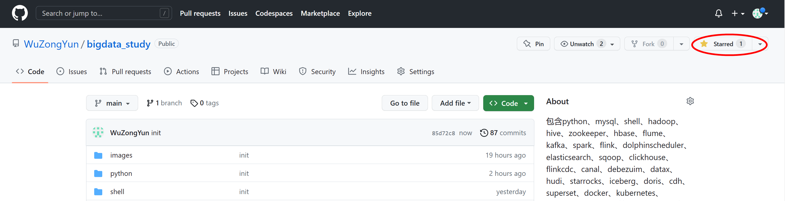

# 大数据学习文档、实战代码、源码解析、测试数据
# 持续更新中...
#### 包含python、mysql、shell、hadoop、hive、zookeeper、hbase、flume、kafka、spark、flink、dolphinscheduler、elasticsearch、sqoop、clickhouse、flinkcdc、canal、debezuim、datax、hudi、starrocks、iceberg、doris、cdh、superset、docker、kubernetes、strampark、maxwell等组件学习、实战、面试

## 码字不易，请路过的朋友们点个★star★鼓励一下~，谢谢。

## [**一、python**](https://github.com/WuZongYun/bigdata_study/tree/main/python)

[ 1. python基础（概念+代码样例+输出结果）](https://github.com/WuZongYun/bigdata_study/blob/main/python/1_python%E5%9F%BA%E7%A1%80.md)

[ 2. python Numpy（NumPy 是用于处理数组的 python 库 概念+代码样例+输出结果）](https://github.com/WuZongYun/bigdata_study/blob/main/python/2_pythonNumpy.md)

[ 3. python Pandas （Pandas 从 Numpy 和 Matplotlib 的基础上构建而来，享有数据分析“三剑客之一”的盛名）](https://github.com/WuZongYun/bigdata_study/blob/main/python/3_pythonPandas.md)

## [**二、shell**](https://github.com/WuZongYun/bigdata_study/tree/main/shell)

[ 1. shell基础](https://github.com/WuZongYun/bigdata_study/blob/main/shell/1_shell%E5%9F%BA%E7%A1%80.md)

## [三、大数据基础环境准备](https://github.com/WuZongYun/bigdata_study/tree/main/%E5%A4%A7%E6%95%B0%E6%8D%AE%E5%9F%BA%E7%A1%80%E7%8E%AF%E5%A2%83%E6%90%AD%E5%BB%BA)

[1. 安装虚拟机Centos7（Linux发行版之一，是免费的、开源的、可以重新分发的开源操作系统）](https://github.com/WuZongYun/bigdata_study/blob/main/%E5%A4%A7%E6%95%B0%E6%8D%AE%E5%9F%BA%E7%A1%80%E7%8E%AF%E5%A2%83%E6%90%AD%E5%BB%BA/1_%E5%AE%89%E8%A3%85%E8%99%9A%E6%8B%9F%E6%9C%BA.md)

[2. 安装MobaXterm（MobaXterm 是一款远程控制工具，支持创建SSH,Telnet,Rsh,Xdmc,RDP,VNC,FTP,SFTP,）](https://github.com/WuZongYun/bigdata_study/blob/main/%E5%A4%A7%E6%95%B0%E6%8D%AE%E5%9F%BA%E7%A1%80%E7%8E%AF%E5%A2%83%E6%90%AD%E5%BB%BA/2_%E5%AE%89%E8%A3%85MobaXterm.md)

[3. centos7免密设置（后续大数据集群安装时候避免不断输入密码）](https://github.com/WuZongYun/bigdata_study/blob/main/%E5%A4%A7%E6%95%B0%E6%8D%AE%E5%9F%BA%E7%A1%80%E7%8E%AF%E5%A2%83%E6%90%AD%E5%BB%BA/3_centos7%E5%85%8D%E5%AF%86%E8%AE%BE%E7%BD%AE.md)

[4. centos7安装JDK1.8（后续hadoop、spark等组件都依赖于JDK）](https://github.com/WuZongYun/bigdata_study/blob/main/%E5%A4%A7%E6%95%B0%E6%8D%AE%E5%9F%BA%E7%A1%80%E7%8E%AF%E5%A2%83%E6%90%AD%E5%BB%BA/4_centos7%E5%AE%89%E8%A3%85JDK.md)

[5. centos7安装mysql（后续用作Hive的元数据库）](https://github.com/WuZongYun/bigdata_study/blob/main/%E5%A4%A7%E6%95%B0%E6%8D%AE%E5%9F%BA%E7%A1%80%E7%8E%AF%E5%A2%83%E6%90%AD%E5%BB%BA/5_Centos7%E5%AE%89%E8%A3%85mysql.md)

## [**四、hadoop**](https://github.com/WuZongYun/bigdata_study/tree/main/shell)

[1. hadoop基本概念（hdfs、mapreducce、yarn）](https://github.com/WuZongYun/bigdata_study/blob/main/hadoop/1_hadoop%E5%9F%BA%E6%9C%AC%E6%A6%82%E5%BF%B5.md)

[2. hadoop集群安装（三个节点，master只有一个）](https://github.com/WuZongYun/bigdata_study/blob/main/hadoop/2_hadoop%E5%AE%89%E8%A3%85.md)

[3. hadoop集群高可用安装（三个节点，HDFS HA）](https://github.com/WuZongYun/bigdata_study/blob/main/hadoop/3_hadoop%E9%AB%98%E5%8F%AF%E7%94%A8%E5%AE%89%E8%A3%85%EF%BC%88HDFS%20HA%EF%BC%89.md)

[4. hadoop集群高可用安装（三个节点，YARN HA）](https://github.com/WuZongYun/bigdata_study/blob/main/hadoop/4_hadoop%E9%AB%98%E5%8F%AF%E7%94%A8%E5%AE%89%E8%A3%85%EF%BC%88YARN%20HA%EF%BC%89.md)

[5. hadoop shell 命令（在服务器上操作HDFS）](https://github.com/WuZongYun/bigdata_study/blob/main/hadoop/5_hadoop%20shell%20%E5%91%BD%E4%BB%A4.md)

[6. hadoop mapreduce实战（wordcount案例编写）](https://github.com/WuZongYun/bigdata_study/blob/main/hadoop/6_hadoop%20MapRerduce%E5%AE%9E%E6%88%98.md)

## [**五、hive**](https://github.com/WuZongYun/bigdata_study/tree/main/shell)

[1. hive 安装（集群版）](https://github.com/WuZongYun/bigdata_study/blob/main/hive/1_hive%E5%AE%89%E8%A3%85.md)

[2. hive 基本概念（数据类型、内外部表、分区分桶表、数据倾斜等）](https://github.com/WuZongYun/bigdata_study/blob/main/hive/2_hive%E5%9F%BA%E6%9C%AC%E6%A6%82%E5%BF%B5.md)

[3. hive 查询（WHERE子句、HAVING子句、GROUP BY子句、JOIN连接查询等）](https://github.com/WuZongYun/bigdata_study/blob/main/hive/3_hive%E5%AE%9E%E6%88%98.md)

[3. hive 窗口函数（ROW_NUMBER、RANK、DENSE_RANK、NTILE等）](https://github.com/WuZongYun/bigdata_study/blob/main/hive/3_hive%E5%AE%9E%E6%88%98.md)

## [**六、zookeeper**](https://github.com/WuZongYun/bigdata_study/tree/main/shell)

## [**七、hbase**](https://github.com/WuZongYun/bigdata_study/tree/main/shell)

## [**八、flume**](https://github.com/WuZongYun/bigdata_study/tree/main/shell)

## [**九、kafka**](https://github.com/WuZongYun/bigdata_study/tree/main/shell)

## [**十、spark**](https://github.com/WuZongYun/bigdata_study/tree/main/shell)

## [**十一、flink**](https://github.com/WuZongYun/bigdata_study/tree/main/shell)

## [**十二、dolphinscheduler**](https://github.com/WuZongYun/bigdata_study/tree/main/shell)

## [**十三、elasticsearch**](https://github.com/WuZongYun/bigdata_study/tree/main/shell)

## [**十四、sqoop**](https://github.com/WuZongYun/bigdata_study/tree/main/shell)

## [**十五、clickhouse**](https://github.com/WuZongYun/bigdata_study/tree/main/shell)

## [**十六、flinkcCDC**](https://github.com/WuZongYun/bigdata_study/tree/main/shell)

## [**十七、canal**](https://github.com/WuZongYun/bigdata_study/tree/main/shell)

## [**十八、debezium**](https://github.com/WuZongYun/bigdata_study/tree/main/shell)

## [**十九、datax**](https://github.com/WuZongYun/bigdata_study/tree/main/shell)

## [**二十、hudi**](https://github.com/WuZongYun/bigdata_study/tree/main/shell)

## [**二十一、starrocks**](https://github.com/WuZongYun/bigdata_study/tree/main/shell)

## [**二十二、iceberg**](https://github.com/WuZongYun/bigdata_study/tree/main/shell)

## [**二十三、doris**](https://github.com/WuZongYun/bigdata_study/tree/main/shell)

## [**二十四、cdh centos**](https://github.com/WuZongYun/bigdata_study/tree/main/shell)

## [**二十五、cdh ubuntu**](https://github.com/WuZongYun/bigdata_study/tree/main/shell)

## [**二十六、superset**](https://github.com/WuZongYun/bigdata_study/tree/main/shell)

## [**二十七、docker**](https://github.com/WuZongYun/bigdata_study/tree/main/shell)

## [**二十八、kubernetes**](https://github.com/WuZongYun/bigdata_study/tree/main/shell)

## [**二十九、streampark**](https://github.com/WuZongYun/bigdata_study/tree/main/shell)

## [**三十、maxwell**](https://github.com/WuZongYun/bigdata_study/tree/main/shell)