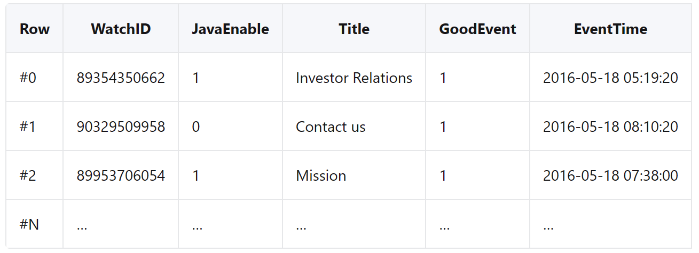
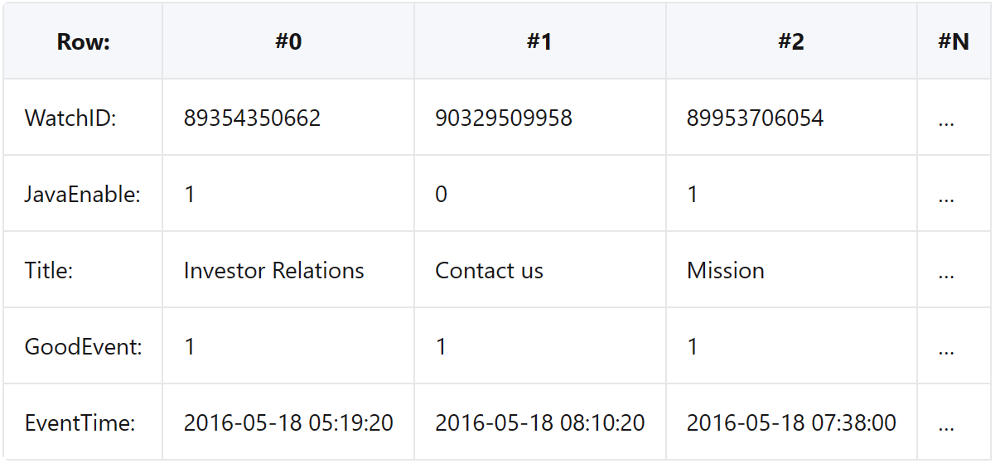
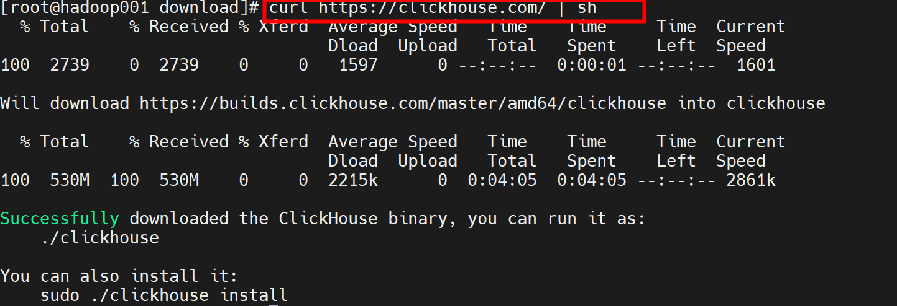
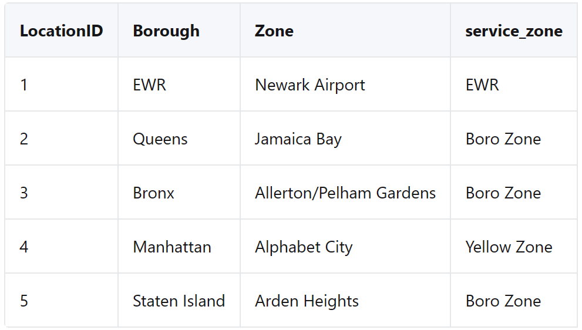

# ClickHouse简介

### 什么是ClickHouse?

ClickHouse®是一个用于在线分析处理(OLAP)的高性能、面向列的SQL数据库管理系统(DBMS)。它既可以作为开源软件，也可以作为云产品。

### 什么是OLAP?

OLAP场景需要在大型数据集上对具有以下特征的复杂分析查询进行实时响应:

* 数据集可以是巨大的——数十亿或数万亿行
* 数据被组织在包含许多列的表中
* 只选择少数列来回答任何特定的查询
* 结果必须以毫秒或秒为单位返回

### 面向列数据库与面向行数据库

* 在面向行的DBMS中，数据存储在行中，与一行相关的所有值在物理上彼此相邻存储。
* 在面向列的DBMS中，数据存储在列中，来自相同列的值存储在一起。

### 为什么面向列的数据库在OLAP场景中工作得更好

面向列的数据库更适合OLAP场景:它们处理大多数查询的速度至少快100倍。

### 为什么ClickHouse这么快?

ClickHouse充分利用所有可用的系统资源，尽可能快地处理每个分析查询。这是由于分析能力的独特组合和对实现最快的OLAP数据库所需的底层细节的关注。

### 实时处理分析性查询

在面向行的DBMS中，数据按以下顺序存储:



换句话说，与一行相关的所有值都在物理上彼此相邻存储。

面向行DBMS的例子有MySQL、Postgres和MS SQL Server。

在一个面向列的DBMS中，数据是这样存储的:



这些例子只显示了数据的排列顺序。来自不同列的值分别存储，来自同一列的数据存储在一起。

面向列的DBMS的例子:Vertica, Paraccel (Actian Matrix和Amazon Redshift)， Sybase IQ, Exasol, Infobright, InfiniDB, MonetDB (VectorWise和Actian Vector)， LucidDB, SAP HANA，谷歌Dremel，谷歌PowerDrill, Druid和kdb+。

不同的数据存储顺序更适合不同的场景。数据访问场景指的是执行哪些查询、频率和比例;对于每种类型的查询(行、列和字节)要读取多少数据;读取和更新数据之间的关系;数据的工作大小以及如何在本地使用它;是否使用事务，以及它们是如何隔离的;数据复制和逻辑完整性要求;对每种查询类型的延迟和吞吐量的需求，等等。

系统负载越高，定制系统设置以匹配使用场景的需求就越重要，定制的粒度也就越细。没有一种系统能够同样适用于截然不同的场景。如果一个系统能够适应广泛的场景集，那么在高负载下，该系统将同样糟糕地处理所有场景，或者只在一个或几个可能的场景中工作得很好。

### OLAP场景的关键属性

* 表是“宽的”，这意味着它们包含大量的列。
* 数据集很大，查询在处理单个查询时需要高吞吐量(每台服务器每秒可达数十亿行)。
* 列值相当小:数字和短字符串(例如，每个URL 60字节)。
* 查询提取大量的行，但只提取列的一小部分。
* 对于简单的查询，允许大约50毫秒的延迟。
* 每个查询有一个大表;所有的表都很小，只有一张除外。
* 查询结果明显小于源数据。换句话说，数据被过滤或聚合，因此结果适合单个服务器的RAM。
* 查询相对较少(通常每个服务器每秒有数百个查询或更少)。
* 插入发生在相当大的批量(> 1000行)，而不是单个行。
* 事务不是必需的。
* 很容易看出OLAP场景与其他流行场景(如OLTP或键值访问)有很大不同。因此，如果您想要获得良好的性能，尝试使用OLTP或Key-Value DB来处理分析性查询是没有意义的。例如，如果您尝试使用MongoDB或Redis进行分析，与OLAP数据库相比，您将获得非常差的性能。

### 输入/输出

1. 对于分析性查询，只需要读取少量的表列。在面向列的数据库中，您只能读取所需的数据。例如，如果需要100列中的5列，则I/O将减少20倍。
2. 由于数据是以包的形式读取的，因此更容易压缩。列中的数据也更容易压缩。这进一步减少了I/O容量。
3. 由于减少了I/O，系统缓存可以容纳更多的数据。

例如，查询“计算每个广告平台的记录数量”需要读取一个“广告平台ID”列，该列占用1个未压缩字节。如果大部分流量不是来自广告平台，您可以预期该列至少压缩了10倍。当使用快速压缩算法时，可以以每秒至少几gb的未压缩数据的速度进行数据解压缩。换句话说，在一台服务器上可以以大约每秒几十亿行的速度处理该查询。这个速度实际上是在实践中达到的。

# ClickHouse快速入门

**1:下载二进制文件**

ClickHouse可以在Linux、FreeBSD和macOS上运行，也可以通过WSL在Windows上运行。本地下载ClickHouse最简单的方法是运行以下curl命令。它决定你的操作系统是否被支持，然后下载一个合适的ClickHouse二进制文件:

`curl https://clickhouse.com/ | sh`



**2:启动服务器**

运行命令安装ClickHouse服务器。

`sudo clickhouse install`

**3:启动客户端**

使用ClickHouse客户端连接到您的ClickHouse服务。打开一个新终端，将目录更改到保存clickhouse二进制文件的位置，并运行以下命令:

`sudo clickhouse start`

当它连接到本地主机上运行的服务时，你应该看到一个笑脸:

`my-host :)`

**4:新建表**

使用CREATE TABLE定义一个新表。典型的SQL DDL命令在ClickHouse中只需要添加一个附加项——ClickHouse中的表需要一个ENGINE子句。使用MergeTree来利用ClickHouse的性能优势:

```
CREATE TABLE my_first_table
(
    user_id UInt32,
    message String,
    timestamp DateTime,
    metric Float32
)
ENGINE = MergeTree
PRIMARY KEY (user_id, timestamp)
```

**5:插入数据**

您可以在ClickHouse中使用熟悉的INSERT INTO TABLE命令，但重要的是要理解对合并树表的每次插入都会在存储中创建一个部件(文件夹)。为了最小化部件，可以一次批量插入大量行(一次插入数万甚至数百万行)。

```
INSERT INTO my_first_table (user_id, message, timestamp, metric) VALUES
    (101, 'Hello, ClickHouse!',                                 now(),       -1.0    ),
    (102, 'Insert a lot of rows per batch',                     yesterday(), 1.41421 ),
    (102, 'Sort your data based on your commonly-used queries', today(),     2.718   ),
    (101, 'Granules are the smallest chunks of data read',      now() + 5,   3.14159 )
```

**5:查询新表**

您可以像使用任何SQL数据库一样编写SELECT查询:

```
 SELECT *
 FROM my_first_table
 ORDER BY timestamp
```

**注意，返回的响应是一个很好的表格格式:**

```
┌─user_id─┬─message────────────────────────────────────────────┬───────────timestamp─┬──metric─┐
│     102 │ Insert a lot of rows per batch                     │ 2022-03-21 00:00:00 │ 1.41421 │
│     102 │ Sort your data based on your commonly-used queries │ 2022-03-22 00:00:00 │   2.718 │
│     101 │ Hello, ClickHouse!                                 │ 2022-03-22 14:04:09 │      -1 │
│     101 │ Granules are the smallest chunks of data read      │ 2022-03-22 14:04:14 │ 3.14159 │
└─────────┴────────────────────────────────────────────────────┴─────────────────────┴─────────┘

4 rows in set. Elapsed: 0.008 sec.
```

**7:插入自己的数据**

下一步是将当前数据输入ClickHouse。我们有许多用于摄取数据的表函数和集成。我们在下面的选项卡中有一些例子，或者查看我们的集成，以获得与ClickHouse集成的一长串技术列表。

##### 1. S3

使用s3表函数从s3读取文件。它是一个表函数-这意味着结果是一个表，可以是:

用作SELECT查询的源(允许您运行特别查询并将数据留在S3中)，或将结果表插入到合并树表中(当您准备将数据移动到ClickHouse时)
一个特别的查询是这样的:

```
SELECT
   passenger_count,
   avg(toFloat32(total_amount))
FROM s3(
    'https://datasets-documentation.s3.eu-west-3.amazonaws.com/nyc-taxi/trips_0.gz',
    'TabSeparatedWithNames'
)
GROUP BY passenger_count
ORDER BY passenger_count;
```

将数据移动到ClickHouse表中如下所示，其中nyc_taxi是一个合并树表:

```
INSERT INTO nyc_taxi
   SELECT * FROM s3(
    'https://datasets-documentation.s3.eu-west-3.amazonaws.com/nyc-taxi/trips_0.gz',
    'TabSeparatedWithNames'
)
SETTINGS input_format_allow_errors_num=25000;
```

##### 2. GCS

用于在AWS s3中读取数据的s3表函数也适用于谷歌云存储中的文件。例如:

```
SELECT
   *
FROM s3(
  'https://storage.googleapis.com/my-bucket/trips.parquet',
  'MY_GCS_HMAC_KEY',
  'MY_GCS_HMAC_SECRET_KEY',
  'Parquet'
)
LIMIT 1000
```

##### 3. Web

url表函数读取从web上可访问的文件:

```
SELECT *
FROM url(
    'http://prod2.publicdata.landregistry.gov.uk.s3-website-eu-west-1.amazonaws.com/pp-complete.csv',
    'CSV'
  );
```

##### 4. Local

使用文件表引擎读取本地文件。为简单起见，将文件复制到user_files目录(该目录位于下载ClickHouse二进制文件的目录中)。

```
DESCRIBE TABLE file('comments.tsv')

Query id: 8ca9b2f9-65a2-4982-954a-890de710a336

┌─name──────┬─type────────────────────┬─default_type─┬─default_expression─┬─comment─┬─codec_expression─┬─ttl_expression─┐
│ id        │ Nullable(Int64)         │              │                    │         │                  │                │
│ type      │ Nullable(String)        │              │                    │         │                  │                │
│ author    │ Nullable(String)        │              │                    │         │                  │                │
│ timestamp │ Nullable(DateTime64(9)) │              │                    │         │                  │                │
│ comment   │ Nullable(String)        │              │                    │         │                  │                │
│ children  │ Array(Nullable(Int64))  │              │                    │         │                  │                │
└───────────┴─────────────────────────┴──────────────┴────────────────────┴─────────┴──────────────────┴────────────────┘
```

**注意，ClickHouse通过分析大量行来推断列的名称和数据类型。如果ClickHouse不能从文件名中确定存储类型，您可以将其指定为第二个参数:**

```
SELECT count()
FROM file(
  'comments.tsv',
  'TabSeparatedWithNames'
)
```

##### 5. PostgreSQL

使用postgresql table函数从postgresql的表中读取数据:

```
SELECT *
FROM
   postgresql(
    'localhost:5432',
    'my_database',
    'my_table',
    'postgresql_user',
    'password')
;
```

##### 5. MySQL

使用 MySQL table函数从MySQL的表中读取数据:

```
SELECT *
FROM
   mysql(
    'localhost:3306',
    'my_database',
    'my_table',
    'postgresql_user',
    'password')
;
```

# 高级教程

### 从本教程中可以期待什么?

在本教程中，您将创建一个表并插入一个大型数据集(200万行纽约出租车数据)。然后，您将在数据集上运行查询，包括如何创建字典并使用它执行JOIN的示例。

**请注意 ：本教程假设您可以访问正在运行的ClickHouse服务。如果没有，请查看快速入门。**

#### 1. 创建新表
   纽约市的出租车数据包含数百万次出租车乘坐的详细信息，包括接送时间和地点、费用、小费金额、通行费、支付类型等列。让我们创建一个表来存储这些数据…

如果你使用的是自我管理的ClickHouse，你可以在https://hostname:8443/play连接到SQL控制台(请与你的ClickHouse管理员查看详细信息)。

(1) 在默认数据库中创建以下行程表:

```
CREATE TABLE trips
(
    `trip_id` UInt32,
    `vendor_id` Enum8('1' = 1, '2' = 2, '3' = 3, '4' = 4, 'CMT' = 5, 'VTS' = 6, 'DDS' = 7, 'B02512' = 10, 'B02598' = 11, 'B02617' = 12, 'B02682' = 13, 'B02764' = 14, '' = 15),
    `pickup_date` Date,
    `pickup_datetime` DateTime,
    `dropoff_date` Date,
    `dropoff_datetime` DateTime,
    `store_and_fwd_flag` UInt8,
    `rate_code_id` UInt8,
    `pickup_longitude` Float64,
    `pickup_latitude` Float64,
    `dropoff_longitude` Float64,
    `dropoff_latitude` Float64,
    `passenger_count` UInt8,
    `trip_distance` Float64,
    `fare_amount` Float32,
    `extra` Float32,
    `mta_tax` Float32,
    `tip_amount` Float32,
    `tolls_amount` Float32,
    `ehail_fee` Float32,
    `improvement_surcharge` Float32,
    `total_amount` Float32,
    `payment_type` Enum8('UNK' = 0, 'CSH' = 1, 'CRE' = 2, 'NOC' = 3, 'DIS' = 4),
    `trip_type` UInt8,
    `pickup` FixedString(25),
    `dropoff` FixedString(25),
    `cab_type` Enum8('yellow' = 1, 'green' = 2, 'uber' = 3),
    `pickup_nyct2010_gid` Int8,
    `pickup_ctlabel` Float32,
    `pickup_borocode` Int8,
    `pickup_ct2010` String,
    `pickup_boroct2010` String,
    `pickup_cdeligibil` String,
    `pickup_ntacode` FixedString(4),
    `pickup_ntaname` String,
    `pickup_puma` UInt16,
    `dropoff_nyct2010_gid` UInt8,
    `dropoff_ctlabel` Float32,
    `dropoff_borocode` UInt8,
    `dropoff_ct2010` String,
    `dropoff_boroct2010` String,
    `dropoff_cdeligibil` String,
    `dropoff_ntacode` FixedString(4),
    `dropoff_ntaname` String,
    `dropoff_puma` UInt16
)
ENGINE = MergeTree
PARTITION BY toYYYYMM(pickup_date)
ORDER BY pickup_datetime;
```

#### 2. 插入数据集

现在已经创建了一个表，让我们添加NYC出租车数据。它是S3中的CSV文件，您可以从那里加载数据。

(1) 下面的命令从S3中的两个不同文件trips_1.tsv.gz和trips_2.tsv.gz中插入约2,000,000行到您的trips表中:

```
INSERT INTO trips
SELECT * FROM s3(
    'https://datasets-documentation.s3.eu-west-3.amazonaws.com/nyc-taxi/trips_{1..2}.gz',
    'TabSeparatedWithNames', "
    `trip_id` UInt32,
    `vendor_id` Enum8('1' = 1, '2' = 2, '3' = 3, '4' = 4, 'CMT' = 5, 'VTS' = 6, 'DDS' = 7, 'B02512' = 10, 'B02598' = 11, 'B02617' = 12, 'B02682' = 13, 'B02764' = 14, '' = 15),
    `pickup_date` Date,
    `pickup_datetime` DateTime,
    `dropoff_date` Date,
    `dropoff_datetime` DateTime,
    `store_and_fwd_flag` UInt8,
    `rate_code_id` UInt8,
    `pickup_longitude` Float64,
    `pickup_latitude` Float64,
    `dropoff_longitude` Float64,
    `dropoff_latitude` Float64,
    `passenger_count` UInt8,
    `trip_distance` Float64,
    `fare_amount` Float32,
    `extra` Float32,
    `mta_tax` Float32,
    `tip_amount` Float32,
    `tolls_amount` Float32,
    `ehail_fee` Float32,
    `improvement_surcharge` Float32,
    `total_amount` Float32,
    `payment_type` Enum8('UNK' = 0, 'CSH' = 1, 'CRE' = 2, 'NOC' = 3, 'DIS' = 4),
    `trip_type` UInt8,
    `pickup` FixedString(25),
    `dropoff` FixedString(25),
    `cab_type` Enum8('yellow' = 1, 'green' = 2, 'uber' = 3),
    `pickup_nyct2010_gid` Int8,
    `pickup_ctlabel` Float32,
    `pickup_borocode` Int8,
    `pickup_ct2010` String,
    `pickup_boroct2010` String,
    `pickup_cdeligibil` String,
    `pickup_ntacode` FixedString(4),
    `pickup_ntaname` String,
    `pickup_puma` UInt16,
    `dropoff_nyct2010_gid` UInt8,
    `dropoff_ctlabel` Float32,
    `dropoff_borocode` UInt8,
    `dropoff_ct2010` String,
    `dropoff_boroct2010` String,
    `dropoff_cdeligibil` String,
    `dropoff_ntacode` FixedString(4),
    `dropoff_ntaname` String,
    `dropoff_puma` UInt16
") SETTINGS input_format_try_infer_datetimes = 0
```

(2) 等待INSERT完成—下载150mb的数据可能需要一段时间。

**请注意:s3函数聪明地知道如何解压缩数据，TabSeparatedWithNames格式告诉ClickHouse数据是用制表符分隔的，还可以跳过每个文件的标题行。**

(3) 当插入完成时，验证它工作:

```
SELECT count() FROM trips
```

您应该看到大约2M行(准确地说，是1,999,657行)。

(4) 如果你运行一个需要命中每一行的查询，你会发现需要处理的行要多得多，但运行时间仍然非常快:

```
SELECT DISTINCT(pickup_ntaname) FROM trips
```

该查询必须处理2M行并返回190个值，但请注意，它在大约1秒内完成此操作。pickup_ntaname列表示出租车起源于纽约市的社区名称。

#### 3. 分析数据

让我们运行一些查询来分析2M行数据…

(1) 我们将从一些简单的计算开始，比如计算平均小费金额:

```
SELECT round(avg(tip_amount), 2) FROM trips
```

答案是:

```
┌─round(avg(tip_amount), 2)─┐
│                      1.68 │
└───────────────────────────┘
```
(2) 该查询基于乘客数量计算平均费用:

```
SELECT
passenger_count,
ceil(avg(total_amount),2) AS average_total_amount
FROM trips
GROUP BY passenger_count
```

passenger_count的取值范围为0 ~ 9:

```
┌─passenger_count─┬─average_total_amount─┐
│               0 │                22.69 │
│               1 │                15.97 │
│               2 │                17.15 │
│               3 │                16.76 │
│               4 │                17.33 │
│               5 │                16.35 │
│               6 │                16.04 │
│               7 │                 59.8 │
│               8 │                36.41 │
│               9 │                 9.81 │
└─────────────────┴──────────────────────┘
```

(3) 下面是一个查询，计算每个社区每天的拾取数量:

```
SELECT
pickup_date,
pickup_ntaname,
SUM(1) AS number_of_trips
FROM trips
GROUP BY pickup_date, pickup_ntaname
ORDER BY pickup_date ASC
```

结果如下所示:

```
┌─pickup_date─┬─pickup_ntaname───────────────────────────────────────────┬─number_of_trips─┐
│  2015-07-01 │ Brooklyn Heights-Cobble Hill                             │              13 │
│  2015-07-01 │ Old Astoria                                              │               5 │
│  2015-07-01 │ Flushing                                                 │               1 │
│  2015-07-01 │ Yorkville                                                │             378 │
│  2015-07-01 │ Gramercy                                                 │             344 │
│  2015-07-01 │ Fordham South                                            │               2 │
│  2015-07-01 │ SoHo-TriBeCa-Civic Center-Little Italy                   │             621 │
│  2015-07-01 │ Park Slope-Gowanus                                       │              29 │
│  2015-07-01 │ Bushwick South                                           │               5 │
```

(4) 这个查询计算行程的长度，并根据该值对结果进行分组:

```
SELECT
avg(tip_amount) AS avg_tip,
avg(fare_amount) AS avg_fare,
avg(passenger_count) AS avg_passenger,
count() AS count,
truncate(date_diff('second', pickup_datetime, dropoff_datetime)/60) as trip_minutes
FROM trips
WHERE trip_minutes > 0
GROUP BY trip_minutes
ORDER BY trip_minutes DESC
```
结果如下所示:

```
┌──────────────avg_tip─┬───────────avg_fare─┬──────avg_passenger─┬──count─┬─trip_minutes─┐
│   1.9600000381469727 │                  8 │                  1 │      1 │        27511 │
│                    0 │                 12 │                  2 │      1 │        27500 │
│    0.542166673981895 │ 19.716666666666665 │ 1.9166666666666667 │     60 │         1439 │
│    0.902499997522682 │ 11.270625001192093 │            1.95625 │    160 │         1438 │
│   0.9715789457909146 │ 13.646616541353383 │ 2.0526315789473686 │    133 │         1437 │
│   0.9682692398245518 │ 14.134615384615385 │  2.076923076923077 │    104 │         1436 │
│   1.1022105210705808 │ 13.778947368421052 │  2.042105263157895 │     95 │         1435 │
```

(5) 这个查询显示了每个社区的接车数量，按小时分解:

```
SELECT
pickup_ntaname,
toHour(pickup_datetime) as pickup_hour,
SUM(1) AS pickups
FROM trips
WHERE pickup_ntaname != ''
GROUP BY pickup_ntaname, pickup_hour
ORDER BY pickup_ntaname, pickup_hour
```
结果如下所示:

```
┌─pickup_ntaname───────────────────────────────────────────┬─pickup_hour─┬─pickups─┐
│ Airport                                                  │           0 │    3509 │
│ Airport                                                  │           1 │    1184 │
│ Airport                                                  │           2 │     401 │
│ Airport                                                  │           3 │     152 │
│ Airport                                                  │           4 │     213 │
│ Airport                                                  │           5 │     955 │
│ Airport                                                  │           6 │    2161 │
│ Airport                                                  │           7 │    3013 │
│ Airport                                                  │           8 │    3601 │
│ Airport                                                  │           9 │    3792 │
│ Airport                                                  │          10 │    4546 │
│ Airport                                                  │          11 │    4659 │
│ Airport                                                  │          12 │    4621 │
│ Airport                                                  │          13 │    5348 │
│ Airport                                                  │          14 │    5889 │
│ Airport                                                  │          15 │    6505 │
│ Airport                                                  │          16 │    6119 │
│ Airport                                                  │          17 │    6341 │
│ Airport                                                  │          18 │    6173 │
│ Airport                                                  │          19 │    6329 │
│ Airport                                                  │          20 │    6271 │
│ Airport                                                  │          21 │    6649 │
│ Airport                                                  │          22 │    6356 │
│ Airport                                                  │          23 │    6016 │
│ Allerton-Pelham Gardens                                  │           4 │       1 │
│ Allerton-Pelham Gardens                                  │           6 │       1 │
│ Allerton-Pelham Gardens                                  │           7 │       1 │
│ Allerton-Pelham Gardens                                  │           9 │       5 │
│ Allerton-Pelham Gardens                                  │          10 │       3 │
│ Allerton-Pelham Gardens                                  │          15 │       1 │
│ Allerton-Pelham Gardens                                  │          20 │       2 │
│ Allerton-Pelham Gardens                                  │          23 │       1 │
│ Annadale-Huguenot-Prince's Bay-Eltingville               │          23 │       1 │
│ Arden Heights                                            │          11 │       1 │
```

(6) 让我们看看去拉瓜迪亚机场或肯尼迪机场的车:

```
SELECT
pickup_datetime,
dropoff_datetime,
total_amount,
pickup_nyct2010_gid,
dropoff_nyct2010_gid,
CASE
WHEN dropoff_nyct2010_gid = 138 THEN 'LGA'
WHEN dropoff_nyct2010_gid = 132 THEN 'JFK'
END AS airport_code,
EXTRACT(YEAR FROM pickup_datetime) AS year,
EXTRACT(DAY FROM pickup_datetime) AS day,
EXTRACT(HOUR FROM pickup_datetime) AS hour
FROM trips
WHERE dropoff_nyct2010_gid IN (132, 138)
ORDER BY pickup_datetime
```
结果如下所示:
```
┌─────pickup_datetime─┬────dropoff_datetime─┬─total_amount─┬─pickup_nyct2010_gid─┬─dropoff_nyct2010_gid─┬─airport_code─┬─year─┬─day─┬─hour─┐
│ 2015-07-01 00:04:14 │ 2015-07-01 00:15:29 │         13.3 │                 -34 │                  132 │ JFK          │ 2015 │   1 │    0 │
│ 2015-07-01 00:09:42 │ 2015-07-01 00:12:55 │          6.8 │                  50 │                  138 │ LGA          │ 2015 │   1 │    0 │
│ 2015-07-01 00:23:04 │ 2015-07-01 00:24:39 │          4.8 │                -125 │                  132 │ JFK          │ 2015 │   1 │    0 │
│ 2015-07-01 00:27:51 │ 2015-07-01 00:39:02 │        14.72 │                -101 │                  138 │ LGA          │ 2015 │   1 │    0 │
│ 2015-07-01 00:32:03 │ 2015-07-01 00:55:39 │        39.34 │                  48 │                  138 │ LGA          │ 2015 │   1 │    0 │
│ 2015-07-01 00:34:12 │ 2015-07-01 00:40:48 │         9.95 │                 -93 │                  132 │ JFK          │ 2015 │   1 │    0 │
│ 2015-07-01 00:38:26 │ 2015-07-01 00:49:00 │         13.3 │                 -11 │                  138 │ LGA          │ 2015 │   1 │    0 │
│ 2015-07-01 00:41:48 │ 2015-07-01 00:44:45 │          6.3 │                 -94 │                  132 │ JFK          │ 2015 │   1 │    0 │
│ 2015-07-01 01:06:18 │ 2015-07-01 01:14:43 │        11.76 │                  37 │                  132 │ JFK          │ 2015 │   1 │    1 │
```

#### 4. 创建字典

(1) 让我们看看如何在ClickHouse服务中创建与表关联的字典。表格和字典将基于一个包含265行的CSV文件，纽约市的每个社区都有一行。这些社区被映射到纽约市的行政区(纽约市有5个行政区:布朗克斯区、布鲁克林区、曼哈顿区、皇后区和斯塔顿岛区)，这个文件将纽瓦克机场(EWR)也算作一个行政区。
这是CSV文件的一部分(为清晰起见，以表格形式显示)。文件中的LocationID列映射到行程表中的pickup_nyct2010_gid和dropoff_nyct2010_gid列:



(2) 该文件的URL是https://datasets-documentation.s3.eu-west-3.amazonaws.com/nyc-taxi/taxi_zone_lookup.csv。运行下面的SQL语句，创建一个名为taxi_zone_dictionary的Dictionary，并从S3中的CSV文件填充该Dictionary:

```
CREATE DICTIONARY taxi_zone_dictionary
(
`LocationID` UInt16 DEFAULT 0,
`Borough` String,
`Zone` String,
`service_zone` String
)
PRIMARY KEY LocationID
SOURCE(HTTP(URL 'https://datasets-documentation.s3.eu-west-3.amazonaws.com/nyc-taxi/taxi_zone_lookup.csv' FORMAT 'CSVWithNames'))
LIFETIME(MIN 0 MAX 0)
LAYOUT(HASHED_ARRAY())
```

**注意：将LIFETIME设置为0意味着这个字典将永远不会更新它的源。这里使用它是为了不向S3桶发送不必要的流量，但通常您可以指定您喜欢的任何生命周期值。**

比如：
```
LIFETIME(MIN 1 MAX 10)
```
**指定要在1到10秒之间的随机时间后更新的字典。(在大量服务器上更新时，为了分配字典源上的负载，随机时间是必要的。)**

(3) 验证它的工作-你应该得到265行(每个街区一行):
```
SELECT * FROM taxi_zone_dictionary
```

(4) 使用dictGet函数(或其变体)从字典中检索值。传入字典的名称、需要的值和键(在本例中是taxi_zone_dictionary的LocationID列)。
例如，下面的查询返回LocationID为132的Borough(正如我们上面看到的是JFK机场):

```
SELECT dictGet('taxi_zone_dictionary', 'Borough', 132)
```

JFK在Queens，注意检索值的时间本质上是0:
```
┌─dictGet('taxi_zone_dictionary', 'Borough', 132)─┐
│ Queens                                          │
└─────────────────────────────────────────────────┘

1 rows in set. Elapsed: 0.004 sec.
```

(5) 使用dictHas函数查看字典中是否存在键。例如，下面的查询返回1(在ClickHouse中为“true”):
```
SELECT dictHas('taxi_zone_dictionary', 132)
```

(6) 下面的查询返回0，因为4567不是字典中LocationID的值:
```
SELECT dictHas('taxi_zone_dictionary', 4567)
```
(7) 使用dictGet函数在查询中检索自治区名称。例如:使用dictGet函数在查询中检索自治区名称。例如:
```
SELECT
count(1) AS total,
dictGetOrDefault('taxi_zone_dictionary','Borough', toUInt64(pickup_nyct2010_gid), 'Unknown') AS borough_name
FROM trips
WHERE dropoff_nyct2010_gid = 132 OR dropoff_nyct2010_gid = 138
GROUP BY borough_name
ORDER BY total DESC
```

(8) 这个查询汇总了每个行政区在拉瓜迪亚机场或JFK机场结束的出租车乘坐次数。结果如下所示，并注意有相当多的行程，其中的降落区域是未知的:
```
┌─total─┬─borough_name──┐
│ 23683 │ Unknown       │
│  7053 │ Manhattan     │
│  6828 │ Brooklyn      │
│  4458 │ Queens        │
│  2670 │ Bronx         │
│   554 │ Staten Island │
│    53 │ EWR           │
└───────┴───────────────┘

7 rows in set. Elapsed: 0.019 sec. Processed 2.00 million rows, 4.00 MB (105.70 million rows/s., 211.40 MB/s.)
```
#### 5. 执行连接
让我们编写一些查询，将taxi_zone_dictionary与您的trips表连接起来。

(1) 我们可以从一个简单的JOIN开始，它的作用类似于上面的机场查询:
```
SELECT
count(1) AS total,
Borough
FROM trips
JOIN taxi_zone_dictionary ON toUInt64(trips.pickup_nyct2010_gid) = taxi_zone_dictionary.LocationID
WHERE dropoff_nyct2010_gid = 132 OR dropoff_nyct2010_gid = 138
GROUP BY Borough
ORDER BY total DESC
```

回答看起来很熟悉:
```
┌─total─┬─Borough───────┐
│  7053 │ Manhattan     │
│  6828 │ Brooklyn      │
│  4458 │ Queens        │
│  2670 │ Bronx         │
│   554 │ Staten Island │
│    53 │ EWR           │
└───────┴───────────────┘

6 rows in set. Elapsed: 0.034 sec. Processed 2.00 million rows, 4.00 MB (59.14 million rows/s., 118.29 MB/s.)
```

**注意，上述JOIN查询的输出与之前使用dictGetOrDefault的查询相同(除了不包括Unknown值)。在幕后，ClickHouse实际上为taxi_zone_dictionary字典调用了dictGet函数，但是JOIN语法对于SQL开发人员来说更为熟悉。**

(2) 我们在ClickHouse中不经常使用SELECT * -您应该只检索您实际需要的列!但是很难找到一个花费很长时间的查询，所以这个查询有意地选择每一列并返回每一行(除了默认情况下响应中有一个内置的10,000行最大值)，并且还对每一行与字典进行右连接:
```
SELECT *
FROM trips
JOIN taxi_zone_dictionary
ON trips.dropoff_nyct2010_gid = taxi_zone_dictionary.LocationID
WHERE tip_amount > 0
ORDER BY tip_amount DESC
LIMIT 1000
```

