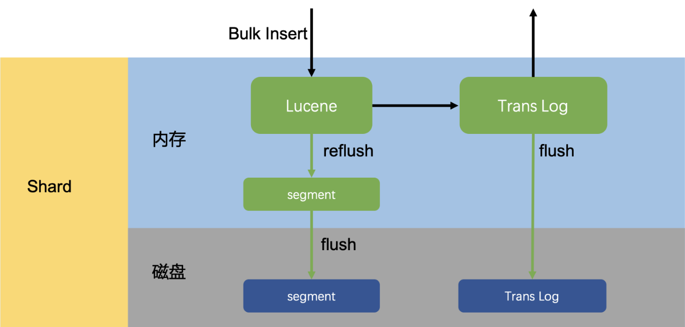
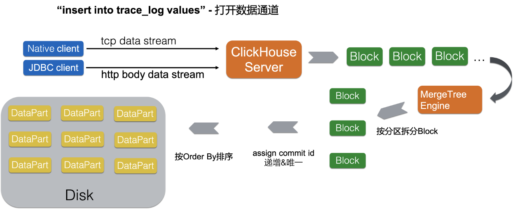

Clickhouse是俄罗斯搜索巨头Yandex开发的完全列式存储计算的分析型数据库。ClickHouse在这两年的OLAP领域中一直非常热门，国内互联网大厂都有大规模使用。Elasticsearch是一个近实时的分布式搜索分析引擎，它的底层存储完全构建在Lucene之上。简单来说是通过扩展Lucene的单机搜索能力，使其具有分布式的搜索和分析能力。Elasticsearch通常会和其它两个开源组件Logstash（日志采集）和Kibana（仪表盘）一起提供端到端的日志/搜索分析的功能，常常被简称为ELK。

今天很多用户在实际的业务场景中，常常面对ClickHouse和Elasticsearch技术选型的难题。用户对ClickHouse和Elasticsearch的内核知识了解不足，往往只能通过性能测试的手段来进行选型。本文的主旨在于通过彻底剖析ClickHouse和Elasticsearch的内核架构，从原理上讲明白两者的优劣之处，同时会附上一份覆盖多场景的测试报告给读者作为参考。

### 分布式架构

Elasticsearch和ClickHouse都是支持分布式多机的数据产品，这里作者首先要比对的就是两者的分布式架构差异，分布式结构设计对产品的易用性和可扩展性具有非常重要的影响。在分布式架构上，核心要解决的几个问题包括：节点发现、Meta同步、副本数据同步。Elasticsearch作为一个老牌的开源产品，在这块上做的相对比较成熟。原生的节点发现、Meta同步协议，给用户非常好的易用性体验。Elasticsearch的Meta同步协议需要解决的问题其实和开源的Raft协议非常相似，只不过在Elasticsearch诞生的时候还没有Raft出现，所以就只能自己动手搞一个了。经过这么多年的打磨，Elasticsearch的Meta同步协议也是相当成熟了。依托于此，Elasticsearch具有非常易用的多角色划分，auto schema inference等功能。值得一提的是Elasticsearch的多副本数据同步，并没有复用Meta同步协议，而是采用传统的主备同步机制，由主节点负责同步到备节点，这种方式会更加简单高效。

ClickHouse的分布式架构能力相对会简单一些，这也是因为ClickHouse还是一个比较年轻的开源产品，还处在分布式易用性不断迭代上升的阶段。ClickHouse引入了外置的ZooKeeper集群，来进行分布式DDL任务（节点Meta变更）、主备同步任务等操作的下发。多副本之间的数据同步（data shipping）任务下发也是依赖于ZooKeeper集群，但最终多副本之间的数据传输还是通过Http协议来进行点对点的数据拷贝，同时多副本都可写，数据同步是完全多向的。至于节点发现，ClickHouse目前都没有这方面的能力，都是需要通过手动配置集群节点地址来解决。ClickHouse目前这种脚手架式的分布式架构，导致它具有极强的灵活部署能力和运维介入能力，对用户的易用性略差，用户门槛相对较高，但是在能力上限方面，ClickHouse的分布式部署扩展性并没有短板，集群规模上限对比Elasticsearch没有差异。ClickHouse架构扁平，没有前端节点和后端节点之分，可部署任意规模集群。同时ClickHouse在多副本功能上有更细粒度的控制能力，可以做到表级别副本数配置，同一物理集群可划分多个逻辑集群，每个逻辑机器可任意配置分片数和副本数。

### 存储架构

#### 写入链路设计

写入吞吐能力是大数据场景下的一项核心指标，用户对大数据产品的要求不光是要存的下，还要写得快。这里首先介绍Elasticsearch的实时写入链路设计：在Elasticsearch的每一个Shard中，写入流程分为两部分，先写入Lucene，再写入TransLog。写入请求到达Shard后，先写Lucene内存索引，此时数据还在内存里面，接着去写TransLog，写完TransLog后，刷新TransLog数据到磁盘上，写磁盘成功后，请求返回给用户。这里有几个关键点，一是把写Lucene放在了最前面，主要是防止用户的写入请求包含“非法”的数据。二是写Lucene索引后，并不是可被搜索的，需要通过refresh把内存的对象转成完整的Segment后，然后再次reopen后才能被搜索，这个refresh时间间隔是用户可设定的。可以看出Lucene索引并没有写入实时可见的能力，所以Elasticsearch是一个近实时（Near Real Time）的系统。最后是每隔一段比较长的时间，比如30分钟后，Lucene会把内存中生成的新Segment刷新到磁盘上，刷新后索引文件已经持久化了，历史的TransLog就没用了，才会清空掉旧的TransLog。

对比Elasticsearch的写入链路，ClickHouse的写入方式更加“简单直接”、极致，上面已经讲过Elasticsearch是一个近实时系统，内存存储引擎中新写入的数据需要定时flush才可见。而ClickHouse则是干脆彻底放弃了内存存储引擎这一功能，所有的数据写入时直接落盘，同时也就省略了传统的写redo日志阶段。在极高写入吞吐要求的场景下，Elasticsearch和ClickHouse都需要为了提升吞吐而放弃部分写入实时可见性。只不过ClickHouse主推的做法是把数据延迟攒批写入交给客户端来实现。另外在多副本同步上，Elasticsearch要求的是实时同步，也就是写入请求必须写穿多个副本才会返回，而ClickHouse是依赖于ZooKeeper做异步的磁盘文件同步（data shipping）。在实战中ClickHouse的写入吞吐能力可以远远超过同规格的Elasticsearch。

#### Segment vs DataPart

Elasticsearch和ClickHouse的存储设计外表上看起来非常相似，但能力却又截然不同。Elasticsearch的磁盘文件由一个个Segment组成，Segment实际上是一份最小单位的Lucene索引，关于Segment内部的存储格式这里不展开讨论。而Segment又会在后台异步合并，这里合并主要解决两个问题：1）让二级索引更加有序；2）完成主键数据变更。二级索引是一种“全局”有序的索引，全部数据构建到一个索引里面比构建到多个索引里对查询的加速更明显。Elasticsearch是支持主键删除更新的，这都是依托于Lucene索引的删除功能来实现的，更新操作会被转换成删除操作加写入操作。当Lucene索引的Segment里存在多条删除记录时，系统就需要通过Segment合并来剔除这些记录。在多个Segment进行合并的时候，Lucene索引中的存储数据表现出的是append-only的合并，这种方式下二级索引的合并就不需要进行“重排序”。

对比Elasticsearch中的Segment，ClickHouse存储中的最小单位是DataPart，一次批量写入的数据会落盘成一个DataPart。DataPart内部的数据存储是完全有序的状态（按照表定义的order by排序），这种有序存储就是一种默认聚簇索引可以用来加速数据扫描。ClickHouse也会对DataPart进行异步合并，其合并也是用来解决两个问题：1）让数据存储更加有序；2）完成主键数据变更。DataPart在合并存储数据时表现出的是merge-sorted的方式，合并后产生的DataPart仍然处于完全有序状态。依赖于DataPart存储完全有序的设定，ClickHouse实现主键数据更新的方式和Elasticsearch截然不同。Elasticsearch在变更主键时，采用的是“先查原纪录-生成新记录-删除原纪录-写入新纪录”的方式，这种方式完全限制住了主键更新的效率，主键更新写入和append-only写入的效率差异非常大。而ClickHouse的主键更新是完全异步进行的，主键相同的多条记录在异步合并的时候会产生最新的记录结果。这种异步批量的主键更新方式比Elasticsearch更加高效。

最后总结一下Segment和DataPart内部文件存储的能力差异，Segment完全就是Lucene索引的存储格式，Lucene索引在倒排文件上的存储毋庸置疑是做到极致的，Lucene索引同时也提供了行存、列存等不同格式的原数据存储。Elasticsearch默认都会把原数据存两份，一份在行存里，一份在列存里。Elasticsearch会根据查询的pattern，选择扫描的合适的存储文件。原生ClickHouse的DataPart中并没有任何二级索引文件，数据完全按列存储，ClickHouse实现的列存在压缩率、扫描吞吐上都做到了极致。相对而言Elasticsearch中的存储比较中庸，并且成本至少翻倍。

#### 再谈Schemaless

讲到Elasticsearch的特性，大家都会提到Schemaless这个词，Elasticsearch可以自动推断写入数据的json-shema，根据写入数据的json-schema调整存储表的Meta结构，这可以帮助用户节省很多建表、加列的麻烦。但是在作者看来，Elasticsearch的这种能力其实叫auto schema inference更为恰当，这都得益于Elasticsearch的分布式Meta同步能力。而Elasticsearch的存储其实是需要schema的，甚至是强绑定schema的，因为它是以二级索引为核心的存储，没有类型的字段又如何能构建索引呢？真正的Schemaless应该是可以灵活高效变更字段类型，同时保证查询性能不会大幅下降的能力。今天用户想变更Elasticsearch index中的某个字段类型，那只有一种方法：就是把整份数据数据reindex。相对比，ClickHouse的存储反而不是强绑定schema的，因为ClickHouse的分析能力是以存储扫描为核心的，它是可以在数据扫描进行动态类型转换，也可以在DataPart合并的时候慢慢异步调整字段的类型，在查询的时候字段类型变更引起的代价也就是运行时增加cast算子的开销，用户不会感受到急剧的性能下降。作者认为Schemeless绝对不是Elasticsearch的护城河能力，相对反而是它的弱项。至于auto schema inference，这是对小规模用户非常友好的能力，但它永远不可能能帮用户创建出性能最佳的Schema，在大数据量场景下大家还是需要根据具体的查询需求来创建Schema，所有的便利最后都是有成本代价的。

### 查询架构

#### 计算引擎

作者在这里把ClickHouse和Elasticsearch摆在一起讲计算引擎其实有些荒谬的味道，因为Elasticsearch实现的只是一个通用化搜索引擎。而搜索引擎能处理的查询复杂度是确定的、有上限的，所有的搜索查询经过确定的若干个阶段就可以得出结果，但是计算引擎则不然。Elasticsearch虽然也有SQL支持的插件，但是这种插件的实现逻辑就是把简单的SQL查询翻译到确定的搜索模式上面。对于搜索引擎原来就不支持的数据分析行为，Elasticsearch-SQL也无济于事。另外Elasticsearch-SQL当前的翻译能力看起来并不是非常完备和智能，为了获得最高的搜索性能用户还是需要尝试Elasticsearch原生的查询API。对于习惯使用SQL的用户而言，Elasticsearch的查询API是完全陌生的一套体系，复杂查询非常难写。

Elasticsearch的搜索引擎支持三种不同模式的搜索方式：query_and_fetch，query_then_fetch，dfs_query_then_fetch。第一种模式很简单，每个分布式节点独立搜索然后把得到的结果返回给客户端，第二种模式是每个分布式存储节点先搜索到各自TopN的记录Id和对应的score，汇聚到查询请求节点后做重排得到最终的TopN结果，最后再请求存储节点去拉取明细数据。这里设计成两轮请求的目的就是尽量减少拉取明细的数量，也就是磁盘扫描的次数。最后一种方式是为了均衡各个存储节点打分的标准，先统计全局的TF（Term Frequency）和DF（Document Frequency），再进行query_then_fetch。Elasticsearch的搜索引擎完全不具备数据库计算引擎的流式处理能力，它是完全回合制的request-response数据处理。当用户需要返回的数据量很大时，就很容易出现查询失败，或者触发GC。一般来说Elasticsearch的搜索引擎能力上限就是两阶段的查询，像多表关联这种查询是完全超出其能力上限的。

ClickHouse的计算引擎特点则是极致的向量化，完全用c++模板手写的向量化函数和aggregator算子使得它在聚合查询上的处理性能达到了极致。配合上存储极致的并行扫描能力，轻松就可以把机器资源跑满。ClickHouse的计算引擎能力在分析查询支持上可以完全覆盖住Elasticsearch的搜索引擎，有完备SQL能力的计算引擎可以让用户在处理数据分析时更加灵活、自由。

#### 数据扫描

ClickHouse是完全列式的存储计算引擎，而且是以有序存储为核心，在查询扫描数据的过程中，首先会根据存储的有序性、列存块统计信息、分区键等信息推断出需要扫描的列存块，然后进行并行的数据扫描，像表达式计算、聚合算子都是在正规的计算引擎中处理。从计算引擎到数据扫描，数据流转都是以列存块为单位，高度向量化的。而Elasticsearch的数据扫描如上一节所述，主要发生在query和fetch阶段。其中query阶段主要是扫描Lucene的索引文件获取查询命中的DocId，也包括扫描列存文件进行聚合计算。而fetch阶段主要是点查Lucene索引中的行存文件读取明细结果。表达式计算和聚合计算在两个阶段都有可能发生，其计算逻辑都是以行为单位进行运算。总的来说Elasticsearch的数据扫描和计算都没有向量化的能力，而且是以二级索引结果为基础，当二级索引返回的命中行数特别大时（涉及大量数据的分析查询），其搜索引擎就会暴露出数据处理能力不足的短板。

#### 再谈高并发

很多用户谈到ClickHouse，都会有一个错误的映像，ClickHouse查询跑得快，但是并发不行。但这背后的原因其实是ClickHouse的并行太牛逼了，这是ClickHouse的一大强项，一个查询就可以把磁盘吞吐都打满，查询并行完全不依赖于shard，可以任意调整。不可否认处理并发请求的吞吐能力是衡量一个数据系统效率的最终指标，ClickHouse的架构上并没有什么天然的并发缺陷，只不过它是个耿直boy，查询需要扫描的数据量和计算复杂度摆在那，ClickHouse只是每次都老老实实计算而已，机器的硬件能力就决定了它的并发上限。ClickHouse的并发能力事实上是不错的，认为它并发不行是个误区。只是默认情况下ClickHouse的目标是保证单个query的latency足够低；部分场景下用户可以通过设置合适的系统参数来提升并发能力，比如max_threads等。反过来，在这里介绍一下为什么有些场景下Elasticsearch的并发能力会很好。首先从Cache设计层面来看，Elasticsearch的Cache包括Query Cache, Request Cache，Data Cache，Index Cache，从查询结果到索引扫描结果层层的Cache加速，就是因为Elasticsearch认为它的场景下存在热点数据，可能被反复查询。反观ClickHouse，只有一个面向IO的UnCompressedBlockCache和系统的PageCache，为什么呢？因为ClickHouse立足于分析查询场景，分析场景下的数据和查询都是多变的，查询结果等Cache都不容易命中，所以ClickHouse的做法是始终围绕磁盘数据，具备良好的IO Cache能力。其次回到数据扫描粒度，Elasticsearch具备全列的二级索引能力，这些索引一般都是预热好提前加载到内存中的，即使在多变的查询条件下索引查询得到结果的代价也很低，拿到索引结果就可以按行读取数据进行计算。而原生ClickHouse并没有二级索引的能力，在多变的查询条件下只能大批量地去扫描数据过滤出结果（阿里云ClickHouse已经具备二级索引能力，解决了这一问题，性能水平和Elasticsearch相当，后续性能测评部分会进行详细介绍）。但是Elasticsearch具备二级索引，并发能力就一定会好么？也不尽然，当二级索引搜索得到的结果集很大时，查询还是会伴随大量的IO扫描，高并发就无从谈起，除非Elasticsearch的Data Cache足够大，把所有原数据都加载到内存里来。

总结来说，Elasticsearch只有在完全搜索场景下面（where过滤后的记录数较少），并且内存足够的运行环境下，才能展现出并发上的优势。而在分析场景下（where过滤后的记录数较多），ClickHouse凭借极致的列存和向量化计算会有更加出色的并发表现。两者的侧重不同而已，同时ClickHouse并发处理能力立足于磁盘吞吐，而Elasticsearch的并发处理能力立足于内存Cache。ClickHouse更加适合低成本、大数据量的分析场景，它能够充分利用磁盘的带宽能力。

