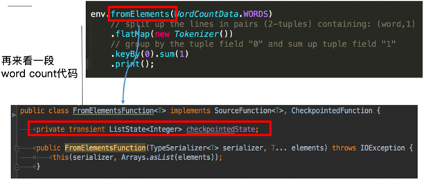
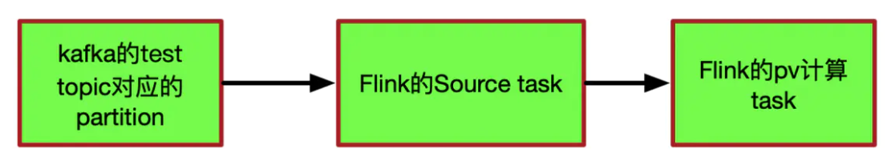
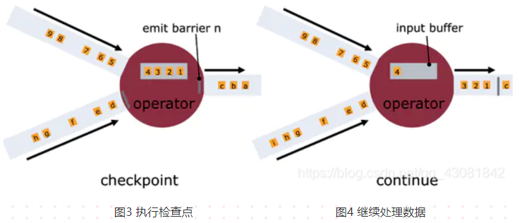

# 1、什么是Flink？描述一下

Flink是一个以 流 为核心的高可用、高性能的分布式计算引擎。具备 流批一体，高吞吐、低延迟，容错能力，大规模复杂计算等特点，在数据流上提供 数据分发、通信等功能。

# 2、能否详细解释一下其中的 数据流、流批一体、容错能力等概念？

**数据流**：

所有产生的 数据 都天然带有 时间概念，把 事件 按照时间顺序排列起来，就形成了一个事件流，也被称作数据流。

**流批一体**：

首先必须先明白什么是 有界数据  和 无界数据


**有界数据**，就是在一个确定的时间范围内的数据流，有开始，有结束，一旦确定就不会再改变，一般 批处理 用来处理有界数据，如上图的 bounded stream。

**无界数据**，就是持续产生的数据流，数据是无限的，有开始，无结束，一般 流处理 用来处理无界数据。如图 unbounded stream。

Flink的设计思想是以 流 为核心，批是流的特例，擅长处理 无界 和 有界 数据， Flink 提供 精确的时间控制能力 和 有状态 计算机制，可以轻松应对无界数据流，同时 提供 窗口 处理有界数据流。所以被成为流批一体。

**容错能力**：

在分布式系统中，硬件故障、进程异常、应用异常、网络故障等异常无处不在，Flink引擎必须保证故障发生后 不仅可以 重启 应用程序，还要 确保 其内部状态保持一致，从最后一次正确的时间点重新出发

Flink提供 **集群级容错** 和 **应用级容错** 能力

**集群级容错**： Flink 与 集群管理器紧密连接，如YARN、Kubernetes，当进程挂掉后，自动重启新进程接管之前的工作。同时具备 高可用性 ，可消除所有单点故障，

**应用级容错**：Flink 使用 轻量级分布式快照，设计检查点（checkpoint）实现可靠容错。

Flink 利用检查点特性，在框架层面 提供 Exactly-once 语义，即端到端的一致性，确保数据仅处理一次，不会重复也不会丢失，即使出现故障，也能保证数据只写一次。

# 3、Flink 和 Spark Streaming的区别？

Flink 和 Spark Sreaming 最大的区别在于：Flink 是标准的实时处理引擎，基于事件驱动，以流为核心，而 Spark Streaming 的RDD 实际是一组小批次的RDD集合，是微批（Micro-Batch）的模型，以批为核心。

下面我们介绍两个框架的主要区别：

**1. 架构模型**

Spark Streaming 在运行时的主要角色包括：

服务架构集群和资源管理 Master / Yarn Application Master；

工作节点 Work / Node Manager；

任务调度器 Driver；任务执行器 Executor


Flink 在运行时主要包含：客户端 Client、作业管理 Jobmanager、任务管理Taskmanager。


**2. 任务调度**

Spark Streaming 连续不断的生成微小的数据批次，构建有向无环图DAG，Spark Streaming 会依次创建 DStreamGraph、JobScheduler。


Flink 根据用户提交的代码生成 StreamGraph，经过优化生成 JobGraph，然后提交给 JobManager进行处理，JobManager 会根据 JobGraph 生成 ExecutionGraph，ExecutionGraph 是 Flink 调度最核心的数据结构，JobManager 根据 ExecutionGraph 对 Job 进行调度，根据物理执行图部署到Taskmanager上形成具体的Task执行。 


**3. 时间机制**

Spark Streaming 支持的时间机制有限，只支持处理时间。

Flink 支持了流处理程序在时间上的三个定义：事件时间 EventTime、摄入时间 IngestionTime 、处理时间 ProcessingTime。同时也支持 watermark 机制来处理滞后数据。


**4. 容错机制**

对于 Spark Streaming 任务，我们可以设置 checkpoint，然后假如发生故障并重启，我们可以从上次 checkpoint 之处恢复，但是这个行为只能使得数据不丢失，可能会重复处理，不能做到恰好一次处理语义。

Flink 则使用两阶段提交协议来解决这个问题。

# 4、Flink的架构包含哪些？

Flink 架构分为 技术架构 和 运行架构 两部分。

# 5、简单介绍一下技术架构

如下图为Flink技术架构：


Flink 作为流批一体的分布式计算引擎，必须提供面向开发人员的API层，同时还需要跟外部数据存储进行交互，需要连接器，作业开发、测试完毕后，需要提交集群执行，需要部署层，同时还需要运维人员能够管理和监控，还提供图计算、机器学习、SQL等，需要应用框架层。

# 6、详细介绍一下Flink的运行架构

如下图为Flink运行架构：


Flink 集群采取 Master - Slave 架构，Master的角色为 JobManager，负责集群和作业管理，Slave的角色是 TaskManager，负责执行计算任务，同时，Flink 提供客户端 Client 来管理集群和提交任务，JobManager 和 TaskManager 是集群的进程。

（1）Client

Flink 客户端是F1ink 提供的 CLI 命令行工具，用来提交 Flink 作业到 Flink 集群，在客户端中负责 StreamGraph (流图)和 Job Graph (作业图)的构建。

（2）JobManager
JobManager 根据并行度将 Flink 客户端提交的Flink 应用分解为子任务，从资源管理器 ResourceManager 申请所需的计算资源，资源具备之后，开始分发任务到 TaskManager 执行 Task，并负责应用容错，跟踪作业的执行状态，发现异常则恢复作业等。

（3）TaskManager

TaskManager 接收 JobManage 分发的子任务，根据自身的资源情况 管理子任务的启动、 停止、销毁、异常恢复等生命周期阶段。Flink程序中必须有一个TaskManager。

# 7、Flink的并行度介绍一下？

Flink程序在执行的时候，会被映射成一个Streaming Dataflow。一个Streaming Dataflow是由一组Stream和Transformation Operator组成的。在启动时从一个或多个Source Operator开始，结束于一个或多个Sink Operator。

Flink程序本质上是并行的和分布式的，在执行过程中，一个流(stream)包含一个或多个流分区，而每一个operator包含一个或多个operator子任务。操作子任务间彼此独立，在不同的线程中执行，甚至是在不同的机器或不同的容器上。

operator子任务的数量是这一特定operator的并行度。相同程序中的不同operator有不同级别的并行度。


一个Stream可以被分成多个Stream的分区，也就是Stream Partition。一个Operator也可以被分为多个Operator Subtask。如上图中，Source被分成Source1和Source2，它们分别为Source的Operator Subtask。每一个Operator Subtask都是在不同的线程当中独立执行的。一个Operator的并行度，就等于Operator Subtask的个数。

上图Source的并行度为2。而一个Stream的并行度就等于它生成的Operator的并行度。数据在两个operator之间传递的时候有两种模式：

# 8、Flink的并行度的怎么设置的？

我们在实际生产环境中可以从四个不同层面设置并行度：

* 操作算子层面(Operator Level)
* 执行环境层面(Execution Environment Level)
* 客户端层面(Client Level)
* 系统层面(System Level)

需要注意的优先级：算子层面>环境层面>客户端层面>系统层面。

# 9、Flink编程模型了解不？

Flink 应用程序主要由三部分组成，源 Source、转换 transformation、目的地 sink。这些流式 dataflows 形成了有向图，以一个或多个源（source）开始，并以一个或多个目的地（sink）结束。


# 10、Flink作业中的DataStream，Transformation介绍一下

Flink作业中，包含两个基本的块：数据流（DataStream）和 转换（Transformation）。

DataStream是逻辑概念，为开发者提供API接口，Transformation是处理行为的抽象，包含了数据的读取、计算、写出。所以Flink 作业中的DataStream API 调用，实际上构建了多个由 Transformation组成的数据处理流水线（Pipeline）

DataStream API 和 Transformation 的转换如下图：


# 11、Flink的分区策略了解吗？

目前 Flink 支持8种分区策略的实现，数据分区体系如下图：


**（1）GlobalPartitioner**

数据会被分发到下游算子的第一个实例中进行处理。

**（2）ForwardPartitioner**

在API层面上ForwardPartitioner应用在DataStream上，生成一个新的 DataStream。

该Partitioner 比较特殊，用于在同一个 OperatorChain 中上下游算子之间的数据转发，实际上数据是直接传递给下游的，要求上下游并行度一样。

**（3）ShufflePartitioner**

随机的将元素进行分区，可以确保下游的Task能够均匀地获得数据，使用代码如下：

`dataStream.shuffle();
`

**（4）RebalancePartitioner**

以Round-robin 的方式为每个元素分配分区，确保下游的 Task 可以均匀地获得数据，避免数据倾斜。使用代码如下：

`dataStream.rebalance();`

（5）RescalePartitioner

根据上下游 Task 的数量进行分区， 使用 Round-robin 选择下游的一个Task 进行数据分区，如上游有2个 Source.，下游有6个 Map，那么每个 Source 会分配3个固定的下游 Map，不会向未分配给自己的分区写人数据。这一点与 ShufflePartitioner 和 RebalancePartitioner 不同， 后两者会写入下游所有的分区。


运行代码如下：

`dataStream.rescale();
`
（6）BroadcastPartitioner

将该记录广播给所有分区，即有N个分区，就把数据复制N份，每个分区1份，其使用代码如下：

`dataStream.broadcast();
`

（7）KeyGroupStreamPartitioner

在API层面上，KeyGroupStreamPartitioner应用在 KeyedStream上，生成一个新的 KeyedStream。

KeyedStream根据keyGroup索引编号进行分区，会将数据按 Key 的 Hash 值输出到下游算子实例中。该分区器不是提供给用户来用的。

KeyedStream在构造Transformation的时候默认使用KeyedGroup分区形式，从而在底层上支持作业Rescale功能。

（8）CustomPartitionerWrapper

用户自定义分区器。需要用户自己实现Partitioner接口，来定义自己的分区逻辑。

# 12、描述一下Flink wordcount执行包含的步骤有哪些？

主要包含以下几步：

1. 获取运行环境 StreamExecutionEnvironment
2. 接入source源
3. 执行转换操作，如map()、flatmap()、keyby（）、sum()
4. 输出sink源 如print()
5. 执行 execute

提供一个示例：

```

import org.apache.flink.api.common.functions.FlatMapFunction;
import org.apache.flink.api.java.utils.ParameterTool;
import org.apache.flink.streaming.api.datastream.DataStream;
import org.apache.flink.streaming.api.datastream.DataStreamSource;
import org.apache.flink.streaming.api.environment.StreamExecutionEnvironment;
import org.apache.flink.streaming.api.windowing.time.Time;
import org.apache.flink.util.Collector;


public class WordCount {

public static void main(String[] args) throws Exception {
//定义socket的端口号
int port;
try{
            ParameterTool parameterTool = ParameterTool.fromArgs(args);
            port = parameterTool.getInt("port");
        }catch (Exception e){
            System.err.println("没有指定port参数，使用默认值9000");
            port = 9000;
        }
//获取运行环境
        StreamExecutionEnvironment env = StreamExecutionEnvironment.getExecutionEnvironment();
//连接socket获取输入的数据
        DataStreamSource<String> text = env.socketTextStream("10.192.12.106", port, "\n");
//计算数据
        DataStream<WordWithCount> windowCount = text.flatMap(new FlatMapFunction<String, WordWithCount>() {
public void flatMap(String value, Collector<WordWithCount> out) throws Exception {
                String[] splits = value.split("\\s");
for (String word:splits) {
                    out.collect(new WordWithCount(word,1L));
                }
            }
        })//打平操作，把每行的单词转为<word,count>类型的数据
                .keyBy("word")//针对相同的word数据进行分组
                .timeWindow(Time.seconds(2),Time.seconds(1))//指定计算数据的窗口大小和滑动窗口大小
                .sum("count");               
//把数据打印到控制台
        windowCount.print()
                .setParallelism(1);//使用一个并行度
//注意：因为flink是懒加载的，所以必须调用execute方法，上面的代码才会执行
        env.execute("streaming word count");
    }
/**
     * 主要为了存储单词以及单词出现的次数
     */
public static class WordWithCount{
public String word;
public long count;
public WordWithCount(){}
public WordWithCount(String word, long count) {
this.word = word;
this.count = count;
        }
@Override
public String toString() {
return "WordWithCount{" +
"word='" + word + '\'' +
", count=" + count +
'}';
        }
    }
}
```

# 13、Flink常用的算子有哪些？

分两部分：

（1）数据读取，这是Flink流计算应用的起点，常用算子有：

从内存读：fromElements、从文件读：readTextFile、Socket 接入 ：socketTextStream、自定义读取：createInput

（2）处理数据的算子，主要用于 转换 过程

常用的算子包括：Map（单输入单输出）、FlatMap（单输入、多输出）、Filter（过滤）、KeyBy（分组）、Reduce（聚合）、Window（窗口）、Connect（连接）、Split（分割）等。


核心篇主要涉及以上知识点，下面让我们详细了解一下。

# 14、Flink的四大基石包含哪些？

Flink四大基石分别是：Checkpoint（检查点）、State（状态）、Time（时间）、Window（窗口）。

# 15、说说Flink窗口，以及划分机制

**窗口概念**：将无界流的数据，按时间区间，划分成多份数据，分别进行统计(聚合)

Flink支持两种划分窗口的方式(time和count)，第一种，按时间驱动进行划分、另一种按数据驱动进行划分。


1、按时间驱动Time Window 划分可以分为 滚动窗口 Tumbling Window 和滑动窗口 Sliding Window。

2、按数据驱动Count Window也可以划分为滚动窗口 Tumbling Window 和滑动窗口 Sliding Window。

3、Flink支持窗口的两个重要属性(窗口长度size和滑动间隔interval)，通过窗口长度和滑动间隔来区分滚动窗口和滑动窗口。

如果size=interval,那么就会形成tumbling-window(无重叠数据)--滚动窗口

如果size(1min)>interval（30s）,那么就会形成sliding-window(有重叠数据)--滑动窗口

通过组合可以得出四种基本窗口：

（1）time-tumbling-window 无重叠数据的时间窗口，设置方式举例：timeWindow(Time.seconds(5))---基于时间的滚动窗口


（2）time-sliding-window  有重叠数据的时间窗口，设置方式举例：timeWindow(Time.seconds(10), Time.seconds(5))---基于时间的滑动窗口


（3）count-tumbling-window无重叠数据的数量窗口，设置方式举例：countWindow(5)---基于数量的滚动窗口


（4）count-sliding-window 有重叠数据的数量窗口，设置方式举例：countWindow(10,5)---基于数量的滑动窗口


session窗口分配器通过session活动来对元素进行分组，session窗口跟滚动窗口和滑动窗口相比，不会有重叠和固定的开始时间和结束时间的情况

session窗口在一个固定的时间周期内不再收到元素，即非活动间隔产生，那个这个窗口就会关闭。

一个session窗口通过一个session间隔来配置，这个session间隔定义了非活跃周期的长度，当这个非活跃周期产生，那么当前的session将关闭并且后续的元素将被分配到新的session窗口中去,如下图所示：


# 16、看你基本概念讲的还是很清楚的，那你介绍下Flink的窗口机制以及各组件之间是如何相互工作的

以下为窗口机制的流程图：


**WindowAssigner**

1、窗口算子负责处理窗口，数据流源源不断地进入算子（window operator）时，每一个到达的元素首先会被交给 WindowAssigner。WindowAssigner 会决定元素被放到哪个或哪些窗口（window），可能会创建新窗口。因为一个元素可以被放入多个窗口中（个人理解是滑动窗口，滚动窗口不会有此现象），所以同时存在多个窗口是可能的。注意，Window本身只是一个ID标识符，其内部可能存储了一些元数据，如TimeWindow中有开始和结束时间，但是并不会存储窗口中的元素。窗口中的元素实际存储在 Key/Value State 中，key为Window，value为元素集合（或聚合值）。为了保证窗口的容错性，该实现依赖了 Flink 的 State 机制。

**WindowTrigger**

2、每一个Window都拥有一个属于自己的 Trigger，Trigger上会有定时器，用来决定一个窗口何时能够被计算或清除。每当有元素加入到该窗口，或者之前注册的定时器超时了，那么Trigger都会被调用。Trigger的返回结果可以是 ：

（1）continue（继续、不做任何操作），
（2）Fire（触发计算，处理窗口数据），
（3）Purge（触发清理，移除窗口和窗口中的数据），
（4）Fire + purge（触发计算+清理，处理数据并移除窗口和窗口中的数据）。

当数据到来时，调用Trigger判断是否需要触发计算，如果调用结果只是Fire的话，那么会计算窗口并保留窗口原样，也就是说窗口中的数据不清理，等待下次Trigger fire的时候再次执行计算。窗口中的数据会被反复计算，直到触发结果清理。在清理之前，窗口和数据不会释放没所以窗口会一直占用内存。

**Trigger 触发流程：**

3、当Trigger Fire了，窗口中的元素集合就会交给Evictor（如果指定了的话）。Evictor 主要用来遍历窗口中的元素列表，并决定最先进入窗口的多少个元素需要被移除。剩余的元素会交给用户指定的函数进行窗口的计算。如果没有 Evictor 的话，窗口中的所有元素会一起交给函数进行计算。

4、计算函数收到了窗口的元素（可能经过了 Evictor 的过滤），并计算出窗口的结果值，并发送给下游。窗口的结果值可以是一个也可以是多个。DataStream API 上可以接收不同类型的计算函数，包括预定义的sum(),min(),max()，还有 ReduceFunction，FoldFunction，还有WindowFunction。WindowFunction 是最通用的计算函数，其他的预定义的函数基本都是基于该函数实现的。

5、Flink 对于一些聚合类的窗口计算（如sum,min）做了优化，因为聚合类的计算不需要将窗口中的所有数据都保存下来，只需要保存一个result值就可以了。每个进入窗口的元素都会执行一次聚合函数并修改result值。这样可以大大降低内存的消耗并提升性能。但是如果用户定义了 Evictor，则不会启用对聚合窗口的优化，因为 Evictor 需要遍历窗口中的所有元素，必须要将窗口中所有元素都存下来。

# 17、讲一下Flink的Time概念

在Flink的流式处理中，会涉及到时间的不同概念，主要分为三种时间机制，如下图所示：


**EventTime[事件时间]**

事件发生的时间，例如：点击网站上的某个链接的时间，每一条日志都会记录自己的生成时间。

如果以EventTime为基准来定义时间窗口那将形成EventTimeWindow,要求消息本身就应该携带EventTime

**IngestionTime[摄入时间]**

数据进入Flink的时间，如某个Flink节点的sourceoperator接收到数据的时间，例如：某个source消费到kafka中的数据

如果以IngesingtTime为基准来定义时间窗口那将形成IngestingTimeWindow,以source的systemTime为准

**ProcessingTime[处理时间]**
  
某个Flink节点执行某个operation的时间，例如：timeWindow处理数据时的系统时间，默认的时间属性就是Processing Time

在Flink的流式处理中，绝大部分的业务都会使用EventTime，一般只在EventTime无法使用时，才会被迫使用ProcessingTime或者IngestionTime。

如果要使用EventTime，那么需要引入EventTime的时间属性，引入方式如下所示：

# 18、那在API调用时，应该怎么使用？

使用方式如下：

```
final StreamExecutionEnvironment env  
    = StreamExecutionEnvironment.getExecutionEnvironrnent();
// 使用处理时间
env.setStreamTimeCharacteristic(TimeCharacteristic.ProcessingTime) ; 
// 使用摄入时间

env.setStrearnTimeCharacteristic(TimeCharacteristic.IngestionTime);

// 使用事件时间
env.setStrearnTimeCharacteristic(TimeCharacteri stic Eve~tTime);
```

# 19、在流数据处理中，有没有遇到过数据延迟等问题，通过什么处理呢？

有遇到过数据延迟问题。举个例子：

案例1： 

假你正在去往地下停车场的路上，并且打算用手机点一份外卖。

选好了外卖后，你就用在线支付功能付款了，这个时候是11点50分。恰好这时，你走进了地下停车库，而这里并没有手机信号。因此外卖的在线支付并没有立刻成功，而支付系统一直在Retry重试“支付”这个操作。

当你找到自己的车并且开出地下停车场的时候，已经是12点05分了。这个时候手机重新有了信号，手机上的支付数据成功发到了外卖在线支付系统，支付完成。

在上面这个场景中你可以看到，支付数据的事件时间是11点50分，而支付数据的处理时间是12点05分

案例2： 

某App 会记录用户的所有点击行为，并回传日志（在网络不好的情况下，先保存在本地，延后回传）。

A 用户在11:02 对 App 进行操作，B用户在11:03 操作了 App，

但是A 用户的网络不太稳定，回传日志延迟了，导致我们在服务端先接受到B 用户11:03 的消息，然后再接受到A 用户11:02 的消息，消息乱序了。

一般处理数据延迟、消息乱序等问题，通过WaterMark水印来处理。

水印是用来解决数据延迟、数据乱序等问题，总结如下图所示：


水印就是一个时间戳（timestamp），Flink可以给数据流添加水印

        - 水印并不会影响原有Eventtime事件时间

        - 当数据流添加水印后，会按照水印时间来触发窗口计算,也就是说watermark水印是用来触发窗口计算的

        - 设置水印时间，会比事件时间小几秒钟,表示最大允许数据延迟达到多久

        - 水印时间 = 事件时间 - 允许延迟时间 (例如：10:09:57 =  10:10:00 - 3s )


# 20、WaterMark原理讲解一下？

如下图所示：


窗口是10分钟触发一次，现在在12:00 - 12:10 有一个窗口，本来有一条数据是在12:00 - 12:10这个窗口被计算，但因为延迟，12:12到达，这时12:00 - 12:10 这个窗口就会被关闭，只能将数据下发到下一个窗口进行计算，这样就产生了数据延迟，造成计算不准确。

现在添加一个水位线：数据时间戳为2分钟。这时用数据产生的事件时间 12:12 -允许延迟的水印 2分钟 = 12:10 >= 窗口结束时间 。窗口触发计算，该数据就会被计算到这个窗口里。

在DataStream  API 中使用 TimestampAssigner 接口定义时间戳的提取行为，包含两个子接口 AssignerWithPeriodicWatermarks 接口和 AssignerWithPunctuatedWaterMarks接口


# 21、如果数据延迟非常严重呢？只使用WaterMark可以处理吗？那应该怎么解决？

使用 WaterMark+ EventTimeWindow 机制可以在一定程度上解决数据乱序的问题，但是，WaterMark 水位线也不是万能的，在某些情况下，数据延迟会非常严重，即使通过Watermark + EventTimeWindow也无法等到数据全部进入窗口再进行处理，因为窗口触发计算后，对于延迟到达的本属于该窗口的数据，Flink默认会将这些延迟严重的数据进行丢弃

那么如果想要让一定时间范围的延迟数据不会被丢弃，可以使用Allowed Lateness(允许迟到机制/侧道输出机制)设定一个允许延迟的时间和侧道输出对象来解决

即使用WaterMark + EventTimeWindow + Allowed Lateness方案（包含侧道输出），可以做到数据不丢失。

API调用

**allowedLateness(lateness:Time)---设置允许延迟的时间**

该方法传入一个Time值，设置允许数据迟到的时间，这个时间和watermark中的时间概念不同。再来回顾一下，
watermark=数据的事件时间-允许乱序时间值
随着新数据的到来，watermark的值会更新为最新数据事件时间-允许乱序时间值，但是如果这时候来了一条历史数据，watermark值则不会更新。
总的来说，watermark永远不会倒退它是为了能接收到尽可能多的乱序数据。
那这里的Time值呢？主要是为了等待迟到的数据，如果属于该窗口的数据到来，仍会进行计算，后面会对计算方式仔细说明
注意：该方法只针对于基于event-time的窗口

**sideOutputLateData(outputTag:OutputTag[T])--保存延迟数据**

该方法是将迟来的数据保存至给定的outputTag参数，而OutputTag则是用来标记延迟数据的一个对象。

**DataStream.getSideOutput(tag:OutputTag[X])--获取延迟数据**

通过window等操作返回的DataStream调用该方法，传入标记延迟数据的对象来获取延迟的数据

# 22、刚才提到State，那你简单说一下什么是State。


在Flink中，状态被称作state，是用来 保存 中间的 计算结果 或者 缓存数据。

根据状态是否需要保存中间结果，分为 无状态计算 和 有状态计算。

对于流计算而言，事件持续产生，如果每次计算相互独立，不依赖上下游的事件，则相同输入，可以得到相同输出，是无状态计算。

如果计算需要依赖于之前或者后续事件，则被称为有状态计算。


有状态计算如 sum求和，数据类加等。


# 23、Flink 状态包括哪些？

（1） 按照由 Flink管理 还是 用户管理，状态可以分为 原始状态（Raw State）和 托管状态（ManagedState）

* 托管状态（ManagedState）:由Flink 自行进行管理的State。
* 原始状态（Raw State）：由用户自行进行管理。

两者区别：

1. 从状态管理方式的方式来说，Managed State 由Flink Runtime 管理，自动存储，自动恢复，在内存管理上有优化；而 Raw State 需要用户自己管理，需要自己序列化，Flink 不知道 State 中存入的数据是什么结构，只有用户自己知道，需要最终序列化为可存储的数据结构。
2. 从状态数据结构来说，Managed State 支持已知的数据结构，如Value、List、Map等。而 Raw State 只支持字节数组，所有状态都要转换为二进制字节数组才可以。
3. 从推荐使用场景来说，Managed State 大多数情况下均可使用，而Raw State 是当 Managed State 不够用时，比如需要自定义Operator 时，才会使用 Raw State。在实际生产过程中，只推荐使用 Managed State 。

（2）State 按照是否有 key 划分为 KeyedState 和 OperatorState 两种。

keyedState特点：

1. 只能用在keyedStream上的算子中，状态跟特定的key绑定。
2. keyStream流上的每一个key 对应一个state 对象。若一个operator 实例处理多个key，访问相应的多个State，可对应多个state。
3. keyedState 保存在StateBackend中
4. 通过RuntimeContext访问，实现Rich Function接口。
5. 支持多种数据结构：ValueState、ListState、ReducingState、AggregatingState、MapState.


OperatorState特点：

1. 可以用于所有算子，但整个算子只对应一个state。
2. 并发改变时有多种重新分配的方式可选：均匀分配；
3. 实现CheckpointedFunction或者 ListCheckpointed 接口。
4. 目前只支持 ListState数据结构。   



这里的fromElements会调用FromElementsFunction的类，其中就使用了类型为List state 的 operator state

# 24、Flink广播状态了解吗？

Flink中，广播状态中叫作 BroadcastState。 在广播状态模式中使用。所谓广播状态模式， 就是来自一个流的数据需要被广播到所有下游任务，在算子本地存储，在处理另一个流的时候依赖于广播的数据.下面以一个示例来说明广播状态模式。


上图这个示例包含两个流，一个为kafka模型流，该模型是通过机器学习或者深度学习训练得到的模型，将该模型通过广播，发送给下游所有规则算子，规则算子将规则缓存到Flink的本地内存中，另一个为 Kafka数据流，用来接收测试集，该测试集依赖于模型流中的模型，通过模型完成测试集的推理任务。

广播状态（State）必须是MapState类型，广播状态模式需要使用广播函数进行处理，广播函数提供了处理广播数据流和普通数据流的接口。

# 25、Flink 状态接口包括哪些？

在Flink中使用状态，包含两种状态接口：

（1）状态操作接口：使用状态对象本身存储，写入、更新数据。

（2）状态访问接口：从StateBackend获取状态对象本身。

**状态操作接口**

Flink 中的 状态操作接口 面向两类用户，即 应用开发者 和 Flink 框架本身。 所有Flink设计了两套接口

**1、面向开发者State接口**

面向开发的State接口只提供了对State中数据的增删改基本操作接口，用户无法访问状态的其他运行时所需要的信息。接口体系如下图：


2、面向内部State接口

内部State 接口 是给 Flink 框架使用，提供更多的State方法，可以根据需要灵活扩展。除了对State中数据的访问之外，还提供内部运行时信息，如State中数据的序列化器，命名空间（namespace）、命名空间的序列化器、命名空间合并的接口。内部State接口命名方式为InternalxxxState。

**状态访问接口**

有了状态之后，开发者自定义UDF时，应该如何访问状态？

状态会被保存在StateBackend中，但StateBackend 又包含不同的类型。所有Flink中抽象了两个状态访问接口：OperatorStateStore 和 KeyedStateStore，用户在编写UDF时，就无须考虑到底是使用哪种 StateBackend类型接口。

OperatorStateStore 接口原理：


OperatorState数据以Map形式保存在内存中，并没有使用RocksDBStateBackend和HeapKeyedStateBackend。

KeyedStateStore 接口原理：


keyedStateStore数据使用RocksDBStateBackend或者HeapKeyedStateBackend来存储，KeyedStateStore中创建、获取状态都交给了具体的StateBackend来处理，KeyedStateStore本身更像是一个代理。

# 26、Flink 状态如何存储

在Flink中， 状态存储被叫做 StateBackend , 它具备两种能力：

（1）在计算过程中提供访问State能力，开发者在编写业务逻辑中能够使用StateBackend的接口读写数据。

（2）能够将State持久化到外部存储，提供容错能力。

Flink状态提供三种存储方式：

（1）内存：MemoryStateBackend,适用于验证、测试、不推荐生产使用。

（2）文件：FSStateBackend，适用于长周期大规模的数据。

（3）RocksDB :  RocksDBStateBackend，适用于长周期大规模的数据。

上面提到的 StateBackend是面向用户的，在Flink内部3种 State 的关系如下图：


在运行时，MemoryStateBackend 和 FSStateBackend 本地的 State 都保存在TaskManager的内存中，所以其底层都依赖于HeapKeyedStateBackend。HeapKeyedStateBackend面向Flink 引擎内部，使用者无须感知。

**1、内存型  StateBackend**

MemoryStateBackend，运行时所需的State数据全部保存在 TaskManager JVM堆上内存中，  KV类型的State、窗口算子的State 使用HashTable 来保存数据、触发器等。执行检查点的时候，会把 State 的快照数据保存到JobManager进程的内存中。

MemoryStateBackend 可以使用异步的方式进行快照，（也可以同步），推荐异步，避免阻塞算子处理数据。

基于内存的 Stateßackend 在生产环境下不建议使用，可以在本地开发调试测试 。
注意点如下 ：
1) State 存储在 JobManager 的内存中.受限于 JobManager的内存大小。
2) 每个 State默认5MB,可通过 MemoryStateBackend 构造函数调整
3) 每个 Stale 不能超过 Akka Frame 大小。

**2、文件型 StateBackend**

FSStateBackend，运行时所需的State数据全部保存在 TaskManager 的内存中， 执行检查点的时候，会把 State 的快照数据保存到配置的文件系统中。

可以是分布式或者本地文件系统，路径如：
HDFS路径：“hdfs://namenode:40010/flink/checkpoints”
本地路径：“file:///data/flink/checkpoints”。

FSStateBackend 适用于处理大状态、长窗口、或者大键值状态的有状态处理任务。

注意点如下 ：

1) State 数据首先被存在 TaskManager 的内存中。

2) State大小不能超过TM内存。

3) TM异步将State数据写入外部存储。

MemoryStateBackend 和FSStateBackend 都依赖于HeapKeyedStateBackend，HeapKeyedStateBackend 使用 State存储数据。

**3、RocksDBStateBackend**

RocksDBStateBackend 跟内存型和文件型都不同 。

RocksDBStateBackend 使用嵌入式的本地数据库 RocksDB 将流计算数据状态存储在本地磁盘中，不会受限于TaskManager 的内存大小，在执行检查点的时候，再将整个 RocksDB 中保存的State数据全量或者增量持久化到配置的文件系统中，

在 JobManager 内存中会存储少量的检查点元数据。RocksDB克服了State受内存限制的问题，同时又能够持久化到远端文件系统中，比较适合在生产中使用。

缺点：

RocksDBStateBackend 相比基于内存的StateBackend，访问State的成本高很多，可能导致数据流的吞吐量剧烈下降，甚至可能降低为原来的 1/10。

适用场景

1）最适合用于处理大状态、长窗口，或大键值状态的有状态处理任务。
2）RocksDBStateBackend 非常适合用于高可用方案。
3) RocksDBStateBackend 是目前唯一支持增量检查点的后端。 增量检查点非常适用于超 大状态的场景。

注意点

1）总 State 大小仅限于磁盘大小，不受内存限制
2）RocksDBStateBackend 也需要配置外部文件系统，集中保存State 。
3）RocksDB的 JNI API 基于 byte 数组，单 key 和单 Value 的大小不能超过 8 字节
4）对于使用具有合并操作状态的应用程序，如ListState ，随着时间可能会累积到超过 2*31次方字节大小，这将会导致在接下来的查询中失败。

# 27、Flink 状态如何持久化？

首选，Flink的状态最终都要持久化到第三方存储中，确保集群故障或者作业挂掉后能够恢复。

RocksDBStateBackend 持久化策略有两种：

* 全量持久化策略 RocksFullSnapshotStrategy
* 增量持久化策略 RocksIncementalSnapshotStrategy

**1、全量持久化策略**

每次将全量的State写入到状态存储中（HDFS）。内存型、文件型、RocksDB类型的StataBackend 都支持全量持久化策略。


在执行持久化策略的时候，使用异步机制，每个算子启动1个独立的线程，将自身的状态写入分布式存储可靠存储中。在做持久化的过程中，状态可能会被持续修改，

基于内存的状态后端使用 CopyOnWriteStateTable 来保证线程安全，RocksDBStateBackend则使用RocksDB的快照机制，使用快照来保证线程安全。

**2、增量持久化策略**

增量持久化就是每次持久化增量的State，只有RocksDBStateBackend 支持增量持久化。

Flink 增量式的检查点以 RocksDB为基础， RocksDB是一个基于LSM-Tree的KV存储。新的数据保存在内存中， 称为memtable。如果Key相同，后到的数据将覆盖之前的数据，一旦memtable写满了，RocksDB就会将数据压缩并写入磁盘。memtable的数据持久化到磁盘后，就变成了不可变的 sstable。

因为 sstable 是不可变的，Flink对比前一个检查点创建和删除的RocksDB sstable 文件就可以计算出状态有哪些发生改变。

为了确保 sstable 是不可变的，Flink 会在RocksDB 触发刷新操作，强制将 memtable 刷新到磁盘上 。在Flink 执行检查点时，会将新的sstable 持久化到HDFS中，同时保留引用。这个过程中 Flink 并不会持久化本地所有的sstable，因为本地的一部分历史sstable 在之前的检查点中已经持久化到存储中了，只需增加对 sstable文件的引用次数就可以。

RocksDB会在后台合并 sstable 并删除其中重复的数据。然后在RocksDB删除原来的 sstable，替换成新合成的 sstable.。新的 sstable 包含了被删除的 sstable中的信息，通过合并历史的sstable会合并成一个新的 sstable，并删除这些历史sstable. 可以减少检查点的历史文件，避免大量小文件的产生。

# 28、Flink 状态过期后如何清理？

**1、DataStream中状态过期**

可以对DataStream中的每一个状态设置 清理策略 StateTtlConfig，可以设置的内容如下：

* 过期时间：超过多长时间未访问，视为State过期，类似于缓存。
* 过期时间更新策略：创建和写时更新、读取和写时更新。
* State可见性：未清理可用，超时则不可用。

**2、Flink SQL中状态过期**

Flink SQL 一般在流Join、聚合类场景使用State，如果State不定时清理，则导致State过多，内存溢出。清理策略配置如下：

```
StreamQueryConfig qConfig = ...
//设置过期时间为 min = 12小时 ，max = 24小时
qConfig.withIdleStateRetentionTime(Time.hours(12),Time.hours(24));
```


# 29、Flink 通过什么实现可靠的容错机制。

Flink 使用 轻量级分布式快照，设计检查点（checkpoint）实现可靠容错。

# 30、什么是Checkpoin检查点？

Checkpoint被叫做检查点，是Flink实现容错机制最核心的功能，是Flink可靠性的基石，它能够根据配置周期性地基于Stream中各个Operator的状态来生成Snapshot快照，从而将这些状态数据定期持久化存储下来，当Flink程序一旦意外崩溃时，重新运行程序时可以有选择地从这些Snapshot进行恢复，从而修正因为故障带来的程序数据状态中断。

Flink的checkpoint机制原理来自“Chandy-Lamport algorithm”算法

注意:区分State和Checkpoint

1.State:

一般指一个具体的Task/Operator的状态(operator的状态表示一些算子在运行的过程中会产生的一些中间结果)
State数据默认保存在Java的堆内存中/TaskManage节点的内存中
State可以被记录，在失败的情况下数据还可以恢复。

2.Checkpoint:

       表示了一个FlinkJob在一个特定时刻的一份全局状态快照，即包含了所有Task/Operator的状态

       可以理解为Checkpoint是把State数据定时持久化存储了

比如KafkaConsumer算子中维护的Offset状态,当任务重新恢复的时候可以从Checkpoint中获取。

# 31、什么是Savepoin保存点？

保存点在 Flink 中叫作 Savepoint. 是基于Flink 检查点机制的应用完整快照备份机制. 用来保存状态 可以在另一个集群或者另一个时间点.从保存的状态中将作业恢复回来。适用 于应用升级、集群迁移、 Flink 集群版本更新、A/B测试以及假定场景、暂停和重启、归档等场景。保存点可以视为一个(算子 ID -> State) 的Map，对于每一个有状态的算子，Key是算子ID，Value是算子State。

# 32、什么是CheckpointCoordinator检查点协调器？

Flink中检查点协调器叫作 CheckpointCoordinator，负责协调 Flink 算子的 State 的分布式快照。当触发快照的时候，CheckpointCoordinator向 Source 算子中注入Barrier消息 ，然后等待所有的Task通知检查点确认完成，同时持有所有 Task 在确认完成消息中上报的State句柄。

# 33、Checkpoint中保存的是什么信息？

检查点里面到底保存着什么信息呢？我们以flink消费kafka数据wordcount为例：

1. 我们从Kafka读取到一条条的日志，从日志中解析出app_id，然后将统计的结果放到内存中一个Map集合，app_id做为key，对应的pv做为value，每次只需要将相应app_id 的pv值+1后put到Map中即可；
2. kafka topic：test；
3. flink运算流程如下：



kafka topic有且只有一个分区

假设kafka的topic-test只有一个分区，flink的Source task记录了当前消费到kafka test topic的所有partition的offset

例：（0，1000）表示0号partition目前消费到offset为1000的数据

Flink的pv task记录了当前计算的各app的pv值，为了方便讲解，我这里有两个app：app1、app2

例：（app1，50000）（app2，10000）
表示app1当前pv值为50000
表示app2当前pv值为10000
每来一条数据，只需要确定相应app_id，将相应的value值+1后put到map中即可；

该案例中，CheckPoint保存的其实就是第n次CheckPoint消费的offset信息和各app的pv值信息，记录一下发生CheckPoint当前的状态信息，并将该状态信息保存到相应的状态后端。图下代码：（注：状态后端是保存状态的地方，决定状态如何保存，如何保障状态高可用，我们只需要知道，我们能从状态后端拿到offset信息和pv信息即可。状态后端必须是高可用的，否则我们的状态后端经常出现故障，会导致无法通过checkpoint来恢复我们的应用程序）。

# 34、当作业失败后，检查点如何恢复作业？

Flink提供了 应用自动恢复机制 和 手动作业恢复机制。

**应用自动恢复机制：**

Flink设置有作业失败重启策略，包含三种：

1、定期恢复策略：fixed-delay
固定延迟重启策略会尝试一个给定的次数来重启Job，如果超过最大的重启次数，Job最终将失败，在连续两次重启尝试之间，重启策略会等待一个固定时间，默认Integer.MAX_VALUE次

2、失败比率策略：failure-rate
失败率重启策略在job失败后重启，但是超过失败率后，Job会最终被认定失败，在两个连续的重启尝试之间，重启策略会等待一个固定的时间。

3、直接失败策略：None   失败不重启

**手动作业恢复机制。**

因为Flink检查点目录分别对应的是JobId，每通过flink run 方式/页面提交方式恢复都会重新生成 jobId，Flink 提供了在启动之时通过设置 -s .参数指定检查点目录的功能，让新的 jobld 读取该检查点元文件信息和状态信息，从而达到指定时间节点启动作业的目的。

启动方式如下：

`/bin/flink -s /flink/checkpoints/03112312a12398740a87393/chk-50/_metadata
`

# 35、当作业失败后，从保存点如何恢复作业？

从保存点恢复作业并不简单，尤其是在作业变更(如修改逻辑、修复 bug) 的情况下， 需要考虑如下几点:

（1）算子的顺序改变

如果对应的 UID 没变，则可以恢复，如果对应的 UID 变了恢复失败。

（2）作业中添加了新的算子

如果是无状态算子，没有影响，可以正常恢复，如果是有状态的算子，跟无状态的算子 一样处理。

（3）从作业中删除了一个有状态的算子

默认需要恢复保存点中所记录的所有算子的状态，如果删除了一个有状态的算子，从保存点回复的时候被删除的OperatorID找不到，所以会报错 可以通过在命令中添加

-- allowNonReStoredSlale (short: -n ）跳过无法恢复的算子 。

（4）添加和删除无状态的算子

如果手动设置了 UID 则可以恢复，保存点中不记录无状态的算子 如果是自动分配的 UID ，那么有状态算子的可能会变( Flink 一个单调递增的计数器生成 UID，DAG 改版，计数器极有可能会变) 很有可能恢复失败。

# 36、Flink如何实现轻量级异步分布式快照？

要实现分布式快照，最关键的是能够将数据流切分。Flink 中使用 Barrier (屏障)来切分数据 流。 Barrierr 会周期性地注入数据流中，作为数据流的一部分，从上游到下游被算子处理。Barrier 会严格保证顺序，不会超过其前边的数据。Barrier 将记录分割成记录集，两个 Barrier 之间的数据流中的数据隶属于同一个检查点。每一个 Barrier 都携带一个其所属快照的 ID 编号。Barrier 随着数据向下流动，不会打断数据流，因此非常轻量。 在一个数据流中，可能会存在多个隶属于不同快照的 Barrier ，并发异步地执行分布式快照，如下图所示：


Barrier 会在数据流源头被注人并行数据流中。Barrier n所在的位置就是恢复时数据重新处理的起始位置。 例如，在Kafka中，这个位置就是最后一个记录在分区内的偏移量 ( offset) ，作业恢复时，会根据这个位置从这个偏移量之后向 kafka 请求数据 这个偏移量就是State中保存的内容之一。

Barrier 接着向下游传递。当一个非数据源算子从所有的输入流中收到了快照 n 的Barrier时，该算子就会对自己的 State 保存快照，并向自己的下游 广播 发送快照 n 的 Barrier。一旦Sink 算子接收到 Barrier ，有两种情况：

（1）如果是引擎内严格一次处理保证，当 Sink 算子已经收到了所有上游的 Barrie  n 时， Sink 算子对自己的 State 进行快照，然后通知检查点协调器( CheckpointCoordinator) 。当所有 的算子都向检查点协调器汇报成功之后，检查点协调器向所有的算子确认本次快照完成。
（2）如果是端到端严格一次处理保证，当 Sink 算子已经收到了所有上游的 Barrie n 时， Sink 算子对自己的 State 进行快照，并预提交事务（两阶段提交的第一阶段），再通知检查点协调器( CheckpointCoordinator) ，检查点协调器向所有的算子确认本次快照完成，Sink 算子提交事务（两阶段提交的第二阶段），本次事务完成。

我们接着 33 的案例来具体说一下如何执行分布式快照：

对应到pv案例中就是，Source Task接收到JobManager的编号为chk-100（从最近一次恢复）的CheckPoint触发请求后，发现自己恰好接收到kafka offset（0，1000）处的数据，所以会往offset（0，1000）数据之后offset（0，1001）数据之前安插一个barrier，然后自己开始做快照，也就是将offset（0，1000）保存到状态后端chk-100中。然后barrier接着往下游发送，当统计pv的task接收到barrier后，也会暂停处理数据，将自己内存中保存的pv信息（app1，50000）（app2，10000）保存到状态后端chk-100中。OK，flink大概就是通过这个原理来保存快照的;
统计pv的task接收到barrier，就意味着barrier之前的数据都处理了，所以说，不会出现丢数据的情况。

# 37、什么是Barrier对齐？




一旦Operator从输入流接收到CheckPoint barrier n，它就不能处理来自该流的任何数据记录，直到它从其他所有输入接收到barrier n为止。否则，它会混合属于快照n的记录和属于快照n + 1的记录；
如上图所示：
图1，算子收到数字流的Barrier,字母流对应的barrier尚未到达
图2，算子收到数字流的Barrier,会继续从数字流中接收数据，但这些流只能被搁置，记录不能被处理，而是放入缓存中，等待字母流 Barrier到达。在字母流到达前， 1，2，3数据已经被缓存。
图3，字母流到达，算子开始对齐State进行异步快照，并将Barrier向下游广播，并不等待快照执行完毕。
图4，算子做异步快照，首先处理缓存中积压数据，然后再从输入通道中获取数据。

# 38、什么是Barrier不对齐？


