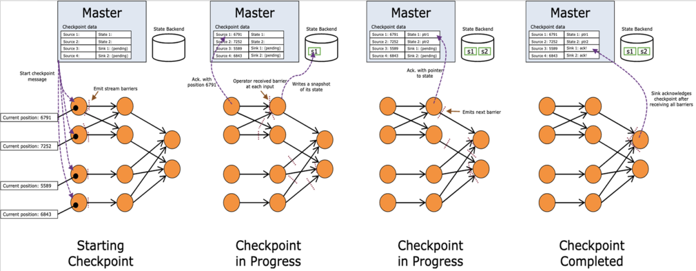
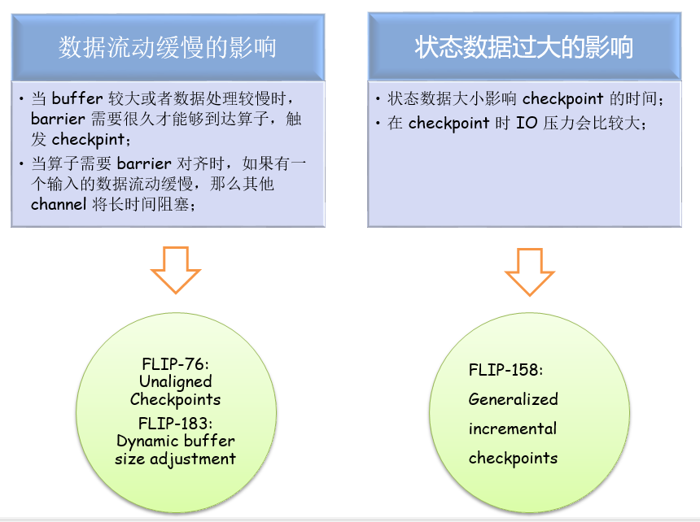
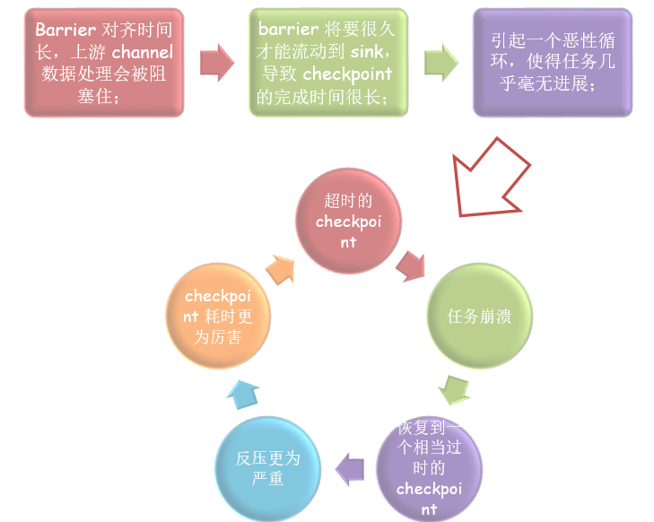
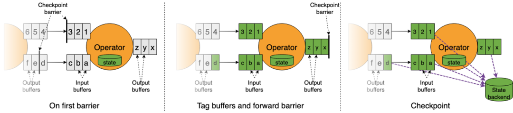
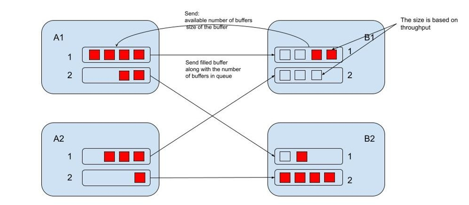
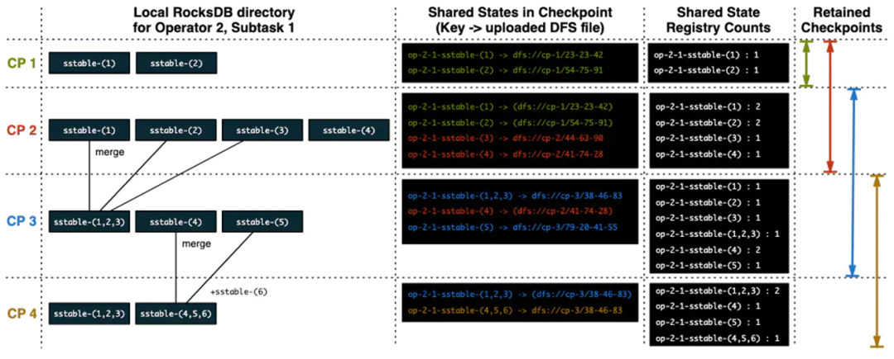
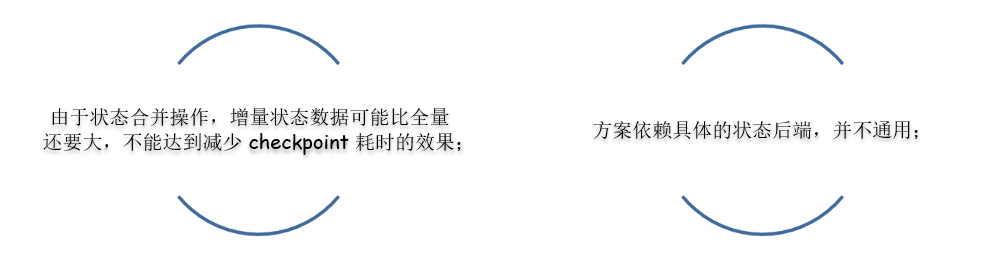
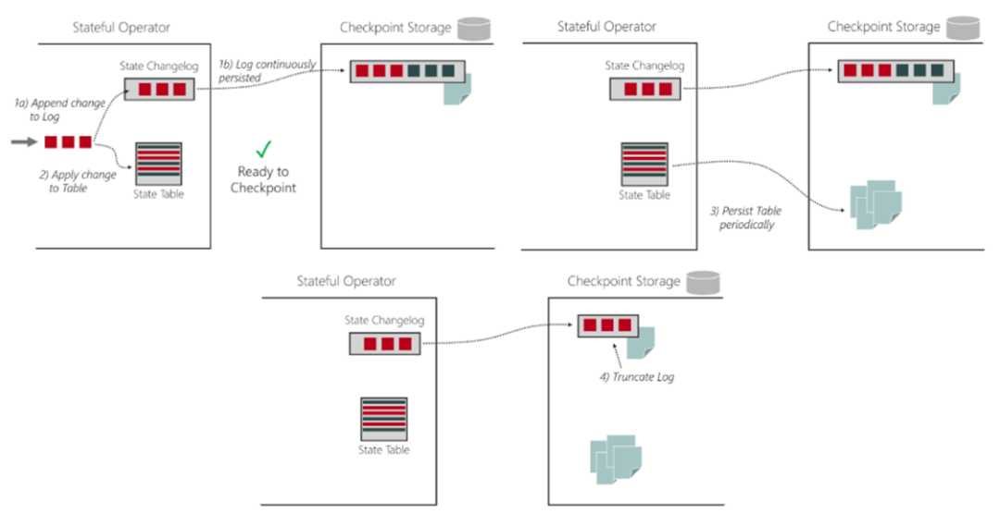
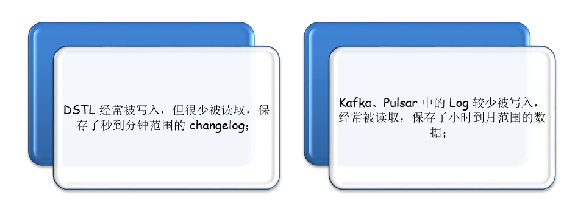
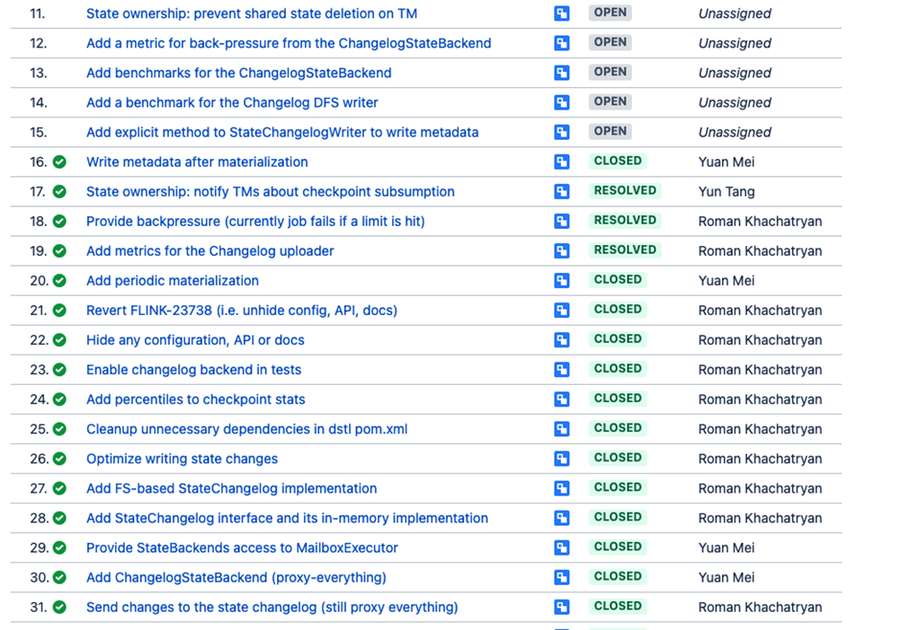

本文主要从以下几方面进行介绍：

1. Checkpoint 执行流程
2. checkpoint 执行失败问题分析
3. 非对齐checkpoint 优化方案
4. 动态调整 buffer 大小
5. 通用增量快照

#### 1 checkpoint 执行流程

如上图所示，chechpoint 在执行过程中，可以简化为可以简化为以下四大步：

1. 在数据流中插入 checkpoint barrier；
2. 每执行到当前算子时，对算子 state 状态进行同步快照与异步上传；
3. 当算子是多输入时，要进行 barrier 对其操作；
4. 所有算子状态都已上传，确认 checkpoint 完成；

#### 2 checkpoint 执行失败问题分析

我们知道，Flink 机制是基于 Chandy-Lamport 算法实现的 checkpoint 机制，在正常情况下，能够实现对正常处理流程非常小的影响，来完成状态的备份。但仍存在一些异常情况，可能造成 checkpoint 代价较大。

**问题1：数据流动缓慢**

我们知道 Flink 的 checkpoint 机制是基于 barrier 的，在数据处理过程中，barrier 也需要像普通数据一样，在 buffer 中排队，等待被处理。当 buffer 较大或者数据处理较慢时，barrier 需要很久才能够到达算子，触发 checkpint。尤其是当应用触发反压时，barrier 可能要在 buffer 中流动数个小时，这显然是不合适的。而另外一种情况则更为严重，当算子需要 barrier 对齐时，如果一个输入的 barrier 已经到达，那么该输入 barrier 后面的数据会阻塞住，不能被处理的，需要等待其他输入 barrier 到达之后，才能继续处理。如果有一个输入的数据流动缓慢，那么等待 barrier 对齐的过程中，其他输入的数据处理都要暂停，这将严重影响应用的实时性。

针对数据流动缓慢的问题，解决思路有两个：

一、让 buffer 中的数据变少；

二、让 barrier 能跳过 buffer 中缓存的数据；

上述的解决办法正是 Flink 社区提出的两个优化方案，分别为 FLIP-76: Unaligned Checkpoints，FLIP-183: Dynamic buffer size adjustment；后面会对这两个方案进行详细介绍。

**问题2：状态数据过大**

状态数据的大小也会影响 checkpoint 的时间，并且在 checkpoint 时 IO 压力也会较大。对于像 RocksDB 这种支持增量 checkpoint 的 StateBackend，如果两次 checkpoint 之间状态变化不大，那么增量 checkpoint 能够极大减少状态上传时间。但当前的增量 checkpoint 仍存在一些问题，一是不通用，不是所有的 StateBackend 都能够支持增量 checkpoint，二是存在由于状态合并的影响，增量状态数据仍会非常大。

针对状态数据过大问题，解决思路 如下：

社区提出的优化方案为 FLIP-158: Generalized incremental checkpoints，这是一种同样的增量快照方案，能够很大程度上减少 checkpoint 时的状态数据大小，后面也会详细介绍。

#### 3 非对齐 checkpoint

FLIP-76: Unaligned Checkpoints

通过上述 Flink Checkpoint 机制的原理与问题分析，总结出两个影响 Checkpoint 性能的问题：数据流动缓慢、状态数据过大。针对这两个问题社区也分别给出了解决方案，并有对应的 FLIP，下面将详细介绍这些方案的设计原理。

1 非对齐的 checkpoint

Flink 在做 Checkpoint 时，如果一个 operator 有多个 input，那么要做 barrier 的对齐。对齐阶段始于任何一个 channel 接收到了 barrier，此时该 channel 的数据处理会被阻塞住，直到 operator 接收到所有 channel 的 barrier。一般情况下，这种对齐机制可以很好地工作，但当应用产生反压时，将会面对下面几个个问题：

1. 反压时，buffer 中缓存了大量的数据，导致 barrier 流动缓慢，对于 barrier 已经到达的 channel，由于需要对齐其他 channel 的 barrier，其上游数据处理会被阻塞住；
2. barrier 将要很久才能流动到 sink，这导致 checkpoint 的完成时间很长。一个完成时间很长的 checkpoint 意味着，其在完成的那个时刻就已经过时了。
3. 因为一个过度使用的 pipeline 是相当脆弱的，这可能会引起一个恶性循环：超时的 checkpoint、任务崩溃、恢复到一个相当过时的 checkpoint、反压更为严重、checkpoint 更为厉害，这样的一个恶性循环会使得任务几乎毫无进展；

针对上述问题，FLIP-76 提出了一个非阻塞的无需 barrier 对齐的 checkpoint 机制，非对齐 checkpoint 只会短暂阻塞任务一瞬，用于标记 buffer、转发 barrier、创建状态快照，它能够尽可能快地将 barrier 传递到 sink，因此很适用由于某些路径数据处理缓慢，barrier 对齐耗时较多的应用场景。非对齐 checkpoint 最根本的思想就是将缓冲的数据当做算子状态的一部分，该机制仍会使用 barrier，用来触发 checkpoint，其原理如下图所示。

具体简化为：

FLIP-76 提出的非阻塞的无需 barrier 对齐的 checkpoint 机制，其优势在于：

* 即使 operator 的 barrier 没有全部到达，数据处理也不会被阻塞；
* checkpoint 耗时将极大减少，即使对于单输入的 operator 也是如此；
* 即使在不稳定的环境中，任务也会有更多的进展，因为从更新的 checkpoint 恢复能够避免许多重复计算；
* 更快的扩缩容；

非对齐 checkpoint 最根本的思想就是将缓冲的数据当做算子状态的一部分，该机制仍会使用 barrier，用来触发 checkpoint

但非对齐 checkpoint 也存在缺点：

* 需要保存 buffer 数据，状态大小会膨胀，磁盘压力大。尤其是当集群 IO 存在瓶颈时，该问题更为明显
* 恢复时需要额外恢复 buffer 数据，作业重新拉起的耗时可能会很长；

当前 FLIP-76 的设计方案在 Flink 1.11 中已实现，具体子任务如下图所示，感兴趣可以查看 FLIP-76 的 umbrella  issue。

#### 4  动态调整 buffer 大小

FLIP-183: Dynamic buffer size adjustment

FLIP-183 也能够有效减少 checkpoint 时， barrier 的对齐时间，从而提高 checkpoint 性能，这实际上与非对齐 checkpoint 的目标一致，所以 FLIP-183 可以视作非对齐 checkpoint 的替代方案。

目前，Flink 的网络内存是静态配置的，所以可以预测出最大的 buffer 空间占用，但是 buffer 中缓存的数据多久可以处理完成是未知的，因此 checkpoint 在做 barrier 对齐时，具体的延迟也无法估算，可能会非常久。实际上，配置一个很大的 buffer 空间除了能够缓存多一些数据，其他并没有什么意义，也不能带来很大的吞吐提升。

**Flink 流控机制**

Flink 采用 Credit-based 流控机制，确保发送端已经发送的任何数据，接收端都具有足够的 Buffer 来接收。

流量控制机制基于网络缓冲区的可用性，每个上游输入（A1、A2）在下游（B1、B2）都有自己的一组独占缓冲区，并共享一个本地缓冲池。

本地缓冲池中的缓冲区称为流动缓冲区（Floating Buffer），因为它们会在输出通道间流动并且可用于每个输入通道。

数据接收方会将自身的可用 Buffer 作为 Credit 告知数据发送方（1 buffer = 1 credit），每个 SubPartition 会跟踪下游接收端的 Credit（也就是可用于接收数据的 Buffer 数目），只有在相应的通道有 Credit 的时候,Flink 才会向更底层的网络协议栈发送数据（以 Buffer 为粒度），并且每发送一个 Buffer 的数据，相应的通道上的 Credit 会减 1。

除了发送数据本身外，数据发送端还会发送相应 SubPartition 中有多少正在排队发送的 Buffer 数（称之为 Backlog）给下游。

数据接收端会利用这一信息去申请合适数量的 Floating Buffer 用于接收发送端的数据，这可以加快发送端堆积数据的处理。接收端会首先申请和 Backlog 数量相等的 Buffer，但可能无法申请到全部，甚至一个都申请不到，这时接收端会利用已经申请到的 Buffer 进行数据接收，并监听是否有新的 Buffer 可用。

FLIP-183 中的 Buffer 不是静态配置的，而是基于吞吐量动态调整的。关键步骤为：

subtask 计算吞吐量，然后根据配置计算 buffer 大小

在 subtask 的整个生命周期中，subtask 会观测吞吐量的变化，然后调整 buffer 大小

下游 subtask 发送新的 buffer 大小以及可用 buffer 到上游对应的 subpartition

上游 subpartition 根据接收到的信息，调整新分配的 buffer 大小，当前 filled buffer 不变

上游发送 filled buffer 及队列中 filled buffer 的数量

当前 FLIP-183 的设计方案在 Flink 1.14 中已实现，具体子任务如下图所示，感兴趣可以查看 FLIP-183 的 umbrella  issue。

#### 5 通用增量快照

Flink Checkpoint 分为同步快照和异步上传两部分，同步快照部分操作较快，异步上传时间无法预测。

如果状态数据较大，那么整个 checkpoint 的耗时可能会非常长。虽然像 RocksDB 之类的状态后端提供了增量 checkpoint 能力，但由于数据合并，增量部分的状态数据大小依然是不可控。

所以即使采用增量 checkpoint，耗时仍可能非常久，并且也不是所有的状态后端都支持增量 checkpoint。

针对全量 checkpoint 与 增量 checkpoint 不稳定问题，FLIP-158 提出了一种基于日志的、通用的增量 checkpoing 方案，能够使得 Flink checkpoint 过程快速稳定。

具体实现思路如下图所示：

* 检查点 CP 1 完成后，产生了两个 sstable 文件，写到持久化存储并将它们的引用计数记为1；
* 检查点 CP 2 完成后，新增了两个 sstable 文件，将它们引用计数记为1。保留2个检查点，上一步 CP 1 产生的两个文件也要算在 CP 2 内，故 sstable-(1) /-(2) 的引用计数会加1，变成2；
* 检查点 CP 3 完成后，sstable-(1)/-(2)/-(3) 合并成了一个文件。sstable-(4) 引用计数变为2，产生了新的sstable-(5)文件。CP 1已经过期，sstable-(1)/-(2) 两个文件不会再被引用，引用计数减1；
* 检查点CP 4完成后，sstable-(4)/-(5)/-(6)三个文件合并成了sstable-(4,5,6)，并对sstable-(1,2,3)、sstable-(4,5,6)引用加1。由于 CP 2 也过期了，所以sstable-([1~4]) 四个文件的引用计数同时减1， sstable-(1)/-(2)/-(3) 的引用计数变为 0，Flink 就从存储系统中删除掉这三个文件；

RocksDBStatebackend 的增量设计方案在状态数据变化不大的情况下，能够极大减少 checkpoint 状态上传时长。但也有一定局限：

FLIP-158 提出了一种通用的增量快照方案，其核心思想是基于 state changelog，changelog 能够细粒度地记录状态数据的变化，如下图所示：

具体描述如下：

* 有状态算子除了将状态变化写入状态后端外，再写一份到预写日志中；
* 预写日志上传到持久化存储后，operator 确认 checkpoint 完成；
* 独立于 checkpoint 之外，state table 周期性上传，这些上传到持久存储中的数据被称为物化状态；
* state stable 上传后，之前部分预写日志就没用了，可以被裁剪；

FLIP-158 中将管理 state changelog 的组件称为 DSTL（Durable Short-term Log），之所以采用这个名字是为了和 Kafka、Pulsar 中的 Log 进行区分：

FLIP-158 的设计方案具有如下优势：

1. 可以显著减少 checkpoint 耗时，从而能够支持更为频繁的 checkpoint；
2. checkpoint 间隔小，任务恢复时，需要重新处理的数据量变少；
3. 因为事务 sink 在 checkpoint 时提交，所以更为频繁的 checkpoint 能够降低事务 Sink 的时延；
4. checkpoint 的时间间隔更容易设置。checkpoint 耗时主要取决于需要持久化数据的大小，以 RocksDB 增量 checkpoint 为例:

如果 checkpoint 间隔内只产生了一个 Level-0 sstable，那么 checkpoint 将很快完成。而如果 checkpoint 间隔内发生了状态合并，产生了新的位于 Level-3/-4/-5 的 sstable，那么 checkpoint 耗时将较长。

正是因为 checkpoint 耗时不稳定，所以设置一个合适的 checkpoint 间隔 较为困难。而 FLIP-158 的方案使得每次 checkpoint 的数据量都较为稳定，所以可以更容易设置 checkpoint 间隔；

FLIP-158 包含五十多个开发子任务，大部分已经开发完成，具体任务如下图所示，感兴趣可以查看 FLIP-158 的 umbrella issue。

