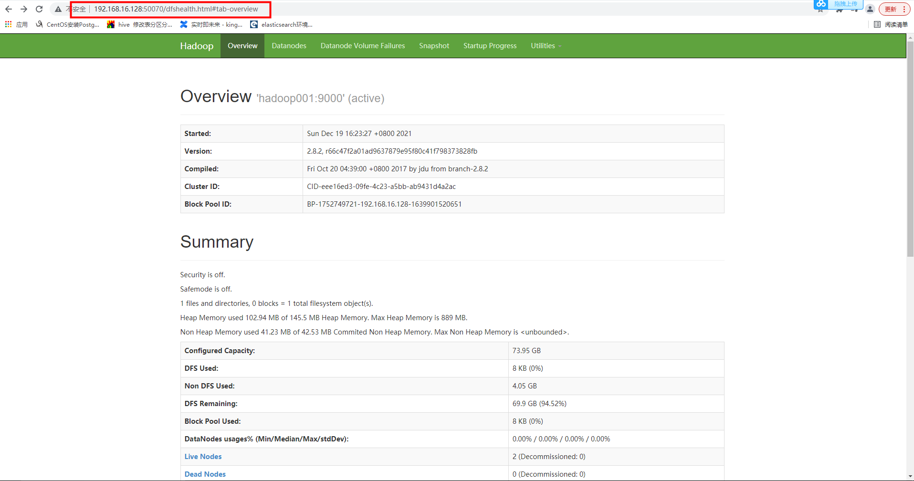

# 一、Hadoop 安装（集群）

### 一、准备工作

[1. 安装虚拟机](https://github.com/WuZongYun/bigdata_study/blob/main/%E5%A4%A7%E6%95%B0%E6%8D%AE%E5%9F%BA%E7%A1%80%E7%8E%AF%E5%A2%83%E6%90%AD%E5%BB%BA/1_%E5%AE%89%E8%A3%85%E8%99%9A%E6%8B%9F%E6%9C%BA.md)

[2. 安装MobaXterm](https://github.com/WuZongYun/bigdata_study/blob/main/%E5%A4%A7%E6%95%B0%E6%8D%AE%E5%9F%BA%E7%A1%80%E7%8E%AF%E5%A2%83%E6%90%AD%E5%BB%BA/2_%E5%AE%89%E8%A3%85MobaXterm.md)

[3. centos7免密设置](https://github.com/WuZongYun/bigdata_study/blob/main/%E5%A4%A7%E6%95%B0%E6%8D%AE%E5%9F%BA%E7%A1%80%E7%8E%AF%E5%A2%83%E6%90%AD%E5%BB%BA/3_centos7%E5%85%8D%E5%AF%86%E8%AE%BE%E7%BD%AE.md)

[4. centos7安装JDK1.8](https://github.com/WuZongYun/bigdata_study/blob/main/%E5%A4%A7%E6%95%B0%E6%8D%AE%E5%9F%BA%E7%A1%80%E7%8E%AF%E5%A2%83%E6%90%AD%E5%BB%BA/4_centos7%E5%AE%89%E8%A3%85JDK.md)

5. 在虚拟机中的opt文件夹下单独创建两个文件（download、software），用来存放安装包和软件

6. 通过Xsftp将hadoop上传至download目录下；

下载链接 https://pan.baidu.com/s/1XVpUOcnWE1WiY8S2jAuLAQ 请输入提取码 提取码：rl9s

### 二、具体步骤

（一）解压

1、输入命令： `tar -zxvf hadoop-2.8.2.tar.gz -C /usr/local/src/software/` ，将文件解压至目录路径下。


（二）hadoop 配置

**hadoop-env.sh**

输入命令：`cd /usr/local/src/software/hadoop-2.8.2/etc/hadoop`，进入此文件夹下，输入命令：`vi hadoop-env.sh` 进行配置，利用`echo $JAVA_HOME` ，找到Java路径，并添加到配置项里，命令如下。配置完成后保存并退出；

```
#JDK
export JAVA_HOME=/usr/local/src/software/jdk1.8
```
**core-site.xml**

输入命令：`cd /usr/local/src/software/hadoop/etc/hadoop/` ,进入此文件夹下，输入命令：`vi core-site.xml` ,进行配置。将<configuration></configuration>部分修改成下方命令。

```
<configuration>         
      <property>                    
              <name>fs.defaultFS</name>                    
              <value>hdfs://192.168.16.128:9000</value>          
      </property>          
      <property>                    
              <name>hadoop.temp.dir</name>                    
              <value>/usr/local/src/software/hadoop-2.8.2/tmp</value>          
      </property>          
      <property>                    
              <name>hadoop.proxyuser.root.users</name>                    
              <value></value>          
      </property>          
</configuration>
```

**hdfs-site.xml**

输入命令：`cd /usr/local/src/software/hadoop-2.8.2/`，新建tmp文件夹 ，进入tmp文件夹下，新建两个 name 、 data 文件夹，复制 name 、 data 两个文件夹的路径并保存。

输入命令：`cd /usr/local/src/software/hadoop-2.8.2/etc/hadoop`，进入此文件夹下，输入命令：`vi hdfs-site.xml`，进行配置。将 < configuration ></ configuration > 部分修改成下方命令：

```
<configuration>
      <property>          
      <!-- 指定SecondaryNamenode所在地址 -->                    
            <name>dfs.namenode.secondary.http-address</name>                    
            <value>hadoop001:50090</value>          
      </property>          
      <property>                   
            <name>dfs.replication</name>                   
            <value>2</value>         
      </property>         
      <property>                   
            <name>dfs.namenode.name.dir</name>                   
            <value>/usr/local/src/software/hadoop-2.8.2/tmp/name</value>         
      </property>         
      <property>                   
            <name>dfs.datanode.data.dir</name>                   
            <value>/usr/local/src/software/hadoop-2.8.2/tmp/data</value>         
      </property>
</configuration>
```

（三）yarn 配置

输入命令：`cd /usr/local/src/software/hadoop-2.8.2/etc/hadoop`，进到此文件下，输入命令：`mv mapred-site.xml.template mapred-site.xml`，将 mapred-site.xml.template 这个文件重命名。

你也可以通过命令：`cp mapred-site.xml.template mapred-site.xml`，来复制一份出来并重命名，这一步主要是为了保留模板文件。

**mapred-site.xml**

输入命令：`vi mapred-site.xml`，进行配置，将 < configuration ></ configuration > 部分修改成下方命令。

```
<configuration>           
      <property>                     
            <name>mapreduce.framework.name</name>                     
            <value>yarn</value>           
      </property>           
      <property>                     
            <name>mapreduce.jobhistory.address</name>                     
            <value>192.168.16.128:10020</value>           
      </property>           
      <property>                     
            <name>mapreduce.jobhistory.webapp.address</name>                     
            <value>192.168.16.128:19888</value>           
      </property>
</configuration>
```

**yarn-site.xml**

输入命令：`vi yarn-site.xml`，进行配置，将 < configuration ></ configuration > 部分修改成下方命令。

```
<configuration>
<!-- Site specific YARN configuration properties -->
        <property>
            <name>yarn.resourcemanager.hostname</name>
            <value>hadoop001</value>
      </property> 
      <property>
              <name>yarn.nodemanager.aux-services</name>
              <value>mapreduce_shuffle</value>
      </property>
      <property>
              <name>yarn.log-aggregation-enable</name>
              <value>true</value>
      </property>
      <property>
              <name>yarn.log-aggregation.retain-seconds</name>
              <value>604800</value>
      </property>
</configuration>
```

**slaves**

将slaves中hostname删除，写入hadoop002,hadoop003指定hadoop002和hadoop003是从节点。`vi slaves`

```
hadoop002
hadoop003
```

将hadoop文件夹发送到其他节点：

```
scp -rp /usr/local/src/software/hadoop-2.8.2 root@hadoop002:/usr/local/src/software/
scp -rp /usr/local/src/software/hadoop-2.8.2 root@hadoop003:/usr/local/src/software/
```

（四）配置环境变量（每台节点都要配置）

1. 输入命令：

`vi /etc/profile`，进入配置文件，输入下方命令，进行配置，配置完毕后保存并退出，输入命令：`source /etc/profile`，重新载入配置文件。

```
#HADOOP
export HADOOP_HOME=/usr/local/src/software/hadoop-2.8.2
export PATH=$HADOOP_HOME/bin:$HADOOP_HOME/sbin:$PATH
export HADOOP_MAPRED_HOME=$HADOOP_HOME
export HADOOP_COMMON_HOME=$HADOOP_HOME
export HADOOP_HDFS_HOME=$HADOOP_HOME
export YARN_HOME=$HADOOP_HOME
export HADOOP_COMMON_LIB_NATIVE_DIR=$HADOOP_HOME/lib/native
export HADOOP_INSTALL=$HADOOP_HOME
```

（五）启动Hadoop集群

**在Master上执行**

首次运行需要，执行

`hdfs namenode -format`

格式化名称节点，然后就可以启动hadoop了。

进入`cd /usr/local/src/software/hadoop-2.8.2/sbin/`启动hadoop：

`./start-all.sh`

使用`jps`查看启动的各个节点，缺少任何进程，都表示出错。

hadoop001


hadoop002/hadoop003


浏览器查看：http://192.168.16.128:50070/



查看相关信息：`hdfs dfsadmin -report`


关闭hadoop：

`./stop-yarn.sh`

如果有问题，重复如下命令：

```
$ ./stop-all.sh   # 关闭
$ rm -r /usr/local/src/software/hadoop-2.8.2/tmp/name     # 删除 tmp 文件，注意这会删除 HDFS中原有的所有数据
$ hdfs namenode -format   # 重新格式化名称节点
$ ./start-all.sh  # 重启
```

