# Hadoop高可用安装（HDFS HA）

[在之前搭建好的hadoop集群之上继续搭建hadoop高可用集群。](https://github.com/WuZongYun/bigdata_study/blob/main/hadoop/2_hadoop%E5%AE%89%E8%A3%85.md)

首先将hadoop001中hadoop配置文件夹进行备份

```
cd /usr/local/src/software/hadoop-2.8.2/etc
mkdir hadoop_bak
cp -r hadoop/* ./hadoop_bak/
```

**hdfs-site.xml**

```
<configuration>
	<property>                   
            <name>dfs.replication</name>                   
            <value>3</value>         
      	</property>
	<!--mycluster为自定义的值，下方配置要使用该值-->         
      	<property>                   
            <name>dfs.nameservices</name>                   
            <value>mycluster</value>
        </property>
	<!--配置两个namenode的标识符-->
	<property>
	    <name>dfs.ha.namenodes.mycluster</name>
	    <value>nn1,nn2</value>
	</property>
        <!--配置两个namenode所在节点与访问端口-->
	<property> 
	    <name>dfs.namenode.rpc-address.mycluster.nn1</name>
	    <value>hadoop001:8020</value>
	</property>
	<!--配置两个namenode所在节点与访问端口-->
        <property>
            <name>dfs.namenode.rpc-address.mycluster.nn2</name>
            <value>hadoop002:8020</value>
        </property>
	<!--配置两个NameNode的web页面访问地址-->
        <property>
            <name>dfs.namenode.http-address.mycluster.nn1</name>
            <value>hadoop001:50070</value>
        </property>
	<!--配置两个namenode所在节点与访问端口-->
        <property>
            <name>dfs.namenode.http-address.mycluster.nn2</name>
            <value>hadoop002:50070</value>
        </property>
    <!--配置一组JournalNode的URL地址-->   
        <property>
            <name>dfs.namenode.shared.edits.dir</name>
            <value>qjournal://hadoop001:8485;hadoop002:8485;hadoop003:8485/mycluster</value>
        </property>
    <!--JournalNode用于存放元数据和状态信息的目录-->   
        <property>
            <name>dfs.journalnode.edits.dir</name>
            <value>/usr/local/src/software/hadoop-2.8.2/tmp/jn</value>
        </property>
    <!--客户端与NameNode通信的Java类-->   
	    <property>
            <name>dfs.client.failover.proxy.provider.mycluster</name>
            <value>org.apache.hadoop.hdfs.server.namenode.ha.ConfiguredFailoverProxyProvider</value>
        </property>
    <!--解决HA集群脑裂问题-->   
	    <property>
            <name>dfs.ha.fencing.methods</name>
            <value>sshfence
            shell(/bin/true)</value>
        </property>
    <!--上述属性SSH通信使用的秘钥文件-->
	    <property>
            <name>dfs.ha.fencing.ssh.private-key-files</name>
            <value>/root/.ssh/id_rsa</value>
        </property>
</configuration>
```

上述配置属性解析如下。

**dfs.nameservices**：为nameservice设置一个逻辑名称ID（nameservice ID），名称ID可以自定义，例如mycluster。并且使用这个逻辑名称ID作为配置属性的值。后续配置属性将引用该ID。

**dfs.ha.namenodes.mycluster** ：nameservice中每个NameNode的唯一标识符。属性值是一个以逗号分隔的NameNode ID列表。这将被DataNode用于确定集群中的所有NameNode。例如，本例中使用“mycluster”作为nameservice ID，并且使用“nn1”和“nn2”作为NameNode的单个ID。需要注意的是，当前每个nameservice只能配置最多两个NameNode。

**dfs.namenode.rpc-address.mycluster.nn1**：设置NameNode的RPC监听地址，需要设置NameNode进程的完整地址和RPC端口。

**dfs.namenode.rpc-address.mycluster.nn2**：设置另一个NameNode的RPC监听地址，需要设置NameNode进程的完整地址和RPC端口。

**dfs.namenode.http-address.mycluster.nn1**：设置NameNode的HTTP Web端监听地址，类似于上面的RPC地址，可以通过浏览器端查看NameNode状态。

**dfs.namenode.http-address.mycluster.nn2**：设置另一个NameNode的HTTPWeb端监听地址，类似于上面的RPC地址，可以通过浏览器端查看NameNode状态。

**dfs.namenode.shared.edits.dir**：设置一组 JournalNode 的 URI 地址，活动NameNode将元数据写入这些JournalNode，而备用 NameNode 则读取这些元数据信息，并作用在内存的目录树中。如果JournalNode有多个节点，则使用分号分割。该属性值应符合以下格式：qjournal://host1:port1;host2:port2;host3:port3/nameservice ID。

**dfs.journalnode.edits.dir**：JournalNode所在节点上的一个目录，用于存放元数据和其他状态信息。

**dfs.client.failover.proxy.provider.mycluster**：客户端与活动状态的NameNode进行交互的Java实现类。由于有两个NameNode，只有活动NameNode可以对外提供读写服务，当客户端访问HDFS时，客户端将通过该类寻找当前的活动NameNode。目前Hadoop的唯一实现是ConfiguredFailoverProxyProvider类，除非用户自己对其定制，否则应该使用这个类。

**dfs.ha.fencing.methods**：解决HA集群脑裂问题（即出现两个 NameNode同时对外提供服务，导致系统处于不一致状态）。在 HDFS HA中，JournalNode只允许一个NameNode对其写入数据，不会出现两个活动NameNode 的问题。但是当主／备切换时，之前的活动 NameNode 可能仍在处理客户端的 RPC 请求，为此需要增加隔离机制（fencing）将之前的活动NameNode杀死。常用的fence方法是sshfence，使用SSH需要指定SSH通信使用的密钥文件。

**dfs.ha.fencing.ssh.private-key-files**：指定上述属性SSH通信使用的密钥文件在系统中的位置（配置SSH无密钥登录所生成的私钥文件，一般在当前用户主目录下的.ssh文件夹中）。

**core-site.xml**

```
<configuration>
	<property>                    
              <name>fs.defaultFS</name>                    
              <value>hdfs://mycluster</value>          
      </property>          
      <property>                    
              <name>hadoop.temp.dir</name>                    
              <value>/usr/local/src/software/hadoop-2.8.2/tmp</value>          
      </property>          
</configuration>
```

先备份另外两个节点的hadoop配置文件（hadoop002,hadoop003）

```
cd /usr/local/src/software/hadoop-2.8.2/etc
mkdir hadoop_bak
cp -r hadoop/* ./hadoop_bak/
```

发送配置文件到另外两个节点（hadoop001）：

```
scp -rp  /usr/local/src/software/hadoop-2.8.2/etc/hadoop/* root@hadoop002:/usr/local/src/software/hadoop-2.8.2/etc/hadoop/
scp -rp  /usr/local/src/software/hadoop-2.8.2/etc/hadoop/* root@hadoop003:/usr/local/src/software/hadoop-2.8.2/etc/hadoop/
```

启动和测试

（1）启动JournalNode进程（hadoop001,hadoop002,hadoop003）。

删除各个节点的$HADOOP_HOME/tmp目录下的所有文件。分别进入各个节点的Hadoop安装目录，执行以下命令，进入sbin目录启动三个节点的JournalNode进程：

```
cd /usr/local/src/software/hadoop-2.8.2/tmp
rm -rf /usr/local/src/software/hadoop-2.8.2/tmp/name
rm -rf /usr/local/src/software/hadoop-2.8.2/tmp/data
hadoop-daemon.sh start journalnode
```

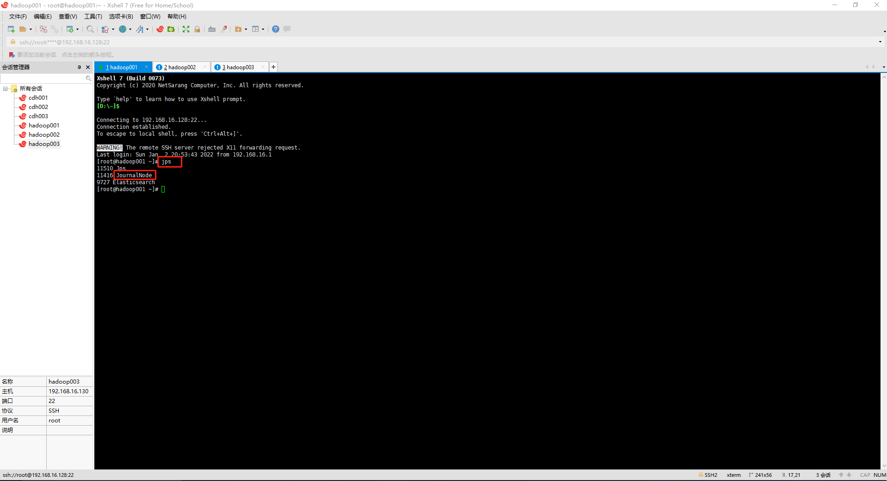

（2）格式化NameNode。

在hadoop001节点上进入Hadoop安装目录，执行以下命令，格式化NameNode。如果没有启动JournalNode，格式化将失败。

```
bin/hdfs namenode -format
```
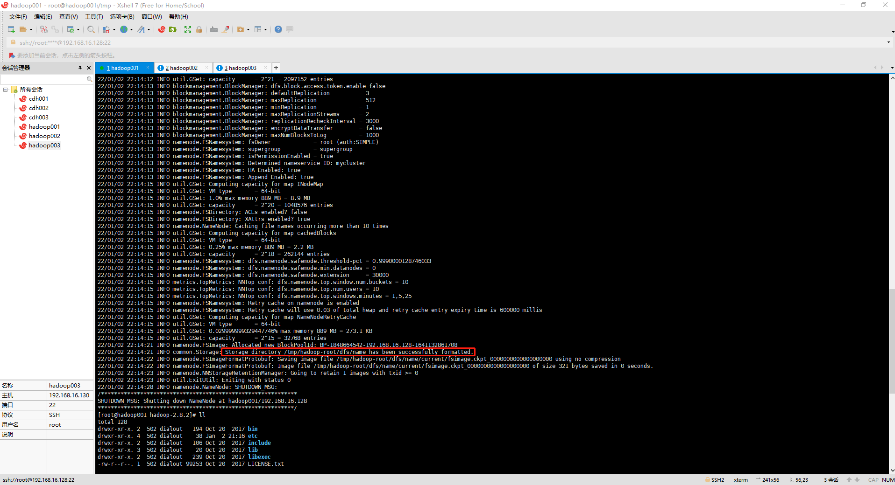

（3）启动NameNode1（活动NameNode）。

在centos01节点上进入Hadoop安装目录，执行以下命令，启动NameNode1：

```
cd /usr/local/src/software/hadoop-2.8.2/sbin
hadoop-daemon.sh start namenode
```

启动NameNode后会生成images元数据。

（4）复制NameNode1元数据。

在hadoop002上进入Hadoop安装目录，执行以下命令，将hadoop002上的NameNode元数据复制到hadoop002上

```
cd /usr/local/src/software/hadoop-2.8.2/bin
hdfs namenode -bootstrapStandby
```

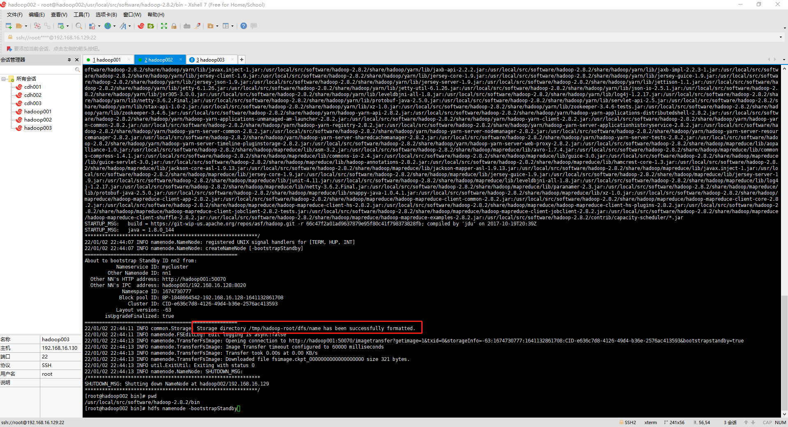

（5）启动NameNode2（备用NameNode）。

在hadoop002上进入Hadoop安装目录，执行以下命令，启动NameNode2：

```
cd /usr/local/src/software/hadoop-2.8.2/sbin
hadoop-daemon.sh start namenode
```
启动后，在浏览器中输入网址http://192.168.16.128:50070/查看NameNode1的状态

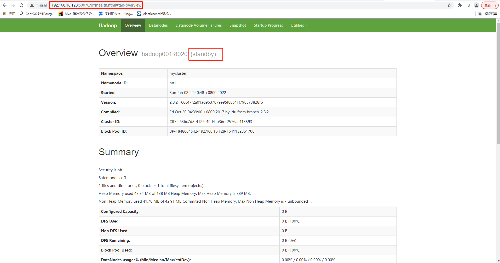

在浏览器中输入网址http://centos02:50070查看NameNode2的状态

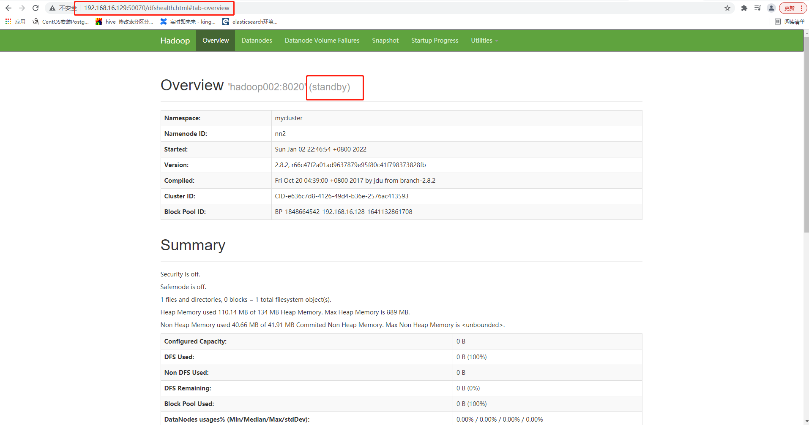

可以看到，此时两个NameNode的状态都为standby（备用）。接下来需要将NameNode1的状态设置为active（活动）

（6）在hadoop001节点上进入Hadoop安装目录，执行如下命令，将NameNode1的状态置为active：

```
cd /usr/local/src/software/hadoop-2.8.2/bin
hdfs haadmin -transitionToActive nn1
```

上述代码中的nn1为hdfs-site.xml中设置的节点hadoop001上的NameNode的ID标识符。上述代码执行完毕后，刷新浏览器，可以看到NameNode1的状态已经变为active

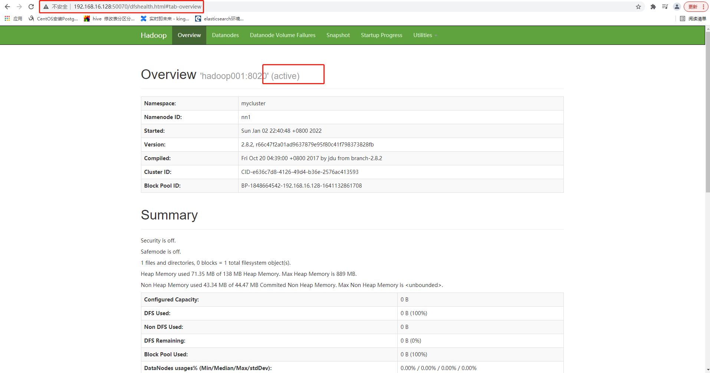

到此，两个NameNode都已经启动成功了，且其中一个为活动状态，另一个为备用状态。但是集群的DataNode还没有启动，我们可以重新启动HDFS，将NameNode、DataNode等所有相关进程一起启动。

（7）重新启动HDFS。

在hadoop001节点上进入Hadoop安装目录，执行以下命令，停止HDFS：

```
cd /usr/local/src/software/hadoop-2.8.2/sbin
stop-dfs.sh
```

然后执行以下命令，启动HDFS：

```
cd /usr/local/src/software/hadoop-2.8.2/sbin
start-dfs.sh
```

（8）再次将NameNode1的状态置为active。

重启以后，NameNode、DataNode等进程都已经启动了，但两个NameNode的状态仍然都为standby，需要再次执行步骤(6)的命令，将NameNode1的状态置为active。

（9）在各节点中执行jps命令，查看各节点启动的Java进程。

hadoop001节点上的Java进程：

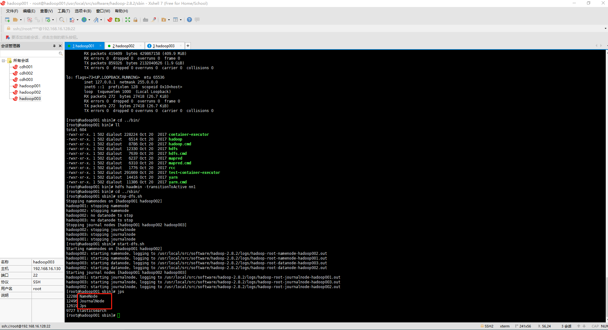

hadoop002节点上的Java进程：

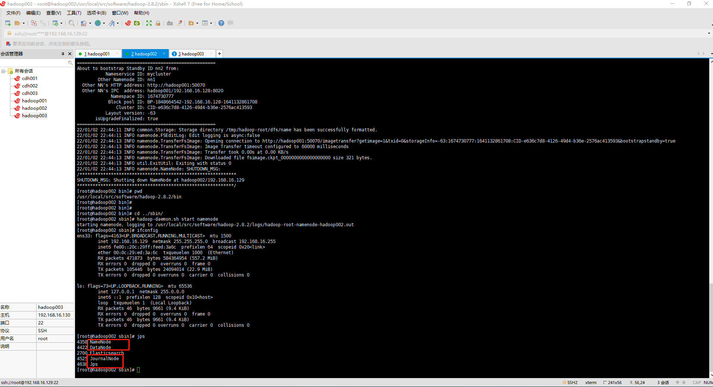

hadoop003节点上的Java进程：

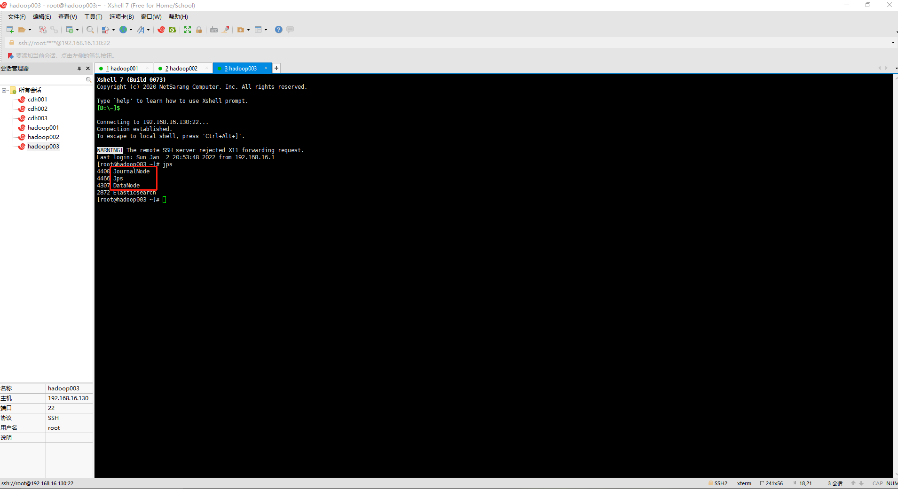

（10）测试HDFS。

上传一个文件到HDFS，测试HDFS是否正常运行，文件的上传此处不做过多讲解。若一切正常，接下来测试NameNode故障转移功能。

```
cd /usr/local/src/software/hadoop-2.8.2
hdfs dfs -put README.txt /
```
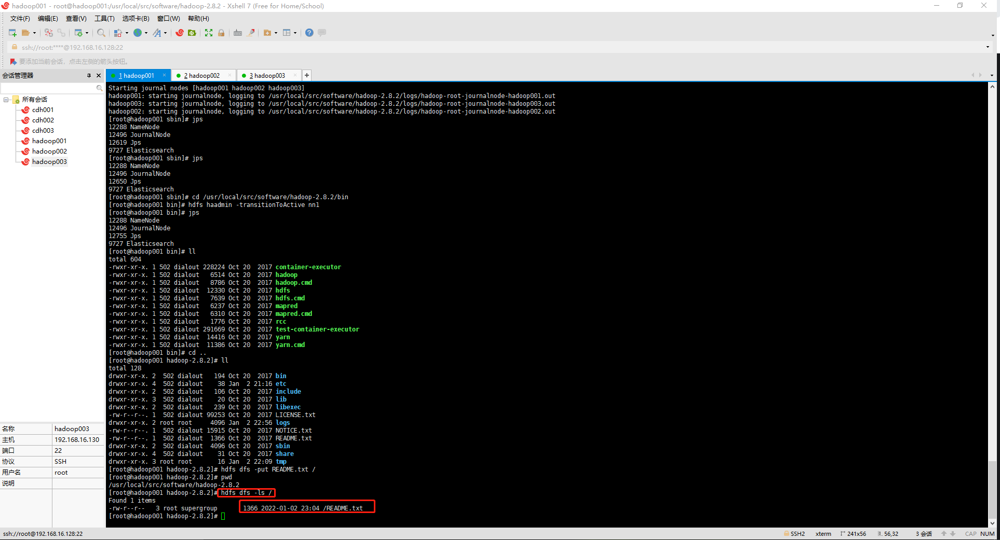

首先将NameNode1进程杀掉：


`kill -9 12288`

然后查看NameNode2的状态，发现仍然是standby，没有自动切换到active，此时需要先在hadoop重新启动hdfs

```
cd /usr/local/src/software/hadoop-2.8.2/sbin
start-dfs.sh
```

再手动执行步骤(6)的命令，将NameNode2的状态切换为active。再次进行HDFS文件系统的测试，发现一切正常。

```
cd /usr/local/src/software/hadoop-2.8.2/bin
hdfs haadmin -transitionToActive nn2
```
以上步骤讲解了如何配置手动故障转移。在该模式下，即使活动节点失败，系统也不会自动触发从活动NameNode到备用NameNode的故障转移。这样手动切换NameNode虽然能解决故障问题，但还是比较麻烦，那么可不可以自动切换呢？答案是肯定的。接下来讲解HDFS结合Zookeeper进行自动故障转移。

HDFS的自动故障转移功能添加了两个新组件：ZooKeeper集群和ZKFailoverController进程（简称ZKFC）。

ZooKeeper在自动故障转移中主要起故障检测和NameNode选举的作用。集群中的每个NameNode计算机都在ZooKeeper中维护一个持久会话。如果计算机崩溃，ZooKeeper会话将过期，ZooKeeper将通知另一个NameNode，从而触发故障转移。当活动NameNode故障时，ZooKeeper提供了一个简单的选举机制，从备用NameNode中（目前HA集群只有两个NameNode）选出一个唯一的NameNode作为活动NameNode。

ZKFC相当于一个ZooKeeper客户端，作为独立的进程运行，负责监视和管理NameNode的状态，对 NameNode的主／备切换进行总体控制。每个运行NameNode的计算机都会运行一个ZKFC。ZKFC会定期对本地的NameNode进行检测。只要NameNode能及时地以健康的状态做出反应，ZKFC就认为该节点是健康的。如果该节点崩溃、冻结或进入不健康状态，ZKFC会将其标记为不健康状态，并通知ZooKeeper。ZooKeeper会从其他备用NameNode中重新选举出一个NameNode作为活动NameNode，然后通知ZKFC，最后ZKFC将其对应的NameNode切换为活动NameNode。

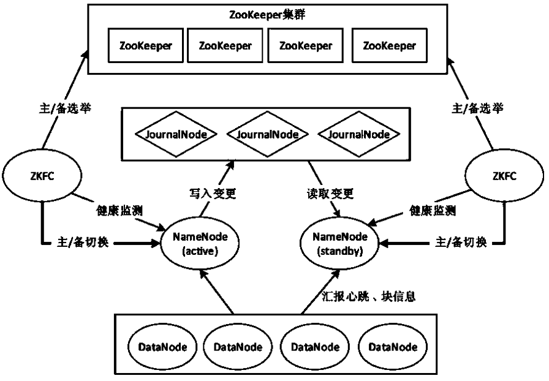

接下来，我们配置的手动故障转移的基础上继续进行修改，搭建NameNode的自动故障转移，操作步骤如下。

1.开启自动故障转移功能

在hadoop001节点中，修改hdfs-site.xml文件，在文件下方加入以下内容：

```
<property>
            <name>dfs.ha.automatic-failover.enabled.mycluster</name>
            <value>true</value>
</property>
```

2. 指定ZooKeeper集群

在hadoop001节点中，修改core-site.xml文件，在文件下方加入以下内容，指定ZooKeeper集群各节点主机名及访问端口：

```
<property>
              <name>ha.zookeeper.quorum</name>
              <value>hadoop001:2181,hadoop002:2181,hadoop003:2181</value>
</property>
```

3. 同步其他节点

发送修改好的hdfs-site.xml和core-site.xml文件到集群其他节点，覆盖原来的文件

```
scp -rp  /usr/local/src/software/hadoop-2.8.2/etc/hadoop/* root@hadoop002:/usr/local/src/software/hadoop-2.8.2/etc/hadoop/
scp -rp  /usr/local/src/software/hadoop-2.8.2/etc/hadoop/* root@hadoop003:/usr/local/src/software/hadoop-2.8.2/etc/hadoop/
```

4. 停止HDFS集群

在hadoop001节点中进入Hadoop安装目录，执行以下命令，停止HDFS集群：

```
cd /usr/local/src/software/hadoop-2.8.2/sbin
stop-dfs.sh
```

5. 启动ZooKeeper集群（hadoop001,hadoop002,hadoop003）

```
cd /usr/local/src/software/zookeeper/bin
./zkServer.sh start
```

6. 初始化HA在ZooKeeper中的状态

在hadoop001节点中进入Hadoop安装目录，执行以下命令，在ZooKeeper中创建一个znode节点，存储自动故障转移系统的数据：

```
cd /usr/local/src/software/hadoop-2.8.2/bin
hdfs zkfc -formatZK
```
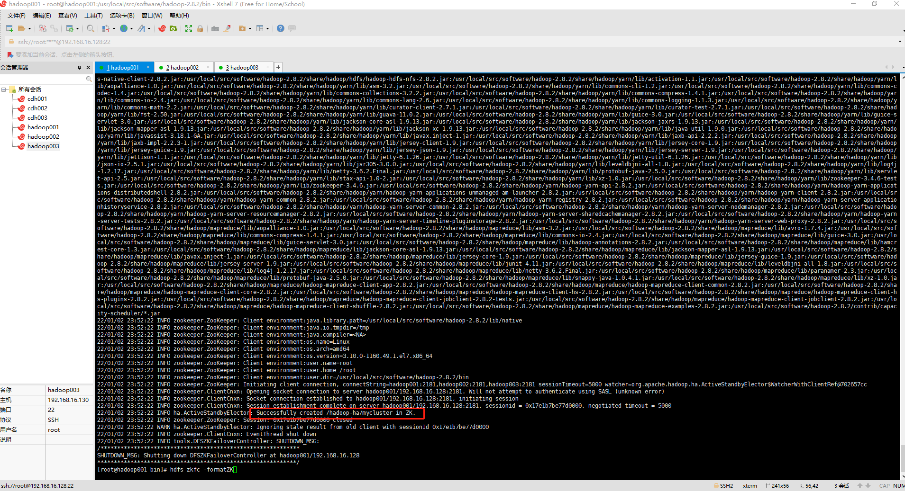

7. 启动HDFS集群

```
cd /usr/local/src/software/hadoop-2.8.2/sbin
start-dfs.sh
```
8. 启动ZKFC守护进程

由于我们是手动管理集群上的服务，所以需要手动启动运行NameNode的每个计算机上的ZKFC守护进程。分别在hadoop001和hadoop002上进入Hadoop安装目录，执行以下命令，启动ZKFC守护进程（或者执行bin/hdfs start zkfc也可以，两种启动方式）：

```
cd /usr/local/src/software/hadoop-2.8.2/sbin
hadoop-daemon.sh start zkfc
```

**需要注意的是，先在哪个节点上启动，哪个节点的NameNode状态就是active。**

9. 测试HDFS自动故障转移

在hadoop001中上传一个文件到HDFS，然后停止NameNode1，读取刚才上传的文件内容。如果仍能成功读取文件内容，说明自动故障转移配置成功。此时在浏览器中访问NameNode2的Web，可以看到NameNode2的状态变为active

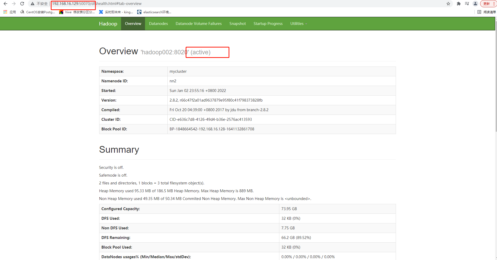

到此，结合ZooKeeper进行HDFS自动故障转移功能就搭建完成了。