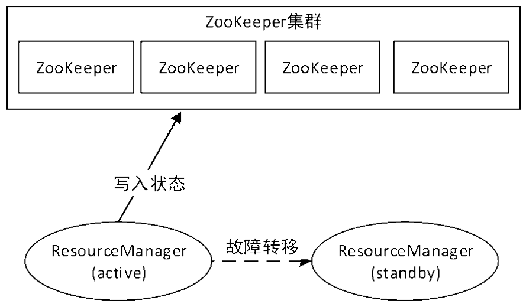
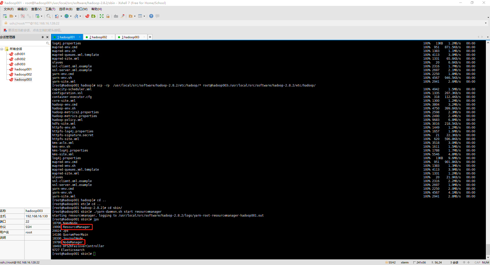
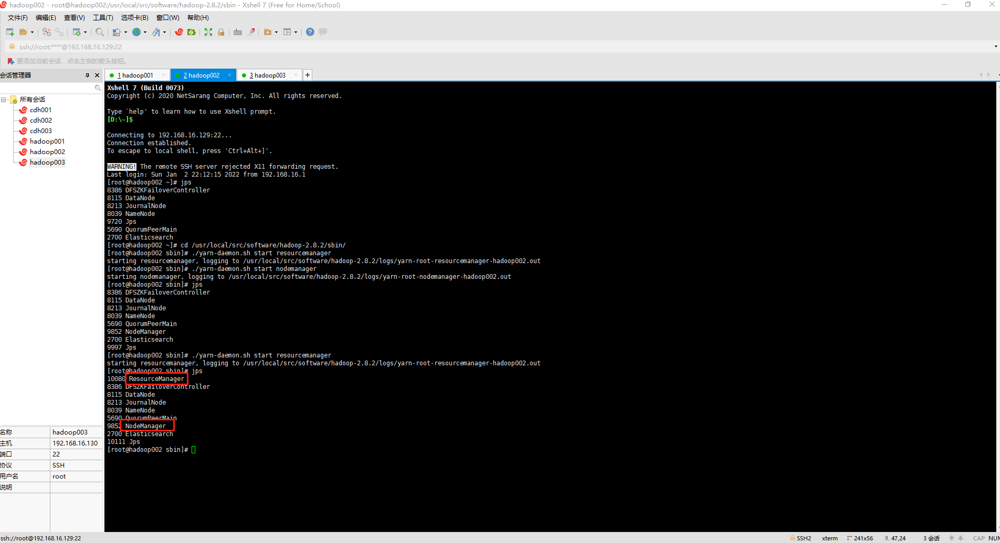
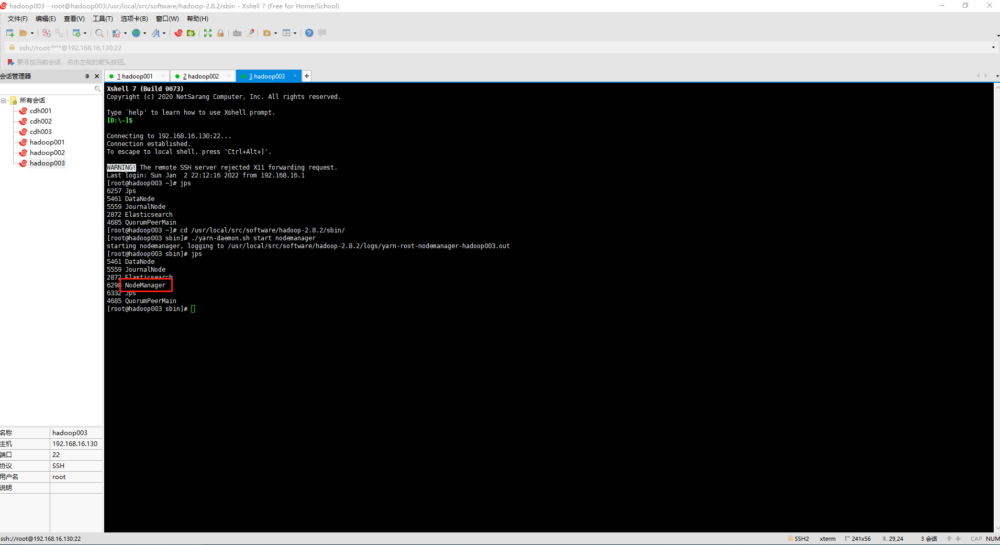
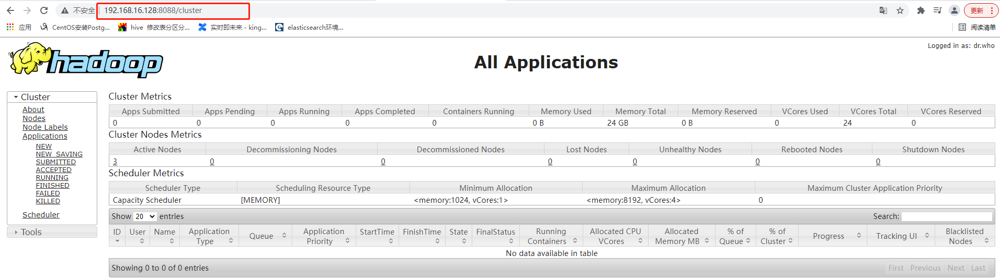
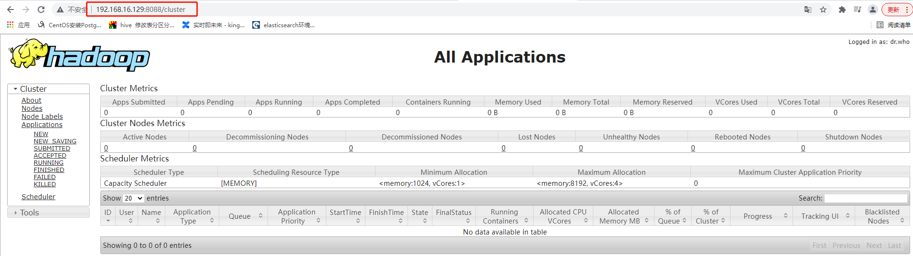

[与HDFS HA类似，YARN集群也可以搭建HA功能。](https://github.com/WuZongYun/bigdata_study/blob/main/hadoop/2_hadoop%E5%AE%89%E8%A3%85.md)

在Hadoop的YARN集群中，ResourceManager负责跟踪集群中的资源，以及调度应用程序（例如MapReduce作业）。在Hadoop 2.4之前，集群中只有一个ResourceManager，当其中一个宕机时，将影响整个集群。高可用特性增加了冗余的形式，即一个活动/备用的ResourceManager对，以便可以进行故障转移。



与HDFS HA类似，同一时间只有一个ResourceManager处于活动状态，当不启用自动故障转移时，我们必须手动将其中一个ResourceManager转换为活动状态。可以结合ZooKeeper实现自动故障转移，当活动ResourceManager无响应或故障时，另一个ResourceManager自动被ZooKeeper选为活动ResourceManager。与HDFS HA不同的是，ResourceManager中的ZKFC只作为ResourceManager的一个线程运行，而不是一个独立的进程。

下面将逐步讲解YARN HA的配置步骤。

1.**yarn-site.xml**

```
<configuration>

<!-- Site specific YARN configuration properties -->
      <!--指定可以在YARN上运行MapReduce程序-->
      <property>                  
              <name>yarn.nodemanager.aux-services</name>                  
              <value>mapreduce_shuffle</value>          
      </property>
      <!--YARN HA 配置-->
      <!--开启ResourceManager HA功能-->
      <property>   
              <name>yarn.resourcemanager.ha.enabled</name>
              <value>true</value>
      </property>
      <!--标志ResourceManager-->
      <property>
              <name>yarn.resourcemanager.cluster-id</name>
              <value>cluster1</value>
      </property>
      <!--集群中ResourceManager的ID列表，后面的配置将引用该ID-->
      <property>
              <name>yarn.resourcemanager.ha.rm-ids</name>
              <value>rm1,rm2</value>
      </property>
      <!--Resourcemanager1所在的节点主机名-->
      <property>
              <name>yarn.resourcemanager.hostname.rm1</name>
              <value>hadoop001</value>
      </property>
      <!--resourcemanager2所在的节点主机名-->
      <property>
              <name>yarn.resourcemanager.hostname.rm2</name>
              <value>hadoop002</value>
      </property>
      <!--resourcemanager1的web页面访问地址-->
      <property>
              <name>yarn.resourcemanager.webapp.address.rm1</name>
              <value>hadoop001:8088</value>
      </property>
      <!--resourcemanager2的web页面访问地址-->
      <property>
              <name>yarn.resourcemanager.webapp.address.rm2</name>
              <value>hadoop002:8088</value>
      </property>
      <!--zookeeper集群列表-->
      <property>
              <name>yarn.resourcemanager.zk-address</name>
              <value>hadoop001:2181,hadoop002:2181,hadoop003:2181</value>
      </property>
      <!--启动resourcemanager重启的功能，默认为false-->
      <property>
              <name>yarn.resourcemanager.recovery.enabled</name>
              <value>true</value>
      </property>
      <!--用于resourcemanager状态存储的类-->
      <property>
              <name>yarn.resourcemanager.store.class</name>
              <value>org.apache.hadoop.yarn.server.resourcemanager.recovery.ZKRMStateStore</value>
      </property>
</configuration>
```

上述配置属性解析如下。

**yarn.nodemanager.aux-services** ：NodeManager上运行的附属服务，需配置成mapreduce_shuffle才可正常运行MapReduce程序。YARN提供了该配置项用于在NodeManager上扩展自定义服务，MapReduce的Shuffle功能正是一种扩展服务。

**yarn.resourcemanager.ha.enabled**：开启ResourceManager HA功能。

**yarn.resourcemanager.cluster-id**：标识集群中的ResourceManager。如果设置该属性，需要确保所有的ResourceManager在配置中都有自己的ID。

**yarn.resourcemanager.ha.rm-ids**：ResourceManager的逻辑ID列表。可以自定义，此处设置为“rm1，rm2”。后面的配置将引用该ID。

**yarn.resourcemanager.hostname.rm1**：指定ResourceManager对应的主机名。另外，可以设置ResourceManager的每个服务地址。

**yarn.resourcemanager.webapp.address.rm1**：指定ResourceManager的Web端访问地址。

**yarn.resourcemanager.zk-address**：指定集成的ZooKeeper的服务地址。

**yarn.resourcemanager.recovery.enabled**：启用ResourceManager重启的功能，默认为false。

**yarn.resourcemanager.store.class**：用于ResourceManager状态存储的类，默认为org.apache.hadoop.yarn.server.resourcemanager.recovery.FileSystemRMStateStore，基于Hadoop文件系统的实现。另外，还可以为org.apache.hadoop.yarn.server.resourcemanager.recovery.ZKRMStateStore，该类为基于ZooKeeper的实现。此处指定该类。

2. 同步其他节点

```
scp -rp  /usr/local/src/software/hadoop-2.8.2/etc/hadoop/* root@hadoop002:/usr/local/src/software/hadoop-2.8.2/etc/hadoop/
scp -rp  /usr/local/src/software/hadoop-2.8.2/etc/hadoop/* root@hadoop003:/usr/local/src/software/hadoop-2.8.2/etc/hadoop/
```

3.启动ZooKeeper集群（hadoop001,hadoop002,hadoop003）

分别进入每个节点的ZooKeeper安装目录，执行以下命令，启动ZooKeeper集群：

```
cd /usr/local/src/software/zookeeper/bin
./zkServer.sh start
```

4. 启动YARN集群（hadoop001,hadoop002）

分别在hadoop001和hadoop002节点上进入Hadoop安装目录，执行以下命令，启动ResourceManager：

```
cd /usr/local/src/software/hadoop-2.8.2/sbin
 ./yarn-daemon.sh start resourcemanager
```

分别在hadoop001、hadoop002和hadoop003节点上进入Hadoop安装目录，执行以下命令，启动NodeManager：

```
cd /usr/local/src/software/hadoop-2.8.2/sbin
./yarn-daemon.sh start nodemanager
```

5. 查看各节点Java进程

hadoop001节点：



hadoop002:



hadoop003:



此时，在浏览器中输入地址http://192.168.16.128:8088访问活动ResourceManager，查看YARN的启动状态



如果访问备用ResourceManager地址http://192.168.16.129:8088，发现自动跳转到了活动ResourceManager的地址http://192.168.16.128:8088。这是因为此时活动状态的ResourceManager在hadoop001节点上，访问备用ResourceManager会自动跳转到活动ResourceManager。

6. 测试YARN自动故障转移

杀掉hadoop001的ResourceManager进程，ResourceManager遇到故障后，自动切换到hadoop002节点上继续执行。此时，浏览器访问备用ResourceManager的Web页面地址http://192.168.16.129:8088，发现可以成功访问。



如果在windows上无法访问hadoop001地址的话需要配置一下hosts文件，修改如下

`C:\Windows\System32\drivers\etc`

修改hosts文件，添加一下一下内容，具体ip按照自己的电脑ip确定

```
192.168.16.128 hadoop001
192.168.16.129 hadoop002
192.168.16.130 hadoop003
```