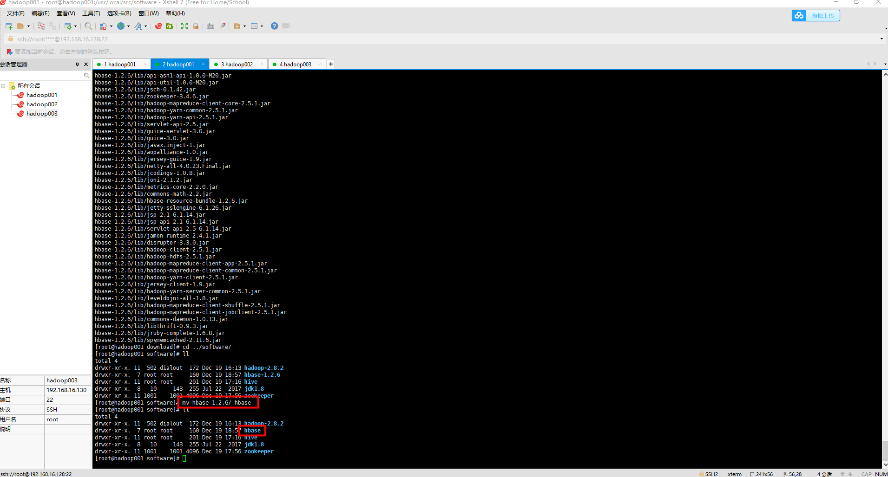
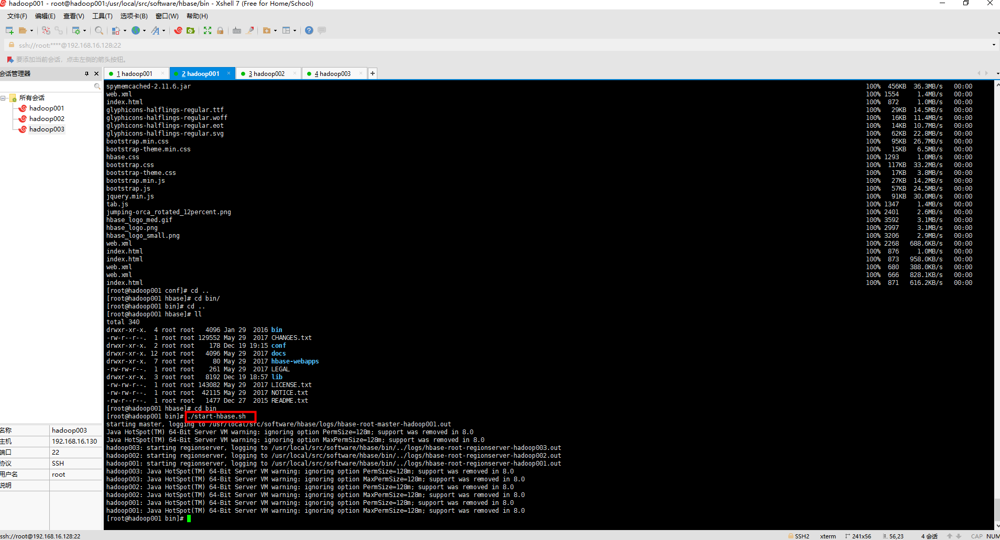
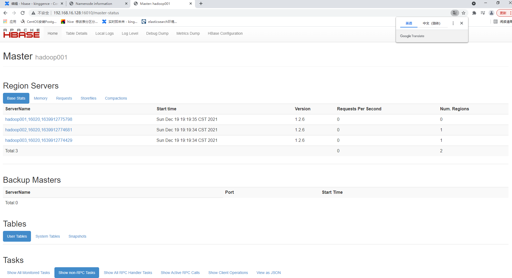

### 一、准备工作

[1、安装一台虚拟机](https://github.com/WuZongYun/bigdata_study/blob/main/%E5%A4%A7%E6%95%B0%E6%8D%AE%E5%9F%BA%E7%A1%80%E7%8E%AF%E5%A2%83%E6%90%AD%E5%BB%BA/1_%E5%AE%89%E8%A3%85%E8%99%9A%E6%8B%9F%E6%9C%BA.md)

[2、启动一台虚拟机，并连接至Xshell、Xftp](https://github.com/WuZongYun/bigdata_study/blob/main/%E5%A4%A7%E6%95%B0%E6%8D%AE%E5%9F%BA%E7%A1%80%E7%8E%AF%E5%A2%83%E6%90%AD%E5%BB%BA/2_%E5%AE%89%E8%A3%85MobaXterm.md)

[3、配置好免密登录](https://github.com/WuZongYun/bigdata_study/blob/main/%E5%A4%A7%E6%95%B0%E6%8D%AE%E5%9F%BA%E7%A1%80%E7%8E%AF%E5%A2%83%E6%90%AD%E5%BB%BA/3_centos7%E5%85%8D%E5%AF%86%E8%AE%BE%E7%BD%AE.md)

[4. zookeeper安装（集群版）](https://github.com/WuZongYun/bigdata_study/blob/main/zookeeper/1_zookeeper%E5%AE%89%E8%A3%85%EF%BC%88%E9%9B%86%E7%BE%A4%E7%89%88%EF%BC%89.md)

5. 建议在虚拟机里单独创建两个文件夹（download、software），用来存放安装包和软件

6. 需要将 hbase-1.2.6-bin.tar.gz 文件，上传至 download 目录。链接：https://pan.baidu.com/s/1KB7H7jRbaD6IaSi_nK8wsg 请输入提取码 提取码：q336

### 二、安装步骤（集群版）

（一）解压（hadoop001）

1.输入命令：`cd /usr/local/src/download`、`ls`，查看是否存在 hbase-1.2.6-bin.tar.gz 这个文件。

2.输入命令：`tar -zxvf /usr/local/src/download/hbase-1.2.6-bin.tar.gz -C /usr/local/src/software/`，将文件解压到 software 文件夹里。

3.解压完毕后，输入命令：`cd /opt/software/hadoop/`，进入到 software  目录里，输入命令：`ls`，查看该目录下是否存在 hbase-1.2.6 这个文件。


4. 输入命令：`mv hbase-1.2.6/ hbase`，将解压后的文件重命名为 hbase。



（二）HBase配置

1. 配置hbase-env.sh

输入命令：`cd /usr/local/src/software/hbase/conf`、`vi hbase-env.sh`，将下图区域配置成下方代码。


```
export JAVA_HOME=/usr/local/src/software/jdk1.8
export HBASE_MANAGES_ZK=false
```

2. 配置hbase-site.xml

输入命令：`cd /usr/local/src/software/hbase/conf`、`vi hbase-site.xml`，将下图区域配置成下方代码，这里需要用到zookeeper中的文件夹。

```
<configuration>          
      <property>                    
            <name>hbase.rootdir</name>                    
            <value>hdfs://hadoop001:9000/hbase</value>          
      </property>          
      <property>                    
            <name>hbase.cluster.distributed</name>                    
            <value>true</value>           
      </property>                   
      <property>                     
            <name>hbase.master.port</name>                     
            <value>16000</value>            
      </property>                     
      <property>
            <name>hbase.zookeeper.quorum</name>             
            <value>hadoop001,hadoop002,hadoop003</value>
      </property>        
      <property>                      
            <name>hbase.zookeeper.property.dataDir</name>                      
            <value>/usr/local/src/software/zookeeper/mydata</value>             
      </property>
</configuration>
```

3. regionservers文件配置

修改HBase安装目录下的/conf/regionservers文件，去掉默认的localhost，加入如下内容（注意：主机名前后不要包含空格）：

```
hadoop001
hadoop002
hadoop003
```


4.复制HBase到其他节点

```
scp -rp /usr/local/src/software/hbase/ root@hadoop002:/usr/local/src/software
scp -rp /usr/local/src/software/hbase/ root@hadoop003:/usr/local/src/software
```

（三）环境配置（hadoop001,hadoop002,hadoop003）

1.  输入命令：

`cd /usr/local/src/software/hbase`，进入到 hbase 目录下，输入命令：`pwd`，查询当前目录路径并复制。

```
/usr/local/src/software/hbase
```

2. 输入命令：vi /etc/profile，建议在之前配置过的地方添加下方代码。

```
#HBASE
export HBASE_HOME=/usr/local/src/software/hbase
export PATH=$HBASE_HOME/bin:$PATH
```

3. 配置完成之后，保存并退出，输入命令：source /etc/profile，重新载入配置文件。

（四）启动hbase（hadoop001）

1. 输入命令启动hadoop,hbase：`start-all.sh`、`zkServer.sh start`，并 `jps` 查看后台进程。

2. 输入命令：`start-hbase.sh`。



使用jps命令查看三台节点上的是否有Hmaster和HreginServer进程。


HBase提供了Web端UI界面，浏览器访问HMaster所在节点的16010端口（http://192.168.16.128:16010）即可查看HBase集群的运行状态。



（五）关闭hbase

1.输入命令：`stop-hbase.sh`，并 `jps` 查看后台进程。
