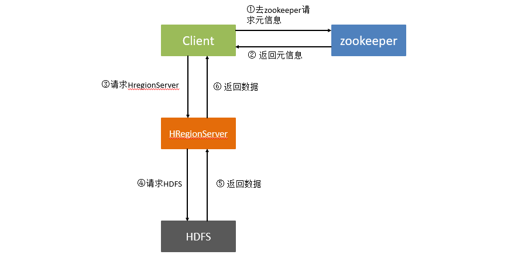

### 一、介绍Hbase

HBase is a type of "NoSQL" database.

Apache HBase 是 Hadoop 数据库，一个分布式、可伸缩的**大数据存储**。

HBase是依赖Hadoop的。为什么HBase能存储海量的数据？**因为HBase是在HDFS的基础之上构建的，HDFS是分布式文件系统**。

HBase是基于HDFS分布式文件系统去构建的。换句话说，HBase的数据其实也是存储在HDFS上的。那肯定有好奇同学就会问：**HDFS和HBase有啥区别阿**？

HDFS是文件系统，而HBase是数据库，其实也没啥可比性。「**你可以把HBase当做是MySQL，把HDFS当做是硬盘。HBase只是一个NoSQL数据库，把数据存在HDFS上**」。

数据库是一个以某种**有组织的方式存储的数据集合**。

说了这么多，那我们为啥要用HBase呢？HBase在HDFS之上提供了**高并发的随机写和支持实时查询**，这是HDFS不具备的。我们可以发现HBase可以以**低成本**来**存储海量**的数据并且支持高并发随机写和实时查询。

但HBase还有一个特点就是：**存储数据的”结构“可以地非常灵活**（这个下面会讲到，这里如果没接触过HBase的同学可能不知道什么意思）。

### 二、入门Hbase

听过HBase的同学可能都听过「列式存储」这个词,，那么列式存储和行式存储有什么区别呢？

我们平时说的行式存储数据排列方式如下：

| **id** | **name** | **age** | **gender** | **class** | **bigdata** | **computer** | **math** | **timestamp** |
|--------|----------|---------|------------|-----------|-------------|--------------|----------|---------------|
| 0001   | tom      | 18      | male       |           | 80          | 90           | 85       | T1            |
| 0002   | amy      | 19      |            | 01        | 95          |              | 89       | T2            |
| 0003   | allen    | 20      | male       | 02        | 90          |              | 88       | T3            |

平时查常见的数据库MySQL，Oracle，SQLServer，PostgressSQL等关系型数据库都是是这种数据存储方式。那我们再看一下，如果把上面的数据转成列式数据应该是什么样子。

| **key**      | **value** |
|--------------|-----------|
| 001:name     | tom       |
| 001:age      | 18        |
| 001:gender   | male      |
| 001:class    |           |
| 001:bigdata  | 80        |
| 001:computer | 90        |
| 001:math     | 85        |

可以看出行式数据转成列式数据后就是把把之前的数据中的每一个字段都转成了key-value形式。

明白了数据是怎么通过行式和列式存储的以后，我们来看一下Hbase是怎么进行数据存储。

### 三、Hbase数据模型

在看Hbase的数据模型时，其实最好不要用【关系型数据库】的概念去理解它。

In HBase, data is stored in tables, which have rows and columns. This is a terminology overlap withrelational databases (RDBMSs), **but this is not a helpful analogy**.

Hbase中有表，主键，列簇，列，值和版本号的概念。我们先来看一下如下表。还是（二）表格为例，它在Hbase中是被怎么设计存储的呢?

| RowKey | userInfo | courseInfo | version |       |         |          |      |    |
|--------|----------|------------|---------|-------|---------|----------|------|----|
|        | name     | age        | gender  | class | bigdata | computer | math |    |
| 0001   | tom      | 18         | male    |       | 80      | 90       | 85   | T1 |
| 0002   | amy      | 19         |         | 01    | 95      |          | 89   | T2 |
| 0003   | allen    | 20         | male    | 02    | 90      |          | 88   | T3 |

可以看到，之前在关系型数据库中能够唯一确定一行数据的id，在Hbase中可以被设计成RowKey，name，age，gender，class这四个列名按属性划分给了列簇用户属性userInfo。bigdata，computer，math这四个列名根据属性划分给了列簇课程属性courseInfo。最后给每条数据都加了一个时间戳作为版本号，这个版本号，也可以自定义设置，默认是当前时间戳。数据写到Hbase的时候都会被记录一个时间戳。当我们修改或者删除某一条数据的时候，本质是往里面新增一条数据，记录版本的加一了而已。比如以0001为例，我们可以看到当前列簇userInfo下面的列age的value是18，它的版本号是T1

| 行键 | 列簇     | 列  | 值 | 时间戳 |
|------|----------|-----|----|--------|
| 0001 | userInfo | age | 18 | T1     |

现在要把这条记录的值改为19，实际就是多添加一条数据，在读取的时候按照时间读最新的记录，在外界“看起来”就是把这条记录改了。

| 行键 | 列簇     | 列  | 值 | 时间戳 |        |
|------|----------|-----|----|--------|--------|
| 0001 | userInfo | age | 18 | T1     | 修改前 |
| 0001 | userInfo | age | 19 | T2     | 修改后 |

那我们删除一个数据的时候是发生了什么呢？其实hbase每个值在存储的时候除了会有RowKey，ColumnFamily，Column，Timestamp外还有一些其他的需要存储的内容，只是这个内容对于程序员来说是透明的，如果把他们完整的列出来是这样的。

| Key Length | Value Length | Row Length | Row Key | Column Family Length | Column Famliy | Column Qualifier | Time Stamp | Key Type | Value |
|------------|--------------|------------|---------|----------------------|---------------|------------------|------------|----------|-------|

如果我们删除一条数据的话，其实就是再新增一条数据，然后对将它的KeyType设置成“delete”就可以了。

在hbase设计中没有值的列不会被存储，所以上面这个表中的RowKey为0001的数据为例，实际上只存储name，age，gender，bigdata，computer，math这六个字段的值。这个说明了数据列稀疏性很大的情况下，相比较行式数据库，hbase数据存储时的磁盘利用率更高。

**hbase的列式可以任意添加的，最大可以到几百万列，几乎不受任何限制。**

### 四、Hbase架构

前面讲了Hbase的数据模型，我们再来看看Hbase的架构是怎么样的。下面是Hbase的架构图。

我们可以看到Hbase主要分为Client，Zookeeper，HMaster，HRegionServer四部分构成。其中：

client：Hbase客户端，它提供了访问Hbase的接口，并且维护了对应的Cache来加速Hbase的访问。

Zookeeper：存储Hbase的元数据，客户端无论是读取还是写入数据，都是去Zookeeper里面去拿到元数据，再去对应的HRegionServer进行响应的操作。

HRegionServer：它是处理客户端的读写请求，并且负责与HDFS底层交互，是真正干活的节点。

HMaster：处理Hregion的分配或者转移。如果Hregion数据量太大的话，HMaster会对拆分后的Region进行重新分配。如果出现HRegion失效的话，会将它转移到正常的HRegionServer上。

那Hbase的读写流程是怎么样的呢？

可以看到Hbase的读写流程如上图所示：

① Client 去 zookeeper 请求需要写入或者读取的数据位置信息等元数据。

② zookeeper 将 client请求的元数据信息返回给 Client。

③ Client 根据拿到的元数据信息去对应的HRegionServer 上进行对应的数据读取操作。

④⑤ HRegionServer 将数据写入底层的HDFS上或者从HDFS上读取出来。

⑥ HRegionServer 将数据返回给Client。

我们再来看看HRegionServer内部是怎么样的呢？如下图：

因为Hbase是分布式的，并且可以存储海量的数据，那他是怎么做到的呢，答案就是Hbase会将一张表的数据分到多台HRegionServer（服务器）上的HRegion中。那Hbase是怎么切割一张表的数据的呢？用的就是表的RowKey来切分，也就是表的横向切割。比如一张表有10亿条数据，其中HRgionServer1上的一个HRegion中存储2亿条，HRgionServer2上的一个HRegion中存储2亿条数据，HRgionServer3上的一个HRegion中存储2亿条数据，HRgionServer4上的一个HRegion中存储2亿条数据，HRgionServer5上的一个HRegion中存储2亿条数据。

一个HRegionServer可以有多个HRegion。这些HRegion可以是不同的表分割出来的。每个HRegion中存储的是某个表的一部分数据。

每一个HRegionSserver都有一个HLOG，HRegionServer中的所有HRegion都共用同一个HLOG，HLOG是干什么的呢？这个就是为了防止数据在写入HBase时，机器发生宕机，从而导致数据丢失而设计的一种机制，数据在写入HRegion之前，要先在HLOG中写一份数据，这个HLOG是顺序写入的，所有速度还是很快的。在HLOG中数据写入完成后，再开始往HRegion中写。只有HLOG和HRegion都写入成功后，才会将写入成功的结果返回给客户端。

HRegion内又有多个Store，那Store又是什么呢？我们前面也说过，一个Hbase表首先要定义列簇，然后在列簇下面可以随意的添加列。一个列簇下面的数据是存储在一起的，这个列簇的数据都是存储在一个Store中。

因为Hbase是分布式的，并且可以存储海量的数据，那他是怎么做到的呢，答案就是Hbase会将一张表的数据分到多台HRegionServer（服务器）上的HRegion中。那Hbase是怎么切割一张表的数据的呢？用的就是表的RowKey来切分，也就是表的横向切割。比如一张表有10亿条数据，其中HRgionServer1上的一个HRegion中存储2亿条，HRgionServer2上的一个HRegion中存储2亿条数据，HRgionServer3上的一个HRegion中存储2亿条数据，HRgionServer4上的一个HRegion中存储2亿条数据，HRgionServer5上的一个HRegion中存储2亿条数据。

一个HRegionServer可以有多个HRegion。这些HRegion可以是不同的表分割出来的。每个HRegion中存储的是某个表的一部分数据。

每一个HRegionSserver都有一个HLOG，HRegionServer中的所有HRegion都共用同一个HLOG，HLOG是干什么的呢？这个就是为了防止数据在写入HBase时，机器发生宕机，从而导致数据丢失而设计的一种机制，数据在写入HRegion之前，要先在HLOG中写一份数据，这个HLOG是顺序写入的，所有速度还是很快的。在HLOG中数据写入完成后，再开始往HRegion中写。只有HLOG和HRegion都写入成功后，才会将写入成功的结果返回给客户端。

HRegion内又有多个Store，那Store又是什么呢？我们前面也说过，一个Hbase表首先要定义列簇，然后在列簇下面可以随意的添加列。一个列簇下面的数据是存储在一起的，这个列簇的数据都是存储在一个Store中。

### 五、RowKey设计

HBase由于其存储和读写的高性能，在OLAP即时分析中越来越发挥重要的作用，作为Nosql数据库的一员，HBase查询只能通过其Rowkey来查询(Rowkey用来表示唯一一行记录)，Rowkey设计的优劣直接影响读写性能。HBase中的数据是按照Rowkey的ASCII字典顺序进行全局排序的,有同学可能对ASCII字典序印象不够深刻，下面举例说明：

假如有5个Rowkey："012", "0", "123", "234", "3"，按ASCII字典排序后的结果为："0", "012", "123", "234", "3"。

Rowkey排序时会先比对两个Rowkey的第一个字节，如果相同，然后会比对第二个字节，依次类推... 对比到第X个字节时，已经超出了其中一个Rowkey的长度，短的Rowkey排在前面。

由于HBase是通过Rowkey查询的，一般Rowkey上都会存一些比较关键的检索信息，我们需要提前想好数据具体需要如何查询，根据查询方式进行数据存储格式的设计，要避免做全表扫描，因为效率特别低。

Rowkey设计应遵循以下原则：

1. **Rowkey的唯一原则**

必须在设计上保证其唯一性。由于在HBase中数据存储是Key-Value形式，若HBase中同一表插入相同Rowkey，则原先的数据会被覆盖掉(如果表的version设置为1的话)，所以务必保证Rowkey的唯一性。

2. **Rowkey的排序原则**

HBase的Rowkey是按照ASCII有序设计的，我们在设计Rowkey时要充分利用这点。比如视频网站上对影片《泰坦尼克号》的弹幕信息，这个弹幕是按照时间倒排序展示视频里，这个时候我们设计的Rowkey要和时间顺序相关。可以使用"Long.MAX_VALUE - 弹幕发表时间"的 long 值作为 Rowkey 的前缀。

3. **Rowkey的散列原则**

我们设计的Rowkey应均匀的分布在各个HBase节点上。拿常见的时间戳举例，假如Rowkey是按系统时间戳的方式递增，Rowkey的第一部分如果是时间戳信息的话将造成所有新数据都在一个RegionServer上堆积的热点现象，也就是通常说的Region热点问题， 热点发生在大量的client直接访问集中在个别RegionServer上（访问可能是读，写或者其他操作），导致单个RegionServer机器自身负载过高，引起性能下降甚至Region不可用，常见的是发生jvm full gc或者显示region too busy异常情况，当然这也会影响同一个RegionServer上的其他Region。

通常有3种办法来解决这个Region热点问题：

3.1 Reverse反转

针对固定长度的Rowkey反转后存储，这样可以使Rowkey中经常改变的部分放在最前面，可以有效的随机Rowkey。

反转Rowkey的例子通常以手机举例，可以将手机号反转后的字符串作为Rowkey，这样的就避免了以手机号那样比较固定开头(137x、15x等)导致热点问题，这样做的缺点是牺牲了Rowkey的有序性。

3.2 Salt加盐

Salt是将每一个Rowkey加一个前缀，前缀使用一些随机字符，使得数据分散在多个不同的Region，达到Region负载均衡的目标。

比如在一个有4个Region(注：以 [ ,a)、[a,b)、[b,c)、[c, )为Region起至)的HBase表中，加Salt前的Rowkey：abc001、abc002、abc003。我们分别加上a、b、c前缀，加Salt后Rowkey为：a-abc001、b-abc002、c-abc003。可以看到，加盐前的Rowkey默认会在第2个region中，加盐后的Rowkey数据会分布在3个region中，理论上处理后的吞吐量应是之前的3倍。由于前缀是随机的，读这些数据时需要耗费更多的时间，所以Salt增加了写操作的吞吐量，不过缺点是同时增加了读操作的开销。

3.3 Hash散列或者Mod

用Hash散列来替代随机Salt前缀的好处是能让一个给定的行有相同的前缀，这在分散了Region负载的同时，使读操作也能够推断。确定性Hash(比如md5后取前4位做前缀)能让客户端重建完整的RowKey，可以使用get操作直接get想要的行。

例如将上述的原始Rowkey经过hash处理，此处我们采用md5散列算法取前4位做前缀，结果如下：

9bf0-abc001 （abc001在md5后是9bf049097142c168c38a94c626eddf3d，取前4位是9bf0）

7006-abc002

95e6-abc003

若以前4个字符作为不同分区的起止，上面几个Rowkey数据会分布在3个region中。实际应用场景是当数据量越来越大的时候，这种设计会使得分区之间更加均衡。

如果Rowkey是数字类型的，也可以考虑Mod方法。

4. **Rowkey的长度原则**

Rowkey长度设计原则：Rowkey是一个二进制，Rowkey的长度被很多开发者建议说设计在10\~100个字节，建议是越短越好。

原因有两点：

其一是HBase的持久化文件HFile是按照KeyValue存储的，如果Rowkey过长比如500个字节，1000万行数据光Rowkey就要占用500\*1000万=50亿个字节，将近1G数据，这会极大影响HFile的存储效率。

其二是MemStore缓存部分数据到内存，如果Rowkey字段过长内存的有效利用率会降低，系统无法缓存更多的数据，这会降低检索效率。

需要指出的是不仅Rowkey的长度是越短越好，而且列族名、列名等尽量使用短名字，因为HBase属于列式数据库，这些名字都是会写入到HBase的持久化文件HFile中去，过长的Rowkey、列族、列名都会导致整体的存储量成倍增加。

**HBase Rowkey设计实战**

比如手机淘宝的事件rowkey设计：

设计event事件的Rowkey为：两位随机数Salt + eventId + Date + kafka的Offset

这样设计的好处是：

设计加盐的目的是为了增加查询的并发性，假如Salt的范围是0\~n，那我们在查询的时候，可以将数据分为n个split同时做scan操作。经过我们的多次测试验证，增加并发度能够将整体的查询速度提升5～20倍以上。随后的eventId和Date是用来做范围Scan使用的。在我们的查询场景中，大部分都是指定了eventId的，因此我们把eventId放在了第二个位置上，同时呢，eventId的取值有几十个，通过Salt + eventId的方式可以保证不会形成热点。在单机部署版本中，HBase会存储所有的event数据，所以我们把date放在rowkey的第三个位置上以实现按date做scan，批量Scan性能甚至可以做到毫秒级返回。

这样的rowkey设计能够很好的支持如下几个查询场景：

1、全表scan

在这种情况下，我们仍然可以将全表数据切分成n份并发查询，从而实现查询的实时响应。

2、只按照event_id查询

3、按照event_id和date查询
