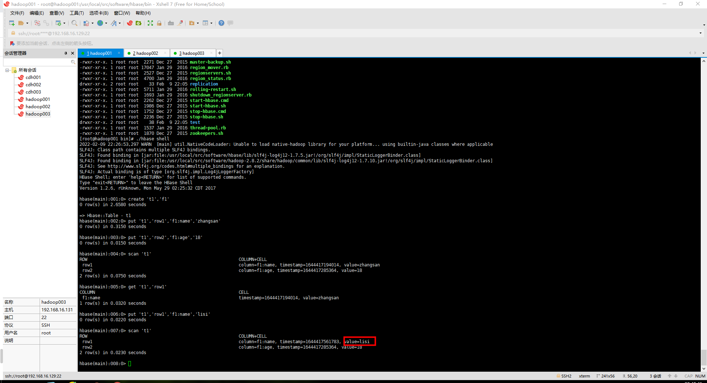

### hbase Shell 命令行

在启动HBase之后，我们可以通过执行以下命令启动HBase Shell：

`./hbase shell`


下面通过实际操作来介绍HBase Shell的使用。

1.  创建表

执行create 't1','f1'命令，将在HBase中创建一张表名为t1，列族名为f1的表，命令及返回信息如下：


创建表的时候需要指定表名与列族名，列名在添加数据的时候动态指定。

注意 在HBase Shell命令行模式下，若输入错误需要删除时，直接按【退格】键将不起作用，可以按【Ctrl+退格】键进行删除。

2. 添加数据

向表t1中添加一条数据，rowkey为row1，列name的值为zhangsan。命令如下：

`put 't1','row1','f1:name','zhangsan'`


再向表t1中添加一条数据，rowkey为row2，列age为18。命令如下：

`put 't1','row2','f1:age','18'`


3. 全表扫描

使用scan命令可以通过对表的扫描来获取表中所有数据。例如，扫描表t1，命令如下：

`scan 't1'`


可以看到，表t1中已经存在两条已添加的数据了。

4. 查询一行数据

使用get命令可以查询表中一整行数据。例如，查询表t1中rowkey为row1的一整行数据，命令如下：

`get 't1','row1'`


5. 修改表

修改表也同样使用put命令。例如，修改表t1中行键row1对应的name值，将zhangsan改为lisi，命令如下：

`put 't1','row1','f1:name','lisi'`


然后扫描表t1，此时row1中name的值已经变为了“lisi”：



6. 删除特定单元格

删除表中rowkey为row1的行的name单元格，命令如下：

`delete 't1','row1','f1:name'`


然后扫描表t1，发现rowkey为row1的行不存在了，因为row1只有一个name单元格，name被删除了，row1一整行数据也就不存在了。


7. 删除一整行数据

使用deleteall命令可以删除一整行数据。例如，删除rowkey为row2的一整行数据，命令如下：

`deleteall 't1','row2'`


8. 删除整张表

disable命令可以禁用表，使表无效。drop命令可以删除表。若需要完全删除一张表，需要先执行disable命令，再执行drop命令。如下：

`disable 't1'`

`drop 't1'`


如果只执行drop命令，将提示以下错误：ERROR: Table t1 is enabled. Disable it first.

9. 列出所有表

使用list命令，可以列出HBase数据库中的所有表：

`list`


从上述返回信息中可以看出，目前HBase中只有一张表t1。

10. 查询表中的记录数

使用count命令，可以查询表中的记录数。例如，查询表t1的记录数，命令如下：

`count 't1'`


11. 查询表是否存在

使用exists命令，查询表t1是否存在，命令如下：

`exists 't1'`


12. 批量执行命令

HBase还支持将多个Shell命令放入一个文件中，每行一个命令，然后读取文件中的命令，批量执行。例如，在HBase安装目录下新建一个文件sample_commands.txt，向其加入以下命令：

```
create 'test','cf'
list
put 'test', 'row1','cf:a', 'value1'
put 'test', 'row1','cf:b', 'value2'
put 'test', 'row1','cf:c', 'value3'
put 'test', 'row1','cf:d', 'value4'
scan 'test'
get 'test', 'row1'
disable 'test'
enable 'test'
```

然后在启动HBase Shell时，将该文件的路径作为一个参数传入。这样文本文件中的每一个命令都会被执行，且每个命令的执行结果会显示在控制台上，如下：

`./hbase shell ./test/sample_commands.txt`

