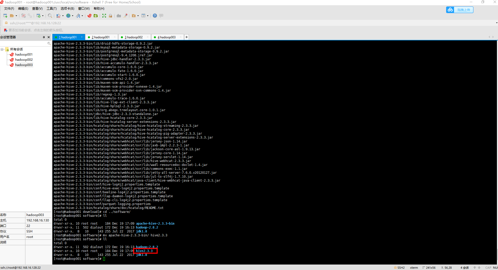
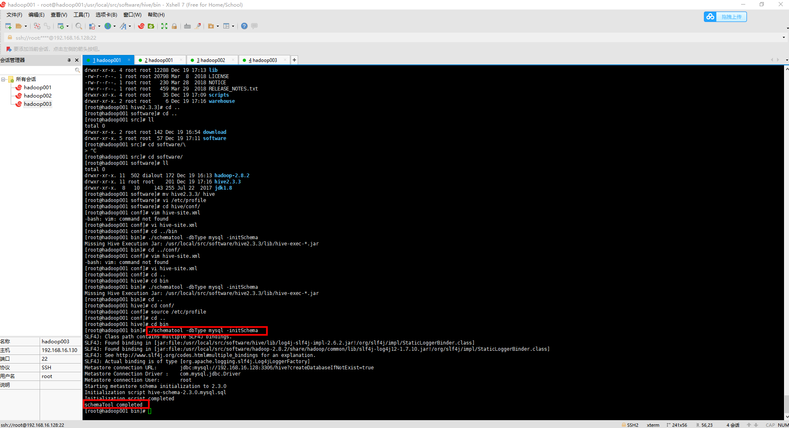
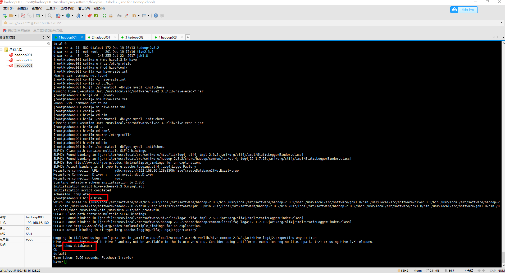

### 一、准备工作

[1、安装一台虚拟机](https://github.com/WuZongYun/bigdata_study/blob/main/%E5%A4%A7%E6%95%B0%E6%8D%AE%E5%9F%BA%E7%A1%80%E7%8E%AF%E5%A2%83%E6%90%AD%E5%BB%BA/1_%E5%AE%89%E8%A3%85%E8%99%9A%E6%8B%9F%E6%9C%BA.md)

[2、启动一台虚拟机，并连接至Xshell、Xftp](https://github.com/WuZongYun/bigdata_study/blob/main/%E5%A4%A7%E6%95%B0%E6%8D%AE%E5%9F%BA%E7%A1%80%E7%8E%AF%E5%A2%83%E6%90%AD%E5%BB%BA/2_%E5%AE%89%E8%A3%85MobaXterm.md)

[3、配置好免密登录](https://github.com/WuZongYun/bigdata_study/blob/main/%E5%A4%A7%E6%95%B0%E6%8D%AE%E5%9F%BA%E7%A1%80%E7%8E%AF%E5%A2%83%E6%90%AD%E5%BB%BA/3_centos7%E5%85%8D%E5%AF%86%E8%AE%BE%E7%BD%AE.md)

[4、安装、搭建好jdk](https://github.com/WuZongYun/bigdata_study/blob/main/%E5%A4%A7%E6%95%B0%E6%8D%AE%E5%9F%BA%E7%A1%80%E7%8E%AF%E5%A2%83%E6%90%AD%E5%BB%BA/4_centos7%E5%AE%89%E8%A3%85JDK.md)

[5、安装、搭建好Hadoop](https://github.com/WuZongYun/bigdata_study/blob/main/%E5%A4%A7%E6%95%B0%E6%8D%AE%E5%9F%BA%E7%A1%80%E7%8E%AF%E5%A2%83%E6%90%AD%E5%BB%BA/5_Centos7%E5%AE%89%E8%A3%85mysql.md)

[6、安装、搭建好mysql](https://github.com/WuZongYun/bigdata_study/blob/main/hadoop/2_hadoop%E5%AE%89%E8%A3%85.md)

7、建议在虚拟机里单独创建两个文件夹（download、software），用来存放安装包和软件

8、需要将 apache-hive-2.3.3-bin.tar.gz 和 mysql-connector-java-5.1.49.jar文件，上传至 download 目录。

hive 下载地址：https://pan.baidu.com/s/1vMMBCTCC908ld8VL2ZI1fg 请输入提取码 提取码：f2zx

mysql驱动包 下载地址：https://pan.baidu.com/s/1ENTZ41Mkz6k6MoKYpzOkjQ 请输入提取码 提取码：nxyv

### 二、安装步骤（集群版）

（一）解压（hadoop001）

1. 输入命令：`cd /usr/local/src/download、ls`，查看是否存在 apache-hive-2.3.3-bin.tar.gz 这个文件。

2. 输入命令：`tar -zxvf apache-hive-2.3.3-bin.tar.gz -C /usr/local/src/software/`，将文件解压到 software 文件夹里。

3. 解压完毕后，输入命令：`cd /usr/local/src/software/`，进入到 software输入命令：ls，查看该目录下是否存在 apache-hive-2.3.3-bin 这个文件。

4. 输入命令：

`mv apache-hive-2.3.3-bin/ hive`，将解压后的文件重命名为 hive。



（二）MySQL驱动管理

拷贝驱动文件

1.  输入命令：

`cp /usr/local/src/download/mysql-connector-java-5.1.49.jar /usr/local/src/software/hive/lib/`，将驱动拷贝一份至 lib 目录下，输入命令：`cd /usr/local/src/software/hive/lib/`，查找该文件。

提示：建议不要重复拷贝，如果想重新拷贝，建议把原来拷贝过来的相同名字的 jar 包 删除。

（三）Hive配置

1.  配置hive-site.xml

输入命令：`cd /usr/local/src/software/hive/conf、ls`，输入命令：`touch hive-site.xml`，输入命令：`vi hive-site.xml`，对文件进行配置。进到 hive-site.xml 文件里，将下方代码直接贴进去。上面新建的 warehouse 的路径在此处就可以用上了。

```
<?xml version="1.0" encoding="UTF-8" standalone="no"?>
<?xml-stylesheet type="text/xsl" href="configuration.xsl"?>
      <configuration>          
            <property>                  
                  <name>javax.jdo.option.ConnectionURL</name>                  
                  <value>jdbc:mysql://192.168.16.128:3306/hive?createDatabaseIfNotExist=true</value>
            </property>         
            <property>                  
                  <name>javax.jdo.option.ConnectionDriverName</name>                  
                  <value>com.mysql.jdbc.Driver</value>          
            </property>          
            <property>                  
                  <name>javax.jdo.option.ConnectionUserName</name>                  
                  <value>root</value>          
            </property>          
            <property>                  
                  <name>javax.jdo.option.ConnectionPassword</name>                  
                  <value>root</value>           
            </property>           
            <property>                  
                  <name>hive.metastore.warehouse.dir</name>                  
                  <value>/usr/local/src/software/hive/warehouse</value>           
            </property>
            <property>                  
                  <name>hive.metastore.local</name>                  
                  <value>false</value>           
            </property>           
            <property>                  
                  <name>hive.server2.authentication</name>                  
                  <value>NONE</value>           
            </property>           
            <property>                  
                  <name>hive.server2.thrift.client.user</name>                  
                  <value>root</value>           
            </property>           
            <property>                  
                  <name>hive.server2.thrift.client.password</name>                  
                  <value>root</value>           
            </property>
</configuration>
```

（四）环境配置

1.  输入命令：

`cd /usr/local/src/software/hive/`，进入到 hive目录下，输入命令：pwd，查询当前目录路径并复制

2. 输入命令：

`vi /etc/profile`，建议在之前配置过的地方添加下方代码。

```
#HIVE
export HIVE_HOME=/usr/local/src/software/hive
export PATH=$HIVE_HOME/bin:$PATH
```

3. 配置完成之后，保存并退出，输入命令：

`source /etc/profile`，重新载入配置文件

（五）初始化schemaTool

1.  输入命令：

`cd /usr/local/src/software/hive/bin/`，并查看（如下图）。输入命令：`./schematool -dbType mysql -initSchema`，如果出现 **schemaTool completed** ，则表明成功。



使用`hive`命令，进入hive客户端，使用`show databases;`命令，查看hive是否安装成功。



