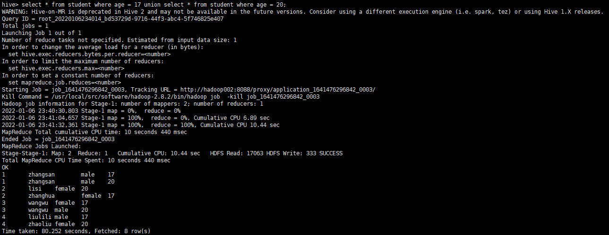
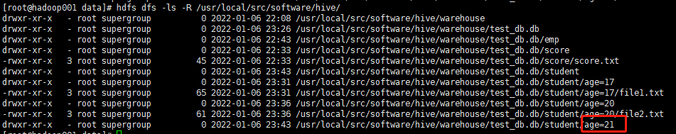
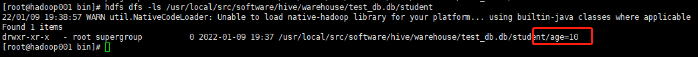

### 一、Hive 数据类型

原生类型：

TINYINT，SMALLINT，INT，BIGINT，BOOLEAN，FLOAT，DOUBLE，STRING，BINARY（Hive 0.8.0以上才可用），TIMESTAMP（Hive 0.8.0以上才可用）

复合类型：

Arrays：ARRAY<data type>

Maps:MAP<primitive_type ,data_type>

Structs:STRUCT<col_name:data_type [COMMENT col_comment],……>

Union:UNIONTYPE<data_type,data_type,……>

### 二、Hive自定义函数

Hive为我们提供了众多的内置函数，但是在实际的运用过程中仍然不能满足我们所有的需求.本身提供了使用java去开发UDF的方式.而这里我们采用python的方式去实现UDF函数.我们这里用python自定义函数，去实现一个方法，利用身份证号去判断性别(18位身份证的倒数第二位偶数为女，奇数为男.15位身份证的倒数第一位偶数为女,奇数为男.).其实这个需求可以使用hive自带的function去进行解决.我们接下来使用udf方式去实现这个需求.

#### 数据准备

我们在hive上创建一个external表(名字person表),执行如下代码：

```
create external table person(
name string,
idcard string)
ROW FORMAT DELIMITED 
FIELDS TERMINATED BY '\t'
STORED as TEXTFILE;
```

该表两个字段，一个为name，另一个为idcard
数据格式如下:

```
neil    411326199402110030
pony    41132519950911004x
jcak    12312423454556561
tony    412345671234908
```

field分隔符使用\t
我们将数据放入hive的warehouse中:

```
hdfs dfs -put person.txt /user/hive/warehouse/test_neil.db/person
```

执行select，我们发现数据已经进入到hive了.

#### UDF编写

如下是我们的udf代码：

```
# -*- coding: utf-8 -*-
import sys
 
for line in sys.stdin:
    detail = line.strip().split("\t")
    if len(detail) != 2:
        continue
    else:
        name = detail[0]
        idcard = detail[1]
        if len(idcard) == 15:
            if int(idcard[-1]) % 2 == 0:
                print("\t".join([name,idcard,"女"]))
            else:
                print("\t".join([name,idcard,"男"]))
        elif len(idcard) == 18:
            if int(idcard[-2]) % 2 == 0:
                print("\t".join([name,idcard,"女"]))
            else:
                print("\t".join([name,idcard,"男"]))
        else:
            print("\t".join([name,idcard,"身份信息不合法!"]))
```

这里我们使用python的重定向，将hive控制台的输出进行split，split默认使用的为\t.然后根据split后的idcard的倒数第二位进行判断这个人的性别.

#### 测试

我们在hive中去执行查询时，报错的提示不是很详细.我们可以使用cat指令去测试python脚本的执行效果. 我们在终端中执行如下指令:

```
cat person.txt|python person.py
```

输入结果如下：

```
neil    411325199308110030  男
pony    41132519950911004x  女
jack    12312423454556561   身份信息不合法!
tony    123124234545565 男
```

说明我们的解析是成功的.

#### 使用

我们在hive中使用python定义的UDF函数要借助transform函数去执行.
transform函数的语法如下:

```
SELECT TRANSFORM (<columns>)
USING 'python <python_script>'
AS (<columns>)
FROM <table>;
```

transfrom和as的columns的个数不必一致. 我们首先需要将我们的person.py加载入，我们在hive中去执行如下代码:

```
add file /xxx/person.py
```

xxx为本地文件的路径.
然后使用transform函数执行:

```
select transform(name,idcard) USING 'python person.py'  AS (name,idcard,gender) from person;
```

### 三、表操作语句

Hive的表由实际存储的数据和元数据组成。实际数据一般存储于HDFS中，元数据一般存储于关系型数据库中。

Hive中创建表的语法如下：

```
CREATE TABLE：创建表，后面跟上指定的表名。
TEMPORARY：声明临时表。
EXTERNAL：声明外部表。
IF NOT EXISTS：如果存在表则忽略本次操作，且不抛出异常。
COMMENT：为表和列添加注释。
PARTITIONED BY：创建分区。
CLUSTERED BY：创建分桶。
SKEWED BY ON：将特定字段的特定值标记为倾斜数据。
ROW FORMAT：自定义SerDe（Serializer/Deserializer的简称，序列化／反序列化）格式或使用默认的SerDe格式。若不指定或设置为DELIMITED将使用默认SerDe格式。在指定表的列的同时也可以指定自定义的SerDe。
STORED AS：数据文件存储格式。Hive支持内置和定制开发的文件格式，常用内置的文件格式有：TEXTFILE（文本文件，默认为此格式）、SEQUENCEFILE（压缩序列文件）、ORC（ORC文件）、AVRO（Avro文件）、JSONFILE（JSON文件）。
STORED BY：用户自己指定的非原生数据格式。
WITH SERDEPROPERTIES：设置SerDe的属性。
LOCATION：指定表在HDFS上的存储位置。
TBLPROPERTIES：自定义表的属性。
```

**需要注意的是，在创建表时，若要指定表所在的数据库有两种方法：第一，在创建表之前使用USE命令指定当前使用的数据库；第二，在表名前添加数据库声明，例如database_name.table_name。**

### 四、Hive内、外部表

#### 内部表

Hive中默认创建的普通表被称为管理表或内部表。内部表的数据由Hive进行管理，默认存储于数据仓库目录/user/hive/warehouse中，可在Hive配置文件hive-site.xml中对数据仓库目录进行更改（配置属性hive.metastore.warehouse.dir）。

删除内部表时，表数据和元数据将一起被删除。

服务器任意目录输入hive命令，进入hive客户端。

1.  创建表

执行以下命令，创建数据库test_db：

```
create database test_db;
```

执行以下命令，使用数据库test_db：

```
use test_db;
```

执行以下命令，创建表student，其中字段id为整型，字段name为字符串：

```
create table student(id INT,name STRING);
```

然后查看数据仓库目录生成的文件，可以看到，在数据仓库目录中的test_db.db文件夹下生成了一个名为student的文件夹，该文件夹正是表“student”的数据存储目录


2. 查看表结构

执行以下命令，查看新创建的表student的表结构：

```
desc student;
```


执行以下命令，将显示详细表结构，包括表的类型以及在数据仓库的位置等信息：

```
desc formatted student;
```


3. 向表中插入数据

执行以下命令，向表student中插入一条数据，命令及输出信息如下：

```
insert into student values(1000,'xiaoming');
```


从上述输出信息可以看出，Hive将insert插入语句转成了MapReduce任务执行。

查看数据仓库目录生成的文件，可以看到，在数据仓库目录中的表“student”对应的文件夹下生成了一个名为000000_0的文件


然后执行以下命令，查看文件000000_0中的内容：


从输出信息可以看到，文件000000_0中以文本的形式存储着表“student”的一条数据。

4. 查询表中数据

执行以下命令，查询表student中的所有数据：


5. 将本地文件导入Hive

我们可以将本地文件的数据直接导入到Hive表中，但是本地文件中数据的格式需要在创建表的时候指定。

（1）新建学生成绩表score，其中学号sno为整型，姓名name为字符串，得分score为整型，并指定以Tab键作为字段分隔符：

```
 create table score(sno int,name string,score int) row format delimited fields terminated by '\t';
```


（2）在本地目录/usr/local/src/data中新建score.txt文件，并写入以下内容，列之间用Tab键隔开：


（3）执行以下命令，将score.txt中的数据导入到表score中：

```
load data local inpath '/usr/local/src/data/score.txt' into table score;
```


（4）查询表score的所有数据：


可以看到，score.txt中的数据已成功导入表“score”。

（5）查看HDFS数据仓库中对应的数据文件，可以看到，score.txt已被上传到了文件夹score中


执行以下命令，查看score.txt的内容：


6. 删除表

执行以下命令，删除test_db数据库中的学生表student：

```
drop table if exists test_db.student;
```


此时查看数据仓库目录中的student表数据，发现目录student已被删除


**注意:Hive LOAD语句只是将数据复制或移动到数据仓库中Hive表对应的位置，不会在加载数据的时候做任何转换工作。因此，如果手动将数据复制到表的相应位置与执行LOAD加载操作所产生的效果是一样的。**

#### 外部表

除了默认的内部表以外，Hive也可以使用关键字“EXTERNAL”创建外部表。外部表的数据可以存储于数据仓库以外的位置，因此Hive并非认为其完全拥有这份数据。

外部表在创建的时候可以关联HDFS中已经存在的数据，也可以手动添加数据。删除外部表不会删除表数据，但是元数据将被删除。

（1）创建外部表时，如果不指定LOCATION关键字，则默认将表创建于数据仓库目录中。

例如，执行以下命令，在数据库test_db中创建外部表emp：

```
create external table test_db.emp(id int,name string);
```


然后查看数据仓库目录中的文件，发现生成了一个文件夹emp，表emp的数据将存储于该目录。


（2）创建外部表时，如果指定LOCATION关键字，则将表创建于指定的HDFS位置。

例如，执行以下命令，在数据库test_db中创建外部表emp2，并指定在HDFS中的存储目为/input/hive，表字段分隔符为Tab键：

```
 create external table test_db.emp2(id int,name string) row format delimited fields terminated by '\t' location '/input/hive';
```


然后在本地目录/usr/local/src/data/下创建文件emp.txt，并将该文件导入表emp2。emp.txt的内容如下（字段之间以Tab键隔开）：


导入命令如下：

```
load data local '/usr/local/src/data/emp.txt' into table test_db.emp2;
```


导入成功后，查看HDFS目录/input/hive中生成的文件，发现emp.txt已导入到该目录


查看导入的emp.txt的文件内容，如下：


查看表emp2的数据，如下：


（3）删除外部表时，不会删除实际数据，但元数据会被删除。

例如，执行以下命令，删除在目录/input/hive中创建的表emp2：


然后查看HDFS目录/input/hive中的数据，发现数据仍然存在，如图9-20所示。


（4）创建外部表时，使用LOCATION关键字，可以将表与HDFS中已经存在的数据相关联。

例如，执行以下命令，在数据库test_db中创建外部表emp3，并指定表数据所在的HDFS中的存储目录为/input/hive（该目录已经存在数据文件emp.txt）,location 指定到文件夹即可：

```
create external table test_db.emp3(id int,name string)row format delimited fields terminated by '\t' location 'input/hive';
```


然后执行以下命令，查询表emp3的所有数据，发现该表已与数据文件emp.txt相关联：


**注意：在实际开发中，外部表一般创建于数据仓库路径之外，因此创建外部表时常常指定LOCATION关键字。在多数情况下，内部表与外部表没有太大的区别（删除表除外）。一般来说，如果所有数据处理都由Hive完成，则应该使用内部表；如果同一个数据集既要用Hive处理又要用其他工具处理，则应该使用外部表。**

### 五、Hive分区表

Hive可以使用关键字PARTITIONED BY对一张表进行分区操作。可以根据某一列的值将表分为多个分区，每一个分区对应数据仓库中的一个目录（相当于根据列的值将表数据进行分目录存储）。当查询数据的时候，根据WHERE条件Hive只查询指定的分区而不需要全表扫描，从而可以加快数据的查询速度。在HDFS文件系统中，分区实际上只是在表目录下嵌套的子目录。

Hive中的分区好比关系型数据库中的索引。例如，有一张数据量非常大的学生表“student”，现需要查询年龄age等于18的所有数据。在关系型数据库中，需要对年龄age列建立索引，当查询时，数据库会先从索引列中找到匹配的数据，然后再根据匹配数据查询一整行数据。如果不建立索引则将先扫描每一行数据，然后取出该行数据的字段age进行对比。在Hive中，创建表的时候可以将列age设置为分区列，然后向表“student”添加或导入数据时，需要指定分区值（即数据所属的分区），例如设置分区值为age=18，则会在表目录下生成一个名为age=18的子目录，年龄等于18的所有数据应当存储于该目录下。当查询age=18时，只查询指定的分区即可。

此外，Hive还支持在创建表时同时指定多个分区列。例如，将“student”表的年龄列age和性别列gender同时指定为分区列，命令如下：

```
create table test_db.student(id int,name string) partitioned by (age int,gender string) row format delimited fields terminated by '\t';
```


下面通过实际操作对分区表进行详细讲解：

（1）创建分区表。

在数据库test_db中创建分区表“student”，表“student”包含四列：id（学号）、name（姓名）、age（年龄）和gender（性别），将年龄age作为分区列。命令如下：

```
 create table test_db.student(id int,name string,gender string) partitioned by (age int) row format delimited fields terminated by '\t';
```

**需要注意的是，创建表时指定的表的列中不应该包含分区列，分区列需要使用关键字PARTITIONED BY在后面单独指定。Hive将把分区列排在普通列之后。**

（2）导入数据。

在本地目录/usr/local/src/data/中创建数据文件file1.txt，并写入以下数据（**注意，列之间用Tab键隔开**）：


然后将数据文件file1.txt导入表“student”中，同时指定分区值age=17，命令如下：

```
 load data local inpath '/usr/local/src/data/file1.txt' into table test_db.student partition(age=17);
```


**注意：①数据文件中列的顺序必须与创建表时指定的顺序一致，且不需要写入分区列age的数据，Hive会自动将分区列放入最后一列。②导入数据时必须指定分区值。如果数据文件file1.txt中存在第四列，无论第四列的值是多少，Hive会自动将第四列替换为分区列，且值为指定的分区值，本例为17。**

导入成功后，查看HDFS数据仓库中表“student”目录中的文件，发现生成了一个名为“age=17”的文件夹，且文件file1.txt也导入到了该文件夹中


同理，将年龄为20的学生数据放入文件file2.txt，然后导入到表“student”中。导入命令如下：


```
load data local inpath '/usr/local/src/data/file2.txt' into table test_db.student partition(age=20);
```


导入成功后，查看HDFS数据仓库中表“student”目录中的文件，发现又生成了一个名为“age=20”的文件夹，该文件夹则为表“student”的另一个分区


（3）查询分区表数据。

可以在SELECT语句中按常用的方式使用分区列，Hive将根据查询条件只扫描相关的分区。如下：


执行上述查询命令后，Hive将不会扫描分区“age=20”中的文件。上述查询结果中的分区列的值是从分区目录名中读取的，因为分区列在数据文件中并不存在。

也可以使用UNION关键字将多个分区联合查询，命令如下：

```
select * from student where age = 17 union select * from student where age = 20;
```


（4）增加分区。

使用修改表关键字ALTER可以为现有分区列增加一个分区目录。例如，在表“student”中增加一个分区age=21，命令如下：

```
alter table student add partition(age = 21);
```


执行成功后，查看HDFS数据仓库中表“student”目录中的文件，发现生成了一个名为“age=21”的文件夹



若需要同时增加多个分区，命令如下：

```
alter table student add partition(age = 21) partition(age = 22);
```
**需要注意的是，以上命令只是为现有的分区列增加一个或多个分区目录，并不是增加其他的分区列**

（5）删除分区。

删除分区将删除分区目录及目录下的所有数据文件。例如，删除分区age=21，命令如下：

```
alter table student drop partition(age = 21);
```


同时删除多个分区，命令如下：

```
alter table student drop partition(age = 21) ,partition(age = 22);
```

（6）查看分区。

```
show partitions test_db.student;
```


7. 查看分区表结构

```
desc formatted test_db.student;
```


（二）多级分区

1. 创建二级分区表（还可以创建多级分区）

```
create table A2 (
	deptno int,
	dname string,
	loc string
)
partitioned by (month string, day string)
row format delimited fields terminated by '\t';
```

2. 加载数据到二级分区表中

```
load data local inpath 'PATH' into table A2 partition(month='201909', day='13');
```

3. 查询分区表数据

```
select * from A2 where month='201909' and day='13';
```

（三）动态分区

1. 当使用静态分区时，在想分区表中插入数据时，我们要指定具体分区列的值，而在动态分区中插入数据时，只要指定分区字段，不用指定具体的分区列值。

2. 动态分区在Hive 2.3.4版本前都是禁用的，所以要将set hive.exec.dynamic.partition=true。以及将分区模式设置为非严格模式 set hive.exec.dynamic.partition.mode=nonstrict;


```
insert into  table student partition(age) values(1001,'zhangsan',10);
```


执行成功后，查看HDFS数据仓库中表“student”目录中的文件，发现生成了一个名为“age=10”的文件夹



（四）Hive动态、静态分区的异同

1. 建表方式一致

2. 分区和模式不同

（1）静态分区表动态分区关闭且模式严格，通常默认是静态分区。
（2）动态分区表需要开启动态分区却设置模式非严格。

```
set hive.exec.dynamic.partition=true			默认为false
set hive.exec.dynamic.partition.mode=nonstrict	默认为strict
```

3.载入数据方式不同

（1）静态分区只能通过load方式一次一个分区装载数据。

```
alter table TABLE_NAME add [if not exists] partition(FIELD='VALUE'...) location 'PATH';	
load data [local] inpath 'DATA_FILE PATH' [overwrite] into table TABLE_NAME partition(FIELD='VALUE'...)
```

（2）动态分区可以通过二级转换方式一次性添加多个分区数据。

```
create table TABLE_NAME ...
load ... into TEST_TABLE
insert into table PARTITION_TABLE partition(PARTITION_FIELDS ...) select ... from TEST_TABLE
```

### 六、Hive分桶表

（一）了解

1. 分桶常作为一种优化的手段、一种补充技术。

2. 可以将 Hive 中的分桶原理理解成 MapReduce 中的 HashPartitioner 的原理，都是基于 hash 值对数据进行分桶。

（二）设置

1. MR：按照key的hash值除以reduceTask个数进行取余(reduce_id =key.hashcode % reduce.num)。

2. Hive：按照分桶字段(列)的hash值，除以分桶的个数进行取余(bucket_id=column.hashcode % bucket.num)。

3. 设置 Hive 的分桶开关

4. 打开 Hive 客户端，并在会话终端开启 Hive 分桶的开关：

```
set hive.enforce.bucketing=true;
(此设置为临时设置，一旦退出会话终端，再打开就会恢复默认设置 false)
```


5.此开关打开之后，会自动根据 bucket个数自动分配Reduce task的个数，Reduce个数与bucket个数一致。( 此外， Reduce的个数还可以通过mapred.reduce.tasks进行设置，但是这方法不推荐在Hive分桶中使用)

（三）操作

1. 建表

```
#建表语句
create table student_bucket(id int,name string,age int)clustered by(age) into 4 buckets row format delimited fields terminated by '\t';
```


**注意：分桶字段只能是建表中已有的字段，而分区表的字段必须是建表中没有的字段**

2. 向分桶表中插入数据

```
insert into table student_bucket values(1002,'lisi',65);
```


可以看出reduce和分桶表的分桶数一致。

3. 查看分桶是否成功

如果分桶成功，因为我们建的是内部表，所以在Hive的数据仓库位置下找到A文件夹，在该文件夹下应该有4个文件（一个bucket代表着一个文件）。


4. 向分桶表导入数据

在本地目录/usr/local/src/data下创建数据文件student_bucket.txt，写入以下数据（列之间以Tab键分隔）：


执行以下命令，将数据文件student_bucket.txt导入表“student_bucket”：发现报如下错误：


根据上述错误信息可以得知，Hive默认不支持通过LOAD命令导入数据到分桶表（在Hive旧版本中默认可以使用LOAD命令导入，但仅仅是将数据复制或移动到表目录下，并不会平均分配到各个桶中），代替的是先将数据导入一张中间表（可以是普通表，也可以是临时表）中，然后通过“INSERT... SELECT”的方式，将普通表的数据导入到分桶表。

5. 创建中间表。

执行以下命令，创建一张中间表“student_bucket_tmp”：

```
create table student_bucket_tmp(id int,name string,age int)row format delimited fields terminated by '\t';
```

向中间表导入数据。

```
load data local inpath '/usr/local/src/data/student_bucket.txt' into table student_bucket_tmp;
```

6. 将中间表的数据导入到分桶表。

执行以下命令，将中间表“student_bucket_tmp”中的数据导入到分桶表“student_bucket”中：

```
insert into table student_bucket select id,name.age from student_bucket_tmp;
```

7. 查看桶数据对应的HDFS数据仓库文件。分别查看以上生成的6个文件中的数据


（四）分桶表数据抽样

当需要做某一方面的调查或分析时，往往需要从大量数据集中抽取出具有代表性的数据作为调查样本，而不是查询全部数据。这时可以使用Hive对分桶表进行抽样查询，在每个桶或部分桶中只抽取部分数据。

使用抽样查询需要用到语法TABLESAMPLE(BUCKET x OUT OF y)，其中y必须是表分桶数的倍数或者因子，Hive会根据y的大小，决定抽样的比例。例如，表总共分了4个桶，当y=2时，则抽取2(4/2=2)个桶的数据；当y=8时，则抽取1/2(4/8=1/2)个桶的数据。

x表示从第几个桶开始抽取，同时y也是抽取的下一个桶与上一个桶的编号间隔数。例如，表分桶数为4，TABLESAMPLE(BUCKET 1 OUT OF 2)表示总共抽取2(4/2=2)个桶的数据，分别为第1个和第3(1+2=3)个桶。

以前面创建的分桶表“student_bucket”为例，对其进行抽样查询，查询命令及结果如下：


```
select * from student_bucket tablesample(bucket 1 out of 2);
```


我们已经知道，表“student_bucket ”的分桶个数为4，则上述命令中抽取的桶的个数为2（4/2=2），抽取的桶分别为第1个、第3（1+2=3）个。

**注意分桶语法中x的值必须小于等于y的值，否则会抛出以下异常：FAILED: SemanticException [Error 10061]: Numerator should not be biggerthan denominator in sample clause for table user_info**

### 七、数据倾斜

（一）什么是数据热点

由于数据分布不均匀，造成数据大量的集中到一点，造成数据热点。

（二）Hadoop 框架的特性

1. 不怕数据大，怕的是数据倾斜

2. Jobs 数较多的作业运行效率相对比较低，如子查询比较多

3. sum、count、max、min 等聚合函数，通常会有数据倾斜问题

（三）主要表现

任务进度长时间维持在 99% 或者 100% 附近，查看任务监控界面，发现只有少量的 reduce 子任务未完成，因为其处理的数据量和其他的 reduce 差异过大。单一 reduce 处理的记录数和平均记录数相差不大。

（四）容易数据倾斜情况

* group by 不和聚合函数搭配的时候也容易出现数据倾斜
* count(distinct)，在数据量大的情况下，容易数据倾斜，因为 count(distinct) 是按 group by 字段分组，按 distinct 字段排序
* 小表关联超大表 join

（五）产生数据倾斜的原因

* key 分布不均匀
* 业务数据本身的特性
* 建表考虑不周全
* 某些 HQL 语句本身就存在数据倾斜

（六）业务场景

1. 空值产生的数据倾斜

场景说明

在日志中，常会有信息丢失的问题，比如日志中的 user_id，如果取其中的 user_id 和用户表中的 user_id 相关联，就会碰到数据倾斜的问题。

解决方案

（1）user_id 为空的不参与关联
（2）赋予空值新的key值

总结

方法 2 比方法 1 效率更好，不但 IO 少了，而且作业数也少了，方案 1 中，log 表 读了两次，jobs 肯定是 2，而方案 2 是 1。这个优化适合无效 id（比如-99，’’，null）产生的数据倾斜，把空值的 key 变成一个字符串加上一个随机数，就能把造成数据倾斜的 数据分到不同的 reduce 上解决数据倾斜的问题。
改变之处：使本身为 null 的所有记录不会拥挤在同一个 reduceTask 了，会由于有替代的 随机字符串值，而分散到了多个 reduceTask 中了，由于 null 值关联不上，处理后并不影响最终结果。

2. 不同数据类型关联产生数据倾斜

场景说明

用户表中 user_id 字段为 int，log 表中 user_id 为既有 string 也有 int 的类型， 当按照两个表的 user_id 进行 join 操作的时候，默认的 hash 操作会按照 int 类型的 id 进 行分配，这样就会导致所有的 string 类型的 id 就被分到同一个 reducer 当中

解决方案

把数字类型 id 转换成 string 类型的 id

3. 大小表关联查询产生数据倾斜

注意：使用map join解决小表关联大表造成的数据倾斜问题。这个方法使用的频率很高。

map join 概念： 将其中做连接的小表（全量数据）分发到所有 MapTask 端进行 Join，从 而避免了 reduceTask，前提要求是内存足以装下该全量数据


以大表 a 和小表 b 为例，所有的 maptask 节点都装载小表 b 的所有数据，然后大表 a 的 一个数据块数据比如说是 a1 去跟 b 全量数据做链接，就省去了 reduce 做汇总的过程。 所以相对来说，在内存允许的条件下使用 map join 比直接使用 MapReduce 效率还高些， 当然这只限于做 join 查询的时候。

在 hive 中，直接提供了能够在 HQL 语句指定该次查询使用 map join，map join 的用法是 在查询/子查询的SELECT关键字后面添加/*+ MAPJOIN(tablelist) */提示优化器转化为map join（早期的 Hive 版本的优化器是不能自动优化 map join 的）。其中 tablelist 可以是一个 表，或以逗号连接的表的列表。tablelist 中的表将会读入内存，通常应该是将小表写在 这里。

在 hive0.11 版本以后会自动开启 map join 优化，由两个参数控制：

set hive.auto.convert.join=true; //设置 MapJoin 优化自动开启

set hive.mapjoin.smalltable.filesize=25000000 //设置小表不超过多大时开启 mapjoin 优化