### Hive 窗口函数

窗口函数最重要的关键字是 partition by 和 order by

具体语法如下：XXX over (partition by xxx order by xxx)

特别注意：over()里面的 partition by 和 order by 都不是必选的，over()里面可以只有partition by，也可以只有order by，也可以两个都没有，大家需根据需求灵活运用。

窗口函数我划分了几个大类，我们一类一类的讲解。

1. SUM、AVG、MIN、MAX
   讲解这几个窗口函数前，先创建一个表，以实际例子讲解大家更容易理解。

首先创建用户访问页面表：user_pv

```
create table user_pv(
cookieid string,  -- 用户登录的cookie，即用户标识
createtime string, -- 日期
pv int -- 页面访问量
); 
```

给上面这个表加上如下数据：

```
cookie1,2021-05-10,1
cookie1,2021-05-11,5
cookie1,2021-05-12,7
cookie1,2021-05-13,3
cookie1,2021-05-14,2
cookie1,2021-05-15,4
cookie1,2021-05-16,4
```

**SUM()使用**

执行如下查询语句：

```
select cookieid,createtime,pv,
sum(pv) over(partition by cookieid order by createtime) as pv1 
from user_pv;
```

结果如下：（因命令行原因，下图字段名和值是错位的，请注意辨别！）


执行如下查询语句：

```
select cookieid,createtime,pv,
sum(pv) over(partition by cookieid ) as pv1 
from user_pv;
```

结果如下：

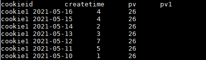

第一条SQL的over()里面加 order by ，第二条SQL没加order by ，结果差别很大

所以要注意了：

**over()里面加 order by 表示**：分组内从起点到当前行的pv累积，如，11号的pv1=10号的pv+11号的pv, 12号=10号+11号+12号；

**over()里面不加 order by 表示**：将分组内所有值累加。

AVG，MIN，MAX，和SUM用法一样，这里就不展开讲了，但是要注意 AVG，MIN，MAX 的over()里面加不加 order by 也和SUM一样，如 AVG 求平均值，如果加上 order by，表示分组内从起点到当前行的平局值，不是全部的平局值。MIN，MAX 同理。

2. ROW_NUMBER、RANK、DENSE_RANK、NTILE

还是用上述的用户登录日志表：user_pv，里面的数据换成如下所示：

```
cookie1,2021-05-10,1
cookie1,2021-05-11,5
cookie1,2021-05-12,7
cookie1,2021-05-13,3
cookie1,2021-05-14,2
cookie1,2021-05-15,4
cookie1,2021-05-16,4
cookie2,2021-05-10,2
cookie2,2021-05-11,3
cookie2,2021-05-12,5
cookie2,2021-05-13,6
cookie2,2021-05-14,3
cookie2,2021-05-15,9
cookie2,2021-05-16,7
```

**ROW_NUMBER()使用：**

ROW_NUMBER()从1开始，按照顺序，生成分组内记录的序列。

```
SELECT 
cookieid,
createtime,
pv,
ROW_NUMBER() OVER(PARTITION BY cookieid ORDER BY pv desc) AS rn 
FROM user_pv;
```

结果如下：

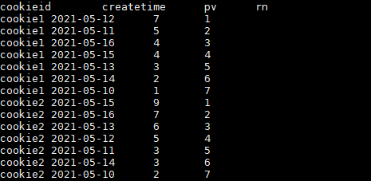

**RANK 和 DENSE_RANK 使用：**

RANK() 生成数据项在分组中的排名，排名相等会在名次中留下空位。

DENSE_RANK()生成数据项在分组中的排名，排名相等会在名次中不会留下空位。

```
SELECT 
cookieid,
createtime,
pv,
RANK() OVER(PARTITION BY cookieid ORDER BY pv desc) AS rn1,
DENSE_RANK() OVER(PARTITION BY cookieid ORDER BY pv desc) AS rn2,
ROW_NUMBER() OVER(PARTITION BY cookieid ORDER BY pv DESC) AS rn3 
FROM user_pv 
WHERE cookieid = 'cookie1';
```

结果如下

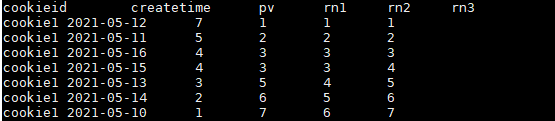

**NTILE的使用：**

有时会有这样的需求:如果数据排序后分为三部分，业务人员只关心其中的一部分，如何将这中间的三分之一数据拿出来呢?NTILE函数即可以满足。

ntile可以看成是：把有序的数据集合平均分配到指定的数量（num）个桶中, 将桶号分配给每一行。如果不能平均分配，则优先分配较小编号的桶，并且各个桶中能放的行数最多相差1。

然后可以根据桶号，选取前或后 n分之几的数据。数据会完整展示出来，只是给相应的数据打标签；具体要取几分之几的数据，需要再嵌套一层根据标签取出。

```
SELECT 
cookieid,
createtime,
pv,
NTILE(2) OVER(PARTITION BY cookieid ORDER BY createtime) AS rn1,
NTILE(3) OVER(PARTITION BY cookieid ORDER BY createtime) AS rn2,
NTILE(4) OVER(ORDER BY createtime) AS rn3
FROM user_pv 
ORDER BY cookieid,createtime;
```

结果如下：

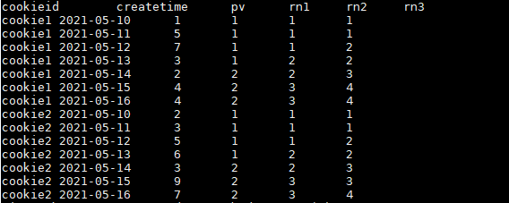

3. LAG、LEAD、FIRST_VALUE、LAST_VALUE

讲解这几个窗口函数时还是以实例讲解，首先创建用户访问页面表：user_url


```
CREATE TABLE user_url (
cookieid string,
createtime string,  --页面访问时间
url string       --被访问页面
);
```

表中加入如下数据：

```
cookie1,2021-06-10 10:00:02,url2
cookie1,2021-06-10 10:00:00,url1
cookie1,2021-06-10 10:03:04,1url3
cookie1,2021-06-10 10:50:05,url6
cookie1,2021-06-10 11:00:00,url7
cookie1,2021-06-10 10:10:00,url4
cookie1,2021-06-10 10:50:01,url5
cookie2,2021-06-10 10:00:02,url22
cookie2,2021-06-10 10:00:00,url11
cookie2,2021-06-10 10:03:04,1url33
cookie2,2021-06-10 10:50:05,url66
cookie2,2021-06-10 11:00:00,url77
cookie2,2021-06-10 10:10:00,url44
cookie2,2021-06-10 10:50:01,url55
```

**LAG的使用：**

LAG(col,n,DEFAULT) 用于统计窗口内往上第n行值。

第一个参数为列名，第二个参数为往上第n行（可选，默认为1），第三个参数为默认值（当往上第n行为NULL时候，取默认值，如不指定，则为NULL）

```
SELECT cookieid,
createtime,
url,
ROW_NUMBER() OVER(PARTITION BY cookieid ORDER BY createtime) AS rn,
LAG(createtime,1,'1970-01-01 00:00:00') OVER(PARTITION BY cookieid ORDER BY createtime) AS last_1_time,
LAG(createtime,2) OVER(PARTITION BY cookieid ORDER BY createtime) AS last_2_time 
FROM user_url;
```

结果如下：

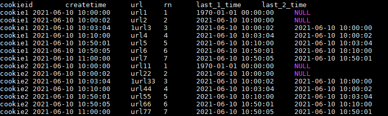

解释：

```
last_1_time: 指定了往上第1行的值，default为'1970-01-01 00:00:00'  
                 cookie1第一行，往上1行为NULL,因此取默认值 1970-01-01 00:00:00
                 cookie1第三行，往上1行值为第二行值，2021-06-10 10:00:02
                 cookie1第六行，往上1行值为第五行值，2021-06-10 10:50:01
last_2_time: 指定了往上第2行的值，为指定默认值
       cookie1第一行，往上2行为NULL
       cookie1第二行，往上2行为NULL
       cookie1第四行，往上2行为第二行值，2021-06-10 10:00:02
       cookie1第七行，往上2行为第五行值，2021-06-10 10:50:01
```

**LEAD的使用：**

与LAG相反

LEAD(col,n,DEFAULT) 用于统计窗口内往下第n行值。

第一个参数为列名，第二个参数为往下第n行（可选，默认为1），第三个参数为默认值（当往下第n行为NULL时候，取默认值，如不指定，则为NULL）

```
SELECT cookieid,
createtime,
url,
ROW_NUMBER() OVER(PARTITION BY cookieid ORDER BY createtime) AS rn,
LEAD(createtime,1,'1970-01-01 00:00:00') OVER(PARTITION BY cookieid ORDER BY createtime) AS next_1_time,
LEAD(createtime,2) OVER(PARTITION BY cookieid ORDER BY createtime) AS next_2_time 
FROM user_url;
```

结果如下：

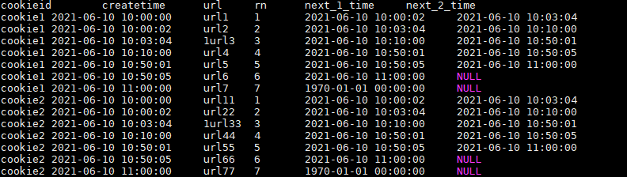

**FIRST_VALUE的使用：**

取分组内排序后，截止到当前行，第一个值。

```
SELECT cookieid,
createtime,
url,
ROW_NUMBER() OVER(PARTITION BY cookieid ORDER BY createtime) AS rn,
FIRST_VALUE(url) OVER(PARTITION BY cookieid ORDER BY createtime) AS first1 
FROM user_url;
```

结果如下：

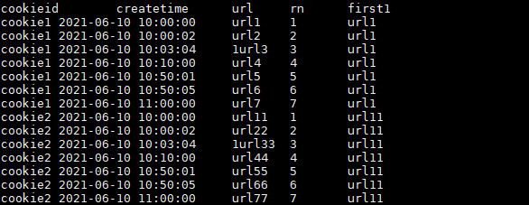

**LAST_VALUE的使用**：

取分组内排序后，截止到当前行，最后一个值。

```
SELECT cookieid,
createtime,
url,
ROW_NUMBER() OVER(PARTITION BY cookieid ORDER BY createtime) AS rn,
LAST_VALUE(url) OVER(PARTITION BY cookieid ORDER BY createtime) AS last1 
FROM user_url;
```

结果如下：

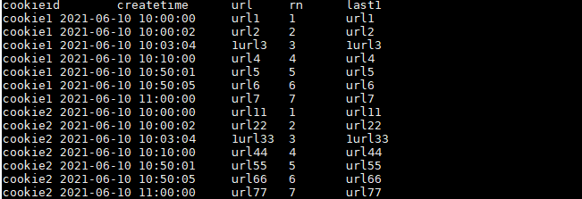

如果想要取分组内排序后最后一个值，则需要变通一下：

```
SELECT cookieid,
createtime,
url,
ROW_NUMBER() OVER(PARTITION BY cookieid ORDER BY createtime) AS rn,
LAST_VALUE(url) OVER(PARTITION BY cookieid ORDER BY createtime) AS last1,
FIRST_VALUE(url) OVER(PARTITION BY cookieid ORDER BY createtime DESC) AS last2 
FROM user_url 
ORDER BY cookieid,createtime;
```

注意上述SQL，使用的是 FIRST_VALUE 的倒序取出分组内排序最后一个值！

结果如下：

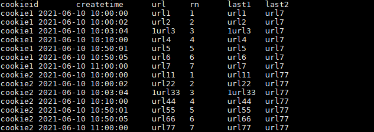

**此处要特别注意order  by**

如果不指定ORDER BY，则进行排序混乱，会出现错误的结果

```
SELECT cookieid,
createtime,
url,
FIRST_VALUE(url) OVER(PARTITION BY cookieid) AS first2  
FROM user_url;
```

结果如下：

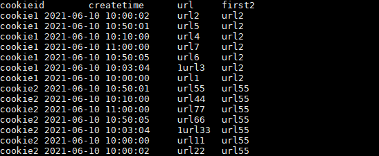

上述 url2 和 url55 的createtime即不属于最靠前的时间也不属于最靠后的时间，所以结果是混乱的。

4. CUME_DIST

先创建一张员工薪水表：staff_salary

```
CREATE EXTERNAL TABLE staff_salary (
dept string,
userid string,
sal int
);
```

表中加入如下数据：

```
d1,user1,1000
d1,user2,2000
d1,user3,3000
d2,user4,4000
d2,user5,5000
```

**CUME_DIST的使用：**

此函数的结果和order by的排序顺序有关系。

CUME_DIST：小于等于当前值的行数/分组内总行数。  order默认顺序 ：正序

比如，统计小于等于当前薪水的人数，所占总人数的比例。

```
SELECT 
dept,
userid,
sal,
CUME_DIST() OVER(ORDER BY sal) AS rn1,
CUME_DIST() OVER(PARTITION BY dept ORDER BY sal) AS rn2 
FROM staff_salary;
```

结果如下：

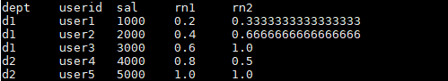

解释：

```
rn1: 没有partition,所有数据均为1组，总行数为5，
     第一行：小于等于1000的行数为1，因此，1/5=0.2
     第三行：小于等于3000的行数为3，因此，3/5=0.6
rn2: 按照部门分组，dpet=d1的行数为3,
     第二行：小于等于2000的行数为2，因此，2/3=0.6666666666666666
```

5. GROUPING SETS、GROUPING__ID、CUBE、ROLLUP

这几个分析函数通常用于OLAP中，不能累加，而且需要根据不同维度上钻和下钻的指标统计，比如，分小时、天、月的UV数。

还是先创建一个用户访问表：user_date

```
CREATE TABLE user_date (
month STRING,
day STRING, 
cookieid STRING 
);
```

表中加入如下数据：

```
2021-03,2021-03-10,cookie1
2021-03,2021-03-10,cookie5
2021-03,2021-03-12,cookie7
2021-04,2021-04-12,cookie3
2021-04,2021-04-13,cookie2
2021-04,2021-04-13,cookie4
2021-04,2021-04-16,cookie4
2021-03,2021-03-10,cookie2
2021-03,2021-03-10,cookie3
2021-04,2021-04-12,cookie5
2021-04,2021-04-13,cookie6
2021-04,2021-04-15,cookie3
2021-04,2021-04-15,cookie2
2021-04,2021-04-16,cookie1
```

**GROUPING SETS的使用：**

grouping sets是一种将多个group by 逻辑写在一个sql语句中的便利写法。

等价于将不同维度的GROUP BY结果集进行UNION ALL。

```
SELECT 
month,
day,
COUNT(DISTINCT cookieid) AS uv,
GROUPING__ID 
FROM user_date 
GROUP BY month,day 
GROUPING SETS (month,day) 
ORDER BY GROUPING__ID;
```

**注：上述SQL中的GROUPING__ID，是个关键字，表示结果属于哪一个分组集合，根据grouping sets中的分组条件month，day，1是代表month，2是代表day。**

结果如下：

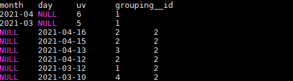

上述SQL等价于：

```
SELECT month,
NULL as day,
COUNT(DISTINCT cookieid) AS uv,
1 AS GROUPING__ID 
FROM user_date 
GROUP BY month 

UNION ALL 

SELECT NULL as month,
day,
COUNT(DISTINCT cookieid) AS uv,
2 AS GROUPING__ID 
FROM user_date 
GROUP BY day;
```

**CUBE的使用：**

根据GROUP BY的维度的所有组合进行聚合。

```
SELECT 
month,
day,
COUNT(DISTINCT cookieid) AS uv,
GROUPING__ID 
FROM user_date 
GROUP BY month,day 
WITH CUBE 
ORDER BY GROUPING__ID;
```

结果如下：

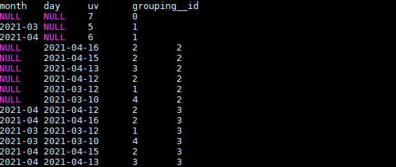

上述SQL等价于：

```
SELECT NULL,NULL,COUNT(DISTINCT cookieid) AS uv,0 AS GROUPING__ID FROM user_date

UNION ALL 

SELECT month,NULL,COUNT(DISTINCT cookieid) AS uv,1 AS GROUPING__ID FROM user_date GROUP BY month 

UNION ALL 

SELECT NULL,day,COUNT(DISTINCT cookieid) AS uv,2 AS GROUPING__ID FROM user_date GROUP BY day

UNION ALL 

SELECT month,day,COUNT(DISTINCT cookieid) AS uv,3 AS GROUPING__ID FROM user_date GROUP BY month,day;
```

**ROLLUP的使用：**

是CUBE的子集，以最左侧的维度为主，从该维度进行层级聚合。

比如，以month维度进行层级聚合：

```
SELECT 
month,
day,
COUNT(DISTINCT cookieid) AS uv,
GROUPING__ID  
FROM user_date 
GROUP BY month,day
WITH ROLLUP 
ORDER BY GROUPING__ID;
```

结果如下：

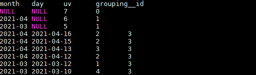

把month和day调换顺序，则以day维度进行层级聚合：

```
SELECT 
day,
month,
COUNT(DISTINCT cookieid) AS uv,
GROUPING__ID  
FROM user_date 
GROUP BY day,month 
WITH ROLLUP 
ORDER BY GROUPING__ID;
```
结果如下：

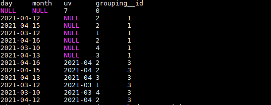

这里，根据日和月进行聚合，和根据日聚合结果一样，因为有父子关系，如果是其他维度组合的话，就会不一样。

**窗口函数实际应用**

1. **第二高的薪水**
   难度简单。

编写一个 SQL 查询，获取 Employee 表中第二高的薪水（Salary）。

```
+----+--------+
| Id | Salary |
+----+--------+
| 1  | 100    |
| 2  | 200    |
| 3  | 300    |
+----+--------+
```

例如上述 Employee 表，SQL查询应该返回 200 作为第二高的薪水。如果不存在第二高的薪水，那么查询应返回 null。

```
+---------------------+
| SecondHighestSalary |
+---------------------+
| 200                 |
+---------------------+
```

这道题可以用 row_number 函数解决。

参考代码：

```
SELECT
  *
  FROM(
    SELECT Salary, row_number() over(order by Salary desc) rk 
    FROM Employee
  ) t WHERE t.rk = 2;
```

更简单的代码：

```
SELECT DISTINCT Salary
FROM Employee
ORDER BY Salary DESC
LIMIT 1 OFFSET 1
```

OFFSET：偏移量，表示从第几条数据开始取，0代表第1条数据。

2. **分数排名**
   难度简单。

编写一个 SQL 查询来实现分数排名。

如果两个分数相同，则两个分数排名（Rank）相同。请注意，平分后的下一个名次应该是下一个连续的整数值。换句话说，名次之间不应该有“间隔”。

```
+----+-------+
| Id | Score |
+----+-------+
| 1  | 3.50  |
| 2  | 3.65  |
| 3  | 4.00  |
| 4  | 3.85  |
| 5  | 4.00  |
| 6  | 3.65  |
+----+-------+
```

例如，根据上述给定的 Scores 表，你的查询应该返回（按分数从高到低排列）：

```
+-------+------+
| Score | Rank |
+-------+------+
| 4.00  | 1    |
| 4.00  | 1    |
| 3.85  | 2    |
| 3.65  | 3    |
| 3.65  | 3    |
| 3.50  | 4    |
+-------+------+
```

参考代码：

```
SELECT Score,
dense_rank() over(order by Score desc) as `Rank`
FROM Scores;
```

3. **连续出现的数字**
   难度中等。

编写一个 SQL 查询，查找所有至少连续出现三次的数字。

```
+----+-----+
| Id | Num |
+----+-----+
| 1  |  1  |
| 2  |  1  |
| 3  |  1  |
| 4  |  2  |
| 5  |  1  |
| 6  |  2  |
| 7  |  2  |
+----+-----+
```

例如，给定上面的 Logs 表， 1 是唯一连续出现至少三次的数字。

```
+-----------------+
| ConsecutiveNums |
+-----------------+
| 1               |
+-----------------+
```

参考代码：

```
SELECT DISTINCT `Num` as ConsecutiveNums
FROM
  (
    SELECT Num,
    lead(Num, 1, null) over(order by id) n2,
    lead(Num, 2, null) over(order by id) n3 
    FROM Logs
  ) t1
WHERE Num = n2 and Num = n3
```

4. **连续N天登录**
   难度困难。

写一个 SQL 查询,  找到活跃用户的 id 和 name，活跃用户是指那些至少连续 5 天登录账户的用户，返回的结果表按照 id 排序。

表 Accounts：

```
+----+-----------+
| id | name      |
+----+-----------+
| 1  | Winston   |
| 7  | Jonathan  |
+----+-----------+
```

表 Logins：

```
+----+-------------+
| id | login_date  |
+----+-------------+
| 7  | 2020-05-30  |
| 1  | 2020-05-30  |
| 7  | 2020-05-31  |
| 7  | 2020-06-01  |
| 7  | 2020-06-02  |
| 7  | 2020-06-02  |
| 7  | 2020-06-03  |
| 1  | 2020-06-07  |
| 7  | 2020-06-10  |
+----+-------------+
```

例如，给定上面的Accounts和Logins表，至少连续 5 天登录账户的是id=7的用户

```
+----+-----------+
| id | name      |
+----+-----------+
| 7  | Jonathan  |
+----+-----------+
```

思路：

1. 去重：由于每个人可能一天可能不止登陆一次，需要去重
2. 排序：对每个ID的登录日期排序
3. 差值：计算登录日期与排序之间的差值，找到连续登陆的记录
4. 连续登录天数计算：select id, count(*) group by id, 差值（伪代码）
5. 取出登录5天以上的记录
6. 通过表合并，取出id对应用户名

参考代码：

```
SELECT DISTINCT b.id, name
FROM
  (SELECT id, login_date,
    DATE_SUB(login_date, ROW_NUMBER() OVER(PARTITION BY id ORDER BY login_date)) AS diff 
   FROM(SELECT DISTINCT id, login_date FROM Logins) a) b
INNER JOIN Accounts ac
ON b.id = ac.id
GROUP BY b.id, diff
HAVING COUNT(b.id) >= 5
```

**注意点：**

DATE_SUB的应用：DATE_SUB (DATE, X)，注意，X为正数表示当前日期的前X天；

如何找连续日期：通过排序与登录日期之间的差值，因为排序连续，因此若登录日期连续，则差值一致；

GROUP BY和HAVING的应用：通过id和差值的GROUP BY，用COUNT找到连续天数大于5天的id，注意COUNT不是一定要出现在SELECT后，可以直接用在HAVING中

5. **给定数字的频率查询中位数**
   难度困难。

Numbers 表保存数字的值及其频率。

```
+----------+-------------+
|  Number  |  Frequency  |
+----------+-------------|
|  0       |  7          |
|  1       |  1          |
|  2       |  3          |
|  3       |  1          |
+----------+-------------+
```

在此表中，数字为 0, 0, 0, 0, 0, 0, 0, 1, 2, 2, 2, 3，所以中位数是 (0 + 0) / 2 = 0。

```
+--------+
| median |
+--------|
| 0.0000 |
+--------+
```

请编写一个查询来查找所有数字的中位数并将结果命名为 median 。

参考代码：

```
select
avg(cast(number as float)) as median
from
  (
    select Number,
    Frequency,
    sum(Frequency) over(order by Number) - Frequency as prev_sum,
    sum(Frequency) over(order by Number) as curr_sum 
    from Numbers
  ) t1, (
    select sum(Frequency) as total_sum 
    from Numbers
  ) t2
where
t1.prev_sum <= (cast(t2.total_sum as float) / 2) 
and
t1.curr_sum >= (cast(t2.total_sum as float) / 2)
```