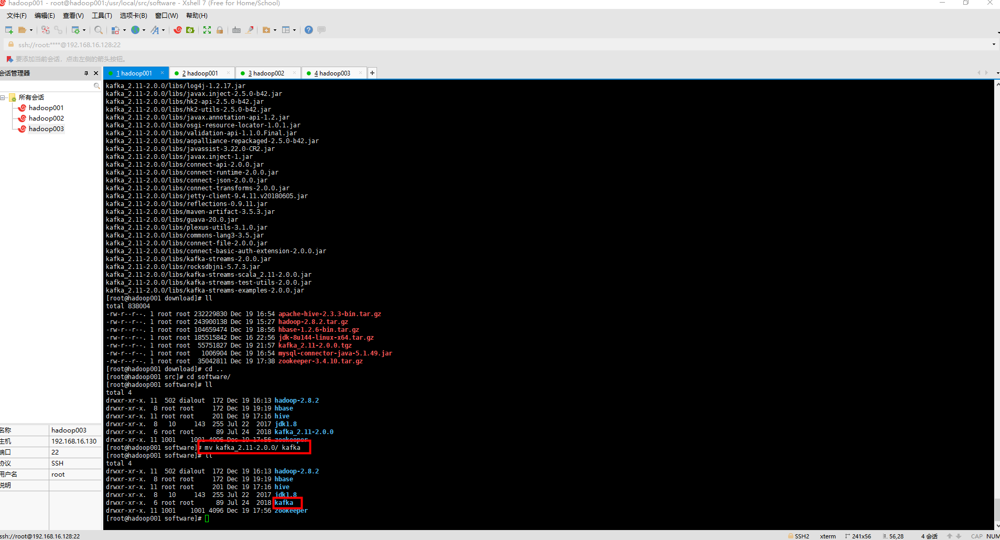
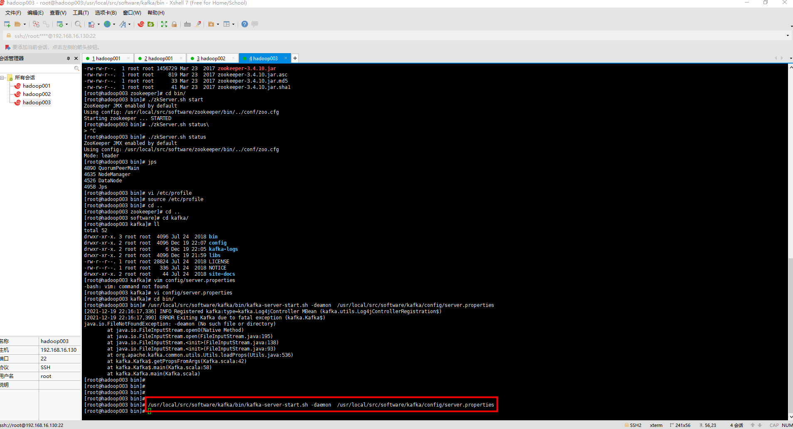
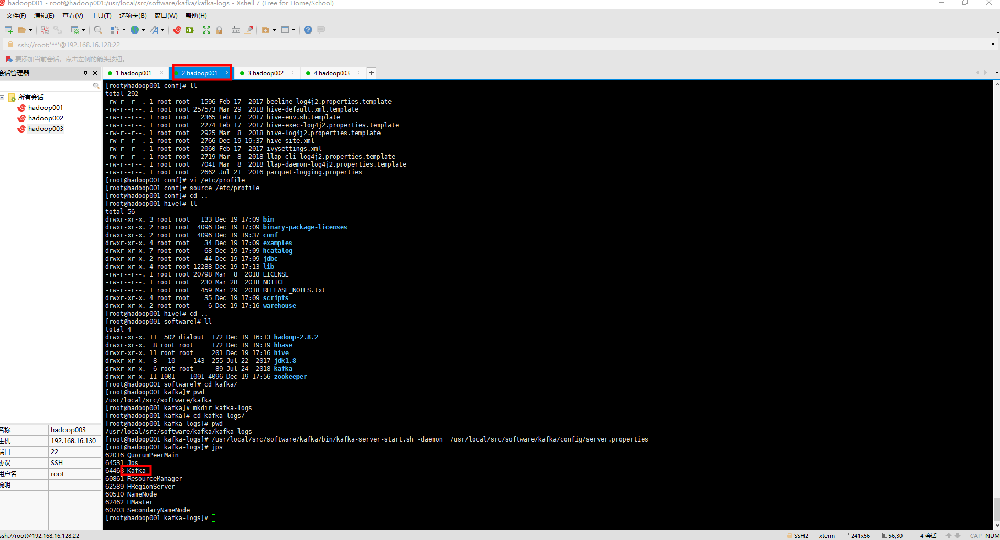
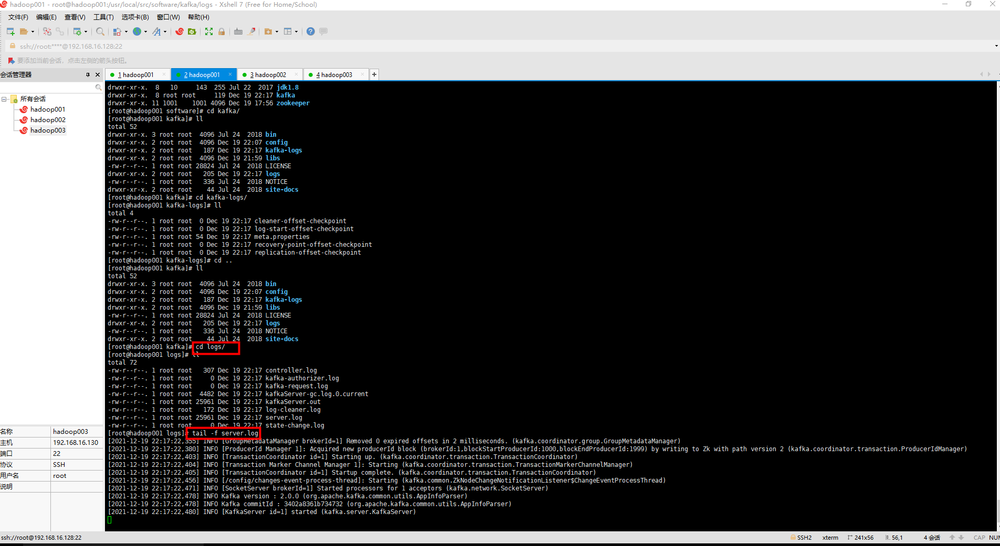

### kafka安装

一、准备工作

[1. 安装虚拟机Centos7（Linux发行版之一，是免费的、开源的、可以重新分发的开源操作系统）](https://github.com/WuZongYun/bigdata_study/blob/main/%E5%A4%A7%E6%95%B0%E6%8D%AE%E5%9F%BA%E7%A1%80%E7%8E%AF%E5%A2%83%E6%90%AD%E5%BB%BA/1_%E5%AE%89%E8%A3%85%E8%99%9A%E6%8B%9F%E6%9C%BA.md)

[2. 安装MobaXterm（MobaXterm 是一款远程控制工具，支持创建SSH,Telnet,Rsh,Xdmc,RDP,VNC,FTP,SFTP,）](https://github.com/WuZongYun/bigdata_study/blob/main/%E5%A4%A7%E6%95%B0%E6%8D%AE%E5%9F%BA%E7%A1%80%E7%8E%AF%E5%A2%83%E6%90%AD%E5%BB%BA/2_%E5%AE%89%E8%A3%85MobaXterm.md)

[3. centos7免密设置（后续大数据集群安装时候避免不断输入密码）](https://github.com/WuZongYun/bigdata_study/blob/main/%E5%A4%A7%E6%95%B0%E6%8D%AE%E5%9F%BA%E7%A1%80%E7%8E%AF%E5%A2%83%E6%90%AD%E5%BB%BA/3_centos7%E5%85%8D%E5%AF%86%E8%AE%BE%E7%BD%AE.md)

[4. centos7安装JDK1.8（后续hadoop、spark等组件都依赖于JDK）](https://github.com/WuZongYun/bigdata_study/blob/main/%E5%A4%A7%E6%95%B0%E6%8D%AE%E5%9F%BA%E7%A1%80%E7%8E%AF%E5%A2%83%E6%90%AD%E5%BB%BA/4_centos7%E5%AE%89%E8%A3%85JDK.md)

建议在虚拟机里单独创建两个文件夹（download、software），用来存放安装包和软件

需要将 kafka_2.11-2.0.0.tgz 文件，上传至 download 目录。链接：https://pan.baidu.com/s/1yEvmb95GMeWx_DJt_vD_oA 请输入提取码 提取码：59zk

二、安装步骤（集群版）

（一）解压

1. 输入命令：`cd /usr/local/src/download`、`ls`，查看是否存在 kafka_2.11-2.0.0.tgz  这个文件。

2. 输入命令：`tar -zxvf kafka_2.11-2.0.0.tgz -C /usr/local/src/software/`，将文件解压到 software 文件夹里。

3. 解压完毕后，输入命令：`cd /usr/local/src/software/`，输入命令：`ls`，查看该目录下是否存在 kafka_2.11-2.0.0 这个文件。

4. 输入命令：`mv kafka_2.11-2.0.0/ kafka`，将解压后的文件重命名为 kafka 。



（二）配置文件

1. 在 kafka 下新建文件夹 kafka-logs 。

2. 输入命令：`vi /usr/local/src/software/kafka/config/server.properties`。

```
broker.id=1
num.partitions=2
default.replication.factor=2
listeners=PLAINTEXT://hadoop001:9092
log.dirs=/usr/local/src/software/kafka/kafka-logs
zookeeper.connect=hadoop001:2181,hadoop002:2181,hadoop003:2181
```

3. 发送安装文件到其他节点

```
scp -rp /usr/local/src/software/kafka/ root@hadoop002://usr/local/src/software/
scp -rp /usr/local/src/software/kafka/ root@hadoop003://usr/local/src/software/
```
复制完成后，修改hadoop002节点的Kafka安装目录下的config/server.properties文件，修改内容如下：

```
broker.id=2
listeners=PLAINTEXT://hadoop002:9092
```
同理，修改hadoop003节点的Kafka安装目录下的config/server.properties文件，修改内容如下：

```
broker.id=3
listeners=PLAINTEXT://hadoop003:9092
```

（三）启动服务

1. 启动ZooKeeper集群（hadoop001,hadoop002,hadoop003）

`/usr/local/src/software/zookeeper/bin/zkServer.sh start`

2. 启动kafka集群（hadoop001,hadoop002,hadoop003）

`/usr/local/src/software/kafka/bin/kafka-server-start.sh -deamon /usr/local/src/software/kafka/config/server.properties`

启动后，使用jps命令查看所有节点上是否都有kafka进程。





查看日志确保没有异常


