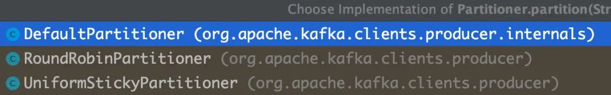
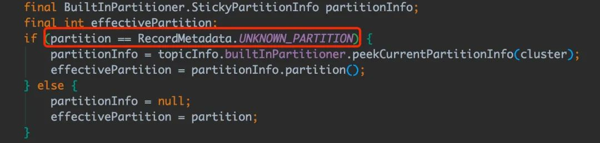
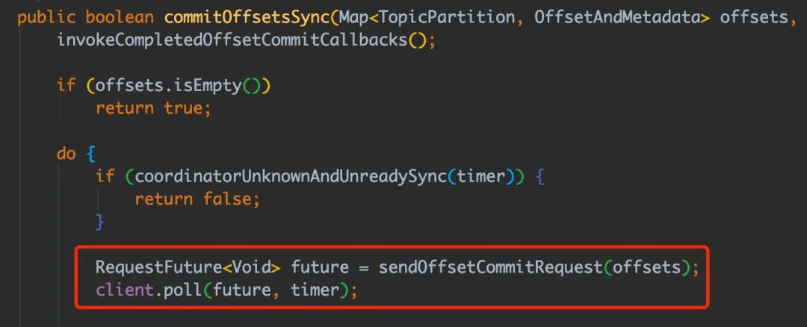

### 一. 消息队列的作用

#### 1. 异步：可以用于系统内部的异步通信，也可以用于分布式微服务系统之间的异步通信，提高系统整体吞吐量

异步对于支持多线程模型的语言（例如 Java）来说通过自身就可以实现，但是自身实现就需要考虑持久化和线程管理等问题，当异步执行的任务可靠性诉求较高时就可以考虑使用消息中间件来实现（引入消息中间件也会增加系统复杂度，需要开发者权衡）。

#### 2. 解耦：使用消息队列可以让上下游系统间的耦合度降低

消息队列是标准的生产者/消费者模型，生产者不需要关注消费者，消费者也不需要关注生产者；当系统整体链路较长时，就可以对系统按照功能进行拆分；比如短信发送功能，假设一条短信发送链路为：参数校验 -> 鉴权 -> 模板匹配 -> 内容组装 -> 黑名单校验 -> 调用下游渠道发送短信，就可以将整个系统拆分为两部分：前置处理（专门负责校验和内容组装）和后置处理（专门负责和下游渠道交互发送短信，接收渠道回执、回复等），两部分之间就通过消息中间件来交互，这就已经做到解耦，同时也会加快接口响应，假设原来「前置处理」需要 20 ms，「后置处理」需要 100ms，总共就是 120ms，现在进行微服务拆分并且两服务间用消息队列交互，耗时就会降到 20ms，提升整体吞吐量。

#### 3. 削峰限流：尖刺流量分散，减少下游系统压力，提升系统可用性

比如某一个写数据库操作流量较大，之上就可以加一个消息队列，排队请求数据库，减少数据库压力。

消息队列的思想就是利用可靠高效的消息传递机制进行异步的数据传输。

消息队列固然好用，但是有利也有弊，引入消息队列也可能会有新的问题需要处理：

* 如何保证消息顺序
* 如何保证消息不丢
* 如何处理重复消息
* 如何处理消息堆积

我们下面就这四大问题来分析发生的场景和一些解决方案。

## 二. 如何保证消息顺序

如果业务要求消息全局严格顺序执行，消息队列数只能有一个，并且生产者和消费者也只能各有一个，这样就能保证全局顺序。

但是上述方案消费能力太差，并发高的时候延迟会很大；大部分情况下，我们只用保证局部有序就可以了；例如：假设某个用户的多个操作都会推送到消息队列，我们只需要保证该用户的操作消息有序即可。

Kafka 消息的收发基于 Topic，单个 Topic 可以有多个 Partition（分区，可以理解为一个队列），而单个 Patition 在同一个消费组内只能被一个消费者消费；在这种规则下，Kafka 内部是保证在同一个 Partition 中的消息是顺序的。

所以基于上述 Kafka 的特性，我们只要让需要有序的消息发送到同一个分区就行。

我们来看下 Kafka 生产消息时分区相关源码（基于 kafka-clients-3.3.1，源码省去不相关部分）：

生产消息 API - send(ProducerRecord<K, V> record, Callback callback)：

```
public Future<RecordMetadata> send(ProducerRecord<K, V> record, Callback callback) {
    // 发送前执行处理器包装record
    ProducerRecord<K, V> interceptedRecord = this.interceptors.onSend(record);
    return doSend(interceptedRecord, callback);
}

private Future<RecordMetadata> doSend(ProducerRecord<K, V> record, Callback callback) {
    // 省略......
    try {
        // 省略......
        byte[] serializedKey;
        try {
            // 将 key 序列化成字节数组
            serializedKey = keySerializer.serialize(record.topic(), record.headers(), record.key());
        } catch (ClassCastException cce) {
            throw new SerializationException("Can't convert key of class " + record.key().getClass().getName() +
                    " to class " + producerConfig.getClass(ProducerConfig.KEY_SERIALIZER_CLASS_CONFIG).getName() +
                    " specified in key.serializer", cce);
        }
        byte[] serializedValue;
        try {
            // 将 value 序列化成字节数组
            serializedValue = valueSerializer.serialize(record.topic(), record.headers(), record.value());
        } catch (ClassCastException cce) {
            throw new SerializationException("Can't convert value of class " + record.value().getClass().getName() +
                    " to class " + producerConfig.getClass(ProducerConfig.VALUE_SERIALIZER_CLASS_CONFIG).getName() +
                    " specified in value.serializer", cce);
        }
        // 选择分区
        int partition = partition(record, serializedKey, serializedValue, cluster);
        // 省略......
        RecordAccumulator.RecordAppendResult result = accumulator.append(record.topic(), partition, timestamp, serializedKey,
                serializedValue, headers, appendCallbacks, remainingWaitMs, abortOnNewBatch, nowMs, cluster);
        // 省略......
    } catch (ApiException e) {
        // 省略......
    } 
```

看到是 partition 方法决定分区的选择：

```
private int partition(ProducerRecord<K, V> record, byte[] serializedKey, byte[] serializedValue, Cluster cluster) {
    // 如果发送时指定分区直接返回
    if (record.partition() != null)
        return record.partition();
    // 如果分区器不为空，由分区器决定分区策略
    if (partitioner != null) {
        int customPartition = partitioner.partition(
            record.topic(), record.key(), serializedKey, record.value(), serializedValue, cluster);
        if (customPartition < 0) {
            throw new IllegalArgumentException(String.format(
                "The partitioner generated an invalid partition number: %d. Partition number should always be non-negative.", 
                customPartition));
        }
        return customPartition;
    }
    // 如果 key 不为空 且配置项 partitionerIgnoreKeys 为 false
    if (serializedKey != null && !partitionerIgnoreKeys) {
        // 通过计算 key 的 hash 值并与分区数量取模得出分区
        return BuiltInPartitioner.partitionForKey(serializedKey, cluster.partitionsForTopic(record.topic()).size());
    } else {
        // partition、partitioner、key 都没指定就返回未知分区，后续默认使用随机分区策略
        return RecordMetadata.UNKNOWN_PARTITION;
    }
}
```
我们可以看到 Kafka 的分区选择策略清晰明了：

1. 指定分区：当发送时指定 partition 就使用该 partition；

2. 指定分区器实现：当客户端配置指定分区器时，则由分区器的 Partitioner#partition 方法选择 partition；

Kafka 提供了三种实现，感兴趣的同学可以自己去看看：



当然也可以通过实现 org.apache.kafka.clients.producer.Partitioner 接口来自定义分区策略。

3. 指定 key 哈希路由：当发送时候传入的 key 不为空且配置项 partitionerIgnoreKeys 为 false 时，通过计算 key 的 hash 值并与分区数量取模得出分区；

4. 默认随机策略：当 partition、partitioner、key 都没指定就返回未知分区，后续默认使用随机分区策略。



所以想要保证局部有序性，就可以利用上述第三条分区策略：指定 key 哈希路由；我们可以利用 userId 或能标记记录的标识作为 key，key 相同的消息就会被分发到同一个分区进行消费，即在 Kafka 侧保证了顺序性。

当然，也可以在业务层面根据一些手段来保证顺序，比如数据本身的先后状态。

## 三. 如何保证消息不丢

一条消息从生产到被消费可以分为三个阶段：生产阶段、存储阶段、消费阶段

* 生产阶段：消息被 Producer 生产出来，通过网络传输到 Broker；
* 存储阶段：消息在 Broker 存储，如果 Broker 是集群部署，则会被复制到其他副本；
* 消费阶段：Consumer 从 broker 上拉取消息，经过网络传输发送到 Consumer 上。

我们分别从这三个阶段来看如何保证消息的可靠性。

1. 生产阶段

在生产阶段，一般消息队列都会有 ACK 确认机制来保证消息可靠性，当 Producer 向 Broker 发送消息，Broker 接收消息完成后会给客户端返回一个确认响应表示消息已接收到，客户端接收到响应后完成一次正常的消息发送。

生产时丢消息的场景：

（1）API 使用不当

（2）网络异常

kafka-client 提供了两种 API：send(ProducerRecord<K, V> record) 和 send(ProducerRecord<K, V> record, Callback callback)；

两个 API 都会返回一个 Future 的包装类，看到返回的 Future 大家肯定猜到发送接口是异步的；没错，为了提高性能，Kafka 的客户端并不是调用 send 方法就立刻发送的，而是先写到客户端本地内存，客户端后台会跑着一个 ioThread 定时清理这块内存去发送消息，起到了一个批处理的作用；当 ioThread 真正发送消息后才会将结果写进 Future 的包装类（这块源码比较长，就不贴了...）。

如果只 producer.send(record)，真正发送时出现的异常和超时都不会捕获到；想要知道消息是否发送成功，就需要调用 Future 的 get() 方法一直阻塞直到结果到达：

```
try { 
    producer.send(record).get();
} catch (Throwable e) {
    // 重试或告警
    handle(record, e)
}
```

或者使用带有回调方法的 API：send(ProducerRecord<K, V> record, Callback callback) 就可以省去阻塞等待结果的时间，判断异常的逻辑写在 callback 里。

producer 端还提供配置项 retries，代表当发送消息时出现异常（包括网络异常、超时等）会自行重试的次数。


2. 存储阶段

为了保证消息可靠性和系统高可用，消息队列的 Broker 会以一主多从的方式集群部署，Kafka 在写入消息时，采用的是异步复制的方式。消息写入主节点后，并不会马上返回写入成功，而是等待足够多的节点都复制成功再返回，来保证消息的可靠性。

存储丢消息的场景：

（1）当 Leader 节点宕机触发选举，如果选了一个落后 Leader 节点的副本作为 Leader，就会造成消息丢失；

（2）Kafka 为了提高写入性能，使用了操作系统的页缓存机制，消息会先被写到 page cache，后续被异步持久化到磁盘；当刷盘之前操作系统崩溃或服务器断电，消息也会丢失。

针对第一点，生产消息时，等待复制成功的节点数量可以配置的：min.insync.replicas，Kafka 让用户自己决定需要性能还是可靠；需要写入的节点数越多，可用性和数据可靠性就越好，但是写入性能就越差；为了防止宕机时选举到落后的副本，Leader 维护了一个动态的同步副本集合（ISR），代表和 Leader 数据保持同步的副本节点集合，如果 ISR 里的节点长时间（配置项：replica.lag.time.max.ms）未响应 Leader 的同步消息则会被踢出 ISR；最后再开启配置：unclean.leader.election.enable=true，代表宕机后的 Leader 选举只会从 ISR 列表里选择。

针对第二点，如果一定需要 Broker 持久化可靠性最高，可以配置刷盘参数，相关的配置有两个：

（1）flush.messages：代表多少条消息写入 page cache 后进行刷盘；

（2）flush.ms：代表多少 ms 后进行一次刷盘操作。

不过官网上也不建议使用这两个配置，因为会影响写入性能，建议通过多节点同步写入的方式实现保证可靠性；其实将消息同步到多个副本再返回响应基本上就能应对未刷盘造成的丢失（多个节点分布在不同物理机上，同时宕机的概率比较低）。


3. 消费阶段

消费阶段采用和生产阶段类似的确认机制来保证消息的可靠性，客户端从 Broker 拉取消息后，执行业务逻辑，成功后才会给 Broker 发送消费确认响应。如果 Broker 没有收到消息的消费确认响应，重启后就会从提交的消息下一个位置开始消费，确保消息不会因为消费后没执行业务逻辑宕机导致消息丢失。

消费阶段丢消息的场景：

（1）这个阶段的消息丢失主要是是由没处理完消息但还提交了消费确认响应引起的。

Kafka 客户端消费的逻辑也大量采用了异步和合并请求的思想：发送请求时，会先构建 Request，暂存到发送队列 unsent，等待合适的时机发送，在收到 Broker 的响应结果后也不会立刻处理，也是暂存到队列中，同样是择机批量处理。客户端与 Broker 交互都采用 NIO 多路复用的网络模型，线程不用阻塞等待网络 IO 响应。

Kafka 的消费确认响应就是提交 offset（每个消息都有一个 offset 标识，消费者启动时会从提交 offset 位置的下一条消息开始消费），在 Kafka 中有三种提交 offset 的方式：自动提交、异步手动提交、同步手动提交。

自动提交

当 Consumer 实例设置配置项为 enable.auto.commit=true 就代表开启了自动提交 offset。

在调用 poll 方法时，拉取消息之前会判断两个条件：是否开启自动提交offset（配置项：enable.auto.commit）、距离上次提交是否大于等于配置间隔（配置项：auto.commit.interval.ms），满足以上两个条件会触发一次异步的 offset 提交（提交上次消费消息的 offset）：

```
// 消费相关部分源码
public void maybeAutoCommitOffsetsAsync(long now) {
    // 是否开启offset自动提交
    if (autoCommitEnabled) {
        nextAutoCommitTimer.update(now);
        // 距离上次提交是否超过配置间隔
        if (nextAutoCommitTimer.isExpired()) {
            // 重置时间
            nextAutoCommitTimer.reset(autoCommitIntervalMs);
            // 异步提交
            autoCommitOffsetsAsync();
        }
    }
}
```

当 Consumer 实例设置配置项为 enable.auto.commit=false 就代表后续的 offset 需要在代码中显示提交。


异步手动提交（API：commitAsync() ）

调用 commitAsync() 时，会异步将 offset 提交到 Broker，不等提交结果直接返回。


同步手动提交（API：commitSync() ）

调用 commitAsync() 时，也是先异步将 offset 提交到 Broker，然后同步等待结果再返回：



三种方式的性能排行：自动提交 > 异步手动提交 > 同步手动提交

一般来说我们只要保证在处理完业务逻辑之后再提交 offset 就不会出现消息丢失的问题。

如果消费后的业务逻辑是同步的，可以使用自动提交 offset 的方式；但如果消费后的业务逻辑是异步的，就需要开启手动提交 offset，手动提交建议使用 commitAsync() 异步提交的方式保证性能，就算提交失败也只会在重启消费者时重复消费，消息不会丢，在业务逻辑里保证幂等即可（在下面会讲如何处理重复消息）。

不管是哪种方式都需要在代码里根据任务重要性做好执行失败重试、补偿或告警。

简单来说消息的可靠性主要是靠 代码配合消息队列的请求确认机制 + 消息队列存储 实现的。


## 四. 如何处理重复消息


目前市面上大部分的消息中间件都不能保证消息不重复（实现成本较大），中间件设计者将这个问题交给使用者来解决。

出现重复消息的场景：

（1）生产者端在传递消息到 Broker 后，Broker 的响应因为网络原因没有发送到生产者端，导致生产者进行重试，进而产生重复消息。

（2）消费者在消息处理完、提交消费响应前异常关闭，重启后就会消费到重复消息。

（3）Kafka 还有一个特殊的场景：消费者在消息处理完、提交消费响应前发生 Rebalance，Rebalance 结束后也会消费到重复消息。

Rebalance 是 Kafka 的分区分配协议，规定了一个 Consumer Group 下的所有 Consumer 如何达成一致，给消费者分配 Topic 的分区；目的是为了均衡分配消息，合理利用消费者资源。

Rebalance 的缺点：
1. 期间消费者停止消费，影响整体吞吐量
2. 可能会引起重复消息。

有三个情况会触发 Rebalance ：
1. 消费者订阅 Topic 变化（正则方式订阅）
2. 分区数量变化
3. 消费者数量变化

消费者数量变化是导致 Rebalance 最常见的情况，因为网络原因消费者未及时发送心跳请求到 Broker、客户端拉完消息后处理时间过长等情况都会被判定为下线，从而引发 Rebalance。

解决重复消息的办法是：让消费端的操作具备幂等性（幂等性：任意执行多次所产生的影响和执行一次的影响相同）。

保证幂等性方案：


1. 数据库唯一键

这种方案适用于消费后在数据库「新增」的场景，利用数据库的唯一键约束来保证幂等插入。

比如新增订单：我们将订单表的 order_id 字段设为唯一键，在生产端生成订单号组装订单 entity 发送到消息队列，消费端消费订单 entity 后直接插入数据库，具有相同订单号的消息只有一条能插入成功。


2. 前置条件

这种方案就是在数据变更时设置一个前置条件，如果满足条件就更新数据，否则不操作；这个前置条件可以由上游携带过来，也可以根据业务状态顺序来定（只要是线程安全的中间件都能支持该种方式）。

比如发送一条短信消息：记录表中有 status 字段，在生产端组装好短信内容先插入记录表，这时 status 的值为 0（初始化状态），接着发送到消息队列，消费端消费后将记录状态修改为 1（发送中）后，再调用渠道进行发送。

消费端更新短信状态语句的 SQL 就可以这么写：

update sms_record set status = 1 where id = #{id} and status = 0;

根据 SQL 更新的影响行数判断是否为重复消息，如果影响行数为 1 就正常处理后续逻辑，如果影响行数为 0 代表这条消息已经处理过，直接返回即可。

那如果业务记录本身没有上述状态的概念，或后续是别的更新逻辑怎么办呢？

有个通用的方式，就是在数据上加个「版本号」的属性，版本号的数据由上游传递过来，消费后对“期望的版本号”进行一次更新，如果影响行数为 1 就正常处理后续逻辑，如果影响行数为 0 代表这条消息已经处理过，直接返回即可。

update t set version = version + 1 where id = #{id} and version = #{version};

这个方案适用于有少量重复的场景（重复量大会增加数据库的压力，数据库是爹！），比如消息队列的幂等消费。


3. Redis setNx

利用消息的唯一标识在 Redis 维护一个处理缓存，判断是否处理过；我们可以使用拥有 set if not exist 原子语义的 setNx 命令设置这个处理缓存，如果设置成功就继续执行业务逻辑，执行失败就代表消息处理过，直接返回即可。

这个方案使用于大量重复请求较集中的场景（Redis 性能强，可以保护系统），比如防刷接口。

当然还有其他方案，基本思想都是用唯一标识「检查是否存在」和「不存在就记录」两步操作，且需要保证这两步操作的原子性。


## 五. 如何处理消息堆积


通常在引入消息队列时，我们会权衡好生产者和消费者的速率，一般需要消费者的性能大于生产者；其实消息堆积是消息队列削峰限流的体现，但如果生产者和消费者的速率没有协调好，消息就会越堆越多，最终可能导致消息中间件不可提供服务或消息丢失，业务侧的任务也会延迟执行。

我们从「发生前-如何避免消息堆积」和「发生后-如何解决消息堆积」分析解决方案。

发生前-如何避免消息堆积

1. Producer

我们需要保证生产速率不要过快，尽量和用户线程保持同步即可。

2. Broker

我们知道，一个 Topic 下可以建多个分区，而一个分区相当于一个队列，所以适当增加分区数可以增强消费能力；由于分区只能被一个消费者组下一个消费者消费的特性，一般分区数要小于等于消费者实例数（多了没用还占用资源）。

3. Consumer

大部分的消息堆积都是由于 Consumer 的性能跟不上导致，很多时候我们使用消息队列就是想把耗时或数据库相关的操作给异步化，所以很多情况下 Consumer 端的逻辑确实比较耗时（例如第三方接口调用）。

并行消费

我们可以在消费完消息后，丢给线程池执行，合理压榨 CPU 的性能；但是丢到线程池执行的方式，就算手动提交 offset 也可能会丢消息，比如现在现在有三条消息 offset 为 1、2、3 丢到线程池中分别交由 Thread1、Thread2、Thread3 执行，假设 Thread3 执行完业务逻辑提交了 offset=3 ，offset=1 和 offset=2 的消息还未处理时服务重启，启动后消费者会从 offset=3 的下一条消息开始消费，1、2 两条消息就会丢失。

单独管理 offset

在网上看到有一种方案是在丢给线程池执行前先记录下该 offset 到一个内存队列中，并设置状态为未提交，后续线程执行完后不去提交而是修改该 offset 的状态为提交，在维护一个线程不断轮询提交可以提交的 offset 即可；这种方案需要额外考虑的点还蛮多的，只是提供一种思路。

优雅关闭

其实我们只需要做好线程池的优雅关闭就能基本能解决（线程池的优雅关闭可以看阿东之前的文章：《深入理解 Java 线程池技术》），真正遇到断电或进程崩溃等极端场景可以考虑补偿任务（最终一致性）或手动调整 offset 到事故时间点重新消费也能解决，很多时候系统需要舍弃一小部分可靠性来换取更高的性能。


发生后-如何解决消息堆积

当发生了消息堆积，在下游系统的承受范围内，我们可以加机器 + 加分区，增加消费能力；还可以将并行消费线程池的参数配置写入配置中心，可以在消息堆积时不停机适当动态调大线程池的核心线程数。


