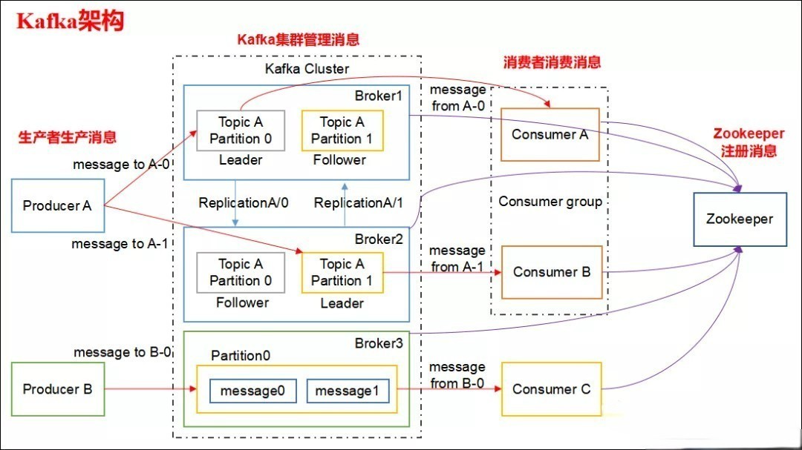
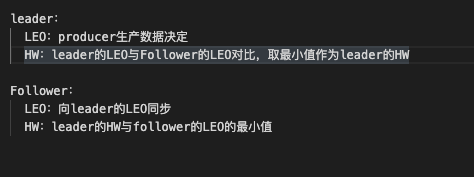
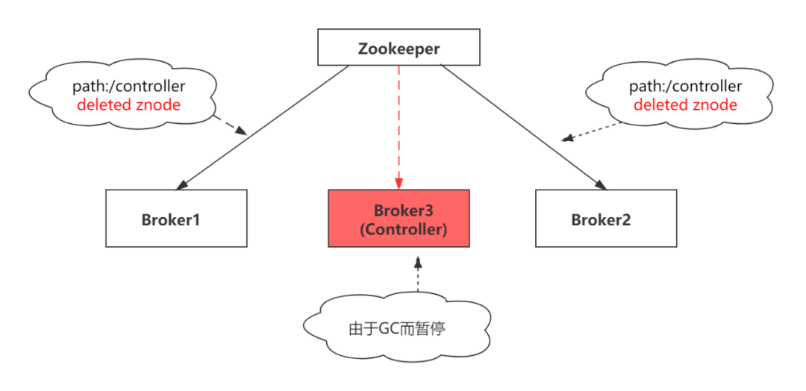
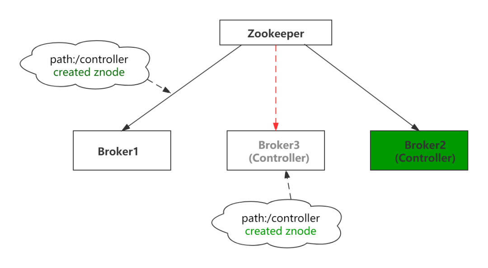
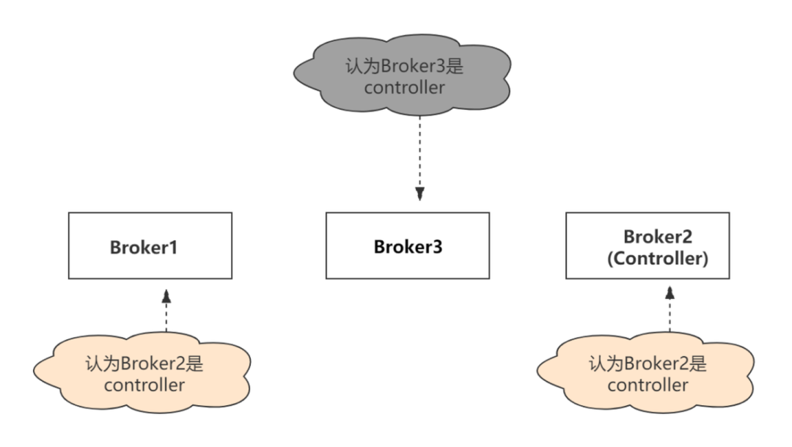
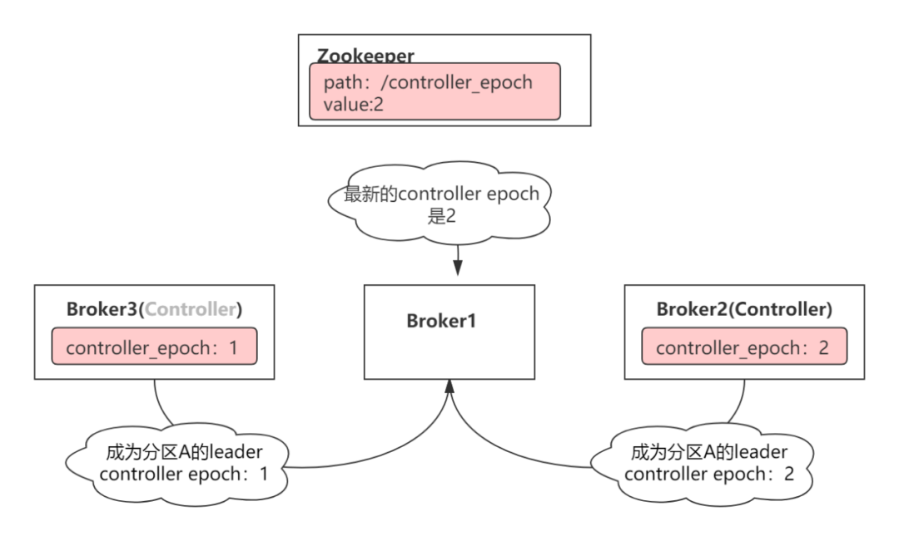
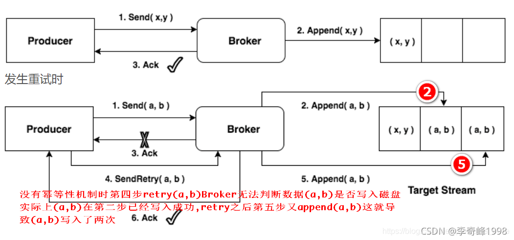
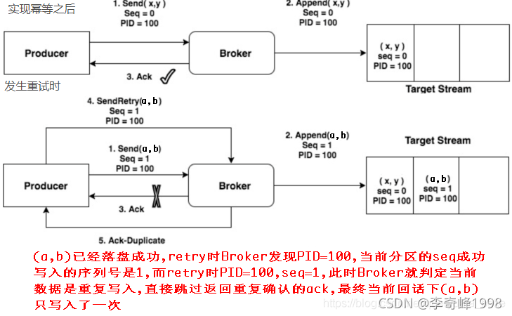
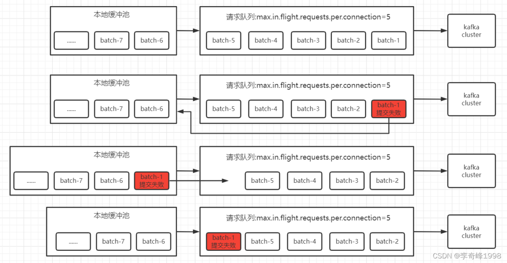

### 1、 kafka 是什么,有什么作用

Kafka是一个开源的高吞吐量的分布式消息中间件，对比于其他

* 缓冲和削峰：上游数据时有突发流量，下游可能扛不住，或者下游没有足够多的机器来保证冗余，kafka在中间可以起到一个缓冲的作用，把消息暂存在kafka中，下游服务就可以按照自己的节奏进行慢慢处理。
* 解耦和扩展性：项目开始的时候，并不能确定具体需求。消息队列可以作为一个接口层，解耦重要的业务流程。只需要遵守约定，针对数据编程即可获取扩展能力。
* 冗余：可以采用一对多的方式，一个生产者发布消息，可以被多个订阅topic的服务消费到，供多个毫无关联的业务使用。
* 健壮性：消息队列可以堆积请求，所以消费端业务即使短时间死掉，也不会影响主要业务的正常进行。
* 异步通信：很多时候，用户不想也不需要立即处理消息。消息队列提供了异步处理机制，允许用户把一个消息放入队列，但并不立即处理它。想向队列中放入多少消息就放多少，然后在需要的时候再去处理它们。

### 2、Kafka为什么这么快

* 利用 Partition 实现并行处理 不同 Partition 可位于不同机器，因此可以充分利用集群优势，实现机器间的并行处理。另一方面，由于 Partition 在物理上对应一个文件夹，即使多个 Partition 位于同一个节点，也可通过配置让同一节点上的不同 Partition 置于不同的磁盘上，从而实现磁盘间的并行处理，充分发挥多磁盘的优势。
* 利用了现代操作系统分页存储 Page Cache 来利用内存提高 I/O 效率
* 顺序写 kafka的消息是不断追加到文件中的，这个特性使kafka可以充分利用磁盘的顺序读写性能 由于现代的操作系统提供了预读和写技术，磁盘的顺序写大多数情况下比随机写内存还要快。顺序读写不需要硬盘磁头的寻道时间，只需很少的扇区旋转时间，所以速度远快于随机读写
* Zero-copy 零拷技术减少拷贝次数
* 数据批量处理。合并小的请求，然后以流的方式进行交互，直顶网络上限。在很多情况下，系统的瓶颈不是 CPU 或磁盘，而是网络IO。因此，除了操作系统提供的低级批处理之外，Kafka 的客户端和 broker 还会在通过网络发送数据之前，在一个批处理中累积多条记录 (包括读和写)。记录的批处理分摊了网络往返的开销，使用了更大的数据包从而提高了带宽利用率。
* Pull 拉模式 使用拉模式进行消息的获取消费，与消费端处理能力相符。
* 数据压缩 Kafka还支持对消息集合进行压缩，Producer可以通过GZIP、Snappy、LZ4格式对消息集合进行压缩，数据压缩一般都是和批处理配套使用来作为优化手段的。压缩的好处就是减少传输的数据量，减轻对网络传输的压力 Producer压缩之后，在Consumer需进行解压，虽然增加了CPU的工作，但在对大数据处理上，瓶颈在网络上而不是CPU，所以这个成本很值得

### 3、Kafka架构及名词解释



* Broker ：一台kafka服务器就是一个broker。一个集群由多个broker组成。一个broker可以容纳多个topic。
* Producer：消息生产者，向kafka broker发送消息的客户端。
* Consumer：消息消费者，向kafka broker取消息的客户端。
* Topic：队列，生产者和消费者通过此进行对接。
* Consumer Group （CG）：若干个Consumer组成的集合。这是kafka用来实现一个topic消息的广播（发给所有的consumer）和单播（发给任意一个consumer）的手段。一个topic可以有多个CG。topic的消息会复制（不是真的复制，是概念上的）到所有的CG，但每个CG只会把消息发给该CG中的一个consumer。如果需要实现广播，只要每个consumer有一个独立的CG就可以了。要实现单播只要所有的consumer在同一个CG。用CG还可以将consumer进行自由的分组而不需要多次发送消息到不同的topic。
* Partition：分区，为了实现扩展性，一个topic可以分布在多个broker上，一个topic可以分为多个partition，每个partition都是一个有序的队列。partition中的每条消息都会被分配一个有序的id（offset）。kafka只保证同一个partition中的消息顺序，不保证一个topic的整体（多个partition之间）的顺序。生产者和消费者使用时可以指定topic中的具体partition。
* 副本：在kafka中，每个主题可以有多个分区，每个分区又可以有多个副本。这多个副本中，只有一个是leader，而其他的都是follower副本。仅有leader副本可以对外提供服务。多个follower副本通常存放在和leader副本不同的broker中。通过这样的机制实现了高可用，当某台机器挂掉后，其他follower副本也能迅速”转正“，开始对外提供服务。
* offset：消费偏移量，topic中的每个分区都是有序且顺序不可变的记录集，并且不断地追加到结构化的log文件。分区中的每一个记录都会分配一个id号来表示顺序，我们称之为offset，offset用来唯一的标识分区中每一条记录。可以设置为“自动提交”与“手动提交”。

### 4、Kafka中的AR、ISR、OSR代表什么

* AR:Assigned Replicas 指当前分区中的所有副本。
* ISR:In-Sync Replicas 副本同步队列。ISR中包括Leader和Foller。如果Leader进程挂掉，会在ISR队列中选择一个服务作为新的Leader。有replica.lag.max.message(延迟条数)和replica.lag.time.max.ms(延迟时间)两个参数决定一台服务器是否可以加入ISR副本队列，在0.10版本之后移除了replica.lag.max.message(延迟条数)参数，防治服务频繁的进出队列。任意一个维度超过阈值都会把Follower踢出ISR，存入OSR（Outof-Sync Replicas）列表，新加入的Follower也会先存放在OSR中。
* OSR：（Out-of-Sync Replicas）非同步副本队列。与leader副本同步滞后过多的副本（不包括leader副本）组成OSR。如果OSR集合中有follower副本“追上”了leader副本，那么leader副本会把它从OSR集合转移至ISR集合。默认情况下，当leader副本发生故障时，只有在ISR集合中的副本才有资格被选举为新的leader，而在OSR集合中的副本则没有任何机会（不过这个原则也可以通过修改unclean.leader.election.enable参数配置来改变）。unclean.leader.election.enable 为true的话，意味着非ISR集合的broker 也可以参与选举，这样就有可能发生数据丢失和数据不一致的情况，Kafka的可靠性就会降低；而如果unclean.leader.election.enable参数设置为false，Kafka的可用性就会降低。

**ISR的伸缩：1）Leader跟踪维护ISR中follower滞后状态，落后太多或失效时，leade把他们从ISR剔除。2）OSR中follower“追上”Leader，在ISR中才有资格选举leader。**

### 5、HW、LEO代表什么

LEO （Log End Offset），标识当前日志文件中下一条待写入的消息的offset。上图中offset为9的位置即为当前日志文件的 LEO，LEO 的大小相当于当前日志分区中最后一条消息的offset值加1.分区 ISR 集合中的每个副本都会维护自身的 LEO ，而 ISR 集合中最小的 LEO 即为分区的 HW，对消费者而言只能消费 HW 之前的消息。
HW：replica高水印值，副本中最新一条已提交消息的位移。leader 的HW值也就是实际已提交消息的范围，每个replica都有HW值，但仅仅leader中的HW才能作为标示信息。什么意思呢，就是说当按照参数标准成功完成消息备份（成功同步给follower replica后）才会更新HW的值，代表消息理论上已经不会丢失，可以认为“已提交”。 



### 6、ISR收缩性

启动 Kafka时候自动开启的两个定时任务，“isr-expiration"和”isr-change-propagation"。

* isr-expiration：isr-expiration任务会周期性的检测每个分区是否需要缩减其ISR集合，相当于一个纪检委员，巡查尖子班时候发现有学生睡觉打牌看小说，就把它的座位移除尖子班，缩减ISR，宁缺毋滥。同样道理，如果follower数据同步赶上leader，那么该follower就能进入ISR尖子班，扩充。上面关于ISR尖子班人员的所见，都会记录到isrChangeSet中，想象成是一个名单列表，谁能进，谁要出，都记录在案。
* isr-change-propagation：作用就是检查isrChangeSet，按照名单上的信息移除和迁入，一般是2500ms检查一次，但是为了防止频繁收缩扩充影响性能，不是每次都能做变动，必须满足：1、上一次ISR集合发生变化距离现在已经超过5秒，2、上一次写入zookeeper的时候距离现在已经超过60秒。这两个条件都满足，那么就开始换座位！这两个条件可以由我们来配置。
* Kafka使用这种ISR收缩的方式有效的权衡了数据可靠性与性能之间的关系。

### 7、kafka follower如何与leader同步数据

Kafka的复制机制既不是完全的同步复制，也不是单纯的异步复制。完全同步复制要求All Alive Follower都复制完，这条消息才会被认为commit，这种复制方式极大的影响了吞吐率。而异步复制方式下，Follower异步的从Leader复制数据，数据只要被Leader写入log就被认为已经commit，这种情况下，如果leader挂掉，会丢失数据，kafka使用ISR的方式很好的均衡了确保数据不丢失以及吞吐率。Follower可以批量的从Leader复制数据，而且Leader充分利用磁盘顺序读以及send file(zero copy)机制，这样极大的提高复制性能，内部批量写磁盘，大幅减少了Follower与Leader的消息量差。

### 8、Zookeeper 在 Kafka 中的作用（早期）

zookeeper 是一个分布式的协调组件，早期版本的kafka用zk做meta信息存储，consumer的消费状态，group的管理以及 offset的值。考虑到zk本身的一些因素以及整个架构较大概率存在单点问题，新版本中逐渐弱化了zookeeper的作用。新的consumer使用了kafka内部的group coordination协议，也减少了对zookeeper的依赖，

但是broker依然依赖于ZK，zookeeper 在kafka中还用来选举controller 和 检测broker是否存活等等。

1. Broker注册：Broker是分布式部署并且互相独立，此时需要有一个注册系统能够将整个集群中的Broker管理起来，此时就用到的Zookeeper。在Zookeeper上会有一个专门用来进行Broker服务器列表记录的节点：/brokes/ids

2. Topic注册：在kafka中，同一个Topic的消息会被分成多个分区并将其分布在多个Broker上，这些分区信息以及与Broker的对应关系也都是由Zookeeper维护，由专门的节点记录：/brokers/topics

3. 消费者注册：消费者服务器在初始化启动时加入消费者分组的步骤如下：注册到消费者分组。每个消费者服务器启动时，都会到Zookeeper的指定节点下创建一个属于自己的消费者节点，例如/consumer/[groupid]/ids/[consumerid]，完成节点创建后，消费者就会将自己订阅的Topic信息写入该临时节点。

对消费者分组中的消费者的变化注册监听：每个消费者都需要关注所属消费者分组中的其他消费者服务器的变化情况，即对/consumer/[group_id]/ids节点注册子节点变化的Watcher监听，一旦发现消费者新增或减少，就触发消费者的负载均衡。

对Broker服务器变化注册监听：消费者需要对/broker/ids[0-N]中的节点进行监听，如果发现Broker服务器列表发生变化，那么就根据具体情况来决定是否需要进行消费者负载均衡。

进行消费者负载均衡：为了让同一个Topic下不同分区的消息尽量均衡地被多个消费者消费而进行消费者与消息分区分配的过程，通常对于一个消费者分组，如果组内的消费者服务器发生变更或Broker服务器发生变更，会进行消费者负载均衡。

Offset记录 在消费者对指定消息分区进行消费的过程中，需要定时地将分区消息的消费进度Offset记录到Zookeeper上，以便对该消费者进行重启或者其他消费者重新接管该消息分区的消息消费后，能够从之前的进度继续进行消息消费。Offset在Zookeeper中由一个专门节点进行记录，其节点路径为：/consumers/[groupid]/offsets/[topic]/[brokerid-partition_id] 节点内容就是Offset的值。

4. 生产者负载均衡：由于同一个Topic消息会被分区并将其分布在多个Broker上，因此生产者需要将消息合理地发送到这些分布式的Broker上，那么如何实现生产者的负载均衡，Kafka支持传统的四层负载均衡，也支持Zookeeper方式实现负载均衡。

四层负载均衡：根据生产者的IP地址和端口来为其圈定一个相关联的Broker。通常，一个生产者只会对应单个Broker，然后该生产者产生的消息都发送到该Broker。这种方式逻辑简单，每个生产者不需要同其他系统建立额外的TCP链接，只需要和Broker维护单个TCP连接即可。但是无法做到真正的负载均衡，因为实际系统中的每个生产者产生的消息量及每个Broker的消息存储量都是不一样的，如果有些生产者产生的消息远多于其他生产者的话，那么会导致不同的Broker接收到的消息总数差异巨大，同时，生产者也无法实时感知到Broker的新增和删除。

使用Zookeeper进行负载均衡，由于每个Broker启动时，都会完成Broker注册过程，生产者会通过该节点的变化来动态地感知到Broker服务器列表的变更，这样就可以实现动态的负载均衡机制。

5. 消费者负载均衡：与生产者相似，Kafka中的消费者同样需要进行负载均衡来实现多个消费者合理地从对应的Broker服务器上接收消息，每个消费者分组包含若干消费者，每条消息都只会发送给分组中的一个消费者，不同的消费者分组消费自己特定的Topic下面的消息，互不干扰。

6. 分区与消费者的关系：消费组consumer group下有多个Consumer（消费者）。对于每个消费者组（consumer group），Kafka都会为其分配一个全局唯一的Group ID，Group内部的所有消费者共享该ID。订阅的topic下的每个分区只能分配给某个group下的一个consumer（当然该分区还可以被分配给其他group）
同时，kafka为每个消费者分配一个Consumer ID，通常采用“Hostname：UUID”形式表示。在kafka中，规定了每个消息分区只能被同组的一个消费者进行消费，因此，需要在zookeeper上记录消息分区与Consumer之间的关系，每个消费者一旦确定了对一个消费分区的消费权利，需要将其Consumer ID写入到平Zookeeper对应消息分区的临时节点上，例如：/consumers/[groupid]/owners/topic/[brokerid-partitionid]
其中，[brokerid-partition_id]就是一个消息分区的表示，节点内容就是该消息分区上消费者的Consumer ID。

7. 补充：早期版本的 kafka 用 zk 做 meta 信息存储，consumer 的消费状态，group 的管理以及 offse t的值。考虑到zk本身的一些因素以及整个架构较大概率存在单点问题，新版本中确实逐渐弱化了zookeeper的作用。新的consumer使用了kafka内部的group coordination协议，也减少了对zookeeper的依赖

### 9、Kafka如何快速读取指定offset的消息

Kafka本地日志存储根据segement分段存储，默认1G，其中segement包括index稀疏索引文件和log数据文件。其中index文件索引通过offset与posttion来定位数据文件中指定message的消息。其中index和log的文件名都为当前segement的起始offset。

读取offset=170418的消息，首先通过offset根据二分法定位到index索引文件，然后根据索引文件中的[offset,position]（position为物理偏移地址）去log中获取指定offset的message数据。

### 10、生产者发送消息有哪些模式

**同步发送**
对于生产者的异步发送来说就是，我发送完当前消息后，并不需要你将当前消息的发送结果立马告诉我，而是可以随即进行下一条消息的发送。但是我会允许添加一个回调函数，接收你后续返回的发送结果。异步发送这块我们直接调用kafkaProducer的send方法即可实现异步发送。

**异步发送**
如果生产者需要使用同步发送的方式，只需要拿到 send 方法返回的future对象后，调用其 get() 方法即可。此时如果消息还未发送到broker中，get方法会被阻塞，等到 broker 返回消息发送结果后会跳出当前方法并将结果返回。

### 11、发送消息的分区策略有哪些

所谓分区写入策略，即是生产者将数据写入到kafka主题后，kafka如何将数据分配到不同分区中的策略。

常见的有三种策略，轮询策略，随机策略，和按键保存策略。其中轮询策略是默认的分区策略，而随机策略则是较老版本的分区策略，不过由于其分配的均衡性不如轮询策略，故而后来改成了轮询策略为默认策略。

**轮询策略**
所谓轮询策略，即按顺序轮流将每条数据分配到每个分区中。

举个例子，假设主题test有三个分区，分别是分区A，分区B和分区C。那么主题对接收到的第一条消息写入A分区，第二条消息写入B分区，第三条消息写入C分区，第四条消息则又写入A分区，依此类推。

轮询策略是默认的策略，故而也是使用最频繁的策略，它能最大限度保证所有消息都平均分配到每一个分区。除非有特殊的业务需求，否则使用这种方式即可。

**随机策略**
随机策略，也就是每次都随机地将消息分配到每个分区。其实大概就是先得出分区的数量，然后每次获取一个随机数，用该随机数确定消息发送到哪个分区。

在比较早的版本，默认的分区策略就是随机策略，但其实使用随机策略也是为了更好得将消息均衡写入每个分区。但后来发现对这一需求而言，轮询策略的表现更优，所以社区后来的默认策略就是轮询策略了。

**hash（Key）**
按键保存策略，就是当生产者发送数据的时候，可以指定一个key，计算这个key的hashCode值，按照hashCode的值对不同消息进行存储。

至于要如何实现，那也简单，只要让生产者发送的时候指定key就行。欸刚刚不是说默认的是轮询策略吗？其实啊，kafka默认是实现了两个策略，没指定key的时候就是轮询策略，有的话那激素按键保存策略了。

上面有说到一个场景，那就是要顺序发送消息到kafka。前面提到的方案是让所有数据存储到一个分区中，但其实更好的做法，就是使用这种按键保存策略。

让需要顺序存储的数据都指定相同的键，而不需要顺序存储的数据指定不同的键，这样一来，即实现了顺序存储的需求，又能够享受到kafka多分区的优势，岂不美哉。

**粘性分区**
所以如果使用默认的轮询partition策略，可能会造成一个大的batch被轮询成多个小的batch的情况。鉴于此，kafka2.4的时候推出一种新的分区策略，即StickyPartitioning Strategy，StickyPartitioning Strategy会随机地选择另一个分区并会尽可能地坚持使用该分区——即所谓的粘住这个分区。

鉴于小batch可能导致延时增加，之前对于无Key消息的分区策略效率很低。社区于2.4版本引入了黏性分区策略（StickyPartitioning Strategy）。该策略是一种全新的策略，能够显著地降低给消息指定分区过程中的延时。使用StickyPartitioner有助于改进消息批处理，减少延迟，并减少broker的负载。

自定义分区器
实现partitioner接口

**切记分区是实现负载均衡以及高吞吐量的关键，所以一定要在生产者这一端就要考虑好合适的分区策略，避免造成消息数据的“倾斜”，使得某些分区成为性能瓶颈，从而导致下游数据消费的性能下降的问题。**

### 12、Kafka可靠性保证（不丢消息）

**Kafka精确一次性（Exactly-once）保障之一**

Kafka可靠性主要从三个方面来看，Broker、Producer、Consumer。1. Brokerbroker写数据时首先写到PageCache中，pageCache的数据通过linux的flusher程序异步批量存储至磁盘中，此过程称为刷盘。而pageCache位于内存。这部分数据会在断电后丢失。刷盘触发条件有三：

* 主动调用sync或fsync函数
* 可用内存低于阀值
* dirty data时间达到阀值。dirty是pagecache的一个标识位，当有数据写入到pageCache时，pagecache被标注为dirty，数据刷盘以后，dirty标志清除。

kafka没有提供同步刷盘的方式，也就是说理论上要完全让kafka保证单个broker不丢失消息是做不到的，只能通过调整刷盘机制的参数缓解该情况，比如：

**减少刷盘间隔log.flush.interval.ms(在刷新到磁盘之前，任何topic中的消息保留在内存中的最长时间)**
**减少刷盘数据量大小log.flush.interval.messages(在将消息刷新到磁盘之前，在日志分区上累积的消息数量)。**

时间越短，数据量越小，性能越差，但是丢失的数据会变少，可靠性越好。这是一个选择题。

同时，Kafka通过producer和broker协同处理消息丢失的情况，一旦producer发现broker消息丢失，即可自动进行retry。retry次数可根据参数retries进行配置，超过指定次数会，此条消息才会被判断丢失。producer和broker之间，通过ack机制来判断消息是否丢失。

* acks=0，producer不等待broker的响应，效率最高，但是消息很可能会丢。
* acks=1，leader broker收到消息后，不等待其他follower的响应，即返回ack。也可以理解为ack数为1。此时，如果follower还没有收到leader同步的消息leader就挂了，那么消息会丢失。按照上图中的例子，如果leader收到消息，成功写入PageCache后，会返回ack，此时producer认为消息发送成功。但此时，按照上图，数据还没有被同步到follower。如果此时leader断电，数据会丢失。
* acks=-1，leader broker收到消息后，挂起，等待所有ISR列表中的follower返回结果后，再返回ack。-1等效与all。这种配置下，只有leader写入数据到pagecache是不会返回ack的，还需要所有的ISR返回“成功”才会触发ack。如果此时断电，producer可以知道消息没有被发送成功，将会重新发送。如果在follower收到数据以后，成功返回ack，leader断电，数据将存在于原来的follower中。在重新选举以后，新的leader会持有该部分数据。数据从leader同步到follower，需要2步：
* 数据从pageCache被刷盘到disk。因为只有disk中的数据才能被同步到replica。
* 数据同步到replica，并且replica成功将数据写入PageCache。在producer得到ack后，哪怕是所有机器都停电，数据也至少会存在于leader的磁盘内。
* 上面第三点提到了ISR的列表的follower，需要配合另一个参数才能更好的保证ack的有效性。ISR是Broker维护的一个“可靠的follower列表”，in-sync Replica列表，broker的配置包含一个参数：min.insync.replicas。该参数表示ISR中最少的副本数。如果不设置该值，ISR中的follower列表可能为空。此时相当于acks=1。


Topic 分区副本

在 Kafka 0.8.0 之前，Kafka 是没有副本的概念的，那时候人们只会用 Kafka 存储一些不重要的数据，因为没有副本，数据很可能会丢失。但是随着业务的发展，支持副本的功能越来越强烈，所以为了保证数据的可靠性，Kafka 从 0.8.0 版本开始引入了分区副本（详情请参见 KAFKA-50）。也就是说每个分区可以人为的配置几个副本（比如创建主题的时候指定 replication-factor，也可以在 Broker 级别进行配置 default.replication.factor），一般会设置为3。

Kafka 可以保证单个分区里的事件是有序的，分区可以在线（可用），也可以离线（不可用）。在众多的分区副本里面有一个副本是 Leader，其余的副本是 follower，所有的读写操作都是经过 Leader 进行的，同时 follower 会定期地去 leader 上的复制数据。当 Leader 挂了的时候，其中一个 follower 会重新成为新的 Leader。通过分区副本，引入了数据冗余，同时也提供了 Kafka 的数据可靠性。

Kafka 的分区多副本架构是 Kafka 可靠性保证的核心，把消息写入多个副本可以使 Kafka 在发生崩溃时仍能保证消息的持久性。

2. Producer

producer在发送数据时可以将多个请求进行合并后异步发送，合并后的请求首先缓存在本地buffer中，正常情况下，producer客户端的异步调用可以通过callback回调函数来处理消息发送失败或者超时的情况，但是当出现以下情况，将会出现数据丢失

* producer异常中断，buffer中的数据将丢失。
* producer客户端内存不足，如果采取的策略是丢弃消息（另一种策略是block阻塞），消息也会丢失。
* 消息产生（异步）过快，导致挂起线程过多，内存不足，导致程序崩溃，消息丢失。

针对以上情况，可以有以下解决思路。

* producer采用同步方式发送消息，或者生产数据时采用阻塞的线程池，并且线程数不宜过多。整体思路就是控制消息产生速度。
* 扩大buffer的容量配置，配置项为：buffer.memory。这种方法可以缓解数据丢失的情况，但不能杜绝。

3.Consumer

Consumer消费消息有以下几个步骤：

* 接收消息
* 处理消息
* 反馈处理结果

消费方式主要分为两种

* 自动提交offset，Automatic Offset Committing （enable.auto.commit=true）
* 手动提交offset，Manual Offset Control（enable.auto.commit=false）

Consumer自动提交机制是根据一定的时间间隔，将收到的消息进行commit，具体配置为：auto.commit.interval.ms。commit和消费的过程是异步的，也就是说可能存在消费过程未成功，commit消息就已经提交，此时就会出现消息丢失。我们可将提交类型改为手动提交，在消费完成后再进行提交，这样可以保证消息“至少被消费一次”（at least once），但如果消费完成后在提交过程中出现故障，则会出现重复消费的情况，

### 13、Kafka 是怎么去实现负载均衡的

生产者层面
分区器是生产者层面的负载均衡。Kafka 生产者生产消息时，根据分区器将消息投递到指定的分区中，所以 Kafka 的负载均衡很大程度上依赖于分区器。Kafka 默认的分区器是 Kafka 提供的 DefaultPartitioner。它的分区策略是根据 Key 值进行分区分配的：

如果 key 不为 null：对 Key 值进行 Hash 计算，从所有分区中根据 Key 的 Hash 值计算出一个分区号；拥有相同 Key 值的消息被写入同一个分区；如果 key 为 null：消息将以轮询的方式，在所有可用分区中分别写入消息。如果不想使用 Kafka 默认的分区器，用户可以实现 Partitioner 接口，自行实现分区方法。

**注：在笔者的理解中，分区器的负载均衡与顺序性有着一定程度上的矛盾。**

**负载均衡的目的是将消息尽可能平均分配，对于 Kafka 而言，就是尽可能将消息平均分配给所有分区；**
**如果使用 Kafka 保证顺序性，则需要利用到 Kafka 的分区顺序性的特性。**
**对于需要保证顺序性的场景，通常会利用 Key 值实现分区顺序性，那么所有 Key值相同的消息就会进入同一个分区。这样的情况下，对于大量拥有相同 Key值的消息，会涌入同一个分区，导致一个分区消息过多，其他分区没有消息的情况，即与负载均衡的思想相悖。**

消费者层面
主要根据消费者的Rebalance机制实现，内容详见下章

### 14、简述Kafka的Rebalance机制

**什么是 Rebalance**

Rebalance 本质上是一种协议，规定了一个 Consumer Group 下的所有 consumer 如何达成一致，来分配订阅
Topic 的每个分区。

例如：某 Group 下有 20 个 consumer 实例，它订阅了一个具有 100 个 partition 的 Topic。正常情况下，kafka 会为每个 Consumer 平均的分配 5 个分区。这个分配的过程就是 Rebalance。

**触发 Rebalance 的时机**

Rebalance 的触发条件有3个。

* 组成员个数发生变化。例如有新的 consumer 实例加入该消费组或者离开组。
* 订阅的 Topic 个数发生变化。
* 订阅 Topic 的分区数发生变化。

Rebalance 发生时，Group 下所有 consumer 实例都会协调在一起共同参与，kafka 能够保证尽量达到最公平的分配。但是
Rebalance 过程对 consumer group 会造成比较严重的影响。在 Rebalance 的过程中 consumer group 下的所有消费者实例都会停止工作，等待 Rebalance 过程完成。

**Rebalance 过程**

Rebalance 过程分为两步：JoinGroup 请求和 SyncGroup 请求。JoinGroup :JoinGroup 请求的主要作用是将组成员订阅信息发送给领导者消费者，待领导者制定好分配方案后，重平衡流程进入到 SyncGroup 请求阶段。SyncGroup：SyncGroup 请求的主要目的，就是让协调者把领导者制定的分配方案下发给各个组内成员。当所有成员都成功接收到分配方案后，消费者组进入到 Stable 状态，即开始正常的消费工作。

### 15、Kafka 负载均衡会导致什么问题

在消费者组Rebalance期间，一直等到rebalance结束前，消费者会出现无法读取消息，造成整个消费者组一段时间内不可用。

### 16、如何增强消费者的消费能力

1. 如果是Kafka消费能力不足，则可以考虑增加Topic的分区数，并且同时提升消费组的消费者数量，消费者数==分区数。两者缺一不可。
2. 如果是下游的数据处理不及时：则提高每批次拉取的数量。批次拉取数据过少（拉取数据/处理时间<生产速度），使处理的数据小于生产的数据，也会造成数据积压。
3. 优化消费者的处理逻辑，提高处理效率

### 17、消费者与Topic的分区策略

**Range**
Range是对每个Topic而言的（即一个Topic一个Topic分），首先对同一个Topic里面的分区按照序号进行排序，并对消费者按照字母顺序进行排序。然后用Partitions分区的个数除以消费者线程的总数来决定每个消费者线程消费几个分区。如果除不尽，那么前面几个消费者线程将会多消费一个分区。

**RoundRobin**
将消费组内所有消费者以及消费者所订阅的所有topic的partition按照字典序排序，然后通过轮询方式逐个将分区以此分配给每个消费者。使用RoundRobin策略有两个前提条件必须满足：

同一个消费者组里面的所有消费者的num.streams（消费者消费线程数）必须相等；

每个消费者订阅的主题必须相同。

**StickyAssignor**
无论是RangeAssignor，还是RoundRobinAssignor，当前的分区分配算法都没有考虑上一次的分配结果。显然，在执行一次新的分配之前，如果能考虑到上一次分配的结果，尽量少的调整分区分配的变动，显然是能节省很多开销的。

Sticky是“粘性的”，可以理解为分配结果是带“粘性的”——每一次分配变更相对上一次分配做最少的变动（上一次的结果是有粘性的），其目标有两点：

* 分区的分配尽量的均衡
* 每一次重分配的结果尽量与上一次分配结果保持一致

StickyAssignor的模式比其他两种提供更加均衡的分配结果，在发生Consumer或者Partition变更的情况下，也能减少不必要的分区调整。

### 18、如何保证消息不被重复消费（消费者幂等性）

Kafka精确一次性（Exactly-once）保障之一

幂等性：就是用户对于同一操作发起的一次请求或者多次请求的结果是一致的，不会因为多次点击而产生了副作用。

出现原因：

* 原因1：Consumer在消费过程中，被强行kill掉消费者线程或异常中断（消费系统宕机、重启等），导致实际消费后的数据，offset没有提交。
* 原因2：设置offset为自动提交，关闭kafka时，如果在close之前，调用 consumer.unsubscribe() 则有可能部分offset没提交，下次重启会重复消费。
* 原因3：消费超时导致消费者与集群断开连接，offset尚未提交，导致重平衡后重复消费。一般消费超时（session.time.out）有以下原因：并发过大，消费者突然宕机，处理超时等。

解决思路：

1. 提高消费能力，提高单条消息的处理速度，例如对消息处理中比 较耗时的步骤可通过异步的方式进行处理、利用多线程处理等。
2. 在缩短单条消息消费时常的同时，根据实际场景可将session.time.out（Consumer心跳超时时间）和max.poll.interval.ms（consumer两次poll的最大时间间隔）值设置大一点，避免不必要的rebalance，此外可适当减小max.poll.records的值（ 表示每次消费的时候，获取多少条消息），默认值是500，可根据实际消息速率适当调小。这种思路可解决因消费时间过长导致的重复消费问题， 对代码改动较小，但无法绝对避免重复消费问题。
3. 根据业务情况制定：引入单独去重机制，例如生成消息时，在消息中加入唯一标识符如主键id。写入时根据逐渐主键判断update还是insert。如果写redis，则每次根据主键id进行set即可，天然幂等性。或者使用redis作为缓冲，将id首先写入redis进行重复判断，然后在进行后续操作。
4. 开启生产者的精确一次性，也就是幂等性， 再引入producer事务 ，即客户端传入一个全局唯一的Transaction ID，这样即使本次会话挂掉也能根据这个id找到原来的事务状态

### 19、为什么Kafka不支持读写分离

在 Kafka 中，生产者写入消息、消费者读取消息的操作都是与 leader 副本进行交互的，从 而实现的是一种主写主读的生产消费模型。

Kafka 并不支持主写从读，因为主写从读有 2 个很明 显的缺点:

* 数据一致性问题。数据从主节点转到从节点必然会有一个延时的时间窗口，这个时间 窗口会导致主从节点之间的数据不一致。某一时刻，在主节点和从节点中 A 数据的值都为 X， 之后将主节点中 A 的值修改为 Y，那么在这个变更通知到从节点之前，应用读取从节点中的 A 数据的值并不为最新的 Y，由此便产生了数据不一致的问题。
* 延时问题。类似 Redis 这种组件，数据从写入主节点到同步至从节点中的过程需要经 历网络→主节点内存→网络→从节点内存这几个阶段，整个过程会耗费一定的时间。而在 Kafka 中，主从同步会比 Redis 更加耗时，它需要经历网络→主节点内存→主节点磁盘→网络→从节 点内存→从节点磁盘这几个阶段。对延时敏感的应用而言，主写从读的功能并不太适用。

### 20、Kafka选举机制

Kafka选举主要分为以下三种：

1. 控制器（Broker）选举机制
2. 分区副本选举机制
3. 消费组选举机制

**控制器选举**

控制器是Kafka的核心组件，它的主要作用是在Zookeeper的帮助下管理和协调整个Kafka集群包括所有分区与副本的状态。集群中任意一个Broker都能充当控制器的角色，但在运行过程中，只能有一个Broker成为控制器。集群中第一个启动的Broker会通过在Zookeeper中创建临时节点/controller来让自己成为控制器，其他Broker启动时也会在zookeeper中创建临时节点，但是发现节点已经存在，所以它们会收到一个异常，意识到控制器已经存在，那么就会在Zookeeper中创建watch对象，便于它们收到控制器变更的通知。如果控制器与Zookeeper断开连接或异常退出，其他broker通过watch收到控制器变更的通知，就会尝试创建临时节点/controller，如果有一个Broker创建成功，那么其他broker就会收到创建异常通知，代表控制器已经选举成功，其他Broker只需创建watch对象即可。

**控制器作用**

1. 主题管理：创建、删除Topic，以及增加Topic分区等操作都是由控制器执行。
2. 分区重分配：执行Kafka的reassign脚本对Topic分区重分配的操作，也是由控制器实现。如果集群中有一个Broker异常退出，控制器会检查这个broker是否有分区的副本leader，如果有那么这个分区就需要一个新的leader，此时控制器就会去遍历其他副本，决定哪一个成为新的leader，同时更新分区的ISR集合。如果有一个Broker加入集群中，那么控制器就会通过Broker ID去判断新加入的Broker中是否含有现有分区的副本，如果有，就会从分区副本中去同步数据。
3. Preferred leader选举：因为在Kafka集群长时间运行中，broker的宕机或崩溃是不可避免的，leader就会发生转移，即使broker重新回来，也不会是leader了。在众多leader的转移过程中，就会产生leader不均衡现象，可能一小部分broker上有大量的leader，影响了整个集群的性能，所以就需要把leader调整回最初的broker上，这就需要Preferred leader选举。
4. 集群成员管理：控制器能够监控新broker的增加，broker的主动关闭与被动宕机，进而做其他工作。这也是利用Zookeeper的ZNode模型和Watcher机制，控制器会监听Zookeeper中/brokers/ids下临时节点的变化。同时对broker中的leader节点进行调整。
5. 元数据服务：控制器上保存了最全的集群元数据信息，其他所有broker会定期接收控制器发来的元数据更新请求，从而更新其内存中的缓存数据。

**分区副本选举机制**

发生副本选举的情况：

* 创建主题
* 增加分区
* 分区下线（分区中原先的leader副本下线，此时分区需要选举一个新的leader上线来对外提供服务）
* 分区重分配
* 分区leader副本的选举由Kafka控制器负责具体实施。主要过程如下：
* 从Zookeeper中读取当前分区的所有ISR(in-sync replicas)集合。
* 调用配置的分区选择算法选择分区的leader。
* 分区副本分为ISR（同步副本）和OSR（非同步副本），当leader发生故障时，只有“同步副本”才可以被选举为leader。选举时按照集合中副本的顺序查找第一个存活的副本，并且这个副本在ISR集合中。同时kafka支持OSR（非同步副本）也参加选举，Kafka broker端提供了一个参数unclean.leader.election.enable，用于控制是否允许非同步副本参与leader选举；如果开启，则当 ISR为空时就会从这些副本中选举新的leader，这个过程称为 Unclean leader选举。可以根据实际的业务场景选择是否开启Unclean leader选举。开启 Unclean 领导者选举可能会造成数据丢失，但好处是，它使得分区 Leader 副本一直存在，不至于停止对外提供服务，因此提升了高可用性。一般建议是关闭Unclean leader选举，因为通常数据的一致性要比可用性重要。

**消费组（Consumer Group）选主**

在Kafka的消费端，会有一个消费者协调器以及消费组，组协调器（Group Coordinator）需要为消费组内的消费者选举出一个消费组的leader。如果消费组内还没有leader，那么第一个加入消费组的消费者即为消费组的leader，如果某一个时刻leader消费者由于某些原因退出了消费组，那么就会重新选举leader，选举源码如下：

```
private val members = new mutable.HashMap[String,MemberMetadata]
leaderId = members.keys.headOption
```

在组协调器中消费者的信息是以HashMap的形式存储的，其中key为消费者的member_id，而value是消费者相关的元数据信息。而leader的取值为HashMap中的第一个键值对的key（这种选举方式等同于随机）。

消费组的Leader和Coordinator没有关联。消费组的leader负责Rebalance过程中消费分配方案的制定。

### 21、脑裂问题

controller挂掉后，Kafka集群会重新选举一个新的controller。这里面存在一个问题，很难确定之前的controller节点是挂掉还是只是短暂性的故障。如果之前挂掉的controller又正常了，他并不知道自己已经被取代了，那么此时集群中会出现两台controller。

其实这种情况是很容易发生。比如，某个controller由于GC而被认为已经挂掉，并选择了一个新的controller。在GC的情况下，在最初的controller眼中，并没有改变任何东西，该Broker甚至不知道它已经暂停了。因此，它将继续充当当前controller，这是分布式系统中的常见情况，称为脑裂。

假如，处于活跃状态的controller进入了长时间的GC暂停。它的ZooKeeper会话过期了，之前注册的/controller节点被删除。集群中其他Broker会收到zookeeper的这一通知。



由于集群中必须存在一个controller Broker，所以现在每个Broker都试图尝试成为新的controller。假设Broker 2速度比较快，成为了最新的controller Broker。此时，每个Broker会收到Broker2成为新的controller的通知，由于Broker3正在进行"stop the world"的GC，可能不会收到Broker2成为最新的controller的通知。



等到Broker3的GC完成之后，仍会认为自己是集群的controller，在Broker3的眼中好像什么都没有发生一样。



现在，集群中出现了两个controller，它们可能一起发出具有冲突的命令，就会出现脑裂的现象。如果对这种情况不加以处理，可能会导致严重的不一致。所以需要一种方法来区分谁是集群当前最新的Controller。

Kafka是通过使用epoch number（纪元编号，也称为隔离令牌）来完成的。epoch number只是单调递增的数字，第一次选出Controller时，epoch number值为1，如果再次选出新的Controller，则epoch number将为2，依次单调递增。

每个新选出的controller通过Zookeeper 的条件递增操作获得一个全新的、数值更大的epoch number 。其他Broker 在知道当前epoch number 后，如果收到由controller发出的包含较旧(较小)epoch number的消息，就会忽略它们，即Broker根据最大的epoch number来区分当前最新的controller。



上图，Broker3向Broker1发出命令:让Broker1上的某个分区副本成为leader，该消息的epoch number值为1。于此同时，Broker2也向Broker1发送了相同的命令，不同的是，该消息的epoch number值为2，此时Broker1只听从Broker2的命令(由于其epoch number较大)，会忽略Broker3的命令，从而避免脑裂的发生。

### 22、如何为Kafka集群选择合适的

**Topics/Partitions数量**

**1、根据当前topic的消费者数量确认**

在kafka中，单个patition是kafka并行操作的最小单元。在producer和broker端，向每一个分区写入数据是可以完全并行化的，此时，可以通过加大硬件资源的利用率来提升系统的吞吐量，例如对数据进行压缩。在consumer段，kafka只允许单个partition的数据被一个consumer线程消费。因此，在consumer端，每一个Consumer Group内部的consumer并行度完全依赖于被消费的分区数量。综上所述，通常情况下，在一个Kafka集群中，partition的数量越多，意味着可以到达的吞吐量越大。

**2、根据consumer端的最大吞吐量确定**

我们可以粗略地通过吞吐量来计算kafka集群的分区数量。假设对于单个partition，producer端的可达吞吐量为p，Consumer端的可达吞吐量为c，期望的目标吞吐量为t，那么集群所需要的partition数量至少为max(t/p,t/c)。在producer端，单个分区的吞吐量大小会受到批量大小、数据压缩方法、 确认类型（同步/异步）、复制因子等配置参数的影响。经过测试，在producer端，单个partition的吞吐量通常是在10MB/s左右。在consumer端，单个partition的吞吐量依赖于consumer端每个消息的应用逻辑处理速度。因此，我们需要对consumer端的吞吐量进行测量。

### 23、Kafka 分区数可以增加或减少吗,为什么

**kafka支持分区数增加**

例如我们可以使用 bin/kafka-topics.sh -alter --topic --topic topic-name --partitions 3 命令将原本分区数为1得topic-name设置为3。当主题中的消息包含有key时(即key不为null)，根据key来计算分区的行为就会有所影响。当topic-config的分区数为1时，不管消息的key为何值，消息都会发往这一个分区中；当分区数增加到3时，那么就会根据消息的key来计算分区号，原本发往分区0的消息现在有可能会发往分区1或者分区2中。如此还会影响既定消息的顺序，所以在增加分区数时一定要三思而后行。对于基于key计算的主题而言，建议在一开始就设置好分区数量，避免以后对其进行调整。

**Kafka 不支持减少分区数。**

按照Kafka现有的代码逻辑而言，此功能完全可以实现，不过也会使得代码的复杂度急剧增大。实现此功能需要考虑的因素很多，比如删除掉的分区中的消息该作何处理？如果随着分区一起消失则消息的可靠性得不到保障；如果需要保留则又需要考虑如何保留。直接存储到现有分区的尾部，消息的时间戳就不会递增，如此对于Spark、Flink这类需要消息时间戳(事件时间)的组件将会受到影响；如果分散插入到现有的分区中，那么在消息量很大的时候，内部的数据复制会占用很大的资源，而且在复制期间，此主题的可用性又如何得到保障？与此同时，顺序性问题、事务性问题、以及分区和副本的状态机切换问题都是不得不面对的。反观这个功能的收益点却是很低，如果真的需要实现此类的功能，完全可以重新创建一个分区数较小的主题，然后将现有主题中的消息按照既定的逻辑复制过去即可。

### 24、谈谈你对Kafka生产者幂等性的了解

**Kafka精确一次性（Exactly-once）保障之一**

生产者幂等性主要避免生产者数据重复提交至Kafka broker中并落盘。在正常情况下，Producer向Broker发送消息，Broker将消息追加写到对应的流（即某一Topic的某一Partition）中并落盘，并向Producer返回ACK信号，表示确认收到。但是Producer和Broker之间的通信总有可能出现异常，如果消息已经写入，但ACK在半途丢失了，Producer就会进行retry操作再次发送该消息，造成重复写入。

为了实现Producer的幂等性，Kafka引入了Producer ID（即PID）和Sequence Number。

* PID。每个新的Producer在初始化的时候会被分配一个唯一的PID，这个PID对用户是不可见的。
* Sequence Numbler。对于每个PID，该Producer发送数据的每个都对应一个从0开始单调递增的Sequence Number
* Broker端在缓存中保存了这seq number,对于接收的每条消息,如果其序号比Broker缓存中序号大于1则接受它,否则将其丢弃,这样就可以实现了消息重复提交了.但是只能保证单个Producer对于同一个的Exactly Once语义





Producer使用幂等性的示例非常简单,与正常情况下Producer使用相比变化不大,只需要
把Producer的配置enable.idempotence设置为true即可,如下所示:

```
Properties props = new Properties();
props.put(ProducerConfig.ENABLE_IDEMPOTENCE_CONFIG, "true");
//当enable.idempotence为true时acks默认为 all
// props.put("acks", "all");
props.put("bootstrap.servers", "localhost:9092");
props.put("key.serializer", "org.apache.kafka.common.serialization.StringSerializer");
props.put("value.serializer", "org.apache.kafka.common.serialization.StringSerializer");
KafkaProducer producer = new KafkaProducer(props);producer.send(new ProducerRecord(topic, "test");
```

Prodcuer 幂等性对外保留的接口非常简单，其底层的实现对上层应用做了很好的封装，应用层并不需要去关心具体的实现细节，对用户非常友好

Kafka的幂等性实现了对于单个Producer会话、单个TopicPartition级别的不重不漏，也就是最细粒度的保证。如果Producer重启（PID发生变化），或者写入是跨Topic、跨Partition的，单纯的幂等性就会失效，需要更高级别的事务性来解决了。当然事务性的原理更加复杂

### 25、谈谈你对 Kafka事务的了解

幂等性可以保证单个Producer会话、单个TopicPartition、单个会话session的不重不漏，如果Producer重启，或者是写入跨Topic、跨Partition的消息，幂等性无法保证。此时需要用到Kafka事务。Kafka 的事务处理，主要是允许应用可以把消费和生产的 batch 处理（涉及多个 Partition）在一个原子单元内完成，操作要么全部完成、要么全部失败。为了实现这种机制，我们需要应用能提供一个唯一 id，即使故障恢复后也不会改变，这个 id 就是 TransactionnalId（也叫 txn.id），txn.id 可以跟内部的 PID 1:1 分配，它们不同的是 txn.id 是用户提供的，而 PID 是 Producer 内部自动生成的（并且故障恢复后这个 PID 会变化），有了 txn.id 这个机制，就可以实现多 partition、跨会话的 EOS 语义。当用户使用 Kafka 的事务性时，Kafka 可以做到的保证：

* 跨会话的幂等性写入：即使中间故障，恢复后依然可以保持幂等性；
* 跨会话的事务恢复：如果一个应用实例挂了，启动的下一个实例依然可以保证上一个事务完成（commit 或者 abort）；
* 跨多个 Topic-Partition 的幂等性写入，Kafka 可以保证跨多个 Topic-Partition 的数据要么全部写入成功，要么全部失败，不会出现中间状态。

**事务性示例**

Kafka 事务性的使用方法也非常简单，用户只需要在 Producer 的配置中配置 transactional.id，通过 initTransactions() 初始化事务状态信息，再通过 beginTransaction() 标识一个事务的开始，然后通过 commitTransaction() 或 abortTransaction() 对事务进行 commit 或 abort，示例如下所示：生产者：

```
props = new Properties();
props.put("key.serializer", "org.apache.kafka.common.serialization.StringSerializer");
props.put("value.serializer", "org.apache.kafka.common.serialization.StringSerializer");
props.put("client.id", "ProducerTranscationnalExample");
props.put("bootstrap.servers", "localhost:9092");
props.put("transactional.id", "test-transactional");
props.put("acks", "all");
KafkaProducer producer = new KafkaProducer(props);
producer.initTransactions();
try {
String msg = "matt test";    
producer.beginTransaction();    
producer.send(new ProducerRecord(topic, "0", msg.toString()));    
producer.send(new ProducerRecord(topic, "1", msg.toString()));    
producer.send(new ProducerRecord(topic, "2", msg.toString()));    
producer.commitTransaction();
} catch (
ProducerFencedException
e1
) {    
e1.printStackTrace();    
producer.close();
} catch (
KafkaException e2) {    
e2.printStackTrace();
producer.abortTransaction();}producer.close();
```

消费者：消费者应该设置提交事务的隔离级别

```
properties.put(ConsumerConfig.ISOLATION_LEVEL_CONFIG,"read_committed");
```

Kafka中只有两种事务隔离级别：readcommitted、readuncommitted
**设置为readcommitted时候是生产者事务已提交的数据才能读取到。在执行 commitTransaction() 或 abortTransaction() 方法前，设置为“readcommitted”的消费端应用是消费不到这些消息的，不过在 KafkaConsumer 内部会缓存这些消息，直到生产者执行 commitTransaction() 方法之后它才能将这些消息推送给消费端应用。同时KafkaConsumer会根据分区对数据进行整合，推送时按照分区顺序进行推送。而不是按照数据发送顺序。反之，如果生产者执行了 abortTransaction() 方法，那么 KafkaConsumer 会将这些缓存的消息丢弃而不推送给消费端应用。设置为read_uncommitted时候可以读取到未提交的数据(报错终止前的数据)**

### 26、Kafka消息是采用Pull模式，还是Push模式

push模式下，消费者速率主要由生产者决定，当消息生产速率远大于消费速率，消费者容易崩溃，如果为了避免consumer崩溃而采用较低的推送速率，将可能导致一次只推送较少的消息而造成浪费。Pull模式可以根据自己的消费能力拉取数据。Push模式必须在不知道下游consumer消费能力和消费策略的情况下决定是立即推送每条消息还是缓存之后批量推送。Pull有个缺点是，如果broker没有可供消费的消息，将导致consumer不断轮询。但是可以在消费者设置轮询间隔。

### 27、Kafka缺点

1. 由于是批量发送，数据并非真正的实时；
2. 对于mqtt协议不支持；
3. 不支持物联网传感数据直接接入；
4. 仅支持统一分区内消息有序，无法实现全局消息有序；
5. 监控不完善，需要安装插件；
6. 依赖zookeeper进行元数据管理；3.0版本去除

### 28、Kafka什么时候会丢数据

**broker端消费丢失**

broker端的消息不丢失，其实就是用partition副本机制来保证。

1. unclean.leader.election为true，且选举出的首领分区为OSR时 可能就会发生消息丢失
2. min.insync.replicas为N，则至少要存在N个同步副本才能向分区写入数据。如果同步副本数量小于N时broker就会停止接收所有生产者的消息、生产者会出现异常，如果无法正确处理异常，则消息丢失。此时消费者仍然可以读取已有数据、变成只读状态。如果Topic只有一个同步副本，那么在这个副本变为不可用时,数据就可能会丢失。
3. kafka的数据一开始是存储在PageCache并定期flush到磁盘上的，如果出现断电或者机器故障等，PageCache上的数据就丢失了。

**生产者端**

1. ack有3种状态保证消息被安全生产 ack=0，消息传输到Broker端没收到Broker的反馈即发送下一条，网络故障导致小东西丢失。ack=1，如果刚好leader partition挂了，数据就会丢失。ack=all，min.insync.replicas如果小于N或者Topic只有一个同步副本。
2. 消息重试机制未开启。
3. 当前消息过大，超过max.request.size大小，默认为1MB
4. 生产者速率超过消费者，缓存池空间占满后，生产线程阻塞超过最大时间，此时生产者会抛出异常，如果没有处理好则会丢失数据。

**消费者端**
enable.auto.commit=true，消费在处理之前提交了offset，则处理异常可能会造成消息的丢失。enable.auto.commit=false，Consumer手动批量提交位点，在批量位点中某个位点数据异常时，没有正确处理异常，而是将批量位点的最后一个位点提交，导致异常数据丢失

### 29、Kafka分区数越多越好吗

**并非分区数量越多，效率越高**

* Topic 每个 partition 在 Kafka 路径下都有一个自己的目录，该目录下有两个主要的文件：base_offset.log 和 base_offset.index。Kafka 服务端的 ReplicaManager 会为每个 Broker 节点保存每个分区的这两个文件的文件句柄。所以如果分区过多，ReplicaManager 需要保持打开状态的文件句柄数也就会很多。
* 每个 Producer, Consumer 进程都会为分区缓存消息，如果分区过多，缓存的消息越多，占用的内存就越大；
* n 个分区有 1 个 Leader，(n-1) 个 Follower，如果运行过程中 Leader 挂了，则会从剩余 (n-1) 个 Followers 中选举新 Leader；如果有成千上万个分区，那么需要很长时间的选举，消耗较大的性能。

### 30、Kafka如何保证消息的有序性

**单分区**

Kafka在特定条件下可以保障单分区消息的有序性

kafka在发送消息过程中，正常情况下是有序的，如果消息出现重试，则会造成消息乱序。导致乱序的原因是：max.in.flight.requests.per.connection默认值为5。

**该参数指定了生产者在收到服务器响应之前，请求队列中可以提交多少个请求，用于提高网络吞吐量。**

图中，batch1-5在请求队列中，batch1作为最新数据进行提交，提交失败后如果开启重试机制，则batch1会重新添加到本地缓冲池的头部，然后提交至请求队列中重新发送。此时batch1的顺序会排在batch5之后，发生了乱序。



解决方式是将max.in.flight.requests.per.connection设置为1，消息队列中只允许有一个请求，这样消息失败后，可以第一时间发送，不会产生乱序，但是会降低网络吞吐量。

或者开启生产者幂等性设置，开启后，该Producer发送的消息都对应一个单调增的Sequence Number。同样的Broker端也会为每个生产者的每条消息维护一个序号，并且每commit一条数据时就会将其序号递增。对于接收到的数据，如果其序号比Borker维护的序号大一（即表示是下一条数据），Broker会接收它，否则将其丢弃。如果消息序号比Broker维护的序号差值比一大，说明中间有数据尚未写入，即乱序，此时Broker拒绝该消息，Producer抛出InvalidSequenceNumber
如果消息序号小于等于Broker维护的序号，说明该消息已被保存，即为重复消息，Broker直接丢弃该消息，Producer抛出DuplicateSequenceNumber
Sender发送失败后会重试，这样可以保证每个消息都被发送到broker

**多分区**

Kafka本身无法保障多分区的有序性，可以通过业务设计进行保证，例如需要单表数据通过自定义partition的方式发送至同一个分区

### 31、Kafka精确一次性（Exactly-once）如何保证

宏观上：可靠性 + at least once + 幂等性

具体实现：Kafka不丢消息-生产者幂等性-消费者幂等性


