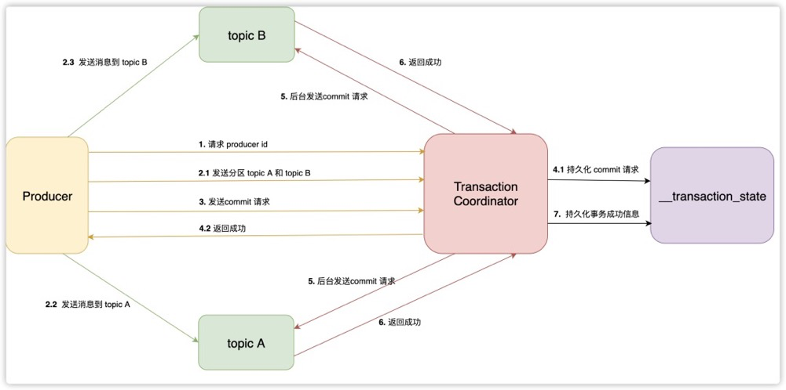
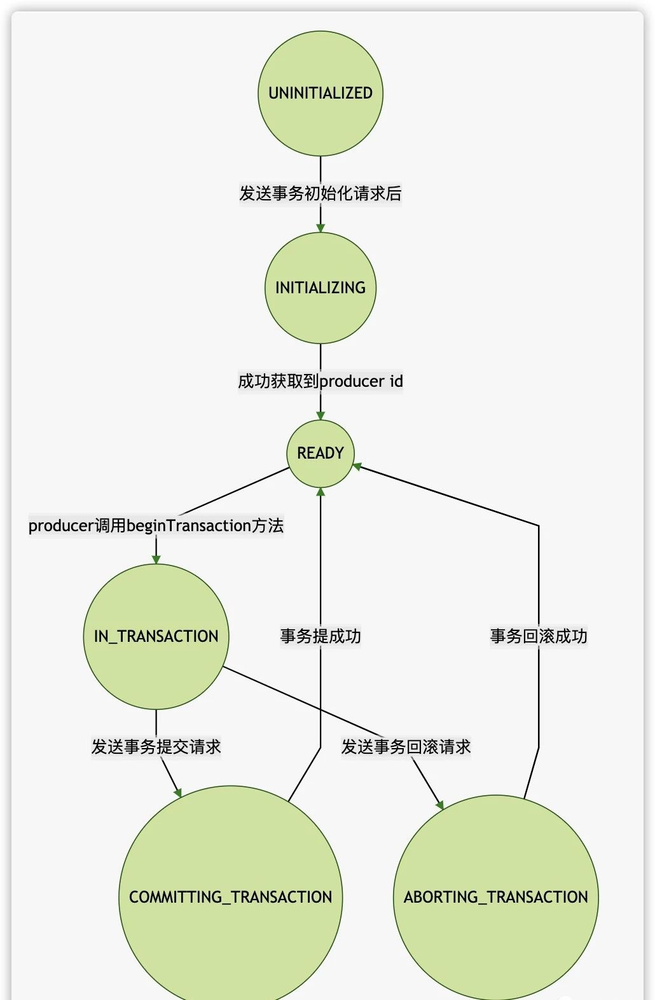
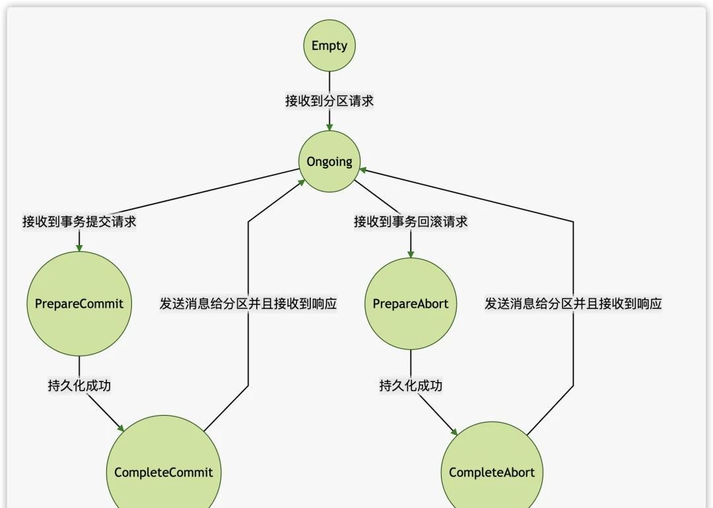
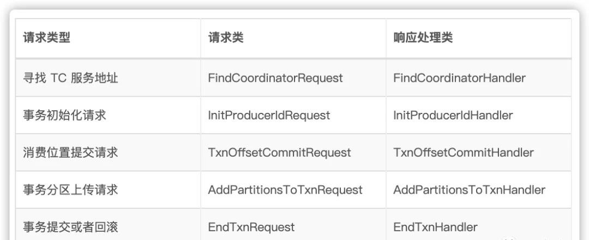
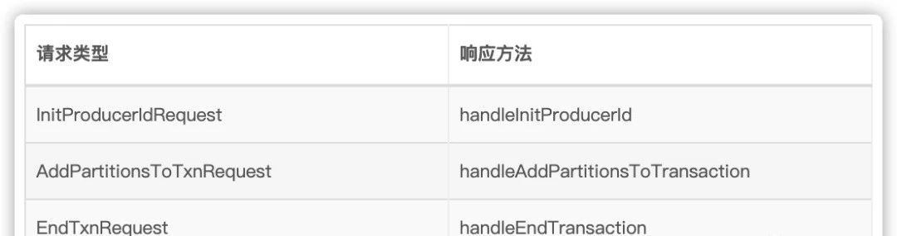

Kafka 事务在流处理中应用很广泛，比如原子性的读取消息，立即处理和发送，如果中途出现错误，支持回滚操作。这篇文章来讲讲事务是如何实现的，首先来看看事务流程图。

### 1.事务流程



上图中的 Transaction Coordinator 运行在 Kafka 服务端，下面简称 TC 服务。

__transaction_state 是 TC 服务持久化事务信息的 topic 名称，下面简称事务 topic。

Producer 向 TC 服务发送的 commit 消息，下面简称事务提交消息。

TC 服务向分区发送的消息，下面简称事务结果消息。

### 2.寻找 TC 服务地址 
Producer 会首先从 Kafka 集群中选择任意一台机器，然后向其发送请求，获取 TC 服务的地址。Kafka 有个特殊的事务 topic，名称为__transaction_state ，负责持久化事务消息。这个 topic 有多个分区，默认有50个，每个分区负责一部分事务。事务划分是根据 transaction id， 计算出该事务属于哪个分区。这个分区的 leader 所在的机器，负责这个事务的TC 服务地址。

### 3.事务初始化

Producer 在使用事务功能，必须先自定义一个唯一的 transaction id。有了 transaction id，即使客户端挂掉了，它重启后也能继续处理未完成的事务。

Kafka 实现事务需要依靠幂等性，而幂等性需要指定 producer id 。所以Producer在启动事务之前，需要向 TC 服务申请 producer id。TC 服务在分配 producer id 后，会将它持久化到事务 topic。

### 4.发送消息

Producer 在接收到 producer id 后，就可以正常的发送消息了。不过发送消息之前，需要先将这些消息的分区地址，上传到 TC 服务。TC 服务会将这些分区地址持久化到事务 topic。然后 Producer 才会真正的发送消息，这些消息与普通消息不同，它们会有一个字段，表示自身是事务消息。

这里需要注意下一种特殊的请求，提交消费位置请求，用于原子性的从某个 topic 读取消息，并且发送消息到另外一个 topic。我们知道一般是消费者使用消费组订阅 topic，才会发送提交消费位置的请求，而这里是由 Producer 发送的。

Producer 首先会发送一条请求，里面会包含这个消费组对应的分区（每个消费组的消费位置都保存在 __consumer_offset topic 的一个分区里），TC 服务会将分区持久化之后，发送响应。Producer 收到响应后，就会直接发送消费位置请求给 GroupCoordinator。

### 5.发送提交请求

Producer 发送完消息后，如果认为该事务可以提交了，就会发送提交请求到 TC 服务。Producer 的工作至此就完成了，接下来它只需要等待响应。这里需要强调下，Producer 会在发送事务提交请求之前，会等待之前所有的请求都已经发送并且响应成功。

**提交请求持久化**

TC 服务收到事务提交请求后，会先将提交信息先持久化到事务 topic 。持久化成功后，服务端就立即发送成功响应给 Producer。然后找到该事务涉及到的所有分区，为每 个分区生成提交请求，存到队列里等待发送。

读者可能有所疑问，在一般的二阶段提交中，协调者需要收到所有参与者的响应后，才能判断此事务是否成功，最后才将结果返回给客户。那如果 TC 服务在发送响应给 Producer 后，还没来及向分区发送请求就挂掉了，那么 Kafka 是如何保证事务完成。因为每次事务的信息都会持久化，所以 TC 服务挂掉重新启动后，会先从 事务 topic 加载事务信息，如果发现只有事务提交信息，却没有后来的事务完成信息，说明存在事务结果信息没有提交到分区。

**发送事务结果信息给分区**

后台线程会不停的从队列里，拉取请求并且发送到分区。当一个分区收到事务结果消息后，会将结果保存到分区里，并且返回成功响应到 TC服务。当 TC 服务收到所有分区的成功响应后，会持久化一条事务完成的消息到事务 topic。至此，一个完整的事务流程就完成了。

### 6.客户端原理

**使用示例：**

下面代码实现，消费者读取消息，并且发送到多个分区的事务：

```
// 创建 Producer 实例，并且指定 transaction id
KafkaProducer producer = createKafkaProducer(
  “bootstrap.servers”, “localhost:9092”,
  “transactional.id”, “my-transactional-id”);

// 初始化事务，这里会向 TC 服务申请 producer id
producer.initTransactions();

// 创建 Consumer 实例，并且订阅 topic
KafkaConsumer consumer = createKafkaConsumer(
  “bootstrap.servers”, “localhost:9092”,
  “group.id”, “my-group-id”,
  "isolation.level", "read_committed");
consumer.subscribe(singleton(“inputTopic”));

while (true) {
  ConsumerRecords records = consumer.poll(Long.MAX_VALUE);
  // 开始新的事务
  producer.beginTransaction();
  for (ConsumerRecord record : records) {
    // 发送消息到分区
    producer.send(producerRecord(“outputTopic_1”, record));
    producer.send(producerRecord(“outputTopic_2”, record));
  }
  // 提交 offset
  producer.sendOffsetsToTransaction(currentOffsets(consumer), "my-group-id");  
  // 提交事务
  producer.commitTransaction();
}
```
### 7.运行原理

上面的例子使用了 Producer的接口实现了事务，但负责与 TC 服务通信的是 TransactionManager 类。

TransactionManager 类会发送申请分配 producer id 请求，上传消息分区请求和事务提交请求，在完成每一步请求，TransactionManager 都会更新自身的状态。



**状态**

```
private enum State {
    UNINITIALIZED,
    INITIALIZING,
    READY,
    IN_TRANSACTION,
    COMMITTING_TRANSACTION,
    ABORTING_TRANSACTION,
    ABORTABLE_ERROR,
    FATAL_ERROR;
}
```

这里还有两个状态没有列出来 ABORTABLE_ERROR或FATAL_ERROR，这是当请求出错后，状态就会变为它们。

### 8.服务端原理

TC 服务会为每个 transaction id 都维护了元数据，元数据的字段如下：

```
class TransactionMetadata(
    val transactionalId: String,      // 事务 id
    var producerId: Long,             // pruducer id
    var producerEpoch: Short,         // producer epoch
    var txnTimeoutMs: Int,            // 事务超时时间
    var state: TransactionState,      // 事务当前状态
    val topicPartitions: mutable.Set[TopicPartition],    // 该事务涉及到的分区列表
    @volatile var txnStartTimestamp: Long = -1,          // 事务开始的时间
    @volatile var txnLastUpdateTimestamp: Long)          // 事务的更新时间
```

对于服务端，每个事务也有对应的状态



当 TC 服务接收到了来自客户端的分区上传请求，此时它才会认为此次事务开始了，然后它会更新分区列表，更新此次的事务开始时间为当前时间，并且会将更新后的元数据，持久化到事务 topic。最后将自身状态改为 Ongoing。

当TC 服务收到事务提交请求或者事务回滚请求，更新元数据，持久化到事务 topic，然后自身状态改为CompleteCommit 或CompleteAbort 。然后向涉及到该事务的分区发送事务结果消息，等待所有的分区都成功返回响应后，就会持久化一条事务成功的消息到消息 topic。

### 9.高可用分析

**TC 服务**

通过上述对 Kafka 事务的简述，可以看到 TC 服务起着很重要的作用。事实上 Kafka 集群中运行着多个 TC 服务，每个TC 服务负责事务 topic 的一个分区读写，也就是这个分区的 leader。Producer 根据 transaction id 的哈希值，来决定该事务属于事务 topic 的哪个分区，最后找到这个分区的 leader 位置。

既然 TC 服务负责事务 topic 的一个分区 leader，我们知道当一个分区的 leader挂掉之后，Kafka 会保证这个的分区的 follower 会转换为 leader 角色，会继续对外提供服务。这么 TC 服务的高可用就达到了。

**消息持久化**

TC 服务为了支持重启后，也能恢复到之前的状态，所以它将每次重要的消息都会持久化起来，并且保存到事务 topic 的时候，指定 leader 分区和 follower 分区必须都存储成功。这样每次 TC 服务启动的时候，都会从事务 topic 读取之前的状态，加载到缓存里。

比如当TC 服务在响应客户端的事务提交请求后，还没来得及向各分区发送事务结果请求，就已经挂掉了。之后 TC 服务重启，会去事务 topic 加载数据，它发现事务的最后状态为 PrepareCommit，并且事务数据还包括了分区列表，这样 TC 服务会继续未完成的事务，会向列表中的各个分区发送事务结果请求。

**超时处理**

如果 Producer 发起了一个事务，但是由于网络问题，TC 服务迟迟没有接下来的请求，那么该事务就会被认为超时。TC 服务会有个线程，会定期检查处理 Ongoing 状态的事务，如果该事务的开始时间和当前时间的差，超过了指定的超时时间（在发送申请producer id请求时可以指定），那么 TC 服务就会回滚该事务，更新和持久化事务的状态，并且发送事务回滚结果给分区。

**源码分析**

如果对源码还有兴趣的读者，可以继续阅读这部分。这里会大概的讲解下代码结构，读者如果想进一步的理解，可以参看源码。整个事务的源码分为两部分，客户端和服务端。

### 10.客户端

事务的客户端，只能是 Producer。下面首先介绍下 Producer 与事务相关的接口。

```
public interface Producer<K, V> extends Closeable {
    // 初始化事务，包括申请 producer id
    void initTransactions();
    // 开始事务，这里会更改事务的本地状态
    void beginTransaction() throws ProducerFencedException;
    // 提交消费位置， offsets表示每个分区的消费位置， consumerGroupId表示消费组的名称
    void sendOffsetsToTransaction(Map<TopicPartition, OffsetAndMetadata> offsets,
                                  String consumerGroupId) throws ProducerFencedException;
    // 发送事务提交请求
    void commitTransaction() throws ProducerFencedException;
    // 发送事务回滚请求
    void abortTransaction() throws ProducerFencedException;
}
```

KafkaProducer 类实现了 Producer 接口，比较简单，只是调用了 TransactionCoordinator 类的方法。客户端事务处理的核心代码，都是在 TransactionCoordinator 类里。



TransactionCoordinator 发送的请求类，都有一个对应的类来处理响应。这些处理类都是继承 TxnRequestHandler 类，它封装了共同的错误处理，比如连接断开，api 版本不兼容等。子类需要实现 handleResponse 方法，负责处理具体的响应内容。

initializeTransactions 方法负责事务初始化，它会发送 InitProducerIdRequest 请求。

```
public synchronized TransactionalRequestResult initializeTransactions() {
    // 检查transaction id是否已经设置
    ensureTransactional();
    // 更改自身状态为INITIALIZING
    transitionTo(State.INITIALIZING);
    // 将producer id和epoch都设为空
    setProducerIdAndEpoch(ProducerIdAndEpoch.NONE);
    // nextSequence在消息发送中会用到，因为发送事务消息要求幂等性，而发送幂等性的消息是需要设置sequence的
    this.nextSequence.clear();
    // 构建申请produce id请求
    InitProducerIdRequest.Builder builder = new InitProducerIdRequest.Builder(transactionalId, transactionTimeoutMs);
    // InitProducerIdHandler 负责处理响应
    InitProducerIdHandler handler = new InitProducerIdHandler(builder);
    // 将消息保存到队列中，等待Sender线程（Producer会有个后台线程发送消息）发送
    enqueueRequest(handler);
    // 返回异步结果
    return handler.result;
}
```

InitProducerIdHandler 类的定义如下：

```
private class InitProducerIdHandler extends TxnRequestHandler {

    @Override
    public void handleResponse(AbstractResponse response) {
        InitProducerIdResponse initProducerIdResponse = (InitProducerIdResponse) response;
        // 检查错误
        Errors error = initProducerIdResponse.error();
        if (error == Errors.NONE) {
            ProducerIdAndEpoch producerIdAndEpoch = new ProducerIdAndEpoch(initProducerIdResponse.producerId(), initProducerIdResponse.epoch());
            // 保存结果 producer id和epoch
            setProducerIdAndEpoch(producerIdAndEpoch);
            // 更改状态为READY
            transitionTo(State.READY);
            lastError = null;
            // 通知异步结果已完成
            result.done();
        } else if (error == Errors.NOT_COORDINATOR || error == Errors.COORDINATOR_NOT_AVAILABLE) {
            // 如果TC服务没有找到或者刚好挂掉，那么生成FindCoordinatorRequest请求，等待发送
            lookupCoordinator(FindCoordinatorRequest.CoordinatorType.TRANSACTION, transactionalId);
            // 并且将自身请求也放入队列，等待发送
            reenqueue();
        } else if (error == Errors.COORDINATOR_LOAD_IN_PROGRESS || error == Errors.CONCURRENT_TRANSACTIONS) {
            // 如果TC服务正在启动中，那么加入队列，等待发送
            reenqueue();
        } else if (error == Errors.TRANSACTIONAL_ID_AUTHORIZATION_FAILED) {
            // 如果发生权限问题，那么认为进入错误状态
            fatalError(error.exception());
        } else {
            fatalError(new KafkaException("Unexpected error in InitProducerIdResponse; " + error.message()));
        }
    }
}
```

beginTransaction 方法负责开始新事务，它只是更改自身状态为 IN_TRANSACTION，并不会发送任何请求。

```
public synchronized void beginTransaction() {
    // 检查 transaction id
    ensureTransactional();
    // 检查之前响应是否出错
    maybeFailWithError();
    // 更改状态
    transitionTo(State.IN_TRANSACTION);
}
```

我们知道Producer发送消息，都是先将消息发送到缓存队列里，最后是由Sender线程发送出去 。Producer 如果开启了事务， 它在发送消息到缓存之前，会将消息所在的分区保存在 TransactionCoordinator 里。然后Sender线程在发送消息之前，会去从 TransactionCoordinator 检查是否需要上次分区到 TC 服务，如果有就先上次分区，随后才发送消息。

```
public class KafkaProducer<K, V> implements Producer<K, V> {
    private Future<RecordMetadata> doSend(ProducerRecord<K, V> record, Callback callback) {
        .......
        int partition = partition(record, serializedKey, serializedValue, cluster);
        tp = new TopicPartition(record.topic(), partition);
        ......
        if (transactionManager != null && transactionManager.isTransactional())
            // 如果开启了事务，那么就先将分区保存在 transactionManager
            transactionManager.maybeAddPartitionToTransaction(tp);
        ......
    }
}
```

TransactionManager 提供了 maybeAddPartitionToTransaction 方法添加分区。

```
public class TransactionManager {
    // 新增的上传分区集合
    private final Set<TopicPartition> newPartitionsInTransaction;
    // 本次事务已经上传的分区集合
    private final Set<TopicPartition> partitionsInTransaction;
    // 本次事务涉及到的所有分区集合
    private final Set<TopicPartition> pendingPartitionsInTransaction;

    public synchronized void maybeAddPartitionToTransaction(TopicPartition topicPartition) {
        // 检查事务状态必须为IN_TRANSACTION
        failIfNotReadyForSend();
        // 如果已经上传过这个分区，或者正在上传这个分区，那么直接返回
        if (isPartitionAdded(topicPartition) || isPartitionPendingAdd(topicPartition))
            return;

        log.debug("Begin adding new partition {} to transaction", topicPartition);
        // 添加到需要上次的集合
        newPartitionsInTransaction.add(topicPartition);
    }

    // 检查是否这个分区已经上传过了
    synchronized boolean isPartitionAdded(TopicPartition partition) {
        return partitionsInTransaction.contains(partition);
    }

    // 检查是否这个分区正在上传中
    synchronized boolean isPartitionPendingAdd(TopicPartition partition) {
        return newPartitionsInTransaction.contains(partition) || pendingPartitionsInTransaction.contains(partition);
    }    
}
```

TransactionManager 的 addPartitionsToTransactionHandler 方法，会生成分区上传请求，然后由Sender发送。

```
public class TransactionManager {

    private synchronized TxnRequestHandler addPartitionsToTransactionHandler() {
        // 将新增的分区，添加到 pendingPartitionsInTransaction 集合
        pendingPartitionsInTransaction.addAll(newPartitionsInTransaction);
        // 清空新增的分区集合
        newPartitionsInTransaction.clear();
        // 构建 AddPartitionsToTxnRequest 请求
        AddPartitionsToTxnRequest.Builder builder = new AddPartitionsToTxnRequest.Builder(transactionalId,
                producerIdAndEpoch.producerId, producerIdAndEpoch.epoch, new ArrayList<>(pendingPartitionsInTransaction));
        return new AddPartitionsToTxnHandler(builder);
    }
}
```

AddPartitionsToTxnHandler 负责处理响应。

```
private class AddPartitionsToTxnHandler extends TxnRequestHandler {

    @Override
    public void handleResponse(AbstractResponse response) {
        AddPartitionsToTxnResponse addPartitionsToTxnResponse = (AddPartitionsToTxnResponse) response;
        Map<TopicPartition, Errors> errors = addPartitionsToTxnResponse.errors();
        boolean hasPartitionErrors = false;
        Set<String> unauthorizedTopics = new HashSet<>();
        retryBackoffMs = TransactionManager.this.retryBackoffMs;

        for (Map.Entry<TopicPartition, Errors> topicPartitionErrorEntry : errors.entrySet()) {
            // 检查每个分区的响应错误
            .....
        }

        Set<TopicPartition> partitions = errors.keySet();
        // 因为这些分区已经有响应了，即使错误也需要从集合中删除
        pendingPartitionsInTransaction.removeAll(partitions);

        if (!unauthorizedTopics.isEmpty()) {
            abortableError(new TopicAuthorizationException(unauthorizedTopics));
        } else if (hasPartitionErrors) {
            abortableError(new KafkaException("Could not add partitions to transaction due to errors: " + errors));
        } else {
            log.debug("Successfully added partitions {} to transaction", partitions);
            // 将这些成功响应的分区，添加到 partitionsInTransaction集合
            partitionsInTransaction.addAll(partitions);
            transactionStarted = true;
            // 通知结果成功
            result.done();
        }
    }
}
```

sendOffsetsToTransaction 方法负责发送消费位置提交请求。

```
public class TransactionManager {
    public synchronized TransactionalRequestResult sendOffsetsToTransaction(Map<TopicPartition, OffsetAndMetadata> offsets, String consumerGroupId) {
        // 保证transaction id
        ensureTransactional();
        // 检查之前的响应错误
        maybeFailWithError();
        // 只有 IN_TRANSACTION 状态才可以发送这种类型请求
        if (currentState != State.IN_TRANSACTION)
            throw new KafkaException("...");
        // 构建请求
        AddOffsetsToTxnRequest.Builder builder = new AddOffsetsToTxnRequest.Builder(transactionalId, producerIdAndEpoch.producerId, producerIdAndEpoch.epoch, consumerGroupId);
        // 构建处理器
        AddOffsetsToTxnHandler handler = new AddOffsetsToTxnHandler(builder, offsets);
        // 添加到队列
        enqueueRequest(handler);
        return handler.result;
    }
}
```

AddOffsetsToTxnHandler 类负责处理响应，它的处理逻辑很简单，它收到响应后，会发送 TxnOffsetCommitRequest 请求给 TC 服务。

最后还剩下事务提交或回滚请求，还没讲述。Producer 在调用 commitTransaction 或 abortTransaction 方法，本质都是调用了 TransactionManager 的 beginCompletingTransaction 方法发送请求。

```
public synchronized TransactionalRequestResult beginCommit() {
    ensureTransactional();
    maybeFailWithError();
    // 更改状态为 COMMITTING_TRANSACTION
    transitionTo(State.COMMITTING_TRANSACTION);
    // 调用 beginCompletingTransaction 方法发送请求
    return beginCompletingTransaction(TransactionResult.COMMIT);
}

public synchronized TransactionalRequestResult beginAbort() {
    ensureTransactional();
    // 更改状态为 ABORTABLE_ERROR
    if (currentState != State.ABORTABLE_ERROR)
        maybeFailWithError();
    transitionTo(State.ABORTING_TRANSACTION);

    // 清空分区集合
    newPartitionsInTransaction.clear();
    // 发送请求
    return beginCompletingTransaction(TransactionResult.ABORT);
}

private TransactionalRequestResult beginCompletingTransaction(TransactionResult transactionResult) {
    // 如果还有分区没有上传，那么生成请求放进队列
    if (!newPartitionsInTransaction.isEmpty())
        enqueueRezquest(addPartitionsToTransactionHandler());
    // 构建请求
    EndTxnRequest.Builder builder = new EndTxnRequest.Builder(transactionalId, producerIdAndEpoch.producerId, producerIdAndEpoch.epoch, transactionResult);
    // 构建处理器
    EndTxnHandler handler = new EndTxnHandler(builder);
    enqueueRequest(handler);
    return handler.result;
}
```

EndTxnHandler 负责处理事务提交或回滚响应，EndTxnHandler的处理逻辑比较简单，它只是调用了 completeTransaction 方法。

```
private synchronized void completeTransaction() {
    // 更改状态为READY
    transitionTo(State.READY);
    lastError = null;
    transactionStarted = false;
    // 清空分区集合
    newPartitionsInTransaction.clear();
    pendingPartitionsInTransaction.clear();
    partitionsInTransaction.clear();
}
```

### 11.服务端

服务端的结构会相对复杂一些，这里尽量简单的讲讲大概逻辑。首先介绍下 TransactionStateManager 类，它负责管理事务的元数据，它也提供持久化事务的元数据，和从事务 topic 加载数据的功能。

```
class TransactionStateManager(...) {
  // key值为 partition id，value为 TxnMetadataCacheEntry对象
  private val transactionMetadataCache: mutable.Map[Int, TxnMetadataCacheEntry] = mutable.Map()
}

// metadataPerTransactionalId 参数是Pool类型，可以看成是Map
// key值为transaction id， value为元数据
private[transaction] case class TxnMetadataCacheEntry(coordinatorEpoch: Int,
                                                      metadataPerTransactionalId: Pool[String, TransactionMetadata])

```

TransactionStateManager 提供了 appendTransactionToLog 方法用于持久化。

```
class TransactionStateManager {

  def appendTransactionToLog(transactionalId: String,
                             coordinatorEpoch: Int,
                             newMetadata: TxnTransitMetadata,  // 新的元数据
                             responseCallback: Errors => Unit, // 回调函数
                             retryOnError: Errors => Boolean = _ => false): Unit = {
    // 生成record的key
    val keyBytes = TransactionLog.keyToBytes(transactionalId)
    // 生成record的calue
    val valueBytes = TransactionLog.valueToBytes(newMetadata)
    // 生成record
    val records = MemoryRecords.withRecords(TransactionLog.EnforcedCompressionType, new SimpleRecord(timestamp, keyBytes, valueBytes))
    val topicPartition = new TopicPartition(Topic.TRANSACTION_STATE_TOPIC_NAME, partitionFor(transactionalId))
    val recordsPerPartition = Map(topicPartition -> records)      

    // 当持久化完成后，会调用这个函数，更新transactionMetadataCache集合的元数据
    def updateCacheCallback(responseStatus: collection.Map[TopicPartition, PartitionResponse]): Unit = {
        // 检查持久化是否出错
        .....
        // 更改元数据
        metadata.completeTransitionTo(newMetadata)
        // 执行回调函数
        responseCallback(responseError)
    }

    ......

    // 持久化recod到topic里
    replicaManager.appendRecords(
                newMetadata.txnTimeoutMs.toLong,
                TransactionLog.EnforcedRequiredAcks,
                internalTopicsAllowed = true,
                isFromClient = false,
                recordsPerPartition,
                updateCacheCallback,   // 持久化完成后，会调用这个函数
                delayedProduceLock = Some(stateLock.readLock))
}
```

TransactionStateManager 提供了 loadTransactionsForTxnTopicPartition 方法用于从消息 topic 恢复数据，这里不再详细介绍。

接下来来讲讲 TransactionCoordinator 类，它负责处理重要的事务请求。



handleInitProducerId 方法会返回 producer id，如果这个事务的 transaction id 第一次请求，那么会为它分配新的 producer id 。如果之前请求过，就会返回之前分配的 producer id。

handleAddPartitionsToTransaction 方法会将上传的分区列表，添加到元数据并且持久化。

handleEndTransaction 方法会稍微复杂一些，因为它需要将这个消息转发给各个分区。

```
def handleEndTransaction(transactionalId: String,
                         producerId: Long,
                         producerEpoch: Short,
                         txnMarkerResult: TransactionResult,
                         responseCallback: EndTxnCallback): Unit = {
    // 获取元数据，更改状态
    val preAppendResult: ApiResult[(Int, TxnTransitMetadata)] = txnManager.getTransactionState(transactionalId).right.flatMap {
      case None =>
        // 如果元数据不存在，说明存在问题
        Left(Errors.INVALID_PRODUCER_ID_MAPPING)
      case Some(epochAndTxnMetadata) =>
        val txnMetadata = epochAndTxnMetadata.transactionMetadata
        val coordinatorEpoch = epochAndTxnMetadata.coordinatorEpoch
        ......
        txnMetadata.state match {
            // 必须是Ongoing状态，如果是别的状态，就会报错
            case Ongoing =>
              // 根据发送的消息类型，查看是事务提交还是回滚，来决定接下来的状态
              val nextState = if (txnMarkerResult == TransactionResult.COMMIT)
                PrepareCommit
              else
                PrepareAbort
              // 调用 prepareAbortOrCommit 来更新状态
              Right(coordinatorEpoch, txnMetadata.prepareAbortOrCommit(nextState, time.milliseconds()))
        }
    }

    // 检查上一步的结果
    preAppendResult match {
      case Left(err) =>
        responseCallback(err)
      case Right((coordinatorEpoch, newMetadata)) =>

        // 定义回调函数，用于发送请求到分区
        def sendTxnMarkersCallback(error: Errors): Unit = {
          if (error == Errors.NONE) {
              ...... // 检查状态，只有是PrepareCommit或PrepareAbort，才能继续执行
            txnMetadata.state match {
              case PrepareCommit =>
                // 更改状态为 CompleteCommit
                txnMetadata.prepareComplete(time.milliseconds())
              case PrepareAbort =>
                // 更改状态为 CompleteAbort
                txnMetadata.prepareComplete(time.milliseconds())
            }
          }
          // 检查更改状态的结果
          preSendResult match {
            case Left(err) =>
              responseCallback(err)
            case Right((txnMetadata, newPreSendMetadata)) =>
              // 向客户端发送成功响应
              responseCallback(Errors.NONE)
              // 通过txnMarkerChannelManager发送请求到分区
              txnMarkerChannelManager.addTxnMarkersToSend(transactionalId, coordinatorEpoch, txnMarkerResult, txnMetadata, newPreSendMetadata)
          }
        }

        // 持久化元数据，然后调用sendTxnMarkersCallback函数，发送客户端的响应和发送请求到分区
        txnManager.appendTransactionToLog(transactionalId, coordinatorEpoch, newMetadata, sendTxnMarkersCallback)
```

上面发送请求到分区，调用了 TransactionMarkerChannelManager 的方法。它会生成每个分区的请求，然后放到一个队列里，后台线程会负责将这些请求发送出去。当收到所有分区的响应后，它还负责更改事务的状态，并且负责持久化一条事务成功的消息。

这里需要提下延迟任务 DelayedTxnMarker，它负责检查是否收到所有分区的响应。它设置的延迟时间达到365天，所以可以认为次任务几乎不会过期。

```
private[transaction] class DelayedTxnMarker(txnMetadata: TransactionMetadata,
                                           completionCallback: Errors => Unit,
                                           lock: Lock)
  extends DelayedOperation(TimeUnit.DAYS.toMillis(100 * 365), Some(lock)) {

  override def tryComplete(): Boolean = {
    txnMetadata.inLock {
      // 当每收到一个分区的响应后，就会从元数据中删除掉。
      // 直到分区列表为空，就说明所有分区都已经成功响应
      if (txnMetadata.topicPartitions.isEmpty)
        forceComplete()
      else false
    }
  }

  override def onExpiration(): Unit = {
    // this should never happen
    throw new IllegalStateException(s"Delayed write txn marker operation for metadata $txnMetadata has timed out, this should never happen.")
  }

  // TODO: if we will always return NONE upon completion, we can remove the error code in the param
  override def onComplete(): Unit = completionCallback(Errors.NONE)
}
```

DelayedTxnMarker 是在 TransactionMarkerChannelManager 的 addTxnMarkersToSend 方法中实例化的，它的 completionCallback 参数，就是定义在 addTxnMarkersToSend 方法里面。

```
def addTxnMarkersToSend(transactionalId: String,
                        coordinatorEpoch: Int,
                        txnResult: TransactionResult,
                        txnMetadata: TransactionMetadata,
                        newMetadata: TxnTransitMetadata): Unit = {
  // 定义延迟任务的回调函数
  def appendToLogCallback(error: Errors): Unit = {
    // 检查错误
    error match {
      case Errors.NONE =>
        // 检查状态
        txnStateManager.getTransactionState(transactionalId) match {
          case Right(Some(epochAndMetadata)) =>
            if (epochAndMetadata.coordinatorEpoch == coordinatorEpoch) {
               // 持久化事务成功消息TxnLogAppend，写入到事务 topic
              tryAppendToLog(TxnLogAppend(transactionalId, coordinatorEpoch, txnMetadata, newMetadata))
            }
        }
    }
  }

  // 实例化延迟任务
  val delayedTxnMarker = new DelayedTxnMarker(txnMetadata, appendToLogCallback, txnStateManager.stateReadLock)
  // 等待执行
  txnMarkerPurgatory.tryCompleteElseWatch(delayedTxnMarker, Seq(transactionalId))
  // 将请求放进队列里
  addTxnMarkersToBrokerQueue(transactionalId, txnMetadata.producerId, txnMetadata.producerEpoch, txnResult, coordinatorEpoch, txnMetadata.topicPartitions.toSet)
}
```
