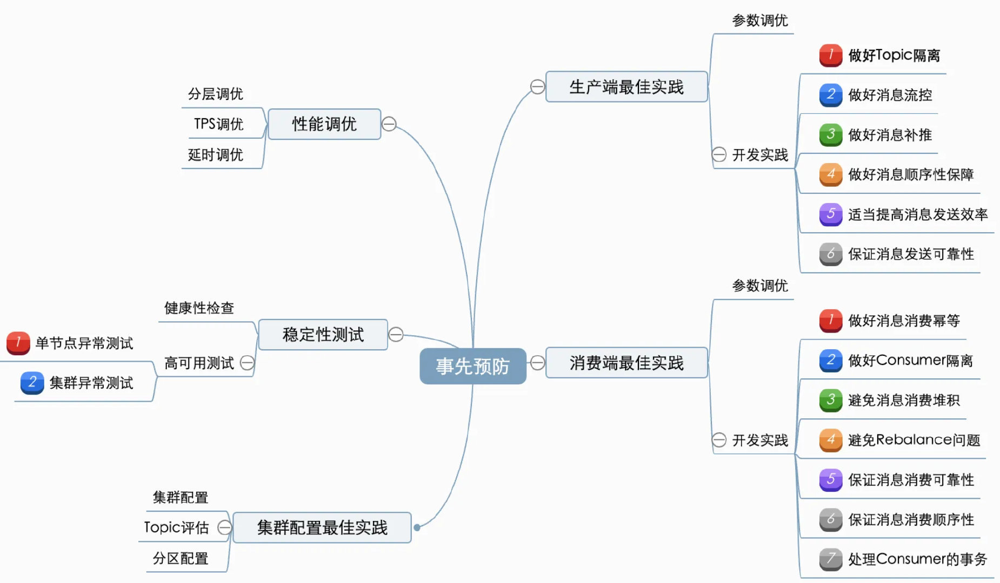
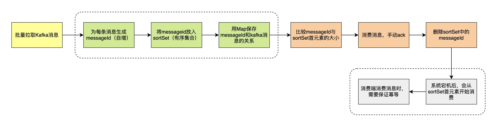
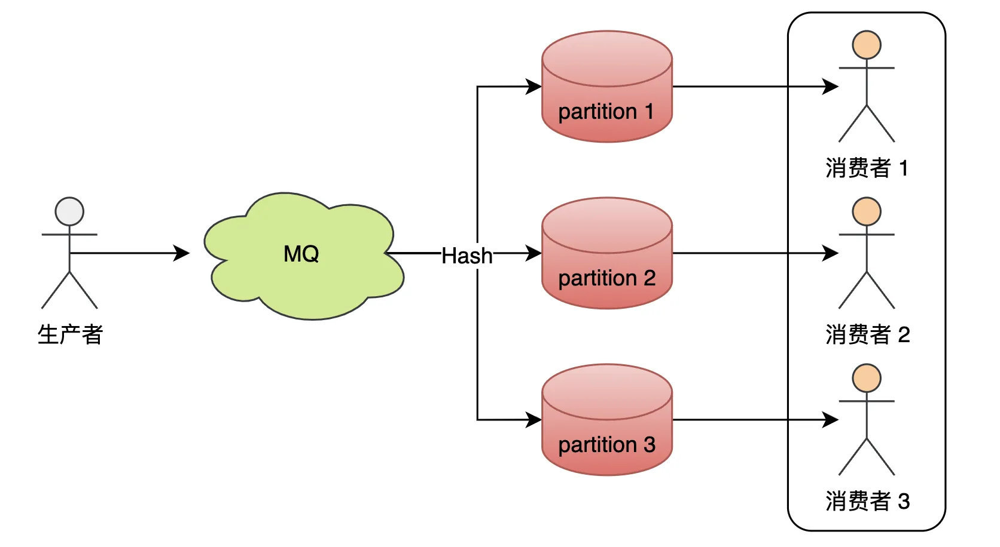
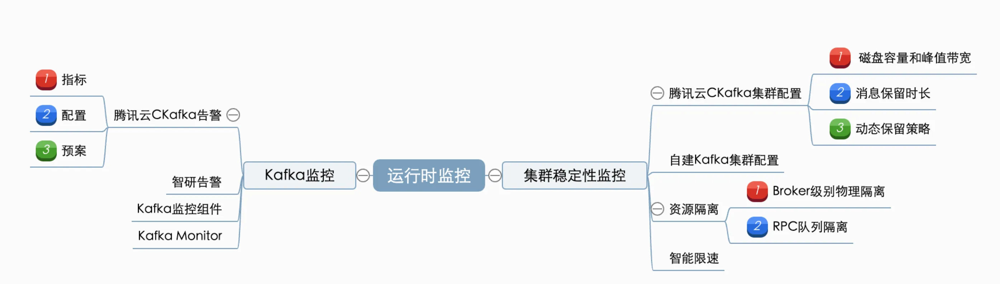
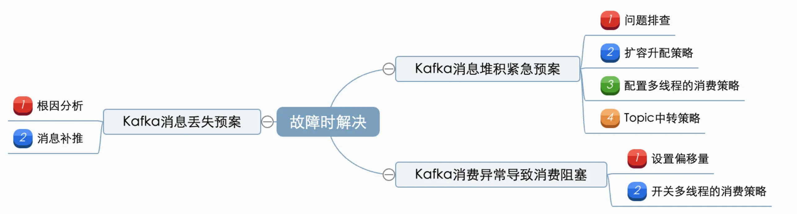
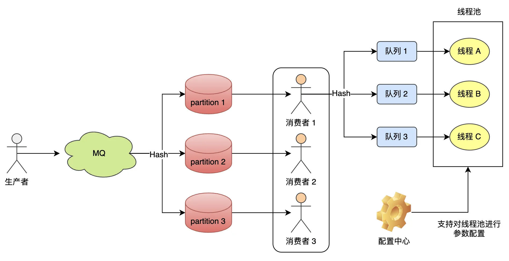
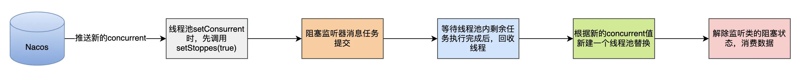
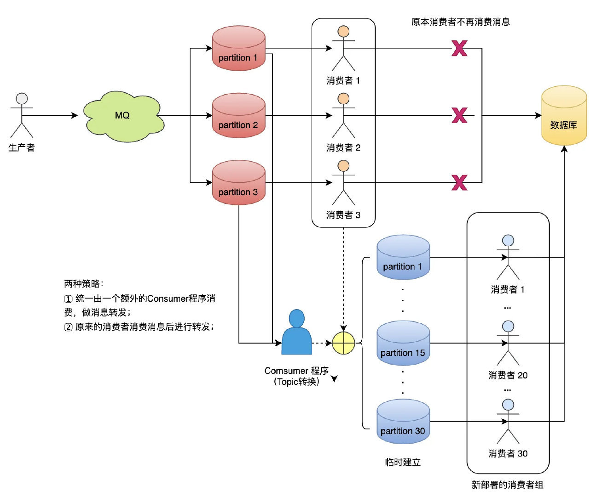
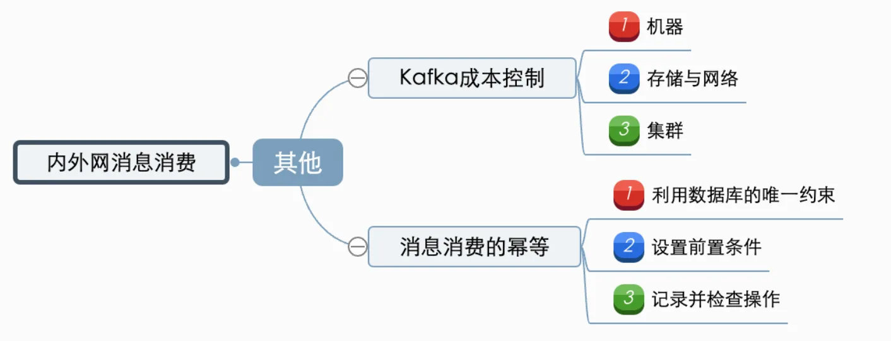
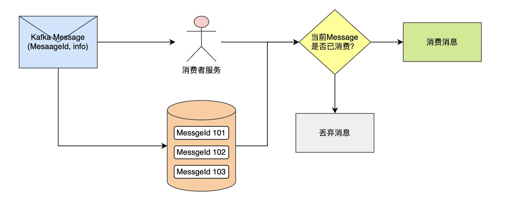

要确保 Kafka 在使用过程中的稳定性，需要从 kafka 在业务中的使用周期进行依次保障。主要可以分为：事先预防（通过规范的使用、开发，预防问题产生）、运行时监控（保障集群稳定，出问题能及时发现）、故障时解决（有完整的应急预案）这三阶段。

### 一、事先预防

事先预防即通过规范的使用、开发，预防问题产生。主要包含集群/生产端/消费端的一些最佳实践、上线前测试以及一些针对紧急情况上线前测试以及一些针对紧急情况 Kafka 调优原则：

1. 确定优化目标，并且定量给出目标（Kafka 常见的优化目标是吞吐量、延时、持久性和可用性）；
2. 确定了目标之后，需要明确优化的维度：

* 通用性优化：操作系统、JVM 等；
* 针对性优化：优化 Kafka 的 TPS、处理速度、延时等。

#### 1. 生产端最佳实践

##### 1.1 参数调优

* 使用 Java 版的 Client；
* 使用 kafka-producer-perf-test.sh 测试你的环境；
* 设置内存、CPU、batch 压缩；
* batch.size：该值设置越大，吞吐越大，但延迟也会越大；
* linger.ms：表示 batch 的超时时间，该值越大，吞吐越大、但延迟也会越大；
* max.in.flight.requests.per.connection：默认为 5，表示 client 在 blocking 之前向单个连接（broker）发送的未确认请求的最大数,超过 1 时，将会影响数据的顺序性；
* compression.type：压缩设置，会提高吞吐量；
* acks：数据 durability 的设置；
* 避免大消息（占用过多内存、降低 broker 处理速度）；
* broker 调整：增加 num.replica.fetchers,提升 Follower 同步 TPS，避免 Broker Full GC 等；
* 当吞吐量小于网络带宽时：增加线程、提高 batch.size、增加更多 producer 实例、增加 partition 数；
* 设置 acks=-1 时，如果延迟增大：可以增大 num.replica.fetchers（follower 同步数据的线程数）来调解；
* 跨数据中心的传输：增加 socket 缓冲区设置以及 OS tcp 缓冲区设置。

###### 1.2 开发实践

**(1) 做好 Topic 隔离**

根据具体场景（是否允许一定延迟、实时消息、定时周期任务等）区分 kafka topic，避免挤占或阻塞实时业务消息的处理。

**(2) 做好消息流控**

如果下游消息消费存在瓶颈或者集群负载过高等，需要在生产端（或消息网关）实施流量生产速率的控制或者延时/暂定消息发送等策略，避免短时间内发送大量消息。

**(3) 做好消息补推**

手动去查询丢失的那部分数据，然后将消息重新发送到 mq 里面，把丢失的数据重新补回来。

**(4) 做好消息顺序性保障**

如果需要在保证 Kafka 在分区内严格有序的话（即需要保证两个消息是有严格的先后顺序），需要设置 key，让某类消息根据指定规则路由到同一个 topic 的同一个分区中（能解决大部分消费顺序的问题）。 但是，需要避免分区内消息倾斜的问题（例如，按照店铺 Id 进行路由，容易导致消息不均衡的问题）。

生产端：消息发送指定 key，确保相同 key 的消息发送到同一个 partition。
消费端：单线程消费或者写 N 个内存 queue，具有相同 key 的数据都到同一个内存 queue；然后对于 N 个线程，每个线程分别消费一个内存 queue ；

**(5) 适当提高消息发送效率**

* **批量发送**：kafka 先将消息缓存在内存中的双端队列（buffer）中，当消息量达到 batch size 指定大小时进行批量发送，减少了网络传输频次，提高了传输效率；
* **端到端压缩消息**： 将一批消息打包后进行压缩，发送给 Broker 服务器后，但频繁的压缩和解压也会降低性能，最终还是以压缩的方式传递到消费者的手上，在 Consumer 端进行解压；
* **异步发送**：将生产者改造为异步的方式，可以提升发送效率，但是如果消息异步产生过快，会导致挂起线程过多，内存不足，最终导致消息丢失；
* **索引分区并行消费**：当一个时间相对长的任务在执行时，它会占用该消息所在索引分区被锁定，后面的任务不能及时派发给空闲的客户端处理，若服务端如果启用索引分区并行消费的特性，就可以及时的把后面的任务派发给其他的客户端去执行，同时也不需要调整索引的分区数（但此类消息仅适用于无需保证消息顺序关系的消息）

(6) 保证消息发送可靠性

**Producer**：如果对数据可靠性要求很高的话，在发送消息的时候，需要选择带有 callBack 的api 进行发送，并设置 acks、retries、factor 等等些参数来保证 Producer 发送的消息不丢失。
Broker：kafka 为了得到更高的性能和吞吐量，将数据异步批量的存储在磁盘中，并采用了批量刷盘的做法，如果对数据可靠性要求很高的话，可以修改为同步刷盘的方式提高消息的可靠性。

#### 2. 消费端最佳实践

##### 2.1 参数调优

吞吐量：调整 partition 数、OS page cache（分配足够的内存来缓存数据）；
offset topic（__consumer_offsets）：offsets.topic.replication.factor（默认为 3）、offsets.retention.minutes（默认为 1440，即 1day）；
offset commit 较慢：异步 commit 或 手动 commit
fetch.min.bytes 、fetch.max.wait.ms
max.poll.interval.ms：调用 poll() 之后延迟的最大时间，超过这个时间没有调用 poll() 的话，就会认为这个 consumer 挂掉了，将会进行 rebalance
max.poll.records：当调用 poll() 之后返回最大的 record 数，默认为 500
session.timeout.ms
Consumer Rebalance：check timeouts、check processing times/logic、GC Issues
网络配置

##### 2.2 开发实践

**(1) 做好消息消费幂等**

消息消费的幂等主要根据业务逻辑做调整。

**以处理订单消息为例：**

1. 由订单编号+订单状态唯一的幂等 key，并存入 redis；
2. 在处理之前，首先会去查 Redis 是否存在该 Key，如果存在，则说明已经处理过了，直接丢掉；
3. 如果 Redis 没处理过，则将处理过的数据插入到业务 DB 上,再到最后把幂等 Key 插入到 Redis 上；

简而言之，即通过 Redis 做前置处理 + DB 唯一索引做最终保证来实现幂等性。

**(2) 做好 Consumer 隔离**

在消息量非常大的情况下，实时和离线消费者同时消费一个集群，离线数据繁重的磁盘 IO 操作会直接影响实时业务的实时性和集群的稳定性。

根据消费的实时性可以将消息消费者行为划分两类：实时消费者和离线消费者。

* 实时消费者：对数据实时性要求较高；在实时消费的场景下，Kafka 会利用系统的 page cache缓存，直接从内存转发给实时消费者（热读），磁盘压力为零，适合广告、推荐等业务场景。
* 离线消费者（定时周期性消费者）：通常是消费数分钟前或是数小时前的消息，这类消息通常存储在磁盘中，消费时会触发磁盘的 IO 操作（冷读），适合报表计算、批量计算等周期性执行的业务场景。

**(3) 避免消息消费堆积**

* 延迟处理、控制速度，时间范围内分摊消息（针对实时性不高的消息）；
* 生产速度大于消费速度，这样可以适当增加分区，增加 consumer 数量，提升消费 TPS；
* 避免很重的消费逻辑，优化 consumer TPS：
   1. 是否有大量 DB 操作； 
   2. 下游/外部服务接口调用超时；
   3. 是否有 lock 操作（导致线程阻塞）；
   4. 需要特别关注 kafka 异步链路中的涉及消息放大的逻辑；
* 如果有较重的消费逻辑，需要调整 xx 参数，避免消息没消费完时，消费组退出，造成 reblance等问题
* 确保 consumer 端没有因为异常而导致消费 hang 住;
* 如果使用的是消费者组，确保没有频繁地发生 rebalance
* 多线程消费，批量拉取处理；

注：批量拉取处理时，需注意下 kafka 版本，spring-kafka 2.2.11.RELEASE 版本以下，如果配置kafka.batchListener=true，但是将消息接收的元素设置为单个元素（非批量 List），可能会导致kafka 在拉取一批消息后，仅仅消费了头部的第一个消息。

**(4) 避免 Rebalance 问题**

**a. 触发条件：**

* 消费者数量变化： 新消费者加入、消费者下线（未能及时发送心跳，被“踢出”Group）、消费者主动退出消费组（Consumer 消费时间过长导致）
* 消费组内订阅的主题或者主题的分区数量发生变化；
* 消费组对应的 GroupCoorinator 节点发生变化

**b. 如何避免非必要 rebalance（消费者下线、消费者主动退出消费组导致的 reblance）：**

1. 需要仔细地设置 session.timeout.ms（决定了 Consumer 存活性的时间间隔）和heartbeat.interval.ms（控制发送心跳请求频率的参数） 的值。
2. max.poll.interval.ms 参数配置：控制 Consumer 实际消费能力对 Rebalance 的影响，限定了Consumer 端应用程序两次调用 poll 方法的最大时间间隔。默认值是 5 分钟，表示 Consumer程序如果在 5 分钟之内无法消费完 poll 方法返回的消息，，那么 Consumer 会主动发起“离开，那么 Consumer 会主动发起“离开长的时间为参考进行设置。

**(5) 保证消息消费可靠性**

一般情况下，还是 client 消费 broker 丢消息的场景比较多，想 client 端消费数据不能丢，肯定是不能使用 autoCommit 的，所以必须是手动提交的。
Consumer 自动提交的机制是根据一定的时间间隔，将收到的消息进行 commit。commit 过程和消费消息的过程是异步的。也就是说，可能存在消费过程未成功（比如抛出异常），commit 消息已经提交了，则此时消息就丢失了。

**(6) 保证消息消费顺序性**

不同 topic（乱序消息）：如果支付与订单生成对应不同的 topic，只能在 consumer 层面去处理了。
同一个 topic（乱序消息）：一个 topic 可以对应多个分区分别对应了多个 consumer，与“不同 topic”没什么本质上的差别。（可以理解为我们的服务有多个 pod，生产者顺序发送消息，但被路由到不同分区，就可能变得乱序了，服务消费的就是无序的消息）
同一个 topic，同一个分区（顺序消息）：Kafka 的消息在分区内是严格有序的，例如把同一笔订单的所有消息，按照生成的顺序一个个发送到同一个 topic 的同一个分区。

**针对乱序消息：**

例如：订单和支付分别封装了各自的消息，但是消费端的业务场景需要按订单消息->支付消息的顺序依次消费消息。

* 宽表（业务主题相关的指标、维度、属性关联在一起的一张数据库表）：消费消息时，只更新对应的字段就好，消息只会存在短暂的状态不一致问题，但是状态最终是一致的。例如订单，支付有自己的状态字段，订单有自己的状态字段，售后有自己的状态字段，就不需要保证支付、订单、售后消息的有序，即使消息无序，也只会更新自己的状态字段，不会影响到其他状态；
* 消息补偿机制：将消息与 DB 进行对比，如果发现数据不一致，再重新发送消息至主进程处理，保证最终一致性；
* MQ 队列：一个中间方（比如 redis 的队列）来维护 MQ 的顺序；
* 业务保证：通过业务逻辑保障消费顺序；

**针对顺序消息：**

两者都是通过将消息绑定到定向的分区或者队列来保证顺序性，通过增加分区或者线程来提升消费能力。

**a. Consumer 单线程顺序消费**

生产者在发送消息时，已保证消息在分区内有序，一个分区对应了一个消费者，保证了消息消费的顺序性。

**b. Consumer 多线程顺序消费（具体策略在后面章节）**

单线程顺序消费的扩展能力很差。为了提升消费者的处理速度，除了横向扩展分区数，增加消费者外，还可以使用多线程顺序消费。

将接收到的 kafka 数据进行 hash 取模（注意：如果 kafka 分区接受消息已经是取模的了，这里一定要对 id 做一次 hash 再取模）发送到不同的队列，然后开启多个线程去消费对应队列里面的数据。

此外，这里通过配置中心进行开关、动态扩容/缩容线程池。

**(7) 处理 Consumer 的事务**

通过事务消息，可以很好的保证一些业务场景的事务逻辑，不会因为网络不可用等原因出现系统之间状态不一致。

当更新任何一个服务出现故障时就抛出异常，事务消息不会被提交或回滚，消息服务器会回调发送端的事务查询接口，确定事务状态，发送端程序可以根据消息的内容对未做完的任务重新执行，然后告诉消息服务器该事务的状态。

#### 3. 集群配置最佳实践

##### 3.1 集群配置

Broker 评估：每个 Broker 的 Partition 数不应该超过 2k、控制 partition 大小（不要超过 25GB）；
集群评估（Broker 的数量根据以下条件配置）：数据保留时间、集群的流量大小；
集群扩容：磁盘使用率应该在 60% 以下、网络使用率应该在 75% 以下；
集群监控：保持负载均衡、确保 topic 的 partition 均匀分布在所有 Broker 上、确保集群的阶段没有耗尽磁盘或带宽

##### 3.2 Topic 评估

**Partition 数：**

* Partition 数应该至少与最大 consumer group 中 consumer 线程数一致；
* 对于使用频繁的 topic，应该设置更多的 partition；
* 控制 partition 的大小（25GB 左右）；
* 考虑应用未来的增长（可以使用一种机制进行自动扩容）；

使用带 key 的 topic；
partition 扩容：当 partition 的数据量超过一个阈值时应该自动扩容（实际上还应该考虑网络流量）。

##### 3.3 分区配置

设置多个分区在一定程度上是可以提高消费者消费的并发度，但是分区数量过多时可能会带来：句 柄开销过大、生产端占用内存过大、可能增加端到端的延迟、影响系统可用性、故障恢复时间较长等问题。

根据吞吐量的要求设置 partition 数：
假设 Producer 单 partition 的吞吐量为 P
consumer 消费一个 partition 的吞吐量为 C
而要求的吞吐量为 T
那么 partition 数至少应该大于 T/P、T/c 的最大值

#### 4. 性能调优

调优目标：高吞吐量、低延时。

##### 4.1 分层调优 

自上而下分为应用程序层、框架层、JVM 层和操作系统层，层级越靠上，调优的效果越明显。

操作系统：挂载文件系统时禁掉 atime 更新；选择 ext4 或 XFS 文件系统；swap 空间的设置；页缓存大小
JVM（堆设置和 GC 收集器）：将 JVM 堆大小设置成 6 ～ 8GB；建议使用G1 收集器，方便省事，比 CMS 收集器的优化难度小
Broker 端：保持服务器端和客户端版本一致
应用层：要频繁地创建 Producer 和 Consumer 对象实例；用完及时关闭；合理利用多线程来改善性能

##### 4.2 吞吐量(TPS)调优

**Broker 端**

适当增加 num.replica.fetchers 参数值，但不超过 CPU 核数
调优 GC 参数以避免经常性的 Full GC

**Producer 端**

* 适当增加 batch.size 参数值，比如从默认的
* 16KB 增加到 512KB 或 1MB
* 适当增加linger.ms参数值，比如 10 ～ 100
* 设置 compression.type=lz4 或 zstd
* 设置 acks=0 或 1
* 设置 retries=0
* 如果多线程共享同一个 Producer 实例，则增加 buffer.memory 参数值

**Consumer 端**

采用多 Consumer 进程或线程同时消费数据
增加 fetch.min.bytes 参数值，比如设置成 1KB 或更大

##### 4.3延时调优

**Broker 端：**

* 适当设置 num.replica.fetchers 值

**Producer 端：**
* 设置linger.ms=0
* 不启用压缩，即设置 compression.type=none
* 设置 ackes=1

**Consumer 端**

* 设置 fetch.min.bytes=1

#### 5. 稳定性测试

kafka 的稳定性测试主要在业务上线前针对 Kafka 实例/集群健康性、高可用性的测试。

##### 5.1 健康性检查

(1) 检查实例：查看 Kafka 实例对象中拿到所有的信息（例如 IP、端口等）；
(2) 测试可用性：访问生产者和消费者，测试连接。

##### 5.2 高可用测试

**a. 单节点异常测试：重启 Leader 副本或 Follower 副本所在 Pod**

步骤：

1. 查看 topic 的副本信息
2. 删除相应 pod
3. 脚本检测 Kafka 的可用性

预期：对生产者和消费者的可用性均无影响。

**b. 集群异常测试：重启所有 pod**

步骤：

1. 删除所有 pod
2. 脚本检测 Kafka 的可用性

预期：所有 broker ready 后服务正常。

### 二、运行时监控

运行时监控主要包含集群稳定性配置与 Kafka 监控的最佳实践，旨在及时发现 Kafka 在运行时产生的相关问题与异常。

#### 1. 集群稳定性监控

##### 1.1 自建 Kafka 集群配置

* 设置日志配置参数以使日志易于管理；
* 了解 kafka 的(低)硬件需求；
* 充分利用 Apache ZooKeeper；
* 以正确的方式设置复制和冗余；
* 注意主题配置；
* 使用并行处理；
* 带着安全性思维配置和隔离 Kafka；
* 通过提高限制避免停机；
* 保持低网络延迟；
* 利用有效的监控和警报。

##### 1.2 资源隔离

**a. Broker 级别物理隔离**

如果不同业务线的 topic 会共享一块磁盘，若某个 consumer 出现问题而导致消费产生 lag，进而导致频繁读盘，会影响在同一块磁盘的其他业务线 TP 的写入。
解决：Broker 级别物理隔离：创建 Topic、迁移 Topic、宕机恢复流程

**b. RPC 队列隔离**

Kafka RPC 队列缺少隔离，一旦某个 topic 处理慢，会导致所有请求 hang 住。
解决：需要按照控制流、数据流分离，且数据流要能够按照 topic 做隔离。

1. 将 call 队列按照拆解成多个，并且为每个 call 队列都分配一个线程池。
2. 一个队列单独处理 controller 请求的队列（隔离控制流），其余多个队列按照 topic 做 hash 的分散开（数据流之间隔离）。

如果一个 topic 出现问题，则只会阻塞其中的一个 RPC 处理线程池，以及 call 队列，可以保障其他的处理链路是畅通的。

##### 1.3 智能限速

整个限速逻辑实现在 RPC 工作线程处理的末端，一旦 RPC 处理完毕，则通过限速控制模块进行限速检测。

1. 配置等待时间，之后放入到 delayed queue 中，否则放到 response queue 中。
2. 放入到 delayed queue 中的请求，等待时间达到后，会被 delayed 线程放入到 response queue 中。
3. 最终在 response queue 中的请求被返回给 consumer。

#### 2. Kafka 监控

白盒监控：服务或系统自身指标，如 CPU 负载、堆栈信息、连接数等；
黑盒监控：一般是通过模拟外部用户对其可见的系统功能进行监控的一种监控方式，相关指标如消息的延迟、错误率和重复率等性能和可用性指标。

**黑盒监控：**

* 主题操作：创建、预览、查看、更新、删除
* 数据写入、是否消费成功
* CPU 负载、堆栈信息、连接数等

**白盒监控：**

总存储空间、已用存储空间、最大分区使用、集群资源、分区数量、主题数量；
消息写入、消费速率、集群网络进出；
消息写入、消费耗时(平均值、99 分位、最大耗时)、主题消费延迟量(offset lag)
集群异常节点数量、消息写入拒绝量、消息消费失败量、依赖 zookeeper 的相关错误

##### 2.1 自建告警平台

通过自建告警平台配置对服务自身的异常告警，其中包括对框架在使用 kafka 组件时抛出与 kafka 消费逻辑过程中抛出的业务异常。

其中，可能需要异常升级的情况（由于）单独做下处理（针对 spring kafka）：

1. 自定义 kafka 异常处理器：实现 KafkaListenerErrorHandler口的方法，注册自定义异常监听器，区分业务异常并抛出；
2. 消费 Kafka 消息时，将@KafkaListener 的errorHandler 参数设置为定义的 Kafka 异常处理器；
3. 此后，指定的业务异常会被抛出，而不会被封装成 Spring kafka 的框架异常，导致不能清晰地了解具体异常信息。

##### 2.2 Kafka 监控组件

目前业界并没有公认的解决方案，各家都有各自的监控之道。

* Kafka Manager：应该算是最有名的专属 Kafka 监控框架了，是独立的监控系统。
* Kafka Monitor：LinkedIn 开源的免费框架，支持对集群进行系统测试，并实时监控测试结果。
* CruiseControl：也是 LinkedIn 公司开源的监控框架，用于实时监测资源使用率，以及提供常用运维操作等。无 UI 界面，只提供 REST API。
* JMX 监控：由于 Kafka 提供的监控指标都是基于 JMX 的，因此，市面上任何能够集成 JMX 的框架都可以使用，比如 Zabbix 和 Prometheus。已有大数据平台自己的监控体系：像 Cloudera 提供的 CDH 这类大数据平台，天然就提供 Kafka 监控方案。
* JMXTool：社区提供的命令行工具，能够实时监控 JMX 指标。答上这一条，属于绝对的加分项，因为知道的人很少，而且会给人一种你对 Kafka 工具非常熟悉的感觉。如果你暂时不了解它的用法，如果你暂时不了解它的用法，

##### 2.3 Kafka Monitor

其中，Kafka Monitor 通过模拟客户端行为，生产和消费数据并采集消息的延迟、错误率和重复率等性能和可用性指标，可以很好地发现下游的消息消费情况进而可以动态地调整消息的发送。（使用过程中需注意对样本覆盖率、功能覆盖率、流量、数据隔离、时延的控制）

**Kakfa Monitor 优势：**

* 通过为每个 Partition 启动单独的生产任务，确保监控覆盖所有 Partition。
* 在生产的消息中包含了时间戳、序列号，Kafka Monitor 可以依据这些数据对消息的延迟、丢失率和重复率进行统计。
* 通过设定消息生成的频率，来达到控制流量的目的。
* 生产的消息在序列化时指定为一个可配置的大小（验证对不同大小数据的处理能力、相同消息大小的性能比较）
* 通过设定单独的 Topic 和 Producer ID 来操作 Kafka 集群，可避免污染线上数据，做到一定程度上的数据隔离。

基于 Kafka Monitor 的设计思想，可以针对业务特点引入对消息的延迟、错误率和重复率等性能的监控告警指标。

### 三、故障时解决

防微杜渐，遇到问题/故障时有完整的应急预案，以快速定位并解决问题。

#### 1. Kafka 消息堆积紧急预案

**问题描述**：消费端产生消息积压，导致依赖该消息的服务不能及时感知业务变化，导致一些业务逻辑、数据处理出现延迟，容易产生业务阻塞和数据一致性问题。

**方案**：问题排查、扩容升配策略、消息 Topic 转换策略、可配置多线程的消费策略。

##### 1.1 问题排查

遇到消息积压时，具体可以从以下几个角度去定位问题原因：

1. 消息生产端数据量是否存在陡升的情况
2. 消息消费端消费能力是否有下降
3. 消息积压是发生在所有的 partition 还是所有的 partition 都有积压情况

对于第 1、2 点导致的消息积压：为暂时性的消息积压，通过扩分区、扩容升配、多线程消费、批量消费等方式提高消费速度能在一定程度上解决这类问题。

对于第 3 点导致的消息积压：可以采用消息 Topic 中转策略。

##### 1.2 扩容升配策略

1. 检查生产端消费发送情况（主要检查是否继续有消息产生、是否存在逻辑缺陷、是否有重复消息发送）
2. 观察消费端的消费情况（预估下堆积消息的处理清理以及是否有降低趋势）
3. 若为生产端问题，则评估是否可以通过增加分区数、调整偏移量、删除 topic（需要评估影响面）等解决
4. 消费端新增机器及依赖资源，提高消费能力；
5. 如果涉及数据一致性问题，需要通过数据比对、对账等功能进行校验。

##### 1.3 配置多线程的消费策略

简而言之，即线程池消费+动态线程池配置策略：将接收到的 kafka 数据进行 hash 取模（如果 kafka 分区接受消息已经是取模的了，这里一定要对 id 做一次 hash 再取模）发送到不同的队列，然后开启多个线程去消费对应队列里面的数据。

**设计思路：**

1. 在应用启动时初始化对应业务的顺序消费线程池（demo 中为订单消费线程池）
2. 订单监听类拉取消息提交任务至线程池中对应的队列
3. 线程池的线程处理绑定队列中的任务数据
4. 每个线程处理完任务后增加待提交的 offsets 标识数
5. 监听类中校验待提交的 offsets 数与拉取到的记录数是否相等，如果相等则
6. 手动提交 offset（关闭 kafka 的自动提交，待本次拉取到的任务处理完成之后再提交位移）

另外，可以根据业务流量调整的线程配置与 pod 的配置，如高峰期设置一个相对较高的并发级别数用来快速处理消息，平峰期设置一个较小的并发级别数来让出系统资源。这里，可以参考美团提供的一种配置中心修改配置动态设置线程池参数的思路，实现动态的扩容或者缩容。

**实现了动态扩容与缩容：**

1. 通过配置中心刷新 OrderKafkaListener 监听类中的配置 concurrent 的值，
2. 通过 set 方法修改 concurrent 的值时，先修改 stopped 的值去停止当前正在执行的线程池。
3. 执行完毕后通过新的并发级别数新建一个新的线程池，实现了动态扩容与缩容。

此外，还可以新增开关，它设置为 true 是可以中断启动中的线程池，故障时进行功能开关。

注意： 如果涉及数据一致性问题，需要通过数据比对、对账等功能进行校验。

##### 1.4 Topic 中转策略

当消息积压是发生在所有的 partition 还是所有的 partition 都有积压情况时，只能操作临时扩容，以更快的速度去消费数据了。

**设计思路：**

1. 临时建立好原先 10 倍或者 20 倍的 queue 数量(新建一个 topic，partition 是原来的 10 倍)。
2. 然后写一个临时分发消息的 consumer 程序，这个程序部署上去消费积压的消息，消费之后不做耗时处理，直接均匀轮询写入临时建好分 10 数量的 queue 里面。
3. 紧接着征用 10 倍的机器来部署 consumer，每一批 consumer 消费一个临时 queue 的消息。
4. 这种做法相当于临时将 queue 资源和 consumer 资源扩大 10 倍，以正常速度的 10 倍来消费消息。
5. 等快速消费完了之后，恢复原来的部署架构，重新用原来的 consumer 机器来消费消息。

**改进：**

1. consumer 程序可以写在服务里面；
2. 指定一个“预案 topic”，在服务中预先写好对“预案 topic”
3. 采用策略模式进行”业务 topic“->“预案 topic”的转换；

**注意：**

1. 如果涉及数据一致性问题，需要通过数据比对、对账等功能进行校验。
2. 需要有个单独的 topic 转换服务，或修改服务代码，或在事前将多线程逻辑写好或者

#### 2. Kafka 消费异常导致消费阻塞

**问题描述**：某个消息消费异常或者某个操作较为耗时，导致单个 pod 的消费能力下降，甚至产生阻塞。

方案：设置偏移量；开关多线程的消费策略；

##### 2.1 设置偏移量

1. 调整偏移量：联系运维，将 offset 后移一位；
2. 消息补推：针对跳过的消息或某个时间段内的数据进行消息补推；
3. 如果涉及数据一致性问题，需要通过数据比对、对账等功能进行校验。

##### 2.2 开关多线程的消费策略

参考上面的“可配置多线程的消费策略”，在发生阻塞时开启多线程消费开关。

**注：需要修改代码或者在事前将多线程逻辑写好**

#### 3. Kafka 消息丢失预案

**问题描述**：服务没有按照预期消费到 kafka 消息，导致业务产生问题

方案：根因分析；消息补推；

##### 3.1 根因分析

**(1) 生产端是否成功发送消费（源头丢失）**

* Broker 丢失消息：Kafka 为了得到更高的性能和吞吐量，将数据异步批量的存储在磁盘中，异步刷盘有肯能造成源头数据丢失；
* Producer 丢失消息：发送逻辑存在 Bug，导致消息为发送成功。

解决：需要检查生产端与集群健康性；消息补发。

**(2) 是否被成功消费**

Consumer 自动提交的机制是根据一定的时间间隔，将收到的消息进行 commit。commit 过程和消费消息的过程是异步的。也就是说，可能存在消费过程未成功（比如抛出异常），commit 消息已经提交了。

此外，如果消费逻辑有 bug，也导致消息丢失的假象。

解决：修复问题，视情况修改消费确认机制。

**(3) 是否有其他服务共用了同一个消费组**

多服务误用同一个消费组会导致消息一定比率或规律性丢失。

例如，创建用户的 kafka 消息，可能价格中心和促销服务误用了一个消费组，导致每个服务都是消费了部分消息，导致一些问题出现偶现的情况。

解决：修改配置，重启服务，各种建立的消费组；事前需要有检查是否有多个服务共用一个消费的情况（检测+比对）；

##### 3.2 消息补推

1. 通过业务影响查询影响的数据信息；
2. 构建 kafka 消息，进行消息补偿；
3. 如果涉及数据一致性问题，需要通过数据比对、对账等功能进行校验。

针对每个对外发送的服务，生产端一般都需要有较为完善的消息补推接口，并且消费端也需要保障消息消费的幂等）

#### 4. 消息消费的幂等

所谓幂等性，数学概念就是: f(f(x)) = f(x) 。f 函数表示对消息的处理。通俗点来讲就是，在消费者收到重复消息进行重复处理时，也要保证最终结果的一致性。

比如，银行转账、下单等，不管重试多少次，都要保证最终结果一定是一致的。

##### 4.1 利用数据库的唯一约束

将数据库中的多个字段联合，创建一个唯一约束，即使多次操作也能保证表里至多存在一条记录（如创建订单、创建账单、创建流水等）。

此外，只要是支持类似“INSERT IF NOT EXIST”语义的存储类系统（如 Redis 的 SETNX）都可以用于实现幂等消费。

##### 4.2 设置前置条件

给数据变更设置一个前置条件（版本号 version、updateTime）；
如果满足条件就更新数据，否则拒绝更新数据；
在更新数据的时候，同时变更前置条件中的数据（版本号+1、更新 updateTime）。

##### 4.3 记录并检查操作

1. 给每条消息都记录一个全局唯一 ID；
2. 消费时，先根据这个全局唯一 ID 检查这条消息是否有被消费过；
3. 如果没有消费过，则更新数据，并将消费状态置为“已消费”状态。

其中，在“检查消费状态，然后更新数据并且设置消费状态”中，三个操作必须作为一组操作保证原子性。

