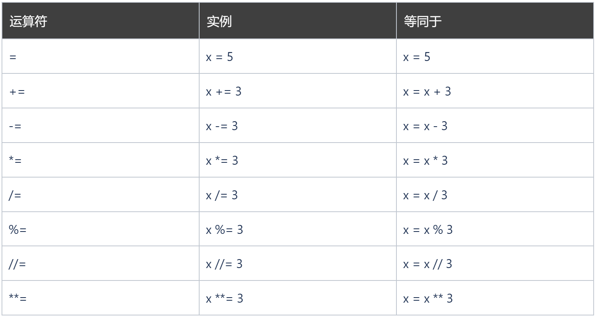
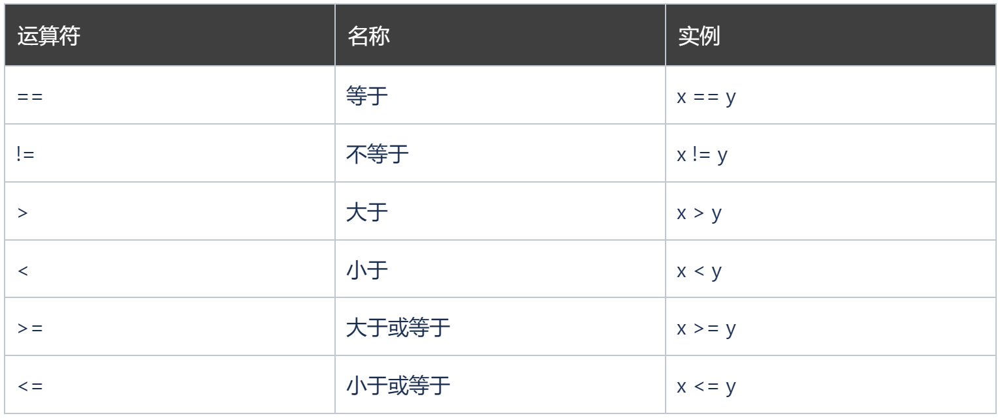
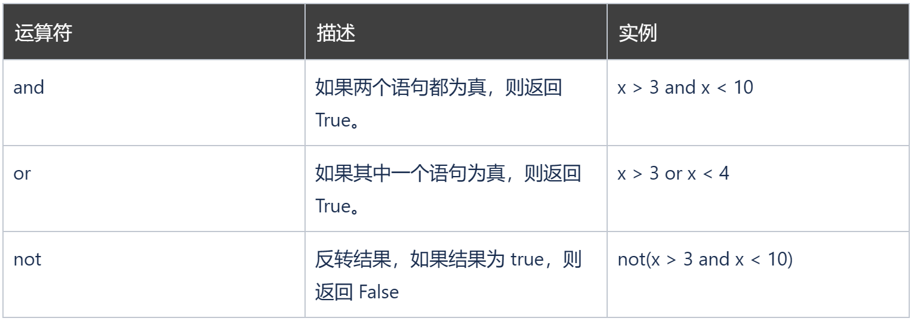
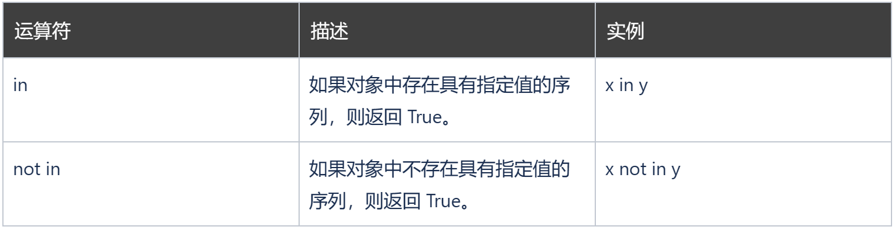

### Python 运算符

运算符用于对变量和值执行操作。
Python 在以下组中划分运算符：

* 算术运算符
* 赋值运算符
* 比较运算符
* 逻辑运算符
* 身份运算符
* 成员运算符


### Python 算术运算符

算术运算符与数值一起使用来执行常见的数学运算：

```
x = 5
y = 3

print(x + y)
```

8
```
x = 5
y = 3

print(x - y)
```
2
```
x = 5
y = 3

print(x * y)
```
15
```
x = 15
y = 3

print(x / y)
```
5.0
```
x = 5
y = 2

print(x % y)
```
1
```
x = 2
y = 5

print(x ** y) #same as 2*2*2*2*2
```
32
```
x = 15
y = 2

print(x // y)

#the floor division // rounds the result down to the nearest whole number
```
7

### python赋值运算符

赋值运算符用于为变量赋值：


```
x = 5
print(x)
```
5
```
x = 5
x += 3
print(x)
```
8
```
x = 5
x -= 3
print(x)
```
2
```
x = 5
x *= 3
print(x)
```
15
```
x = 5
x /= 3
print(x)
```

1.6666666666666667
```
x = 5
x%=3
print(x)
```
2
```
x = 5
x//=3
print(x)
```
1
```
x = 5
x **= 3
print(x)
```

125
### Python 比较运算符

比较运算符用于比较两个值：

```
x = 5
y = 3
print(x == y)
# returns False because 5 is not equal to 3
```

False
```
x = 5
y = 3
print(x != y)
# returns True because 5 is not equal to 3
```

True
```
x = 5
y = 3
print(x > y)
# returns True because 5 is greater than 3
```

True
```
x = 5
y = 3
print(x < y)
# returns False because 5 is not less than 3
```

False
```
x = 5
y = 3
print(x >= y)
# returns True because five is greater, or equal, to 3
```

True
```
x = 5
y = 3
print(x <= y)
# returns False because 5 is neither less than or equal to 3
```

False

### python逻辑运算符

逻辑运算符用于组合条件语句：

```
x = 5
print(x > 3 and x < 10)
# returns True because 5 is greater than 3 AND 5 is less than 10
```

True
```
x = 5
print(x > 3 or x < 4)
# returns True because one of the conditions are true (5 is greater than 3, but 5 is not less than 4)
```

True
```
x = 5
print(not(x > 3 and x < 10))
# returns False because not is used to reverse the result
```

False
### Python 身份运算符

身份运算符用于比较对象，不是比较它们是否相等，但如果它们实际上是同一个对象，则具有相同的内存位置：

```
x = ["apple", "banana"]
y = ["apple", "banana"]
z = x
print(x is z)
# returns True because z is the same object as x
print(x is y)
# returns False because x is not the same object as y, even if they have the same content
print(x == y)
# to demonstrate the difference betweeen "is" and "==": this comparison returns True because x is equal to y
```

True
False
True
```
x = ["apple", "banana"]
y = ["apple", "banana"]
z = x
print(x is not z)
# returns False because z is the same object as x
print(x is not y)
# returns True because x is not the same object as y, even if they have the same content
print(x != y)
# to demonstrate the difference betweeen "is not" and "!=": this comparison returns False because x is equal to y
```

False
True
False
### Python 成员运算符

成员资格运算符用于测试序列是否在对象中出现：

```
x = ["apple", "banana"]

print("banana" in x)
# returns True because a sequence with the value "banana" is in the list
```

True
```
x = ["apple", "banana"]
print("pineapple" not in x)
# returns True because a sequence with the value "pineapple" is not in the list
```

True