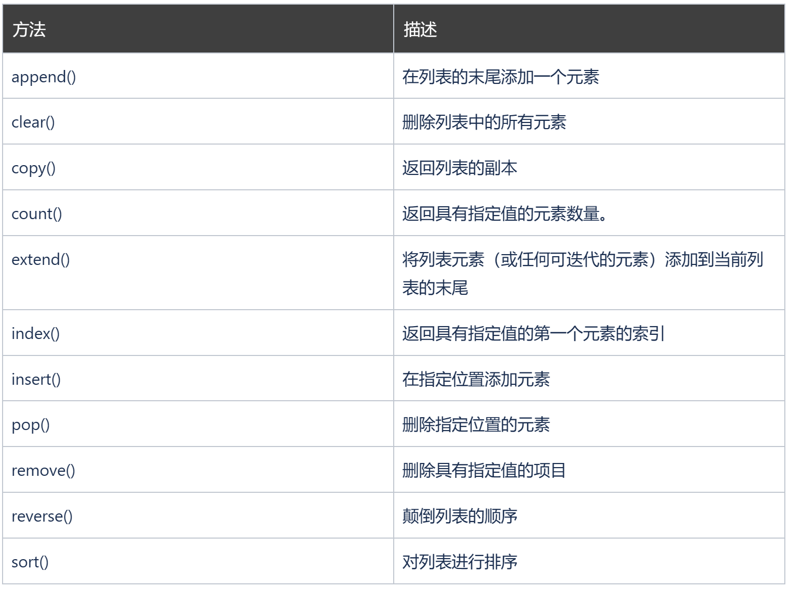

### Python 集合（数组）

Python 编程语言中有四种集合数据类型：
* 列表（List）是一种有序和可更改的集合。允许重复的成员。
* 元组（Tuple）是一种有序且不可更改的集合。允许重复的成员。
* 集合（Set）是一个无序和无索引的集合。没有重复的成员。
* 典（Dictionary）是一个无序，可变和有索引的集合。没有重复的成员。

选择集合类型时，了解该类型的属性很有用。

为特定数据集选择正确的类型可能意味着保留含义，并且可能意味着提高效率或安全性。
### 列表

列表是一个有序且可更改的集合。在 Python 中，列表用方括号编写。

创建列表：
```
thislist = ["apple", "banana", "cherry"]
print(thislist)
```

['apple', 'banana', 'cherry']

### 访问项目

您可以通过引用索引号来访问列表项：

打印列表的第二项：
```
thislist = ["apple", "banana", "cherry"]
print(thislist[1])
```

banana
### 负的索引

负索引表示从末尾开始，-1 表示最后一个项目，-2 表示倒数第二个项目，依此类推。

打印列表的最后一项：
```
thislist = ["apple", "banana", "cherry"]
print(thislist[-1])
```

cherry
### 索引范围

您可以通过指定范围的起点和终点来指定索引范围。

指定范围后，返回值将是包含指定项目的新列表。

返回第三、第四、第五项：
```
thislist = ["apple", "banana", "cherry", "orange", "kiwi", "melon", "mango"]
print(thislist[2:5])
```

['cherry', 'orange', 'kiwi']


**注意：搜索将从索引 2（包括）开始，到索引 5（不包括）结束。请记住，第一项的索引为 0。**
### 负索引的范围

如果要从列表末尾开始搜索，请指定负索引：

此例将返回从索引 -4（包括）到索引 -1（排除）的项目：
```
thislist = ["apple", "banana", "cherry", "orange", "kiwi", "melon", "mango"]
print(thislist[-4:-1])
```

['orange', 'kiwi', 'melon']

### 更改项目值

如需更改特定项目的值，请引用索引号：
```
thislist = ["apple", "banana", "cherry"]
thislist[1] = "mango"
print(thislist)
```

['apple', 'mango', 'cherry']

### 遍历列表

您可以使用 for 循环遍历列表项：

逐个打印列表中的所有项目：
```
thislist = ["apple", "banana", "cherry"]
for x in thislist:
  print(x)
```

apple
banana
cherry
### 检查项目是否存在

如需确定列表中是否存在指定的项，请使用 in 关键字：

检查列表中是否存在 “apple”：
```
thislist = ["apple", "banana", "cherry"]
if "apple" in thislist:
  print("Yes, 'apple' is in the fruits list")
```

Yes, 'apple' is in the fruits list

### 列表长度

如需确定列表中有多少项，请使用 len() 方法：

打印列表中的项目数：
```
thislist = ["apple", "banana", "cherry"]
print(len(thislist))
```
3
### 添加项目

如需将项目添加到列表的末尾，请使用 append() 方法：
```
thislist = ["apple", "banana", "cherry"]
thislist.append("orange")
print(thislist)
```

['apple', 'banana', 'cherry', 'orange']


要在指定的索引处添加项目，请使用 insert() 方法：
```
thislist = ["apple", "banana", "cherry"]
thislist.insert(1, "orange")
print(thislist)
```

['apple', 'orange', 'banana', 'cherry']

### 删除项目

有几种方法可以从列表中删除项目：

remove() 方法删除指定的项目：

```
thislist = ["apple", "banana", "cherry"]
thislist.remove("banana")
print(thislist)
```

['apple', 'cherry']


pop() 方法删除指定的索引（如果未指定索引，则删除最后一项）：
```
thislist = ["apple", "banana", "cherry"]
thislist.pop()
print(thislist)
```

['apple', 'banana']


del 关键字删除指定的索引：

```
thislist = ["apple", "banana", "cherry"]
del thislist[0]
print(thislist)
```

['banana', 'cherry']


del 关键字也能完整地删除列表：
```
thislist = ["apple", "banana", "cherry"]
del thislist
print(thislist)
```

NameError Traceback (most recent call last)~\AppData\Local\Temp\ipykernel_27696\3386762020.py in <module>1 thislist = ["apple", "banana", "cherry"]2 del thislist----> 3 print(thislist)NameError: name 'thislist' is not defined

clear() 方法清空列表：
```
thislist = ["apple", "banana", "cherry"]
thislist.clear()
print(thislist)
```

[]

### 复制列表

您只能通过键入 list2 = list1 （浅拷贝）来复制列表，因为：list2 将只是对 list1 的引用，list1 中所做的更改也将自动在 list2 中进行。

有一些方法可以进行复制，一种方法是使用内置的 List 方法 copy()（深拷贝）。

使用 copy() 方法来复制列表：
```
thislist = ["apple", "banana", "cherry"]
mylist = thislist.copy()
print(mylist)
```

['apple', 'banana', 'cherry']


使用 list() （深拷贝）方法复制列表：
```
thislist = ["apple", "banana", "cherry"]
mylist = list(thislist)
print(mylist)
```
### 合并两个列表

在 Python 中，有几种方法可以连接或串联两个或多个列表。

最简单的方法之一是使用 + 运算符。

合并两个列表：

```
list1 = ["a", "b" , "c"]
list2 = [1, 2, 3]
list3 = list1 + list2
print(list3)
```

['a', 'b', 'c', 1, 2, 3]


连接两个列表的另一种方法是将 list2 中的所有项一个接一个地追加到 list1 中：

把 list2 追加到 list1 中：
```
list1 = ["a", "b" , "c"]
list2 = [1, 2, 3]
for x in list2:
  list1.append(x)
print(list1)
```

['a', 'b', 'c', 1, 2, 3]


或者，您可以使用 extend() 方法，其目的是将一个列表中的元素添加到另一列表中：

使用 extend() 方法将 list2 添加到 list1 的末尾：
```
list1 = ["a", "b" , "c"]
list2 = [1, 2, 3]
list1.extend(list2)
print(list1)
```

['a', 'b', 'c', 1, 2, 3]
### list() 构造函数

也可以使用 list() 构造函数创建一个新列表。

使用 list() 构造函数创建列表：
```
thislist = list(("apple", "banana", "cherry")) # 请注意双括号
print(thislist)
```

['apple', 'banana', 'cherry']

### 列表方法

Python 有一组可以在列表上使用的内建方法。


向 fruits 列表添加元素：
```
fruits = ['apple', 'banana', 'cherry']
fruits.append("orange")
print(fruits)
```

['apple', 'banana', 'cherry', 'orange']


从 fruits 列表删除所有元素：

```
fruits = ['apple', 'banana', 'cherry', 'orange']
fruits.clear()
print(fruits)
```

[]

拷贝 fruits 列表：
```
fruits = ['apple', 'banana', 'cherry', 'orange']
x = fruits.copy()
print(x)
```

['apple', 'banana', 'cherry', 'orange']


返回 "cherry" 在 fruits 列表中出现的次数：

```
fruits = ['apple', 'banana', 'cherry']
x = fruits.count("cherry")
print(x)
```
1

把 cars 中的元素添加到 fruits 列表：
```
fruits = ['apple', 'banana', 'cherry']
cars = ['Porsche', 'BMW', 'Volvo']
fruits.extend(cars)
print(fruits)
```

['apple', 'banana', 'cherry', 'Porsche', 'BMW', 'Volvo']


值 "cherry" 的位置是：
```
fruits = ['apple', 'banana', 'cherry']
x = fruits.index("cherry")
print(x)
```
2

把值 "orange" 作为第二个元素插入 fruits 列表：
```
fruits = ['apple', 'banana', 'cherry']
fruits.insert(1, "orange")
print(fruits)
```

['apple', 'orange', 'banana', 'cherry']


删除 fruits 列表的第二个元素：
```
fruits = ['apple', 'banana', 'cherry']
fruits.pop(1)
print(fruits)
```

['apple', 'cherry']


删除 fruits 列表的 "banana" 元素：
```
fruits = ['apple', 'banana', 'cherry']
fruits.remove("banana")
print(fruits)
```

['apple', 'cherry']


反转 fruits 列表的顺序：
```
fruits = ['apple', 'banana', 'cherry']
fruits.reverse()
print(fruits)
```

['cherry', 'banana', 'apple']


以字母顺序对列表进行排序：
```
cars = ['Porsche', 'BMW', 'Volvo']
cars.sort()
print(cars)
```

['BMW', 'Porsche', 'Volvo']


