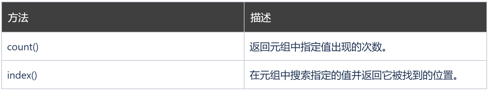

### 元组（Tuple）

元组是有序且不可更改的集合。在 Python 中，元组是用圆括号编写的。

创建元组：
```
thistuple = ("apple", "banana", "cherry")
print(thistuple)
```

('apple', 'banana', 'cherry')
### 访问元组项目

您可以通过引用方括号内的索引号来访问元组项目：

打印元组中的第二个项目：
```
thistuple = ("apple", "banana", "cherry")
print(thistuple[1])
```

banana
### 负索引

负索引表示从末尾开始，-1 表示最后一个项目，-2 表示倒数第二个项目，依此类推。

打印元组的最后一个项目：

```
thistuple = ("apple", "banana", "cherry")
print(thistuple[-1])
```

cherry
### 索引范围

您可以通过指定范围的起点和终点来指定索引范围。

指定范围后，返回值将是带有指定项目的新元组。

返回第三、第四、第五个项目：
```
thistuple = ("apple", "banana", "cherry", "orange", "kiwi", "melon", "mango")
print(thistuple[2:5])
```

('cherry', 'orange', 'kiwi')


**注意：搜索将从索引 2（包括）开始，到索引 5（不包括）结束。请记住，第一项的索引为 0。**
### 负索引范围

如果要从元组的末尾开始搜索，请指定负索引：

此例将返回从索引 -4（包括）到索引 -1（排除）的项目：

```
thistuple = ("apple", "banana", "cherry", "orange", "kiwi", "melon", "mango")
print(thistuple[-4:-1])
```
('orange', 'kiwi', 'melon')
### 更改元组值

创建元组后，您将无法更改其值。元组是不可变的，或者也称为恒定的。

但是有一种解决方法。您可以将元组转换为列表，更改列表，然后将列表转换回元组。

把元组转换为列表即可进行更改：

```
x = ("apple", "banana", "cherry")
y = list(x)
y[1] = "kiwi"
x = tuple(y)

print(x)
```

('apple', 'kiwi', 'cherry')

### 遍历元组

您可以使用 for 循环遍历元组项目。

遍历项目并打印值：

```
thistuple = ("apple", "banana", "cherry")
for x in thistuple:
  print(x)
```

apple
banana
cherry
### 检查项目是否存在

要确定元组中是否存在指定的项，请使用 in 关键字：

检查元组中是否存在 "apple"：

```
thistuple = ("apple", "banana", "cherry")
if "apple" in thistuple:
  print("Yes, 'apple' is in the fruits tuple")
```

Yes, 'apple' is in the fruits tuple

### 元组长度

要确定元组有多少项，请使用 len() 方法：

打印元组中的项目数量：
```
thistuple = ("apple", "banana", "cherry")
print(len(thistuple))
```
3
### 添加项目

元组一旦创建，您就无法向其添加项目。元组是不可改变的。

您无法向元组添加项目：

```
thistuple = ("apple", "banana", "cherry")
thistuple[3] = "orange" # 会引发错误
print(thistuple)
```

TypeError Traceback (most recent call last)~\AppData\Local\Temp\ipykernel_27696\3823058999.py in <module>1 thistuple = ("apple", "banana", "cherry")----> 2 thistuple[3] = "orange" # 会引发错误3 print(thistuple)TypeError: 'tuple' object does not support item assignment
### 创建有一个项目的元组

如需创建仅包含一个项目的元组，您必须在该项目后添加一个逗号，否则 Python 无法将变量识别为元组。

单项元组，别忘了逗号：
```
thistuple = ("apple",)
print(type(thistuple))

#不是元组
thistuple = ("apple")
print(type(thistuple))
```

<class 'tuple'>
<class 'str'>
### 删除项目

注释：您无法删除元组中的项目。

元组是不可更改的，因此您无法从中删除项目，但您可以完全删除元组：

del 关键字可以完全删除元组：
```
thistuple = ("apple", "banana", "cherry")
del thistuple

print(thistuple) # 这会引发错误，因为元组已不存在。
```

NameError Traceback (most recent call last)~\AppData\Local\Temp\ipykernel_27696\2512008026.py in <module>2 del thistuple3----> 4 print(thistuple) # 这会引发错误，因为元组已不存在。NameError: name 'thistuple' is not defined
### 合并两个元组

如需连接两个或多个元组，您可以使用 + 运算符：

合并这个元组：

```
tuple1 = ("a", "b" , "c")
tuple2 = (1, 2, 3)

tuple3 = tuple1 + tuple2
print(tuple3)
```

('a', 'b', 'c', 1, 2, 3)

### tuple() 构造函数

也可以使用 tuple() 构造函数来创建元组。

使用 tuple() 方法来创建元组：

```
thistuple = tuple(("apple", "banana", "cherry")) # 请注意双括号
print(thistuple)
```

('apple', 'banana', 'cherry')
### 元组方法

Python 提供两个可以在元组上使用的内建方法。


返回值 5 在元组中出现的次数:

```
thistuple = (1, 3, 7, 8, 7, 5, 4, 6, 8, 5)
x = thistuple.count(5)
print(x)
```
2

检索首次出现的值 8，并返回其位置：

```
thistuple = (1, 3, 7, 8, 7, 5, 4, 6, 8, 5)
x = thistuple.index(8)
print(x)
```
3