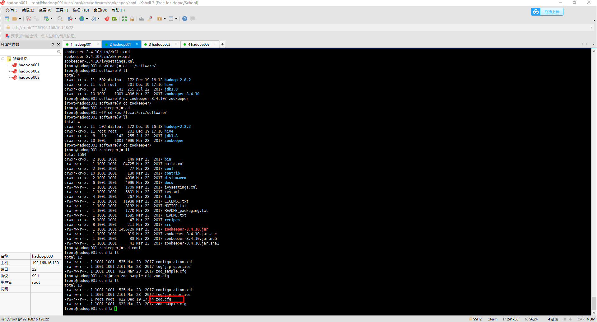
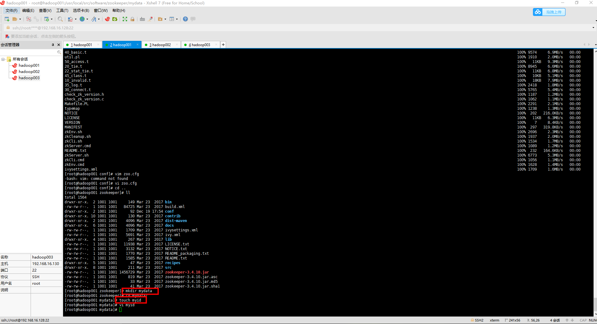
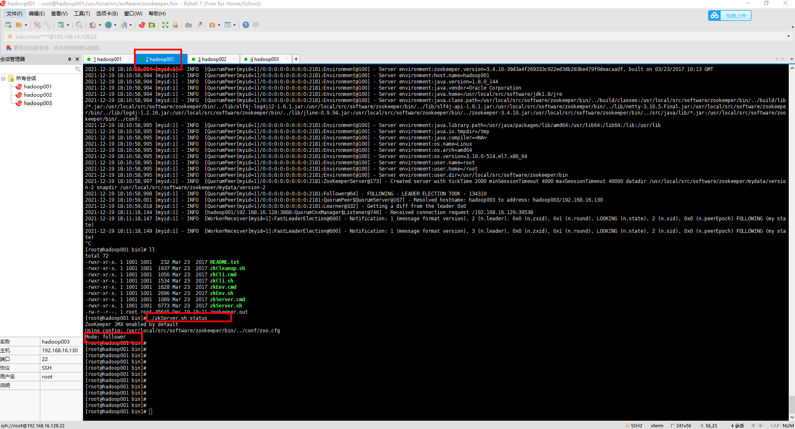
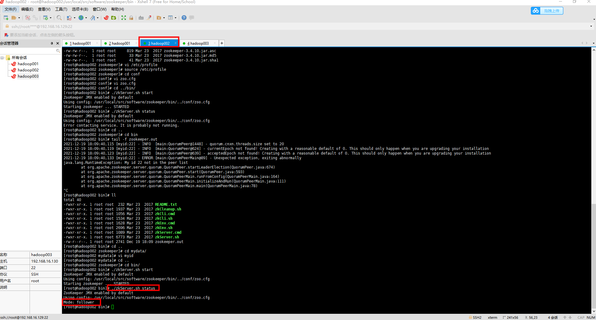
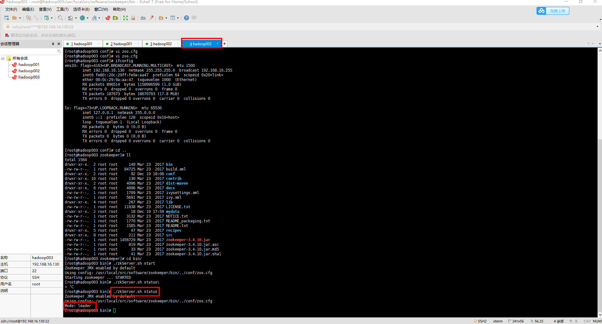

### 一、准备工作

[1、安装一台虚拟机](https://github.com/WuZongYun/bigdata_study/blob/main/%E5%A4%A7%E6%95%B0%E6%8D%AE%E5%9F%BA%E7%A1%80%E7%8E%AF%E5%A2%83%E6%90%AD%E5%BB%BA/1_%E5%AE%89%E8%A3%85%E8%99%9A%E6%8B%9F%E6%9C%BA.md)

[2、启动一台虚拟机，并连接至Xshell、Xftp](https://github.com/WuZongYun/bigdata_study/blob/main/%E5%A4%A7%E6%95%B0%E6%8D%AE%E5%9F%BA%E7%A1%80%E7%8E%AF%E5%A2%83%E6%90%AD%E5%BB%BA/2_%E5%AE%89%E8%A3%85MobaXterm.md)

[3、配置好免密登录](https://github.com/WuZongYun/bigdata_study/blob/main/%E5%A4%A7%E6%95%B0%E6%8D%AE%E5%9F%BA%E7%A1%80%E7%8E%AF%E5%A2%83%E6%90%AD%E5%BB%BA/3_centos7%E5%85%8D%E5%AF%86%E8%AE%BE%E7%BD%AE.md)

[4、安装、搭建好jdk](https://github.com/WuZongYun/bigdata_study/blob/main/%E5%A4%A7%E6%95%B0%E6%8D%AE%E5%9F%BA%E7%A1%80%E7%8E%AF%E5%A2%83%E6%90%AD%E5%BB%BA/4_centos7%E5%AE%89%E8%A3%85JDK.md)

3. 建议在虚拟机里  /usr/local/src 文件夹下单独创建两个文件夹（download、software），用来存放安装包和软件，

4. zookeeper下载地址 https://pan.baidu.com/s/1Wn-A8gMcGzv73trnRc54xw 请输入提取码 提取码：kde7

4. 需要将 zookeeper-3.4.10.tar.gz 文件，上传至 download 目录。

### 二、安装步骤（集群版）

（一）、解压

1.  输入命令：

`cd /usr/local/src/download、ls`，查看是否存在zookeeper-3.4.10.tar.gz 这个文件。

2.  输入命令：

`tar -zxvf zookeeper-3.4.10.tar.gz -C /usr/local/src/software/`，将文件解压到 software 文件夹里。解压完毕后，输入命令：`cd /usr/local/src/software/`，输入命令：`ls`，查看该目录下是否存在 zookeeper-3.4.10 这个文件。

3. 输入命令：`mv zookeeper-3.4.10/ zookeeper`，将解压后的文件命名为 zookeeper。

（二）、zookeeper 配置

zoo.cfg配置

1.  输入命令：

`cd /usr/local/src/software/zookeeper`、`mkdir mydata`，在 zookeeper 目录下新建一个 mydata 文件夹，并获取其路径。

```
/usr/local/src/software/zookeeper/mydata
```

2. 输入命令：

`cd /usr/local/src/software/zookeeper/conf/`、`ls`，输入年命令：`cp zoo_sample.cfg zoo.cfg`、`ls`，查看是否复制并且重命名成功。



3. 接上述 2 ，输入命令：vi zoo.cfg，将图6位置配置成下方代码，配置完成后保存并退出。


```
dataDir=/usr/local/src/software/zookeeper/mydata
#  2888是zk集群中间互相通讯的端口
#  3888是当集群中有领导丢失了，会从这个端口进行选举
#  这两个端口的值随便写，只要不跟别的端口号产生冲突
#  如果集群多了，就慢慢写,例如：
#  server.1=IP:xxxx:xxxxx
#  server.2=IP:xxxx:xxxxx
#  server.3=IP:xxxx:xxxxx
initLimit=5
syncLimit=10
tickTime=2000
clientPort=2181
server.1=hadoop001:2888:3888
server.2=hadoop002:2888:3888
server.3=hadoop003:2888:3888
```

提示：
  1.配置文件中的 tickTime 是心跳时间，意思是：集群必须以两秒为一个时间点，向 leader 报告“我不是死的”，所以这是 心跳包 的时间。
  2.配置文件中的 syncLimit=5 代表有5台机器可以同时运转。
  3.配置文件中的 clientPort=2181 是zk的默认端口。

4. 在配置文件zoo.cfg中的参数dataDir指定的目录下（此处为ZooKeeper安装目录下的dataDir文件夹）新建一个名为 **myid** 的文件

**touch myid**，这个文件仅包含一行内容，即当前服务器的id值，与参数server.id中的id值相同。本例中，当前服务器（hadoop001）的id值为1，则应该在myid文件中写入数字1。ZooKeeper启动时会读取该文件，将其中的数据与zoo.cfg里写入的配置信息进行对比，从而获取当前服务器的身份信息。



5. 修改其他节点配置

复制完成后`scp -rp zookeeper/ root@hadoop002:/usr/local/src/software/` `scp -rp zookeeper/ root@hadoop003:/usr/local/src/software/`，需要将hadoop002和hadoop003节点中的myid文件的值修改为对应的数字，即作出以下操作：修改centos02节点中的/usr/local/src/software/zookeeper/mydata/myid文件中的值为2。修改centos03节点中的/usr/local/src/software/zookeeper/mydata/myid文件中的值为3。

（三）环境变量配置（hadoop001/hadoop002/hadoop003）

1.获取 /usr/local/src/software/zookeeper 这个路径并复制，输入命令：`vi /etc/profile`，进入配置文件，按住shift+g移动至文章底部，按照图7进行配置，配置代码在下方。

```
#ZK
export ZK_HOME=/usr/local/src/software/zookeeper
export PATH=$ZK_HOME/bin:$PATH
```
2.输入命令：source /etc/profile，重新载入配置文件。

（四）启动服务（hadoop001/hadoop002/hadoop003）

输入命令：`cd /usr/local/src/software/zookeeper/bin` `./zkServer.sh start`，启动服务，输入命令：`zkServer.sh status`，查看服务状态，输入命令：`jps`，查看进程，出现 QuorumPeerMain 这个进程，表示 Zookeeper 安装成功并成功启动。
**提示：在启动 Hbase 和 Kafka 前，记得先启动 zookeeper 。**







（五）关闭服务

输入命令：`./zkServer.sh sto`p，关闭服务，输入命令：`jps`，查看进程，没有显示 QuorumPeerMain 这个进程，表示 Zookeeper 安装成功并成功关闭。

提示：在关闭 zookeeper 前， Hbase 和 Kafka 前，记得先关闭 zookeeper 。

