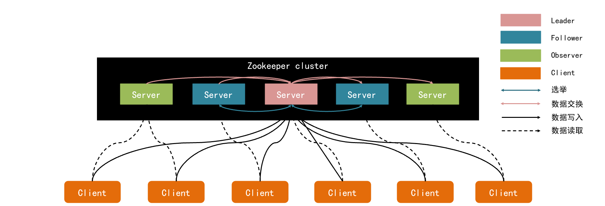
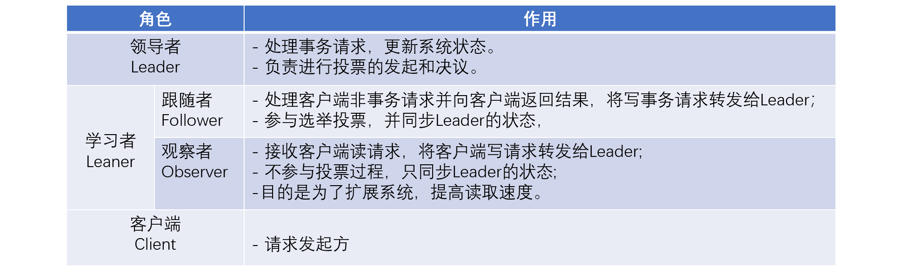
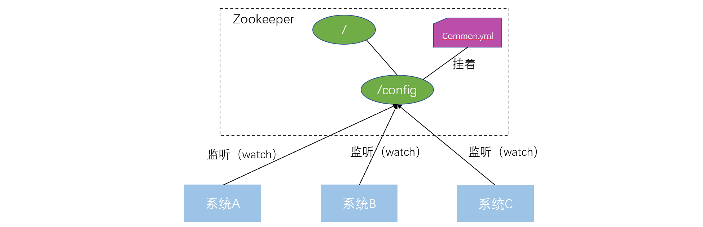
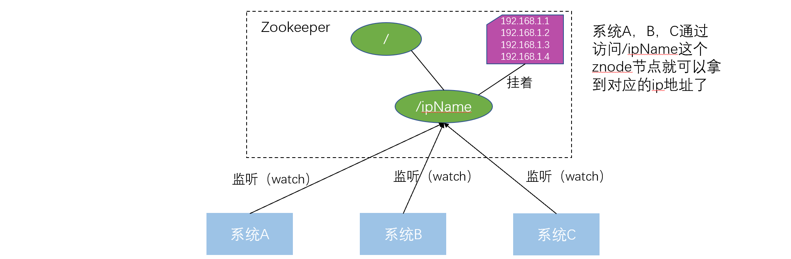
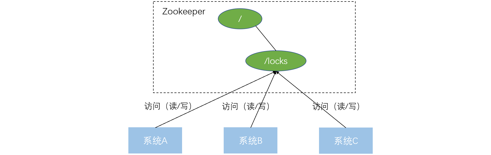
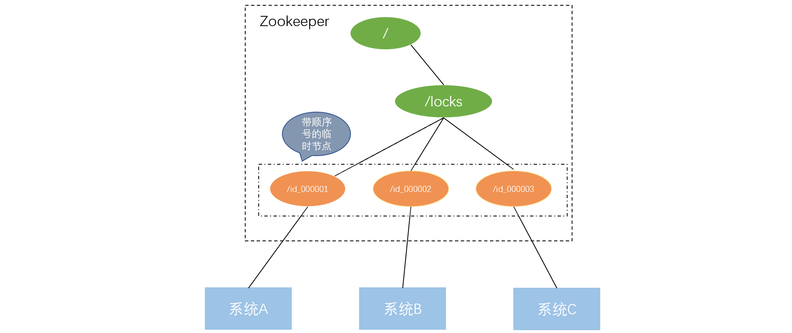
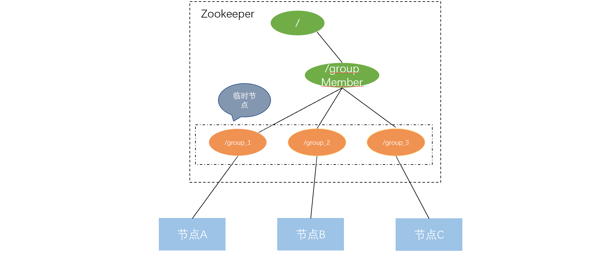
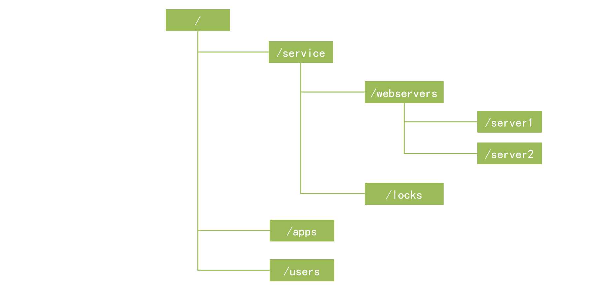

（一）zookeeper简介

顾名思义 zookeeper 就是动物园管理员，他是用来管 hadoop（大象）、Hive(蜜蜂)、pig(小 猪)的管理员， Apache Hbase 和 Apache Solr 的分布式集群都用到了 zookeeper；Zookeeper: 是一个分布式的、开源的程序协调服务，是 hadoop 项目下的一个子项目。他提供的主要功 能包括：配置管理、名字服务、分布式锁、集群管理。

（二）zookeeper架构

1.  ZooKeeper的角色划分

上图体现了ZooKeeper集群中几种角色间的关系，相关描述如下：

**既然有了Follower，为什么还要有Observer呢？**

虽然通过Client直接连接到ZooKeeper集群的性能已经很好了，但该架构在面对超大规模的Client时，需添加ZooKeeper集群的Server数量。

随着Server的添加，ZooKeeper集群的写性能必定下降（ZooKeeper的ZNode变更是要过半数投票通过，随着机器的添加，因为网络消耗等原因必定导致投票成本添加，从而导致写性能的下降。）

Observer是一种新型的ZooKeeper节点，提供ZooKeeper的可扩展性，同时Observer不參与投票，仅仅是简单的接收投票结果。因此我们添加再多的Observer也不会影响集群的写性能；另一方面，Observer不參与投票，所以他们不属于ZooKeeper集群的关键部位，即使他们Failed，或者从集群中断开，也不会影响集群的可用性。

（三）zookeeper的作用

1.  统一配置管理

在我们的应用中除了代码外，还有一些就是各种配置。比如数据库连接等。一般我们都 是使用配置文件的方式，在代码中引入这些配置文件。当我们只有一种配置，只有一台服务 器，并且不经常修改的时候，使用配置文件是一个很好的做法，但是如果我们配置非常多， 有很多服务器都需要这个配置，这时使用配置文件就不是个好主意了。这个时候往往需要寻 找一种集中管理配置的方法，我们在这个集中的地方修改了配置，所有对这个配置感兴趣的 都可以获得变更。

Zookeeper 就是这种服务，它使用 Zab 这种一致性协议来提供一致性。现 在有很多开源项目使用 Zookeeper 来维护配置，比如在 HBase 中，客户端就是连接一个 Zookeeper，获得必要的 HBase 集群的配置信息，然后才可以进一步操作。还有在开源的消 息队列 Kafka 中，也使用 Zookeeper来维护broker的信息。在 Alibaba开源的 SOA 框架Dubbo 中也广泛的使用 Zookeeper 管理一些配置来实现服务治理。

比如我们现在有三个系统A、B、C，他们有三份配置，分别是ASystem.yml、BSystem.yml、CSystem.yml，然后，这三份配置又非常类似，很多的配置项几乎都一样。此时，如果我们要改变其中一份配置项的信息，很可能其他两份都要改。并且，改变了配置项的信息很可能就要重启系统

于是，我们希望把ASystem.yml、BSystem.yml、CSystem.yml相同的配置项抽取出来成一份公用的配置common.yml，并且即便common.yml改了，也不需要系统A、B、C重启。

做法：我们可以将common.yml这份配置放在ZooKeeper的Znode节点中，系统A、B、C监听着这个Znode节点有无变更，如果变更了，及时响应。

2. 名字服务

统一命名服务的理解其实跟域名一样，是我们为这某一部分的资源给它取一个名字，别人通过这个名字就可以拿到对应的资源。

比如说，现在我有一个域名www.java3y.com，但我这个域名下有多台机器：

192.168.1.1，192.168.1.2，192.168.1.3，192.168.1.4

别人访问www.byteteach.com即可访问到我的机器，而不是通过IP去访问。

3. 分布式锁

在分布式环境中，为了保证在同一时刻只能有一个客户端对指定的数据进行访问，需要使用分布式锁技术，只有获得锁的客户端才能对数据进行访问，其余客户端只能暂时等待。

我们可以使用ZooKeeper来实现分布式锁，那是怎么做的呢？？下面来看看：

系统A、B、C都去访问/locks节点

访问的时候会创建带顺序号的临时/短暂(EPHEMERAL_SEQUENTIAL)节点，比如，系统A创建了id_000000节点，系统B创建了id_000002节点，系统C创建了id_000001节点。

**为什么创建临时顺序节点？**

假如客户端A获得锁之后，客户端A所在的计算机宕机了，此时客户端A没有来得及主动删除子节点。如果创建的是永久节点，锁将永远不会被释放，从而导致死锁。临时节点的好处是，尽管客户端宕机了，但是ZooKeeper在一定时间内没有收到客户端的心跳则会认为会话失效，然后将临时节点删除以释放锁。

接着，拿到/locks节点下的所有子节点(id_000000,id_000001,id_000002)，判断自己创建的是不是最小的那个节点

* 如果是，则拿到锁。
* 释放锁：执行完操作后，把创建的节点给删掉
* 如果不是，则监听比自己要小1的节点变化

举个例子：

* 系统A拿到 /locks节点下的所有子节点，经过比较，发现自己(id_000001)，是所有子节点最小的。所以得到锁
* 系统B拿到 /locks节点下的所有子节点，经过比较，发现自己(id_000002)，不是所有子节点最小的。所以监听比自己小1的节点id_000001的状态
* 系统C拿到 /locks节点下的所有子节点，经过比较，发现自己(id_000003)，不是所有子节点最小的。所以监听比自己小1的节点id_000002的状态
…...
**等到系统A执行完操作以后，将自己创建的节点删除(**id_000001)。通过监听，系统B发现id_000001节点已经删除了，发现自己已经是最小的节点了，于是顺利拿到锁
….系统C如上

未获得锁的客户端为什么要监听排在自己前一位的子节点的删除事件？

按照争夺锁的规则，每一轮锁的争夺取的都是序号最小节点，当序号最小的节点删除后，正常情况排在最小节点后一位的节点将获得锁，以此类推。因此，若客户端没有获得锁，只需要监听自己前一位的节点即可，这样每当锁释放时，ZooKeeper只需要通知一个客户端，从而节省了网络带宽。若将监听事件设置在父节点/lock上，那么每次锁的释放将通知所有客户端。假如客户端数量庞大，会导致ZooKeeper服务器必须处理的操作数量激增，增加了ZooKeeper服务器的压力，同时很容易产生网络阻塞。

未获得锁的客户端为什么要监听排在自己前一位的子节点的删除事件？

按照争夺锁的规则，每一轮锁的争夺取的都是序号最小节点，当序号最小的节点删除后，正常情况排在最小节点后一位的节点将获得锁，以此类推。因此，若客户端没有获得锁，只需要监听自己前一位的节点即可，这样每当锁释放时，ZooKeeper只需要通知一个客户端，从而节省了网络带宽。若将监听事件设置在父节点/lock上，那么每次锁的释放将通知所有客户端。假如客户端数量庞大，会导致ZooKeeper服务器必须处理的操作数量激增，增加了ZooKeeper服务器的压力，同时很容易产生网络阻塞。

4. 集群管理

经过上面几个例子，我相信大家也很容易想到ZooKeeper是怎么"感知"节点的动态新增或者删除的了。

还是以我们三个节点A、B、C为例，在ZooKeeper中创建临时节点即可：

只要节点A挂了，那/groupMember/group_1这个节点就会删除，通过监听groupMember下的子节点，节点B和C就能够感知到节点A已经挂了。(新增也是同理)

除了能够感知节点的上下线变化，ZooKeeper还可以实现动态选举Master的功能。(如果集群是主从架构模式下)

原理也很简单，如果想要实现动态选举Master的功能，Znode节点的类型是带顺序号的临时节点(EPHEMERAL_SEQUENTIAL)就好了。

Zookeeper会每次选举最小编号的作为Master，如果Master挂了，自然对应的Znode节点就会删除。然后让新的最小编号作为Master，这样就可以实现动态选举的功能了。

（四）zookeeper数据结构

ZooKeeper有一个树形层次的命名空间，该命名空间的组织方式类似于标准文件系统。ZooKeeper可以将该命名空间共享给分布式应用程序，使它们可以利用该命名空间进行相互协调。与为存储而设计的典型文件系统不同，ZooKeeper数据保存在内存中，这样可以提高吞吐量和降低数据延迟。

在ZooKeeper的命名空间中，名称是由斜线（/）分隔的路径元素组成的。命名空间中的每个名称（也叫节点）都由路径标识。

ZooKeeper命名空间中的每个节点都可以有与之关联的数据（也称元数据）以及子节点，就好比标准文件系统中的每个文件夹都可以存放文件并且每个文件夹都有子文件夹。

通常使用znode来表示ZooKeeper命名空间中的名称节点，存储在每个znode上的数据会被客户端原子化地读取和写入。读取操作可以获取与znode关联的所有数据，而写入操作可以替换所有数据。

znode的主要特点如下：

* znode中 仅存储协调数据，即与同步相关的数据，例如状态信息、配置内容、位置信息等，因此数据量很小，大概B到KB量级。
* 一个znode维护一个状态结构，该结构包括 版本号、ACL（访问控制列表）变更、时间戳。znode存储的数据每次发生变化，版本号都会递增，每当客户端检索数据时，客户端也会同时接收到数据的版本。客户端也可以基于版本号检索相关数据。
* 每个znode都有一个ACL，用来限定该znode的客户端访问权限。

客户端可以在znode上设置一个

观察者（Watcher），如果该znode上的数据发生变更，ZooKeeper就会通知客户端，从而触发Watcher中实现的逻辑的执行。

（五）节点类型

ZooKeeper中的znode节点主要有以下4种类型。

1.  持久节点（PERSISTENT）
持久节点在创建后就一直存在，除非客户端主动将其删除。

2. 持久顺序节点（ PERSISTENT _SEQUENTIAL）
持久顺序节点除了有持久节点的功能外，在创建时，ZooKeeper会在节点名称末尾自动追加一个自增长的数字后缀作为新的节点名称，以便记录每一个节点创建的先后顺序。数字后缀的长度是10位，且由0填充，例如0000000001。举个例子，当前有一个父节点/lock，我们需要在该节点下创建顺序子节点/lock/node-，ZooKeeper在生成该子节点时会根据当前子节点数量自动增加数字后缀，如果是第一个创建的子节点，则节点名称为/lock/node-0000000000，下一个子节点则为/lock/node-0000000001，依次类推。

3. 临时节点（EPHEMERAL）
只要创建节点的客户端与ZooKeeper服务器的连接会话是活动的，这些节点就存在。当客户端与服务器的连接会话断开时，节点将被删除。基于此，临时节点是不允许有子节点的。

4. 临时顺序节点（ EPHEMERAL _SEQUENTIAL ）
临时顺序节点除了有临时节点的功能外，节点在创建时，会在节点末尾追加自增长的数字编号，这一点与持久顺序节点的顺序功能一致。分布式锁和选举集群master就是基于这一点来实现的。

（六）Watcher机制

ZooKeeper是一个基于Watcher（观察者）模式设计的分布式服务管理框架，其允许客户端向服务器的znode上注册一个Watcher，一旦znode的状态发生变化，ZooKeeper就会通知已经在它上面注册的Watcher做出相应的反应。

当前，ZooKeeper有四种状态变化事件：节点创建、节点删除、节点数据修改和子节点变更。

ZooKeeper中所有的读取操作——getData()方法、getChildren()方法和exists()方法，都可以向服务器设置一个Watcher。

Watcher事件相当于一次性的触发器，当znode的数据发生改变时，会通知设置Watcher的客户端。例如，如果客户端执行getData(“/znode1”，true)方法，然后改变或删除/znode1的数据，客户端将获得/znode1的状态改变事件通知。如果/znode1再次更改，则不会发送任何通知给客户端，除非客户端提前再次向/znode1设置Watcher。

ZooKeeper的Watcher有两种类型：数据Watcher和子节点Watcher。数据Watcher只监听节点元数据的改变，子节点Watcher只监听节点的子节点的创建与删除。

getData()方法和exists()方法可以设置数据Watcher，这两个方法返回znode节点的元数据信息。

getChildren()方法可以设置子节点Watcher，该方法则返回一个子节点列表。

setData()方法会触发数据Watcher。

create()方法将触发正在创建的znode的数据Watcher以及父znode的子节点Watcher。

delete()方法将会为被删除的znode触发一个数据Watcher以及为被删除节点的父节点触发一个子节点Watcher。

总结：查询类方法（getChildren、getData、exists）可以设置watcher，创建（create）、更新（setData）和删除（delete）方法会出发watcher。

Watcher机制执行流程：

Watcher机制主要包括客户端线程、客户端WatchManager和ZooKeeper服务器三部分。具体流程为：客户端在向ZooKeeper服务器注册Watcher的同时，会将Watcher对象存储在客户端的WatchManager 中。当ZooKeeper服务器端触发Watcher事件后，会向客户端发送通知，客户端线程从WatchManager中取出对应的Watcher对象来执行回调逻辑。

Watcher相关事件：

节点创建事件：通过调用exists()方法设置。　

节点删除事件：通过调用exists()、getData()和getChildren()方法设置。　

节点改变事件：通过调用exists()和getData()方法设置。　

子节点事件：通过调用getChildren()方法设置。