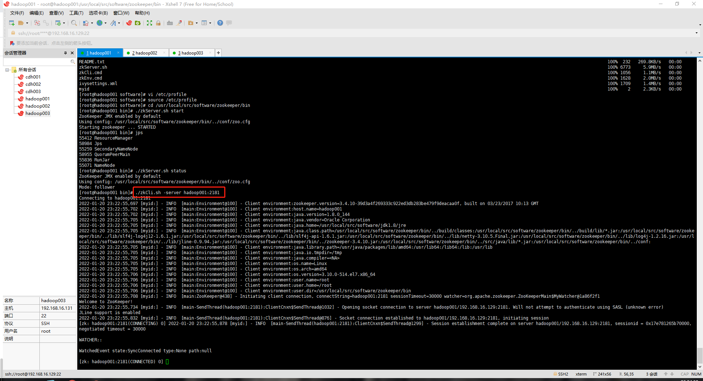
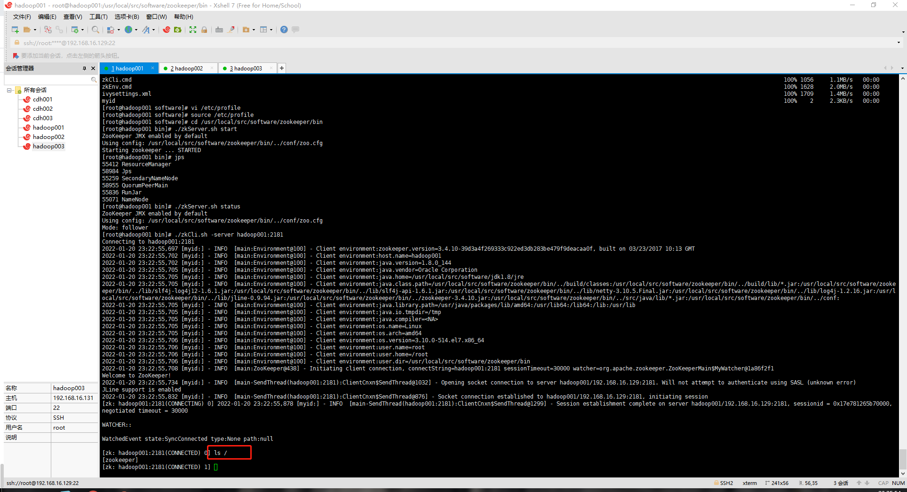
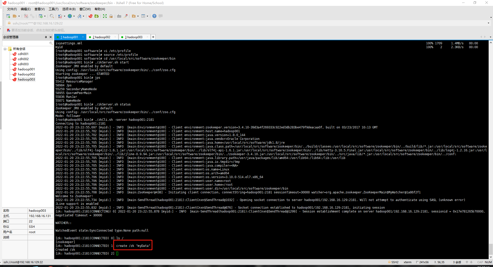
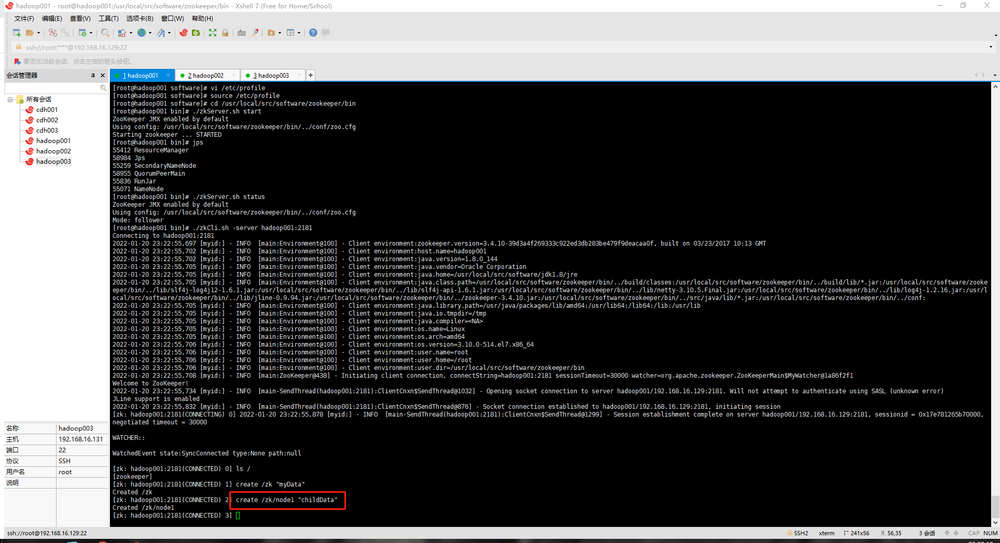
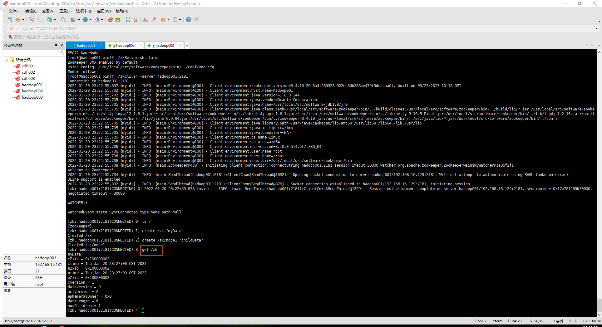
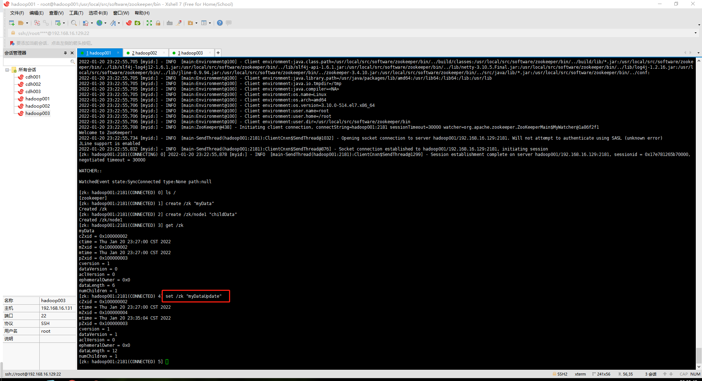
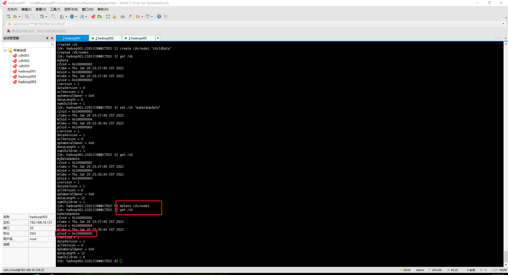

（一）python操作客户端

python 通过 kazoo 可以实现操作 ZooKeeper 。

1.  安装

这个简单，使用 pip 命令安装

```
pip3 install kazoo
```
2.  连接 ZooKeeper

可通过 KazooClient 类直接连接 ZooKeeper ，支持多个 host ，端口默认 2181。

```
import json
from kazoo.client import KazooClient

zk = KazooClient(hosts='10.1.44.55')
zk.start()
```

3. 创建节点

先看下 create() 方法定义

```
def create(self, path, value=b"", acl=None, ephemeral=False,
               sequence=False, makepath=False):
 
        :param path: Path of node.
        :param value: Initial bytes value of node.
        :param acl: :class:`~kazoo.security.ACL` list.
        :param ephemeral: Boolean indicating whether node is ephemeral
                          (tied to this session).
        :param sequence: Boolean indicating whether path is suffixed
                         with a unique index.
        :param makepath: Whether the path should be created if it
                         doesn't exist.
```

我们来解释下这些参数：

* path：          节点路径
* value：         节点对应的值，注意值的类型是 bytes
* ephemeral： 若为 True 则创建一个临时节点，session 中断后自动删除该节点。默认 False
* sequence:     若为 True 则在你创建节点名后面增加10位数字（例如：你创建一个 testplatform/test 节点，实际创建的是 testplatform/test0000000003，这串数字是顺序递增的）。默认 False
* makepath：  若为 False 父节点不存在时抛 NoNodeError。若为 True 父节点不存在则创建父节点。默认 False

举个例子：

```
from kazoo.client import KazooClient

zk = KazooClient(hosts='10.1.44.55')
zk.start()
# 创建节点：makepath 设置为 True ，父节点不存在则创建，其他参数不填均为默认
zk.create('/testplatform/test',b'this is test！',makepath=True)
# 操作完后，别忘了关闭zk连接
zk.stop()
print(value)
```

4. 查看节点

KazooClient 类用提供 get_children() 和 get() 方法获取 子节点 和 节点对应的值

```
from kazoo.client import KazooClient

zk = KazooClient(hosts='10.1.44.55')
zk.start()
# 获取某个节点下所有子节点
node = zk.get_children('/testplatform')
# 获取某个节点对应的值
value = zk.get('/testplatform/mssql')
# 操作完后，别忘了关闭zk连接
zk.stop()
print(node,value)
```

5. 更改节点

更改上文创建的 node 值，使用 set() 方法

```
from kazoo.client import KazooClient

zk = KazooClient(hosts='10.1.44.55')
zk.start()
# 更改节点对应的value
zk.set('/testplatform/test',b'this is not test')
# 获取某个节点对应的值
value = zk.get('/testplatform/test')
zk.stop()
print(value)
```

6. 删除节点

删除上文创建的节点，使用 delete() 方法

```
from kazoo.client import KazooClient

zk = KazooClient(hosts='10.1.44.55')
zk.start()
# 删除节点对应的value
zk.delete('/testplatform/test',recursive=False)
zk.stop()
```

参数 recursive：若为 False，当需要删除的节点存在子节点，会抛异常 NotEmptyError 。若为True，则删除 此节点 以及 删除该节点的所有子节点

7. watches 事件

zookeeper 所有读操作都有设置 watch 选项（get_children() 、get() 和 exists()）。watch 是一个触发器，当检测到 zookeeper 有子节点变动 或者 节点value发生变动时触发。下面以 get() 方法为例。

```
from kazoo.client import KazooClient

zk = KazooClient(hosts='10.1.44.55')
zk.start()

def test(event):
    print('触发事件')

if __name__ == "__main__":
    zk.get('/testplatform/test',watch = test)
    print("第一次获取value")
    zk.set('/testplatform/test',b'hello')
    zk.get('/testplatform/test',watch = test)
    print("第二次获取value")


# 输出
#第一次获取value
#触发事件
#第二次获取value
```

（二）zookeeper客户端操作

ZooKeeper的命令行工具类似于Linux Shell。当ZooKeeper服务启动以后，可以在其中一台运行ZooKeeper服务的服务器中输入以下命令（需要进入ZooKeeper安装目录执行），启动一个客户端，连接到ZooKeeper集群：

```
./zkCli.sh -server hadoop001:2181
```



连接成功后，系统会输出ZooKeeper的运行环境及配置信息，并在屏幕输出“Welcome to ZooKeeper”等欢迎信息，之后就可以使用ZooKeeper命令行工具了。以下是ZooKeeper命令行工具的一些简单操作示例。

1.  查询节点列表

```
ls /
```



可以看到，当前根目录有一个名称为“zookeeper”的znode节点。

2. 创建节点

使用create命令，可以创建一个新的znode节点。例如，在根目录创建一个名为“zk”的znode以及在它上面存放的元数据字符串为“myData”，

命令： `create /zk "myData"`

输出信息如下：



也可以在某个节点下创建子节点。例如，在/zk节点下创建新的节点node1，并关联其元数据为“childData”，

命令：`create /zk/node1 "childData"`

输出信息如下：



**注意： 创建节点时必须指定节点中存放的元数据字符串，否则节点将创建失败。若执行创建命令没有返回任何信息，说明该命令执行失败。**

3. 查看节点详细信息

使用get命令，可以查看某个znode的详细状态信息及其包含的元数据字符串。例如，查看znode节点/zk的详细信息，

命令 ：`get /zk`

输出信息如下：



上述返回结果中的状态属性解析如下：ZooKeeper节点状态的每一次改变，都会产生一个唯一的zxid（用于递增的ZooKeeper事务id）形式的标记。如果zxid1小于zxid2，那么zxid1发生在zxid2之前。

ZooKeeper中每个znode的状态结构由以下字段组成。

* cZxid：节点被创建时产生的zxid值。
* ctime：节点被创建的时间。
* mZxid：节点最后被修改时产生的zxid值。节点每次被修改，mZxid的值都会以递增的形式改变到下一个值。
* pZxid：节点的子节点最后被修改时产生的zxid值。节点的子节点每次被修改，pZxid的值都会以递增的形式改变到下一个值。
* mtime：节点最后一次被修改的时间。
* dataVersion：节点被修改的版本号，即节点被修改的次数。节点创建时版本号为0，每被修改一次，版本号递增1。
* cversion：节点的所有子节点被修改的版本号，即节点的子节点被修改的次数。这里仅指所有子节点被创建和删除的次数，子节点的元数据被修改的次数不会记录在内。
* ephemeralOwner：如果节点为临时节点，则值代表节点拥有者的会话ID。如果节点不是临时节点，则值为0。
* dataLength：节点的元数据长度。
* numChildren：节点的子节点数量。

4. 修改节点

使用set命令，可以修改znode节点的元数据字符串。例如，将znode节点/zk所关联的字符串修改为“myDataUpdate”，

命令：set /zk "myDataUpdate"

输出信息如下：



5. 删除节点

使用delete命令，可以将某个znode节点删除。例如，删除上面创建的znode节点/zk，命令如下：

`delete /zk/node1`

查看 zk 数据

`get /zk`



可以看到 pZxid 数据增大了

**注意：若被删除的节点有子节点，则需要先删除子节点。直接删除含有子节点的节点将删除失败。**