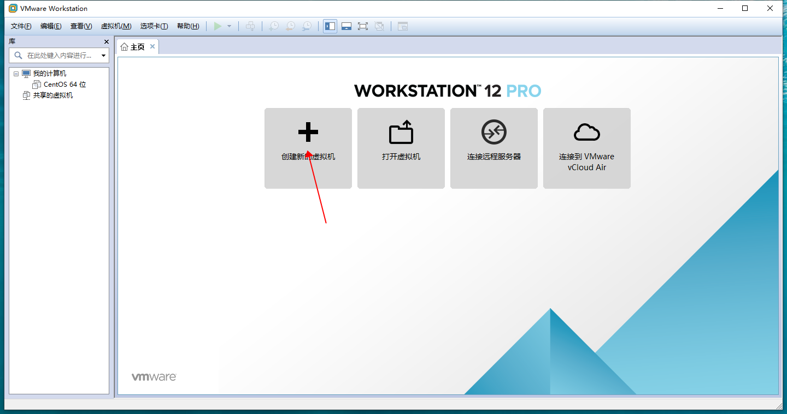
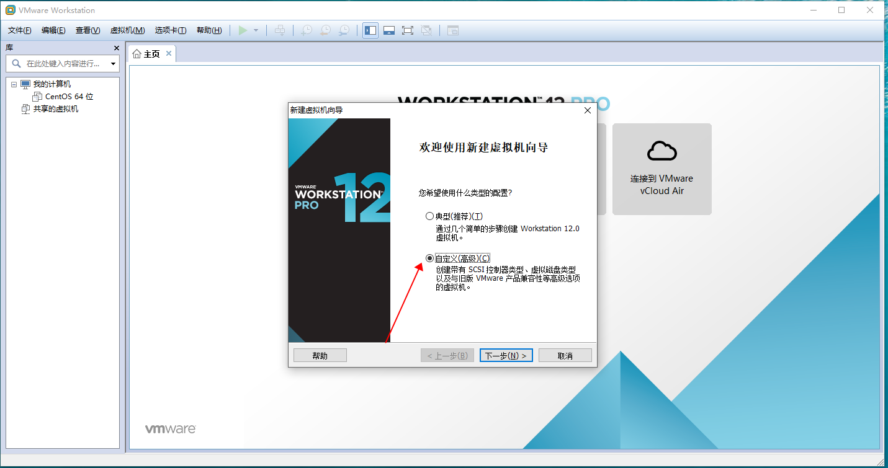
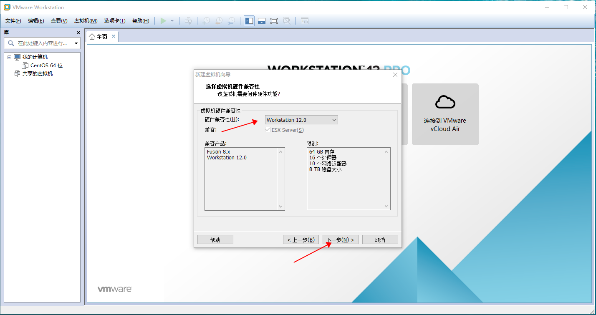
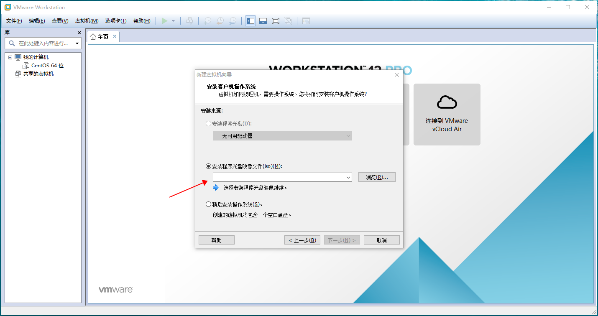
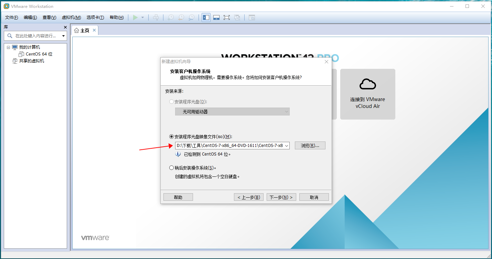
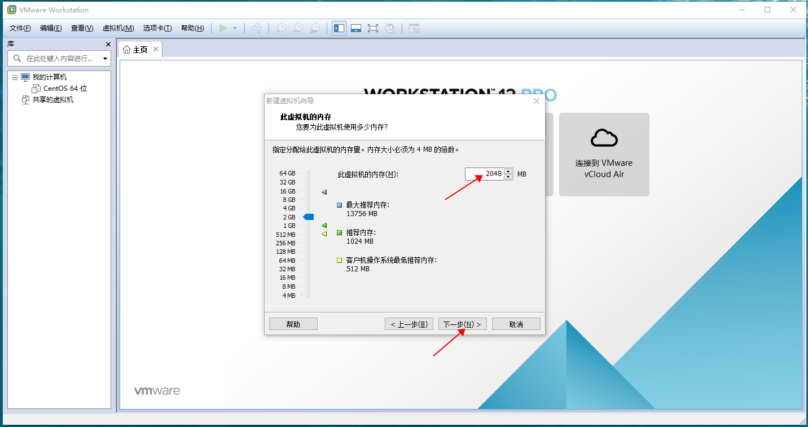
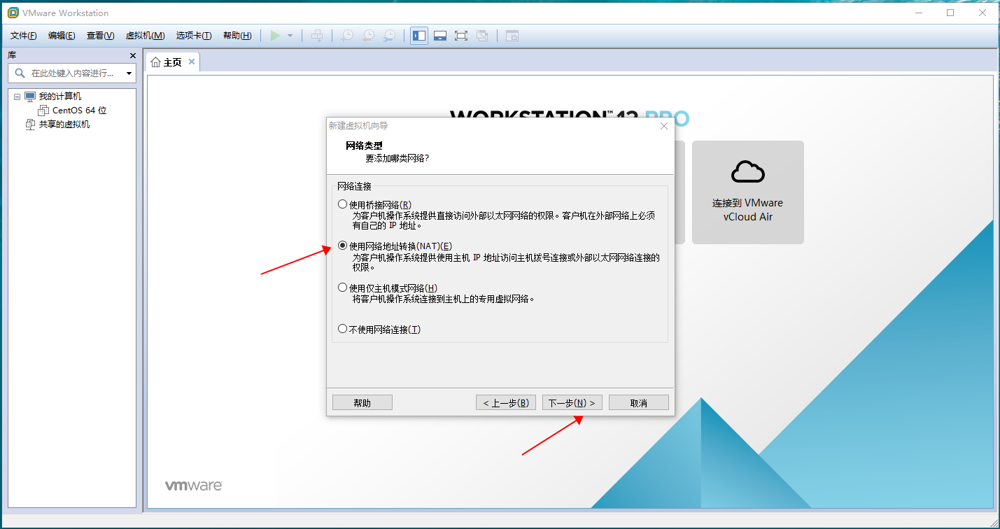
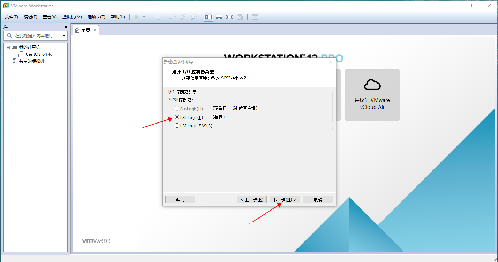
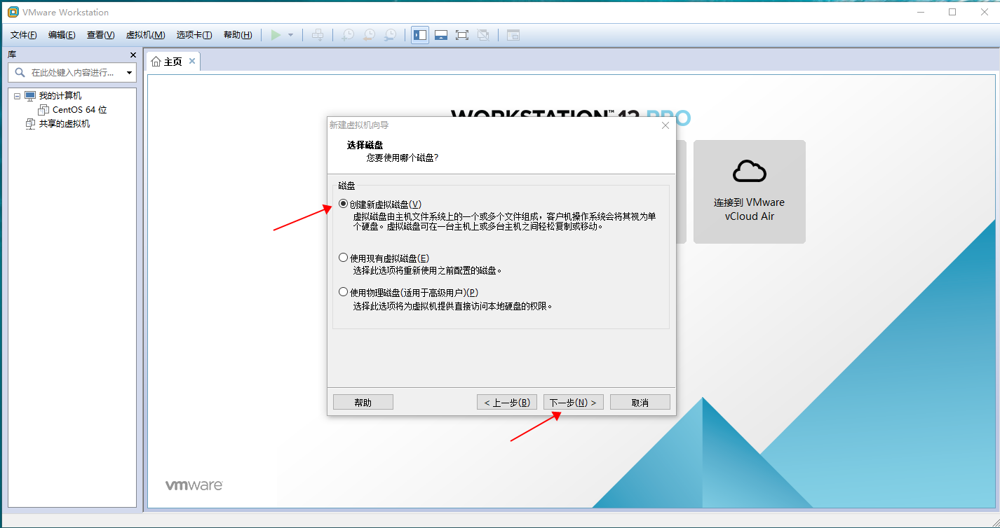

### 一、准备工作

1、安装一台 VMware 虚拟机，默认安装就行

下载地址：https://pan.baidu.com/s/1qN3ubIudMEyue2jpqZTmCg  提取码：1o22

vmwar秘钥：

5A02H-AU243-TZJ49-GTC7K-3C61N
VF5XA-FNDDJ-085GZ-4NXZ9-N20E6
UC5MR-8NE16-H81WY-R7QGV-QG2D8
ZG1WH-ATY96-H80QP-X7PEX-Y30V4
AA3E0-0VDE1-0893Z-KGZ59-QGAVF

centos镜像下载地址：https://pan.baidu.com/s/1psW7AVK30FJLFJfOVBozGA 提取码 u19z

2、在电脑磁盘内新建一个文件夹用来存放虚拟机

3、复制新建文件夹的路径备用

### 二、具体步骤

（一）新建虚拟机

1. 打开VirtualBox，点击“创建新的虚拟机”，勾选“自定义（高级）（C）”，并点击“下一步”

2. 选择硬件兼容性（H）Workstation 12.0，点击“下一步”，选择安装程序光盘映像文件(iso)(M)，点击“选择”按钮，选择到我已经给到链接的centos镜像文件，点击下一步。

3. 设置路径为 **存放虚拟机的路径** ，建议将虚拟机的名字改为自己熟悉的名字，继续点击 **下一步** 。处理器和内核数量根据自己需要进行设置。

5. 对虚拟机进行内存设置，建议根据自己的 **电脑运行内存** 进行设置，继续点击下一步，16G内存的推荐选择4G，8G内存的推荐选择2G。

6. 对虚拟机进行网络类型设置，选择使用网络地址转换(NAT)(E)，继续点击”下一步”，后续设置均按照默认安装进行，如果是初次安装，建议选择 **创建新虚拟机磁盘**。

