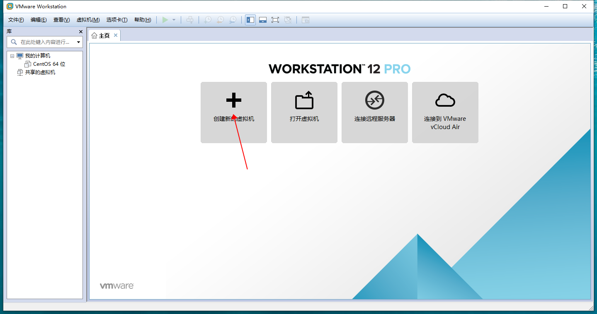

### 一、准备工作

1、安装一台 VMware 虚拟机，默认安装就行

下载地址：https://pan.baidu.com/s/1qN3ubIudMEyue2jpqZTmCg  提取码：1o22

vmwar秘钥：

5A02H-AU243-TZJ49-GTC7K-3C61N
VF5XA-FNDDJ-085GZ-4NXZ9-N20E6
UC5MR-8NE16-H81WY-R7QGV-QG2D8
ZG1WH-ATY96-H80QP-X7PEX-Y30V4
AA3E0-0VDE1-0893Z-KGZ59-QGAVF

centos镜像下载地址：https://pan.baidu.com/s/1psW7AVK30FJLFJfOVBozGA 提取码 u19z

2、在电脑磁盘内新建一个文件夹用来存放虚拟机

3、复制新建文件夹的路径备用

### 二、具体步骤

（一）新建虚拟机

1. 打开VirtualBox，点击“创建新的虚拟机”，勾选“自定义（高级）（C）”，并点击“下一步”
   )
