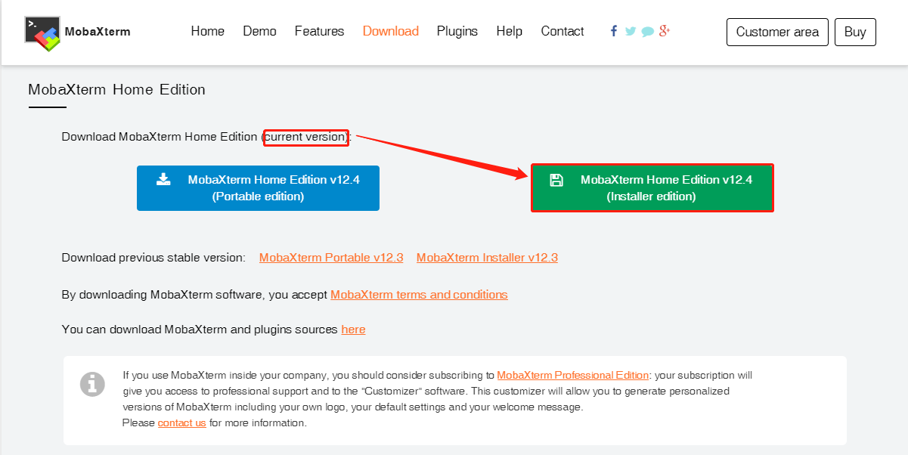
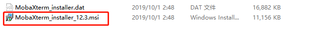
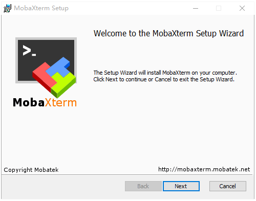

由于需要连接远程 Linux 服务器，早期使用过 Putty，SecureCRT，后面主要使用 Xshell。

MobaXterm 和 Xshell 的关系，就像 IntelliJ IDEA 和 Eclipse 的关系一样，功能更加强大，效果更加炫酷。

接下来，介绍 MobaXterm 的下载、安装、简单使用，以及其强大的功能亮点（优点）。

**MobaXterm 下载**

如果是个人使用，下载家庭版（免费的）就可以满足基本工作需求；如果想要使用更丰富的功能，可以使用专业版（收费的）。

个人使用的是家庭版 v12.3，已经足够满足工作需求了。

1、以下是MobaXterm家庭版的下载地址（当前最新版本是 v12.4）：

**MobaXterm 安装**

下载的是一个zip格式的压缩文件，如下：

解压后，双击 msi 文件进行安装

以下是安装界面（安装一路选择“next”即可）：

