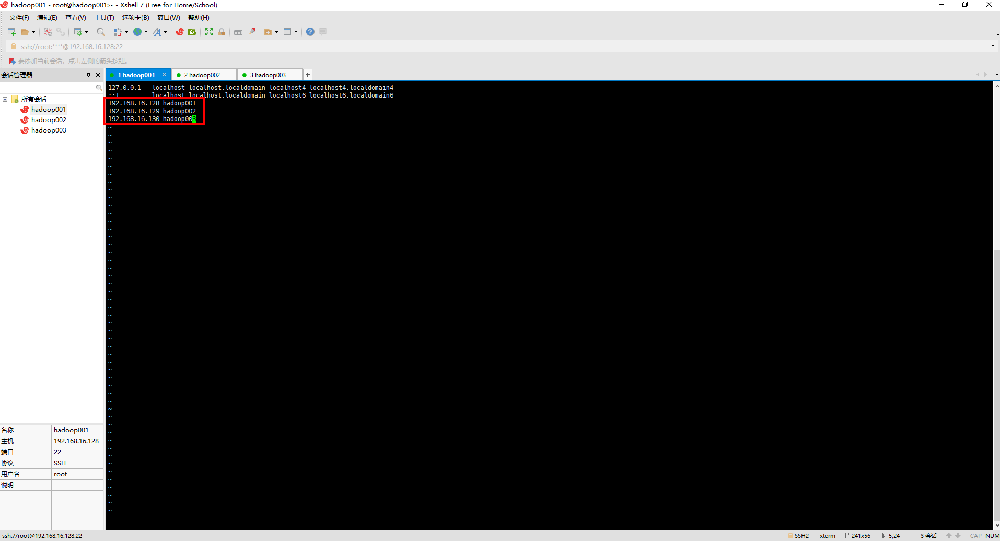
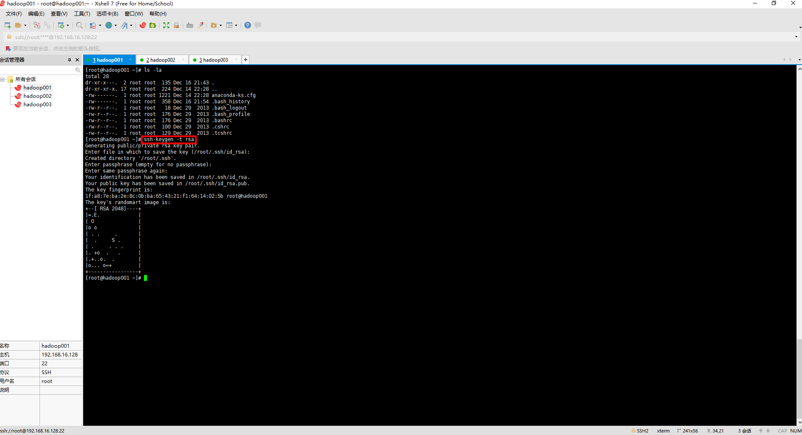
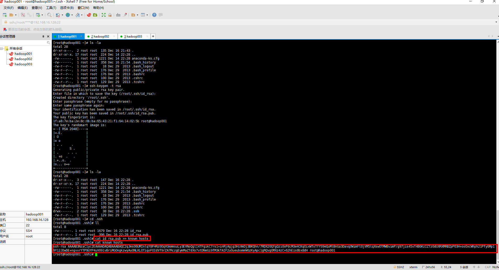
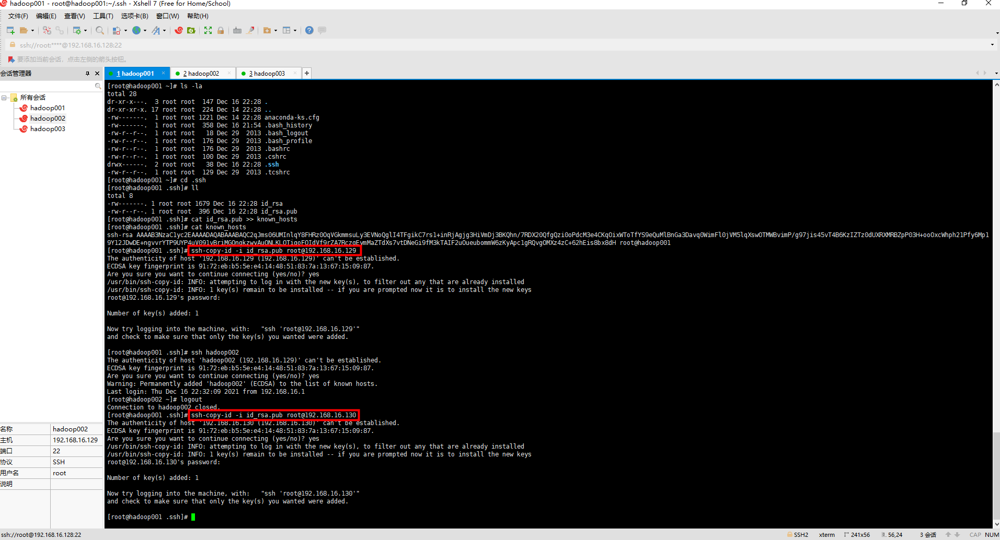
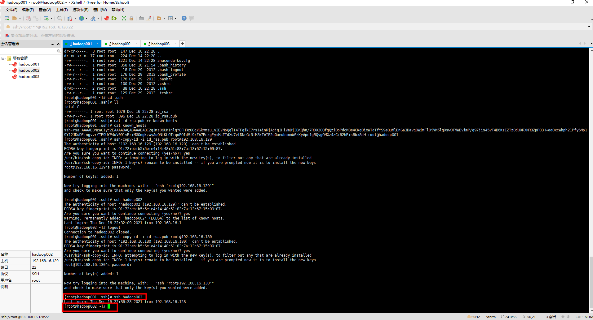
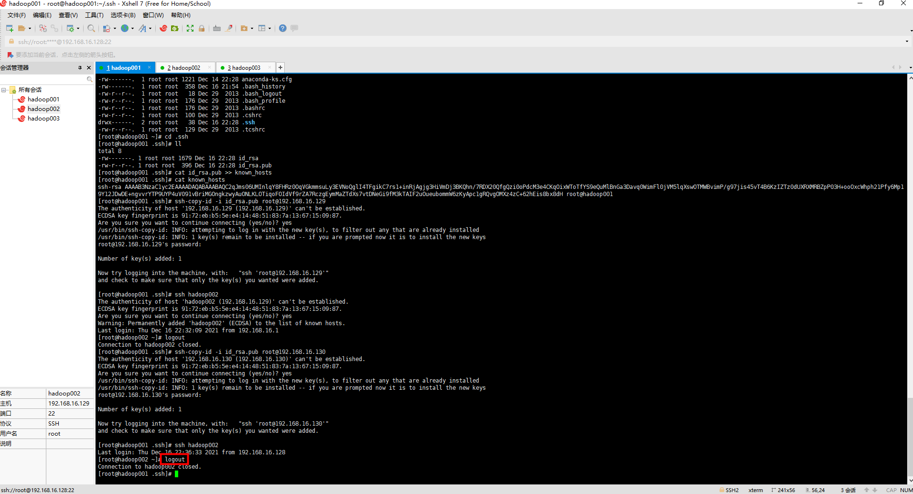

### 一、安装一台虚拟机

[ 1. 安装虚拟机](https://github.com/WuZongYun/bigdata_study/blob/main/%E5%A4%A7%E6%95%B0%E6%8D%AE%E5%9F%BA%E7%A1%80%E7%8E%AF%E5%A2%83%E6%90%AD%E5%BB%BA/1_%E5%AE%89%E8%A3%85%E8%99%9A%E6%8B%9F%E6%9C%BA.md)

### 二、具体步骤

（一）不同虚拟机间的免密处理

1. 启动三台虚拟机（三台节点均做相同操作）。

2. 输入命令：`cd ~`，切换至根目录。输入命令：`hostname`，查看当前主机名。输入命令：`ip addr`，查看当前主机的IP地址。输入命令：`vi /etc/hosts`，接着原有字段后换行写入IP地址和主机名（三台都写），格式为 IP地址 主机名 ，如下图所示。

```
192.168.16.129 hadoop001
192.168.16.130 hadoop002
192.168.16.131 hadoop003
```


3. 先输入命令：`ls -la`，查看是否有 .ssh 文件，再进到 .ssh 文件内，查询是否有：`id_rsa`（私钥）、[id_rsa.pub]()（公钥）。

4. 如果没有，则输入命令：`ssh-keygen -t rsa`，并连续按3下回车键进行创建。



5. 输入命令：`cd .ssh/`，进入.ssh文件，利用命令：`ls`，查看文件是否有：id_rsa（私钥）、id_rsa.pub（公钥）。输入命令：`cat id_rsa.pub >> authorized_keys`，把密钥拷贝一份并追加到authorized_keys文件中。输入命令：`cat authorized_keys`，查看是否存在authorized_keys文件，并查看authorized_keys文件内容。

`注：有些版本的系统是know_hosts，都一样。`



6. 输入命令：`cd .ssh/`，进入.ssh文件，输入命令：`ssh root@对方主机名`，第一次需要输入密码 。输入命令：`logout`，退出远程登录。输入命令：`ssh-copy-id -i id_rsa.pub root@对方主机IP地址`(所有节点都要链接，包括自己)，远程拷贝秘钥，这期间还需要输一次密码 。



7. 输入命令：ssh root@对方主机IP地址，这时，如果不用输入密码，则表示成功了。



**注意当前是在对方主机，还是在本机主机，退出对方主机或本机主机的命令是：logout**



在另外一台需要建立免密通信的虚拟机上重复上述操作即可


