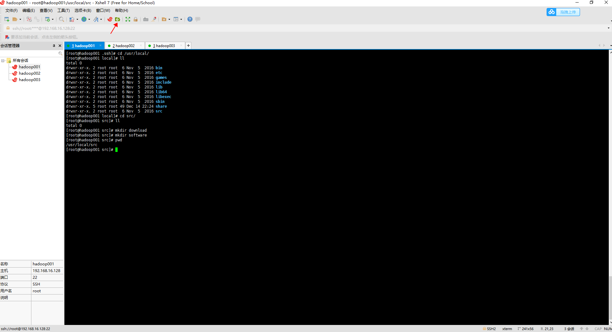
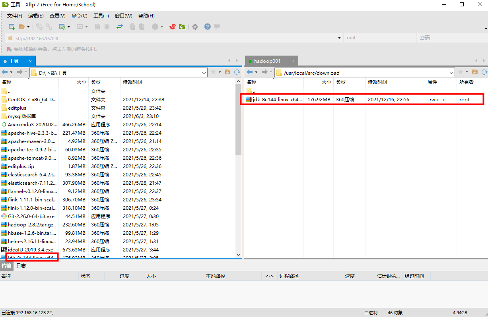
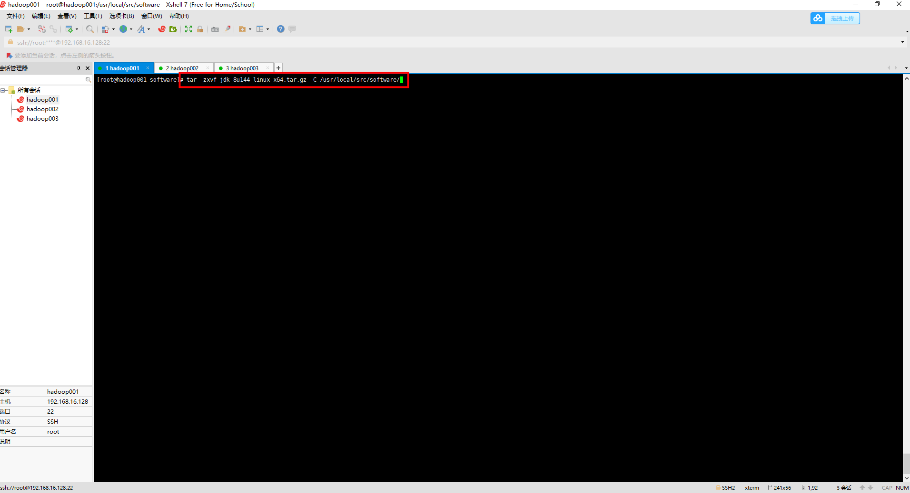
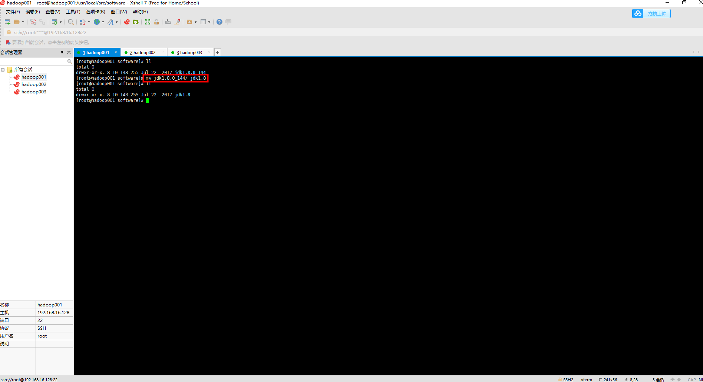
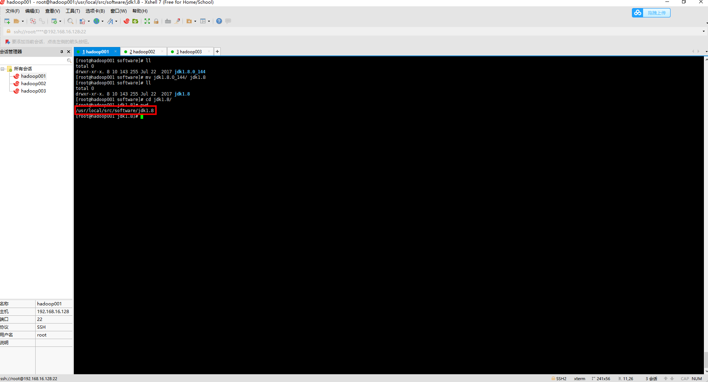
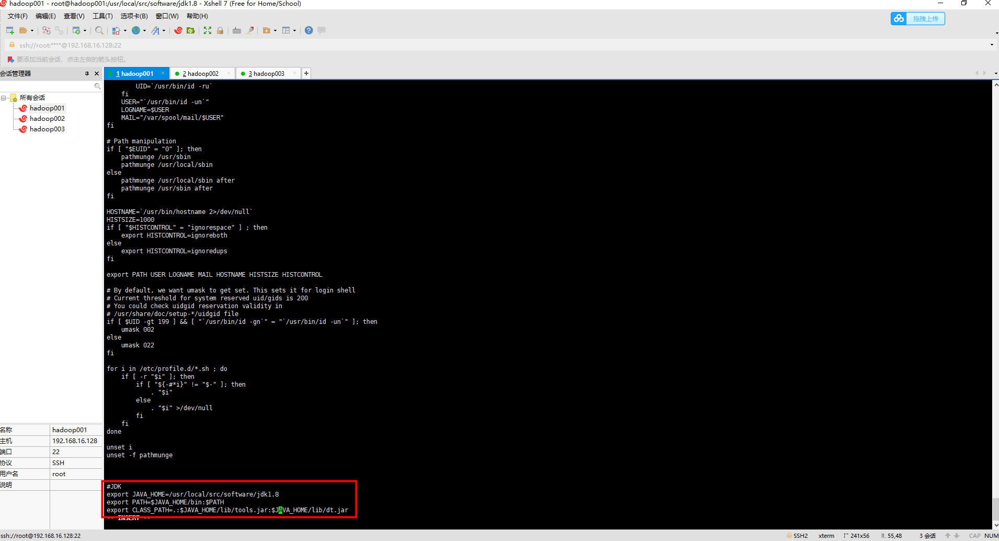
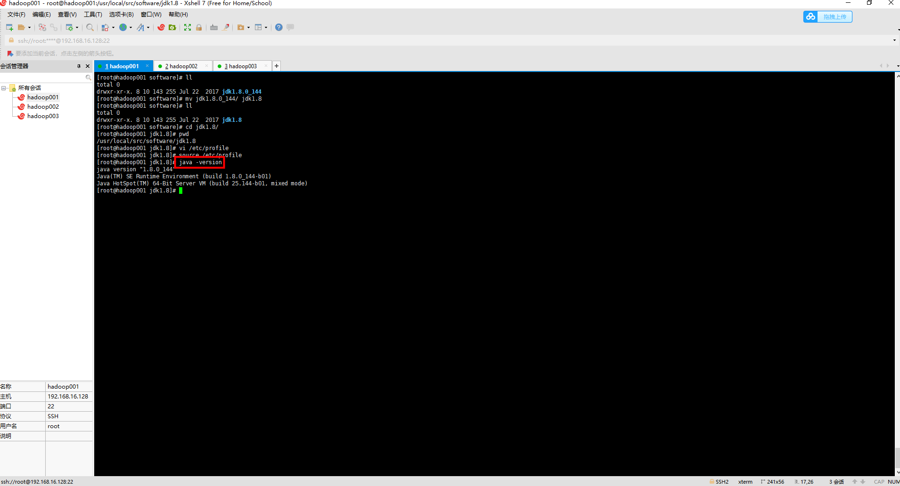

### 一、准备工作

[1. 安装一台虚拟机](https://github.com/WuZongYun/bigdata_study/blob/main/%E5%A4%A7%E6%95%B0%E6%8D%AE%E5%9F%BA%E7%A1%80%E7%8E%AF%E5%A2%83%E6%90%AD%E5%BB%BA/1_%E5%AE%89%E8%A3%85%E8%99%9A%E6%8B%9F%E6%9C%BA.md)

[2. 启动一台虚拟机，并连接至Xshell、Xftp（连接方法）](https://github.com/WuZongYun/bigdata_study/blob/main/%E5%A4%A7%E6%95%B0%E6%8D%AE%E5%9F%BA%E7%A1%80%E7%8E%AF%E5%A2%83%E6%90%AD%E5%BB%BA/2_%E5%AE%89%E8%A3%85MobaXterm.md)

3. 建议在虚拟机里 /usr/local/src/ 文件夹下单独创建两个文件夹（download、software），用来存放安装包和软件

4. 需要将 jdk-8u144-linux-x64.tar.gz 文件，上传至 download 目录。

jdk下载地址：https://pan.baidu.com/s/1VbXr-M7sWArXQnRypc_Azg   密码：v591

### 二、具体步骤

（一）解压

1. 点击xshell左上角xsftp图标上传jdk-8u144-linux-x64.tar.gz 到 /usr/local/src/download文件夹中,输入命令：`tar -zxvf jdk-8u144-linux-x64.tar.gz -C /usr/local/src/software/`，将jdk压缩包解压至“/usr/local/src/software”目录下。







2. 输入命令：`cd /usr/local/src/software`，进到“software”文件夹下。输入命令：`mv jdk1.8.0_144/ jdk1.8`，将解压后的文件重命名。



（二）环境变量配置

1. 编辑配置文件

进入“jdk1.8”文件夹下，获取该文件夹的路径，并复制，输入命令：`vi /etc/profile`，进入文件配置项命令行模式。



在命令行模式下，利用命令：`shift+g`，将光标移动到文档末尾，点击 i 或者 o 进入编辑模式，按图4进行配置，命令如下：

```
#JDK
export JAVA_HOME=/usr/local/src/software/jdk1.8
export PATH=$JAVA_HOME/bin:$PATH
export CLASS_PATH=.:$JAVA_HOME/lib/tools.jar:$JAVA_HOME/lib/dt.jar
```
配置完成后保存并退出。



2. 激活配置项

输入命令：`source /etc/profile`，激活配置文件。

3. 验证是否安装成功

输入命令：`echo $JAVA_HOME`，获取路径。输入命令：`java -version`，当出现图5相关信息后，则说明jdk搭建成功。



（三）复制到其他两个虚拟机hadoop002,hadoop003中，使用命令：

`scp -rp /usr/local/src/software/jdk1.8/ root@hadoop002:/usr/local/src/software/jdk1.8`

`scp -rp /usr/local/src/software/jdk1.8/ root@hadoop003:/usr/local/src/software/jdk1.8`

跟hadoop001一样修改环境变量  `vi /etc/profile` ；

刷新环境变量  `source /etc/profile`。