### 一、准备工作

[1. 安装一台虚拟机](https://github.com/WuZongYun/bigdata_study/blob/main/%E5%A4%A7%E6%95%B0%E6%8D%AE%E5%9F%BA%E7%A1%80%E7%8E%AF%E5%A2%83%E6%90%AD%E5%BB%BA/1_%E5%AE%89%E8%A3%85%E8%99%9A%E6%8B%9F%E6%9C%BA.md)

[2. 启动一台虚拟机，并连接至Xshell、Xftp（连接方法）](https://github.com/WuZongYun/bigdata_study/blob/main/%E5%A4%A7%E6%95%B0%E6%8D%AE%E5%9F%BA%E7%A1%80%E7%8E%AF%E5%A2%83%E6%90%AD%E5%BB%BA/2_%E5%AE%89%E8%A3%85MobaXterm.md)

### 二、具体步骤

（一）yum 安装

1. yum更新（建议在安装完成之后进行）

输入命令：`yum update`，在更新的期间会要求手动输入确认键，暂时还不能走开，更新完成后则会提示图1信息。如果没有可更新的包的话，则会提示图2信息。

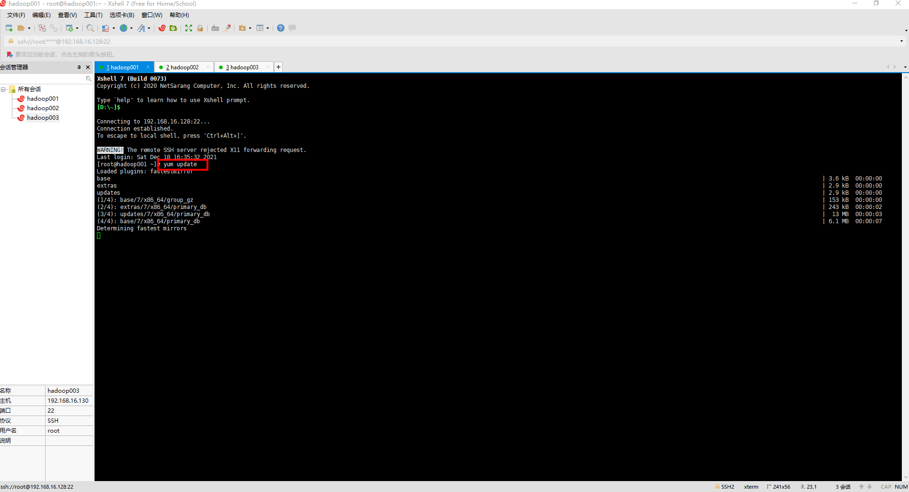

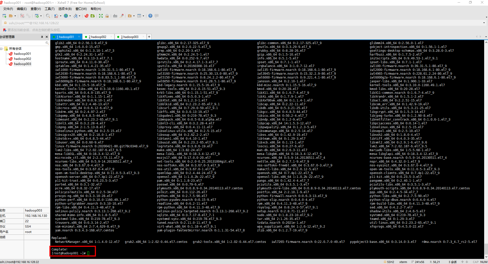

2. yum命令

输入命令：`yum search wget`，回车后会出现图3上的信息。待页面转跳完毕后，输入命令：`yum -y install wget.x86_64`，输入完毕后按下回车，系统则会自行安装。

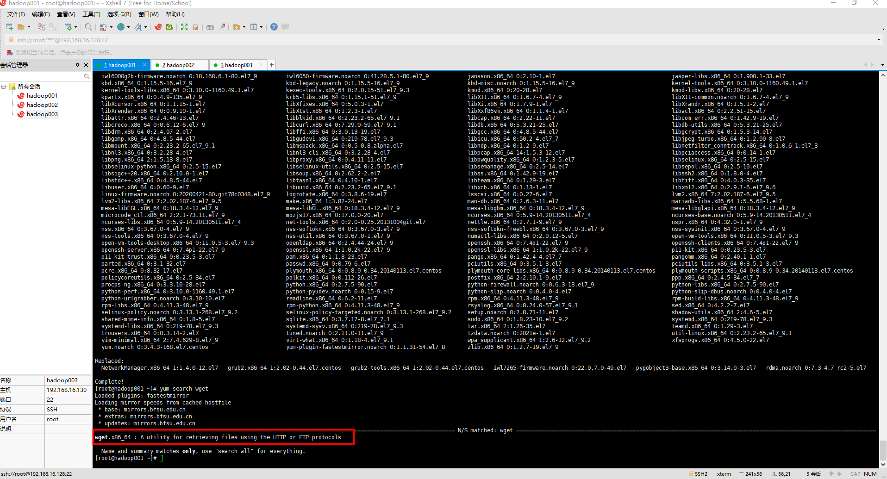

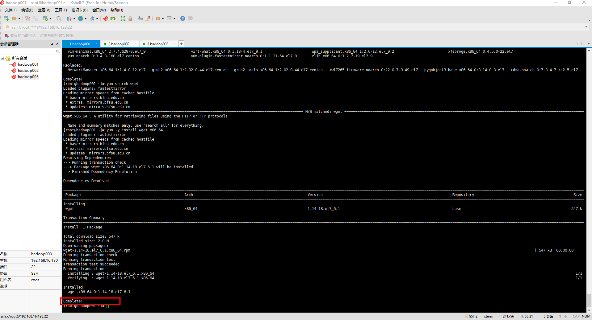

（二）rpm安装MySQL

1. 输入命令：`rpm -qa|grep mariadb`，查看是否存在MySQL的旧版本。如果存在旧版本，则输入命令：`yum -y remove mariadb-libs-5.5.64-1.el7.x86_64`，来删除显示版本。

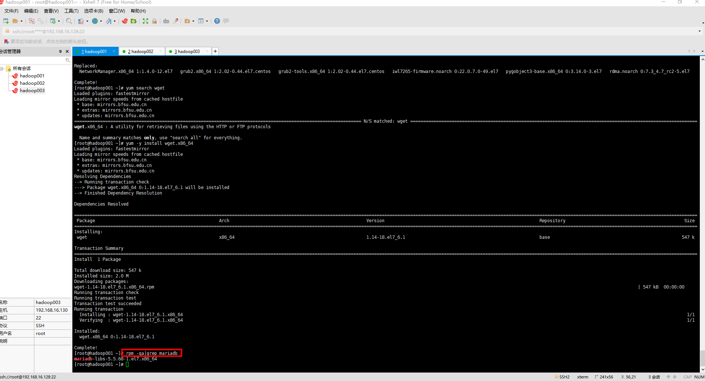

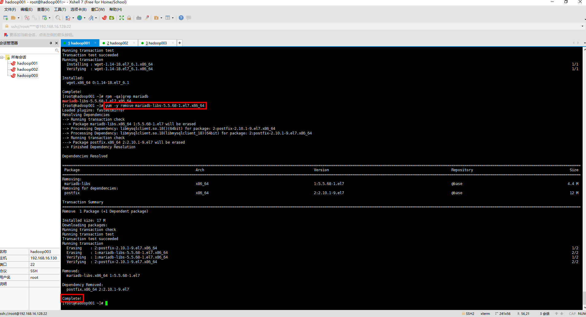

2. 输入命令：`wget http://repo.mysql.com/mysql-community-release-el7-5.noarch.rpm`，来设置镜像。提示 100% 后完成

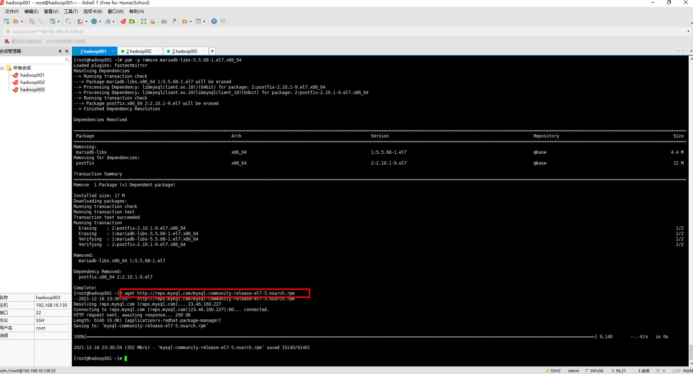

3. 输入命令：`rpm -ivh mysql-community-release-el7-5.noarch.rpm`，安装MySQL的rpm包

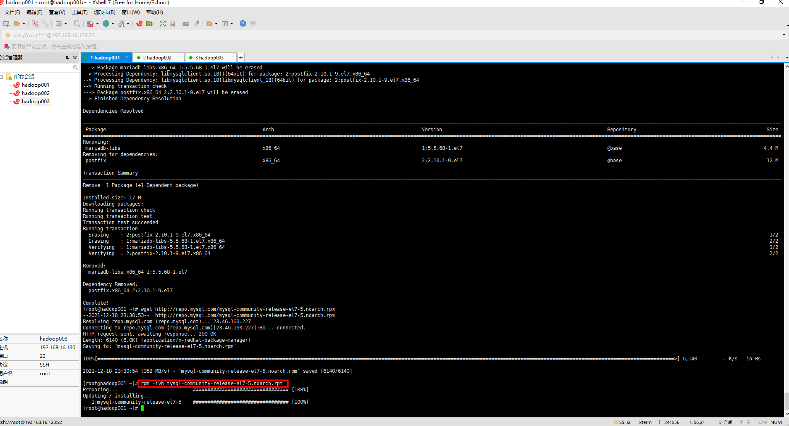

4. 输入命令：`yum -y install mysql-server`，安装MySQL服务，此过程对网速有一点点的要求。安装完毕后会出现Complete字样。

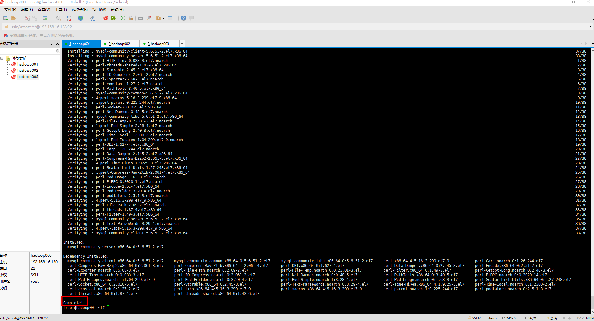

5. 输入命令：`systemctl start mysql`、`systemctl status mysql`，启动MySQL服务和查看MySQL服务状态。

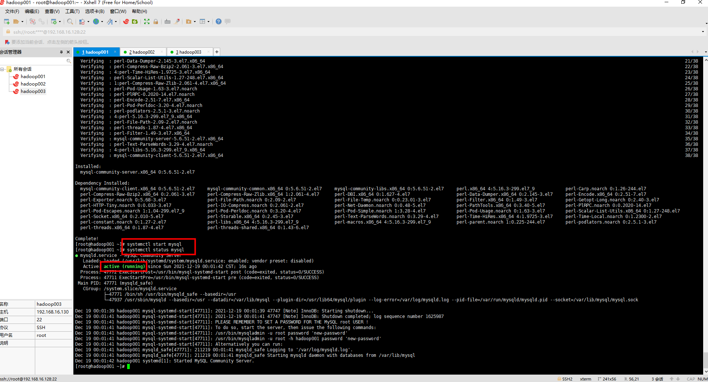

6. 输入命令：mysql，进入 MySQL（首次登录为免密登录）。进入 MySQL 系统后，输入命令：use mysql;、select host,user,password from user where user='root';。

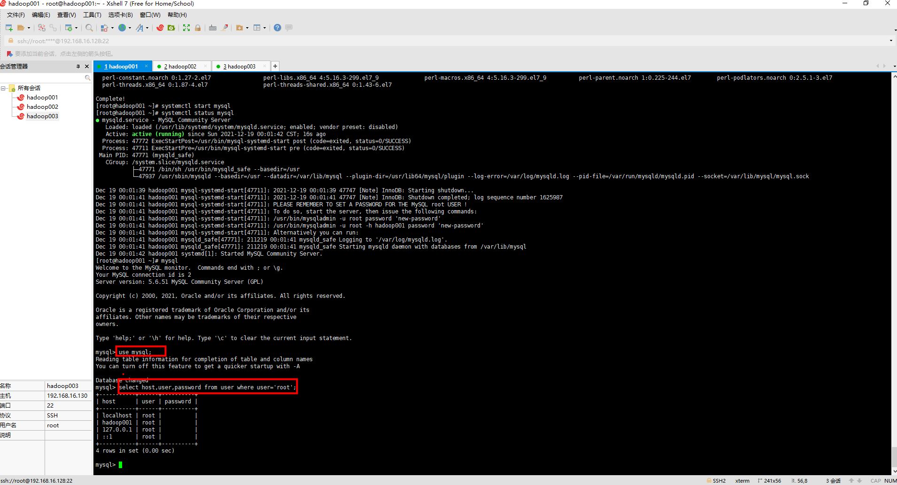

7. 然后通过命令：`update user set password=password('root') where user='root';`来修改MySQL系统的登录密码。设置完毕之后，再输入命令：`select host,user,password from user where user='root';`，来查看用户状态。

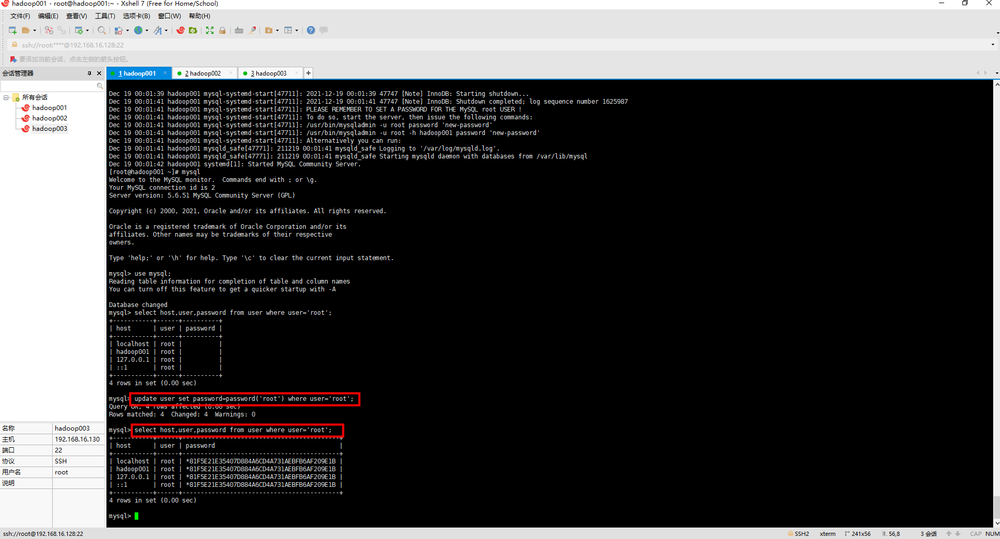

8. 输入命令：`grant all on *.* to root@'%' identified by 'root';`，设置一个远程登陆用户，用于Java或其他客户端远程登录MySQL系统。

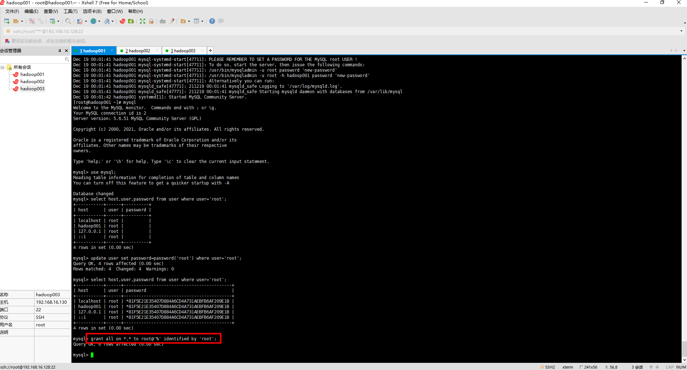

9. 上述6、7、8设置完毕后输入命令：`quit;`，退出MySQL系统，输入命令：`systemctl restart mysql`，重启MySQL服务，这时密码就被激活了，再登录MySQL时则需要输入上面设置的登录密码，整体命令为：`mysql -u root -p` （先回车后输入密码），密码在输入时不会显示，输入完毕后按下回车键，正常登录表示MySQL安装成功。

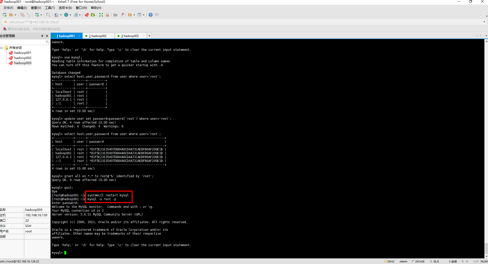

### 三、优化

（一）MySQL不允许插入中文的解决方法

进入MySQL后，输入命令：`show variables like 'char%';`，查看当前字符集信息，如果出现：character-set-database latin1、character-set-server latin1，这些信息，则说明MySQL时不允许中文插入。

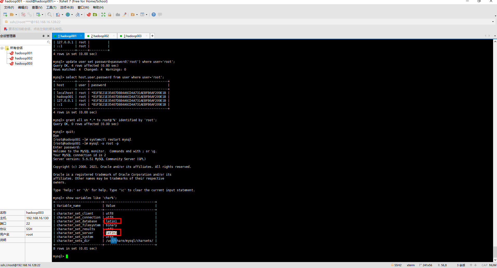

这时，先输入命令`set names utf8`;。

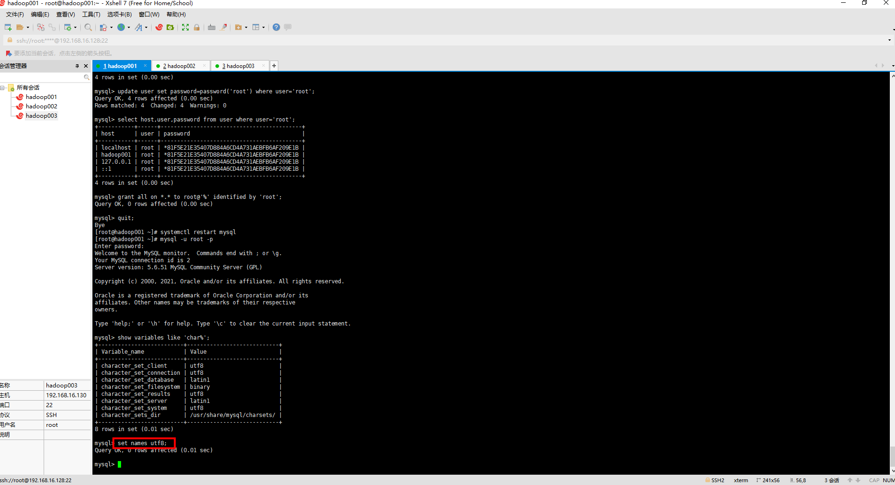

再输入命令：`quit;`或者`ctl+c`，退出MySQL系统返回Linux，查找MySQL的配置文件路径，输入如下命令：

```
[root@master ~]# cd /etc/
[root@master etc]# ls | grep my*
grep: my.cnf.d: Is a directory
[root@master etc]# vi my.cnf
```
进入配置文件后，在 命令行模式 下，按住 键盘上的d键 ，将整篇配置文档的内容删干净，然后贴入下方代码，最后保存并退出。

```
[client]
default-character-set=utf8
[mysqld]
default-storage-engine=INNODB
character-set-server=utf8
collation-server=utf8_general_ci
[mysql]
default-character-set=utf8
```
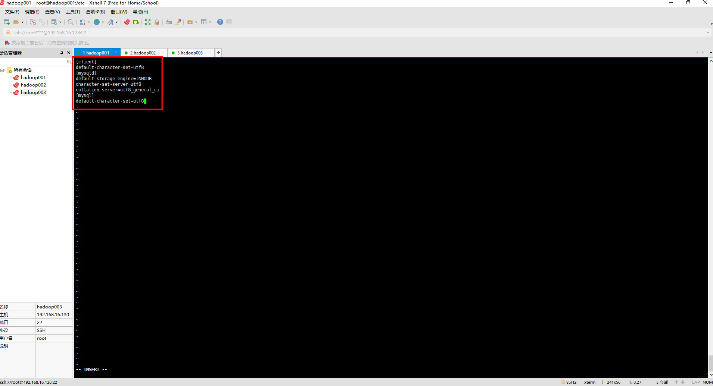

上述操作完毕后，再输入命令`service mysqld restart`。

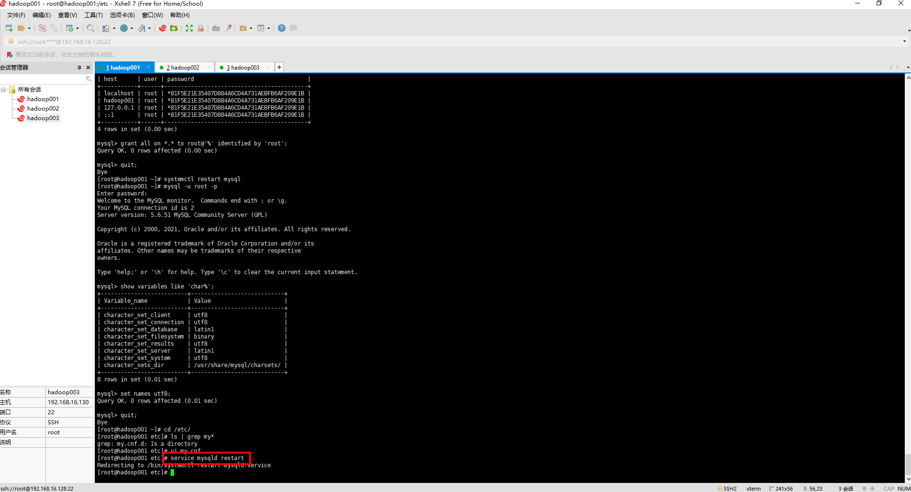

然后进入MySQL后，输入命令：`show variables like 'char%';`，则会出现下列情况。

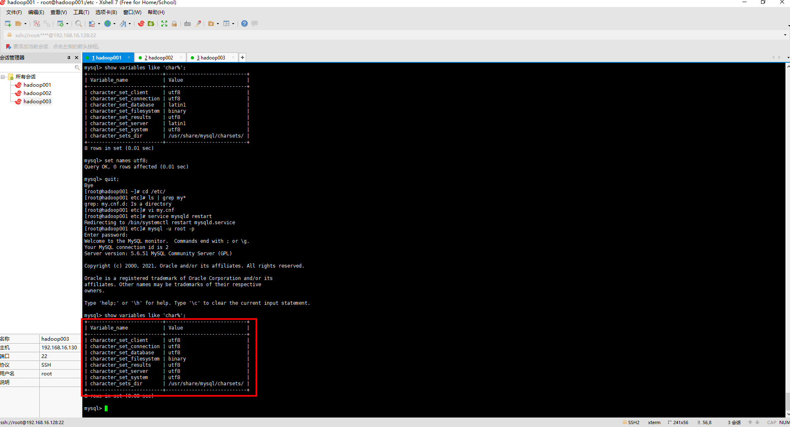


